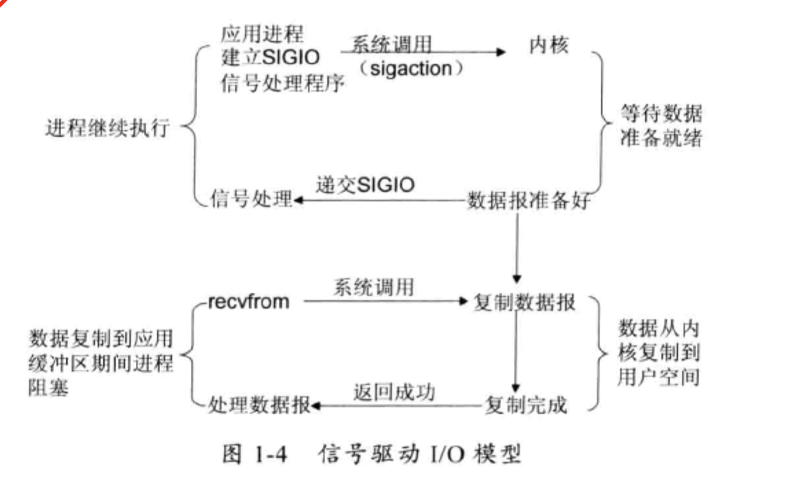

# 5种I/O模型

Linux内核将所有外部设备（包括存储设备、网络）都看做一个文件来操作，对一个文件的读写操作会调用内核提供的系统命令，返回一个file descriptor(fd 文件描述符)，对一个socket的读写同样有相应的描述符，成为socket fd，描述符就是一个数字，它指向内核中的一个结构体（文件路径，数据区等一些属性）。

## 例子

以两个应用程序通讯为例，当A向B发送一条消息时，会经过以下流程

## 1.阻塞IO

在3、接收数据这个步骤中，如果应用B想要从TCP接收缓冲区获取数据，而此时接收缓冲区中还没有接收到属于应用B应该读取的数据时，TCP接收缓冲区是应该告诉应用B，现在还没有你想要的数据，还是让应用B在这里等着，等到有数据的时候再把数据交给应用B？这个问题同样适用于发送的时候，如果应用A想要发送数据，但此时TCP发送缓冲区已满，A应用是否应该等待？

**阻塞IO：**

在进程空间（B应用）中调用recvfrom，其系统调用直到数据包到达且被复制到应用进程的缓冲区或者发生错误时才返回，在此期间一直会等待，进程在调用recvfrom开始到它返回的整段时间内都是被阻塞的。

## 2.非阻塞IO

revcfrom从应用层到内核的时候，如果该缓冲区没有数据的话，就直接返回一个EWOULDBLOCK错误，一般都对非阻塞IO模型进行轮询检查这个状态，看内核是不是有数据到来。

当缓冲区的数据没有准备好时，立刻返回一个error，并不会阻塞用户进程。

## 3.IO复用模型

在这个过程中，如果处于并发环境下，可能会有N个人向应用B发送消息，这种情况下无论是阻塞/非阻塞IO，一个线程都只能处理一个人的请求，那么这种情况下就必须创建多个线程去读取数据，每个线程都会自己调用recvfrom去读取数据。

此时的情况可能如下图：

多个线程都会不断向内核发出recvfrom请求获取数据，这种方式比较浪费资源，而且线程本身就是稀有资源，创建/销毁/维持多个线程都会压缩其他线程的资源。

IO复用模型的思路是使用一个单独的线程去处理多个socket fd，这个线程对fd进行管理，由它来对它所管理的fd进行监控，通常是使用轮询的方式去询问数据是否准备好，当有数据准备好时，再分配对应的线程去读取数据。

操作系统提供了一种函数可以同时监控多个fd的状态，这个函数就是select/poll/epoll函数

进程通过将一个或多个fd传递给select，阻塞在select操作上，select帮我们侦测多个fd是否准备就绪，当有fd准备就绪时，select返回数据可读状态，应用程序再调用recvfrom读取数据。

**当用户进程调用了select后，用户进程会被阻塞**

select/poll顺序扫描fd是否就绪，并且支持的fd数量有限

linux还提供了一个epoll系统调用，它使用基于事件驱动方式代替顺序扫描，因此性能更高，当有fd就绪时，立即回调函数rollback

和阻塞IO相比，IO复用仍会阻塞进程，并且相比阻塞IO只调用recvfrom一个system call，IO复用还多调用了一个select，但是优势在于可以处理多个连接，不需要为每个fd创建一个对应的监控线程。

## 4.信号驱动IO模型

IO复用模型解决了一个线程可以监控多个fd的问题，但是select/poll采用轮询的方式来监控多个fd，在大部分情况下轮询都是无效的。

信号驱动IO不是用循环请求询问的方式去监控数据就绪状态，而是在调用sigaction时候建立一个SIGIO的信号联系，当内核数据准备好之后再通过SIGIO信号通知线程数据准备好后的可读状态，当线程收到可读状态的信号后，此时再向内核发起recvfrom读取数据的请求，因为信号驱动IO的模型下应用线程在发出信号监控后即可返回，不会阻塞，所以这样的方式下，一个应用线程也可以同时监控多个fd

## 5.异步IO

告知内核启动某个操作，并让内核在整个操作完成后（包括将数据从内核复制到用户自己的缓冲区）通知我们，这种模型与信号驱动模型的主要区别是：信号驱动IO由内核通知我们何时可以开始一个IO操作；异步IO模型由内核通知我们操作何时已经完成。

IO过程可以简单的拆分为两步，第一步是等待数据准备完成，第二步是将数据从内核空间复制到用户空间，前面四种IO，在第一步中可能是同步可能是异步，但是在第二步的时候一定是同步的，而异步IO中，第二步操作也是异步的，也就是说，对于线程来说，数据是“送货上门”的，而前面四种IO中，线程需要“自提”。

## epoll所属IO模型思考

复用IO：程序阻塞到多个IO文件描述符上边，当至少一个IO可用的时候返回。select就属于是IO复用。

信号驱动IO：IO可用后程序被中断并执行相应的处理函数来读写IO。其他时间程序可以正常执行其他命令。

epoll机制：poll中用户需要预先向epoll注册相关IO事件，然后调用epoll的主循环epoll_wait()，之后当IO事件发生的时候该函数返回所发生的IO事件的集合，并交由用户进行处理

先看复用IO。复用IO的最主要特点在于阻塞到多个IO上边，当某个IO可用的时候返回。epoll中需要调用epoll_wait，然后epoll_wait返回可用IO处理，并交由用户处理。此时我们一般还要调用recv等函数去读写IO。这样一分析，epoll符合所有复用IO模型的特点，而且epoll本身的使用方法也像极了selec。

然后看看信号驱动IO。信号驱动IO的特点是IO可用的时候程序被中断，然后由中断函数处理IO事件。epoll中我们需要去执行主循环函数等待IO事件，并且IO事件的处理是由接下来的程序处理的，而非由某个回调函数自动处理，所以epoll明显不属于信号驱动。

所以epoll和select一样，属于IO复用模型，但是他也使用到了信号驱动IO和AIO的一些思想。

## IO中的同步异步 阻塞非阻塞

所谓阻塞就是发起读取数据请求的时，当数据还没准备就绪的时候，这时请求是即刻返回，还是在这里等待数据的就绪，如果需要等待的话就是阻塞，反之如果即刻返回就是非阻塞

在IO模型里面如果请求方从发起请求到数据最后完成的这一段过程中都需要自己参与，那么这种我们称为同步请求；反之，如果应用发送完指令后就不再参与过程了，只需要等待最终完成结果的通知，那么这就属于异步

同步阻塞与同步非阻塞，他们不同的只是发起读取请求的时候一个请求阻塞，一个请求不阻塞，但是相同的是，他们都需要应用自己监控整个数据完成的过程。而为什么之后异步非阻塞 而没有异步阻塞呢，因为异步模型下请求指定发送完后就即刻返回了，没有任何后续流程了，所以它注定不会阻塞，所以也就只会有异步非阻塞模型了

# Java BIO

设计思路：

1，学IO流之前，我们写的程序，都是在内存里自己跟自己玩。比如，你声明个变量，创建个数组，创建个集合，写一个排序算法，模拟一个链表，使用一些常用API，现在回想一下，是不是在只是自己在内存里玩一玩？计算机组成包括运算器，控制器，存储器，输入设备，输出设备。那么你前面的工作，仅仅够你的程序和内存以及CPU打打交道，如果你需要操作外部设备呢？比如键盘，显示器，再比如，最常见的外设：硬盘？甚至未来世界里的每家每户都有的机器人，“如何让你的程序和机器人进行交互呢？”

2，所以程序设计语言必须要提供程序与外部设备交互的方式，这就是IO框架的由来。我们需要和外部设备进行数据的交互。那么，计算机是通过什么和外部进行交互的呢？很简单就能想到：数据线。数据线里传播的是什么呢？一个词：比特流。比特就是bit的谐音，计算机中“位”的意思，代表0或1。1位或者1bit，就是一个0或一个1。但是，毕竟0或1不能表示什么，所以计算机更常见的基本单位是字节，也就是用8位0或1组成的一段数据。以上是对比特流的由来做一个简单地解释。（比特流一词来自于计算机网络原理中，对物理层传输内容的描述：物理层（网线）中传输的是“比特流”，在这里借用这个名词代指数据的表示形式，帮助理解）

上面两段话的意思，其实是为了下文做铺垫，帮助理解输入输出最重要的概念：方向性。输入还是输出，是相对于程序或者说相对于内存而言的。数据从外流到内存，就是输入（读），数据从内存出去，就是输出（写）。

3，既然计算机和外界进行信息的输入和输出交互，用的是比特流，那么很容易就能想到IO流名字的由来了。就是比喻输入输出的数据像流一样。我们可以这么认为，任何外部设备与内存之间输入输出的操作，都是需要输入输出流（IO流）来完成的，这里的IO流，指的就是比特流（或者称字节流）。这些外部设备，包括，键盘（标准输入设备），显示器（标准输出设备），音响，网络上另一台主机，甚至你玩游戏用的游戏手柄，以及各种各样的信号传感器，都可以叫做外部设备，和这些设备之间进行数据交互，显然不可能靠之前学习的那些数组，集合，常用类，String等等来完成。而是要靠和外界数据交换的类来完成。靠什么来进行数据交换，就是前面说的，比特流，或者说IO流类。

4，那么，既然要学习IO流，就得针对某一个输入输出设备来学习。哪种输入输出设备最重要同时也最常见？当然是硬盘。硬盘在这里的含义也可以理解为文件系统。（Java程序是运行在某操作系统平台上的应用软件JVM上的，实际上Java程序可见的并不是硬盘，而是操作系统提供的文件系统，因此此处可直接理解为文件系统）。因此，我们学习IO流的时候，基本上是学习的Java如何操作文件系统，除了文件系统，我们还能够了解Java操作标准输入输出设备，如System.in和System.out。

5，知道了学习的方向，是要使用Java操作文件系统，那么首先要学习的就是文件的表示，即File类。然后，我们要操作做文件，虽然我们大部分操作都是操作文件系统，但是要明白IO流的概念不仅仅局限在操作文件上，前面我已经提到了，我们的编程语言是要能操作所有的输入输出，因此，API提供了两个顶层抽象类，用来表示操作所有的输出输出：InputStream，OutputStream。并且，这两个类表示字节的输入输出，因为输入输出的本质是字节流。这里注意体会一句话“字节流是最最基本的流”，这句话的由来就是因为计算机底层传递的就是字节。那么，当我们要操作文件的时候，就需要具体的对文件系统操作的IO实现类，于是我们需要学习FileInputStream和FileOutputStream，它们是文件输入输出字节流。这里之所以FileInputStream/OutputStream作为子类出现，按照面向对象思想理解就是，将来还有别的字节流来操作别的设备（比如将来需要通过操作网络设备获取网络数据，再比如需要操作机器人，那么或许就会再来个RobotInputStream和RobotOutputStream，这些新的需求也就都可以继承这个体系）

（这里顺便提一句架构设计思想，其中有一种设计原则叫“开闭原则”，其核心是：一个对象对扩展开放，对修改关闭。就是说，一旦写好了某个类，就不要去轻易改动他，而是要保证它一直能运行下去，而面对新的功能需求时，只要在原有代码上增加即可，而不是修改原有代码。要做到开闭原则，就需要分清需求中未来哪些部分是稳定的，哪些是很可能变化的，而往往抽象的部分是最稳定的，把稳定的内容分离出来，就能满足开闭原则。这就是为什么Java的类设计的如此之琐碎，为什么我们要从继承关系角度去理解JavaIO流的设计）

6，学了文件IO字节流之后，我们会发现原始的字节流对象用起来没那么高效，因为每个读或写请求都由底层操作系统处理，这些请求往往会触发磁盘访问、网络活动或其他一些相对昂贵的操作。不带缓冲区的流对象，只能一个字节一个字节的读，每次都调用底层的操作系统API，非常低效，而带缓冲区的流对象，可以一次读一个缓冲区，缓冲区空了才去调用一次底层API，这就能大大提高效率。所以又有了BufferedInputStream和BufferedOutputSteam，他们的用法是把字节流对象传入后再使用，也相当于把它俩套在了字节流的外面，给字节流装了个“外挂”，让基本字节流如虎添翼。

7，说到操作文件，就不得不提到文件的分类和编码格式。文件分为二进制文件和文本文件，二进制文件是用记事本打开后看不懂的，他们的编码格式是特殊的，比如pdf文件，exe文件。记事本打开后人能看懂的只有纯文本文件，我们处理文件（或者说处理任何的字节流），就免不了处理一些文本文件（或文本字节流）。如果是英语国家的人还好说，因为他们是用的常用字符用一张ASCII码表就能表示得出来，用一个字节就能表示一个字母。但是显然，对非英语国家的人来说，一个字节的大小无法表示他们所有的文字。因此，人们需要有能够处理字符的类，或者说这个类提供一个功能：就是把输入的字节转成字符，把要输出的字符转成计算机可以识别的字节。所以，你需要两个转换流：InputStreamReader和OutputStreamWriter。这两个类的作用分别是把字节流转成字符流，把字符流转成字节流。**但是这两个流需要套在现成的字节流上才能使用**，**当中用到的设计模式也就是常说的装饰模式**。当字节流被转成字符流之后，恭喜你，你可以不必操作字节流了，而是可以用人类的方式read和write各种“文字”。

（那么，我们为什么还要学习字节流？因为字节流依然有它的作用范围。首先，所有的流都是建立在字节流之上的，比如字符流。字节流或许可以读任何字节，但是他处理不了Unicode（万国码），他处理不了Data流，Object流，也就是说，它做不了高级的事情，只能读写最原始的东西。字节流好比动物，能看，能听，能汪汪叫，但是他不能读书，不能写字，不能理解更高级的知识。其次要注意的是，字符流只能用来处理文本文件，也就是只能来处理字符，如果出来用来处理二进制文件，会带来错误，所以处理二进制文件只能用字节流）

8，还是回到文件系统，我们最常见的是和文件系统打交道，那么针对如此常见的用途，读取文本文件能不能用一种方便的方式呢？当然，大牛们替你想到并提供了。FileReader和FileWriter这两个流对象可以直接把文件转成读取、写入流。让你省去了创建字节流，再套上转换流的步骤。看看这类名起的，实际上很形象，xxxReader和xxxWriter，明摆着告诉你“阅读和书写”都是“人可以做的”也就是他们表示的是字符流。同理上面的InputStreamReader和OutputStreamWriter，表示的是把字节流转成人可读的，把字节流转成人可写的。因此他们的顶层抽象类：Reader和Writer，表示的是所有人类可读可写的字符流统称。

10，同上面说的缓冲区的作用，再把Reader和Writer做成高效的，就需要BufferedReader和BufferedWriter，把它们套在Reader和Writer上，就能实现高效的字符流。

11，讲到这里，IO流的大概思想已经说的的差不多了，是不是觉得之前混乱的那些类，现在知道他们的作用和设计思想以后，稍稍清晰了许多呢？可以简单的记，字节流是基础，理论上可用于所有的输入输出场景，内容是文字的字节流可以通过转换流转成字符流，转换流是字节流和字符流之间相互转换的桥梁，把字节流转成字符流，离不开转换流，字符流是对于字符功能的增强可用来处理“文字”，操作文件系统应用范围最广，所以JDK提供了现成的FileXXX类，用来方便编程使用。另外，还有许多类是“在内存里自己和自己玩的”比如ByteArrayReader/Writer，PipedWriter/Reader，它们虽然也称为“流对象”但是他们的数据不出内存，所以它们的close()方法可有可无。以及其他带有某些功能的类，比如序列化流，比如数据输入输出流，等等。IO流对象的用法和作用大同小异，其使用环境和意义取决于具体需要，用到了再具体分析即可。

多采用装饰者模式，进行一层一层的嵌套

# 参考资料

1.https://www.zhihu.com/question/67535292/answer/1248887503

2.《Netty权威指南 第二版》

3.https://zhuanlan.zhihu.com/p/115912936 5种IO模型

