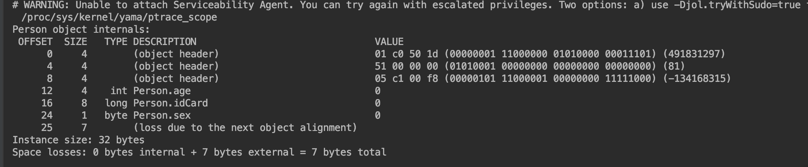

# 1.运行时数据区域


## 1.1程序计数器

**线程私有**

记录当前线程所执行的字节码的行号，各条线程之间计数器互不影响，独立存储。

如果当前执行的是Java方法，则记录虚拟机字节码指令的地址，如果执行的是本地（native）方法，则为空


## 1.2Java虚拟机栈

**线程私有**

每个Java方法在被执行的时候，都会创建一个栈帧用于存储局部变量表、操作数栈、动态连接、方法出口等信息。每一个方法被调用直至执行完毕的过程，就对应一个栈帧在虚拟机栈中入栈到出栈的过程。

局部变量表存放编译期可知的各种Java虚拟机基本数据类型和对象引用，和方法出口returnAddress（指向一条字节码指令的地址），局部变量表所需的内存空间在编译期间完成分配。

可能抛出以下异常

1. 当线程请求的栈深度大于虚拟机所允许的深度，会抛出Stack Overflow异常
2. 如果虚拟机栈容量可以动态扩展，当扩展无法申请到足够的内存时会抛出OutOfMemory异常

注：HotSpot虚拟机的栈容量是不可动态扩展的，只要线程申请栈空间成功就不会OOM，但是如果在申请的时候就因为内存不足而失败，则也会抛出OOM


## 1.3本地方法栈

**线程私有**

与Java虚拟机栈类似，区别是虚拟机栈为虚拟机执行Java方法服务，本地方法则是为虚拟机执行native方法服务

native方法一般是用其他语言(C/C++/汇编语言)编写的，并且被编译为基于本机硬件和操作系统的程序

同样会抛出Stack Overflow和OOM异常


## 1.4Java堆

**线程共享**

被所有线程共享的一块内存区域，在虚拟机启动时创建。

作用是存放对象实例，《Java虚拟机规范》中对Java堆的描述是：“所有的对象实例以及数组都应当在堆上分配”

随着Java语言的发展，逃逸分析与标量替换等的出现，让这句话也不是那么绝对了

是垃圾收集的主要区域

由于现代垃圾收集器大部分都是基于分代收集理论设计的，所以从思想上分为新生代、老年代等概念，而不是实际上的物理区分。

从分配内存的角度看，所有线程共享的Java堆中可以划分出多个线程私有的分配缓冲区(Thread Local Allocation Buffer)以提升对象分配时的效率

Java堆可以处于物理上不连续的内存空间，但在逻辑上应该被视为连续的。但对于大对象(典型的如数组对象)来说，多数虚拟机可能会要求连续的内存空间。

Java堆既可以被设定为固定大小的，也可以是可扩展的，不过当前主流的Java虚拟机都是按照可扩展来实现的，通过参数-Xmx和Xms来设定，如果在堆中没有足够的内存，会抛出OOM


## 1.5方法区

**线程共享**

用于存储已被虚拟机加载的类型信息、常量、静态变量、即时编译器编译后的代码缓存等数据。

相对而言，垃圾收集行为在这个区域比较少出现，这区域的内存回收目标主要是针对常量池的回收和对类型的卸载。


## 1.6运行时常量池

运行时常量池是方法区的一部分。Class文件中除了有类的版本、字段、方法、接口等描述信息外，还有一项信息是常量池表，用于存放编译期间生成的各种字面量与符号引用，这部分内容将在类加载后存放到方法区的运行时常量池中。

除了在编译期生成的常量，还允许动态生成，例如 String 类的 intern()。


## 1.7直接内存

在 JDK 1.4 中新引入了 NIO 类，它可以使用 Native 函数库直接分配堆外内存，然后通过 Java 堆里的 DirectByteBuffer 对象作为这块内存的引用进行操作。这样能在一些场景中显著提高性能，**因为避免了在堆内存和堆外内存来回拷贝数据**。


# 2.HotSpot虚拟机对于对象的操作

## 2.1对象的创建

1.new指令后，先去常量池中找是否有这个类的符号引用，并检查这个引用指向的类是否已经被加载、解析和初始化过，若没有，则先执行类加载过程


2.类加载通过后，虚拟机将为新生对象分配内存，对象所需内存大小在类加载完成后是完全确定的。这一过程实际上是把一块确定大小的内存块从堆中划分出来。

​    1)假设堆中内存是规整的,所有使用过的内存放在一边，没使用的放在另一边，中间用一根指针区分，那么分配的过程相当于把指针移动对象大小的距离，这种方式称为指针碰撞。

​	2)如果内存不是规整的，那么虚拟机必须维护一个列表，记录哪些内存块是可用的，分配的时候从列表中找到一块足够的空间划分给对象实例，并更新表上的记录，这种方式称为空闲列表。

内存是否规整主要取决于采用的垃圾回收器是否带有空间压缩整理能力。

还需要考虑的问题是可能会出现的并发问题，可能出现正在给对象A分配内存，指针还没来得及修改，对象B又同时使用了原来的指针来分配内存的情况，解决方式：

​	1)对分配内存空间的动作进行同步处理，实际上虚拟机是采用CAS配上失败重试机制来保证更新操作的原子性

​	2)各个线程在堆中预先分配一小块内存，称为本地线程分配缓冲，只有本地缓冲区用完的时候，分配新的缓存区时再使用1)的方法进行同步


3.将分配到的内存空间（不包括对象头)都初始化为零值，这一步保证对象实例可以不初始化直接使用


4.对对象头进行设置


5.Java中对象真正的初始化


## 2.2对象的内存布局

对象头：

分为两类信息，第一类用于存储对象自身运行时数据，如HashCode、GC分代年龄、锁标志状态、线程持有的锁、偏向线程ID、偏向时间戳等，这部分信息被称为“MarkWord"，

第二部分是类型指针：即对象指向他的类型元数据的指针，通过这个指针确定这个对象是哪个类的实例，这个并不是必须的。


实例数据：

各个类型的字段内容


对齐填充：

HotSpot要求任何对象的大小必须是8字节的整数倍


对于这部分内容的验证和MarkWord中的字段顺序，以及指针压缩具体是如何使用的可以参考博客：

https://blog.csdn.net/weixin_44627989/article/details/88866450

需要依赖：

```Java
<dependency>
    <groupId>org.openjdk.jol</groupId>
    <artifactId>jol-core</artifactId>
    <version>0.9</version>
</dependency>
```




## 2.3对象的访问定位

在栈中的本地变量表中会存储对象实例的reference，通过reference定位到具体的实例有两种方式：使用句柄和直接指针

使用句柄：


直接访问：


两者的区别就是是否额外使用一块内存来存储对象示例数据的地址信息

使用句柄的优点在于：在对象被移动（垃圾回收中移动对象是普遍行为）时，只需要改变句柄中的指针，而不需要改变栈中的reference

使用直接指针的优点在于：节省了一次指针定位的时间开销，和用来保存到对象实例数据的指针空间


# 3 哪些内存需要回收

### 3.1.1 引用计数法

在对象中添加一个引用计数器，每当有一个地方引用他时，计数器加1，引用失效时，计数器减1，计数器为0时对象就丢失，没有办法再找到、使用他，所以可以被回收

无法解决循环引用的问题

### 3.1.2 可达性分析算法

通过一系列被称为GC Roots的根对象作为起始节点，从这些节点开始，根据引用关系向下搜索，当一个对象不可达时，则这个对象不可能再被使用，所以可以被回收


固定可作为GC Roots的对象包括：

1. 虚拟机栈本地变量表中引用的对象
2. 方法区中类的静态属性引用的对象
3. 方法区中常量引用的对象，如字符串常量池中的引用
4. 本地方法栈中JNI引用的对象
5. 虚拟机内部的引用，如基本数据类型对应的Class对象，一些常驻的异常对象，系统类加载器等
6. 所有被同步锁持有的对象
7. 反映Java虚拟机内部情况的Bean、本地代码缓存等

除了这些固定的GC Roots集合以外，根据不同的垃圾回收器和回收的内存区域，还可以有其他对象临时性加入GC Roots集合。


### 3.1.3 四种引用类型

1. **强引用**

被强引用关联的对象不会被回收。

使用 new 一个新对象的方式来创建强引用。

```
Object obj = new Object();
```

2. **软引用**

被软引用关联的对象只有在内存不够的情况下才会被回收。

使用 SoftReference 类来创建软引用。

```
Object obj = new Object();
SoftReference<Object> sf = new SoftReference<Object>(obj);
obj = null;  // 使对象只被软引用关联
```

3. **弱引用**

被弱引用关联的对象一定会被回收，也就是说它只能存活到下一次垃圾回收发生之前。

使用 WeakReference 类来创建弱引用。

```
Object obj = new Object();
WeakReference<Object> wf = new WeakReference<Object>(obj);
obj = null;
```

4. **虚引用**

又称为幽灵引用或者幻影引用，一个对象是否有虚引用的存在，不会对其生存时间造成影响，也无法通过虚引用得到一个对象。

为一个对象设置虚引用的唯一目的是能在这个对象被回收时收到一个系统通知。

使用 PhantomReference 来创建虚引用。

```
Object obj = new Object();
PhantomReference<Object> pf = new PhantomReference<Object>(obj, null);
obj = null;
```


## 3.2 finalize

类似 C++ 的析构函数，用于关闭外部资源。但是 try-finally 等方式可以做得更好，并且该方法运行代价很高，不确定性大，无法保证各个对象的调用顺序，因此最好不要使用。

当一个对象可被回收时，如果需要执行该对象的 finalize() 方法，那么就有可能在该方法中让对象重新被引用，从而实现自救。自救只能进行一次，如果回收的对象之前调用了 finalize() 方法自救，后面回收时不会再调用该方法。


# 4.垃圾回收算法

## 4.1 分代收集理论

当前虚拟机的垃圾收集器 大多遵循”分代收集“理论，这一理论建立在两个假说之上：

1. 绝大多数对象的生命周期不长
2. 熬过越多次垃圾收集过程的对象就越难以消亡

这两个假说奠定了垃圾回收器一致的设计原则：应该将Java堆划分为不同的区域，然后根据对象的年龄分配到不同的区域。

对于大多数对象来说，他们都难以熬过垃圾回收过程，将他们都放在一起，就能以较低的代价回收大量的空间，剩下难以消亡的对象，也集中在一起，对于这块区域，可以以较低的频率来回收这个区域。

对于不同的区域，也可以使用不同的回收方法来和他们的特征相匹配。

**存在一个明显的困难：**

对象之间会存在跨代引用

比如对新生代进行一次GC，但是新生代的对象可能被老年代所引用，为了找到这些对象，不得不在固定的GC Roots之外，再额外遍历整个老年代的所有对象来确保可达性分析的准确性，反过来也是一样（通常只有单独针对新生代的GC 反过来只是理论说法）。这样开销是巨大的。

**引出第三条假说：**

3.跨代引用相对于同代引用来说比例极小

这条理论可以从前两条推断得出，存在引用关系的对象，应该倾向于同时生存同时消亡的，比如某个新生代对象存在跨代引用，由于老年代对象难以消亡，那么这个新生代对象同样会得以存活，进而进入老年代，跨代引用就此消除。

基于这一理论，跨代引用是少量的，不需要为了这些少量的引用去扫描整个老年代，而是在新生代建立一个全局的数据结构，称为记忆集，标识出老年代的哪一块内存会存在跨代引用，在GC时，只需要将这部分对象加入GC Roots中。


## 4.2 标记-清除算法


标记阶段：检查每个对象是否为活动对象，如果是活动对象，则程序会在对象头部打上标记

清除阶段：对被标记对象进行回收，并且维护空闲列表中的分块


缺点：

1. 执行效率不高，大部分对象都是要被回收的，必须进行大量的标记和清除动作
2. 会产生大量不连续的内存碎片，导致大对象无法被分配


## 4.3 标记-复制算法


