# 简介

Jenkins是一款使用Java语言开发的开源的自动化服务器。我们通过界面 或Jenkinsfile告诉它执行什么任务，何时执行。理论上，我们可以让它执行任 何任务，但是通常只应用于持续集成和持续交付。

使用Jenkins的过程，如同设计软件生产流水线的过程，这个流水线的起点是代码（git），终点是用户手上


# 安装启动

安装：

brew install jenkins  需要Java8与docker环境

启动：

​	jenkins

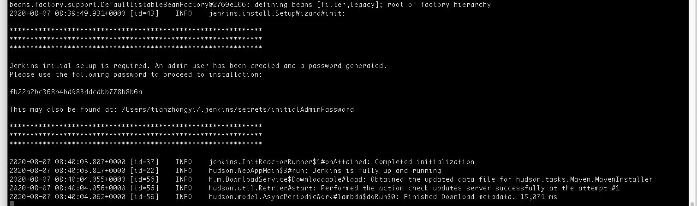

 

访问localhost:8080

输入刚生成的密码

安装插件如果不行要多retry几次 换源不行


# Jenkins与DevOps

DevOps（Development和Operations的组合）是一种重视软件开发人员 （Dev）和IT运维技术人员（Ops）之间沟通合作的文化、运动或惯例。通过自动化软件交付和架构变更的流程，使得构建、测试、发布软件能够更加快 捷、频繁和可靠。

这就是Jenkins的作用


# pipeline

## 什么是pipeline

某种抽象层次上讲，部署流水线（Deployment pipeline）是指从软件版本控制库（git/svn)到用户手中这一过程的自动化表现形式

Jenkins通常把部署流水线简称为pipeline，在以前的版本中叫做任务

在以前的版本中，pipeline是通过手动操作页面的方式来描述、设置的，在Jenkins2.X之后，支持使用代码来描述一个pipeline

## Jenkinsfile

jenkinsfile就是一个文本文件，也就是pipeline在Jenkins中的表现形式，就如同Dockerfile对于Docker，所有部署流水线的逻辑都写在Jenkinsfile中

## pipeline语法选择

有两种：

1.脚本式：

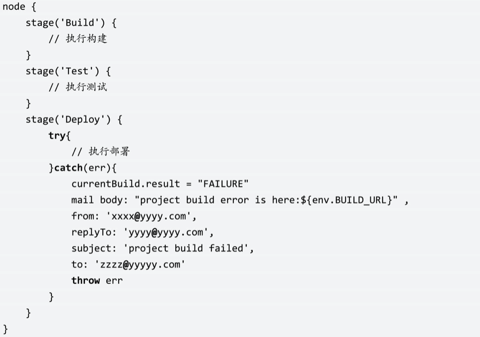

2.声明式：

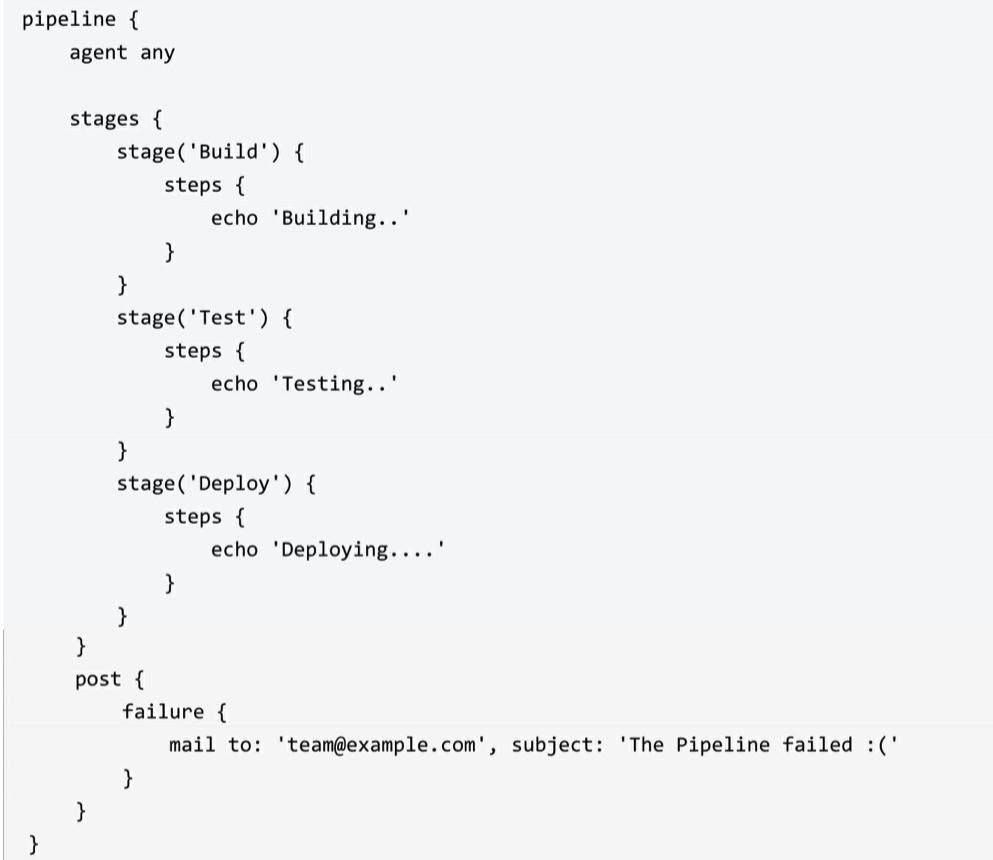


# 第一个pipeline

Jenkins-newItem-pipeline

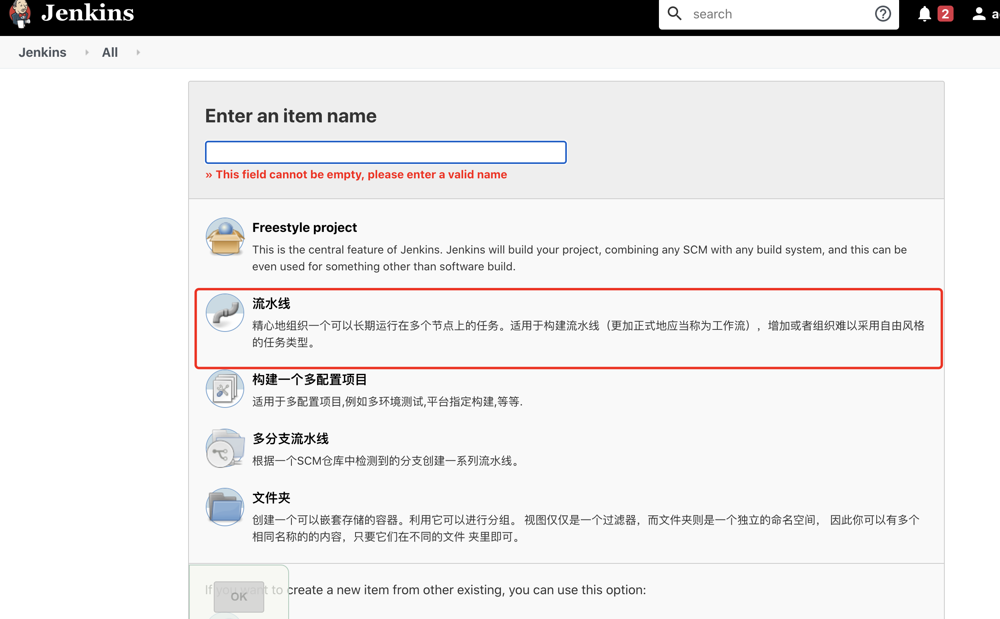

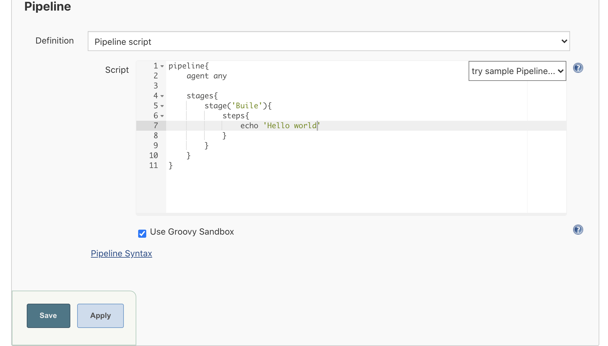

这一个pipeline会输出Hello world

save之后Bulid now

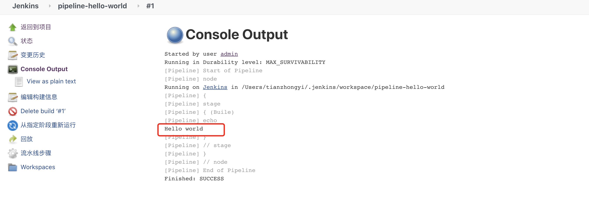

# 从Git中拉取pipeline

首先需要配置凭证

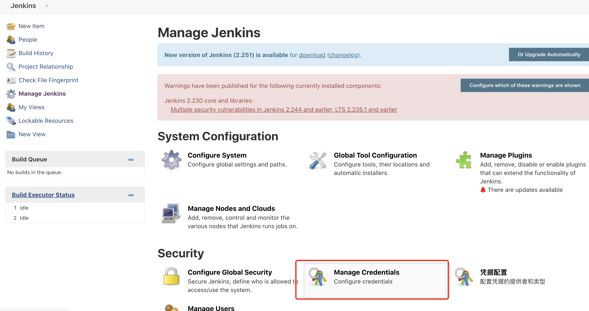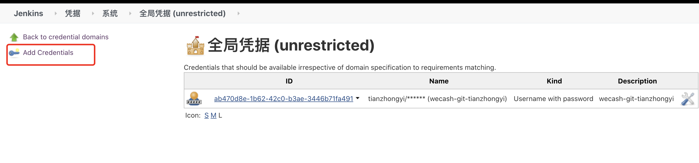

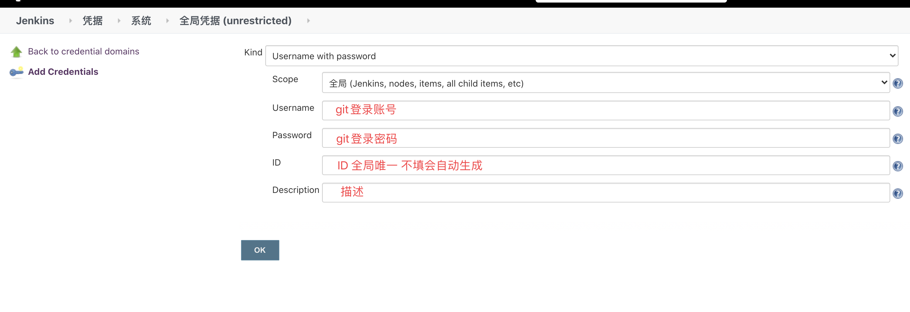

也可以在Kind中选择其他方式比如添加本地秘钥ssh


在git中创建项目 包含Jenkinsfile即可 maven项目是顺手创建的

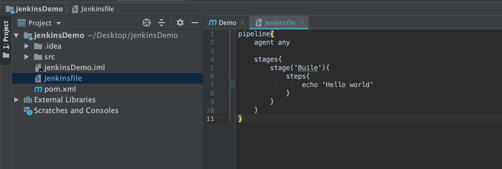

jenkinsfile的内容是第一个pipeline中的内容


再次创建一个流水线

pileline-git-helloworld

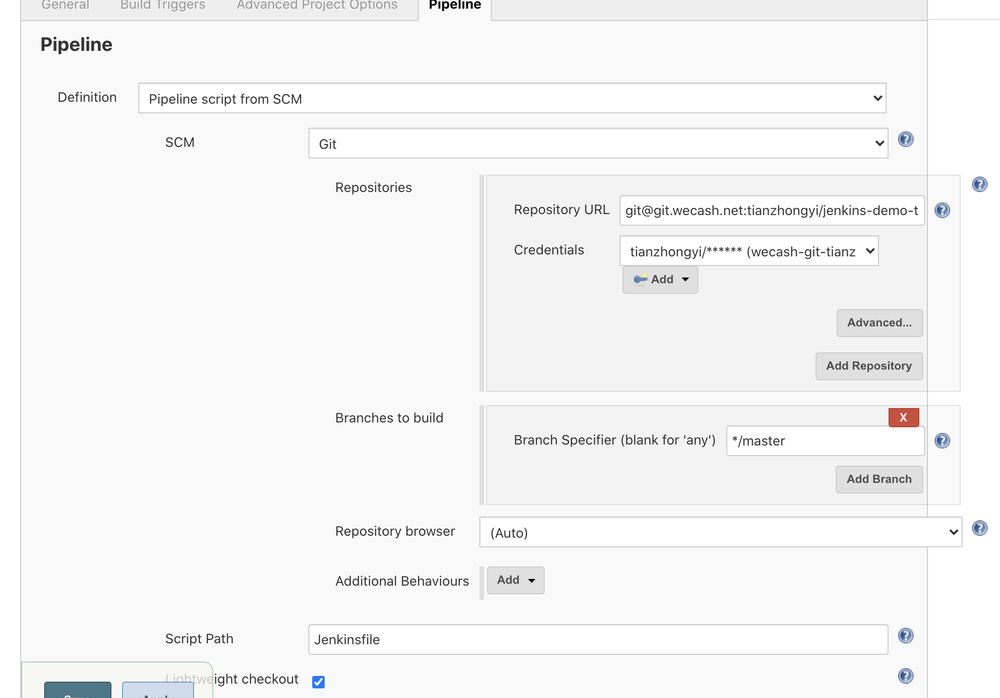

选择Pileline script from SCM


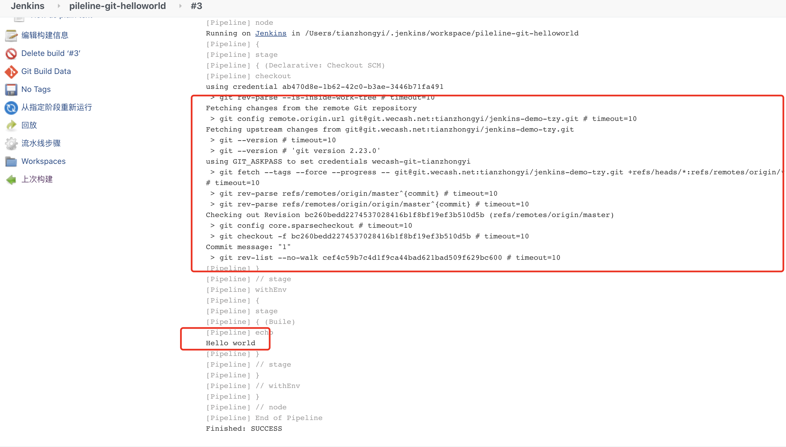

会显示从git中拉取代码的记录 成功输出hello world


此时在项目中将jenkinsfile的输出内容修改为 hello jenkins 

提交代码后再次bulid jenkins

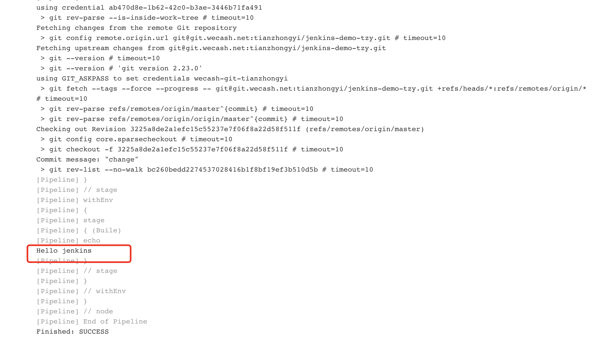


# 使用Maven构建SpringBoot项目

1.需要Jenkins插件Maven Integration、Git plugin

如果Jenkins服务器和项目准备部署的不是同一台服务器的话还需要publis-over-ssh


2.配置JDK与Maven环境

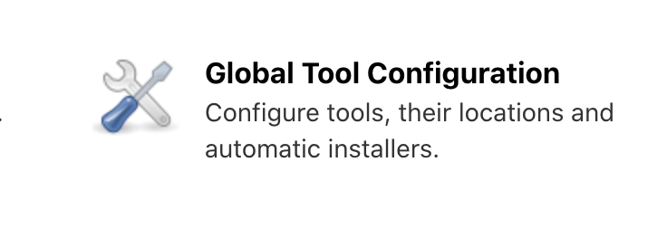

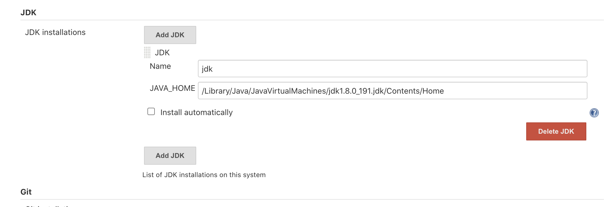

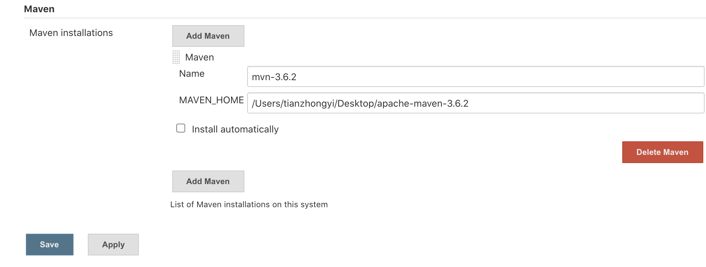


3.准备一个springboot项目到git

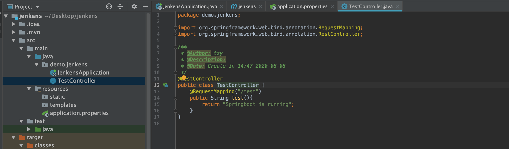

写了个最简单的


4.Jenkins new Item


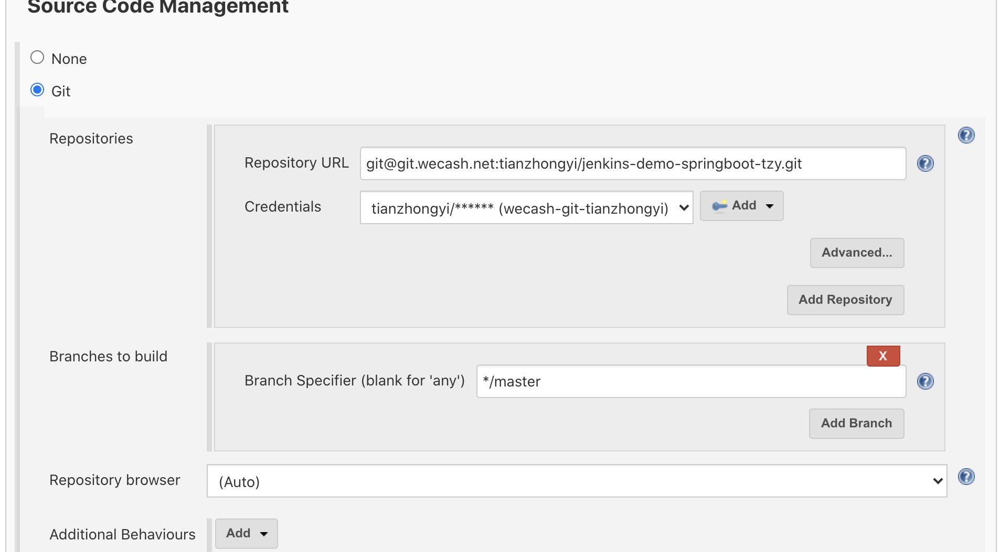

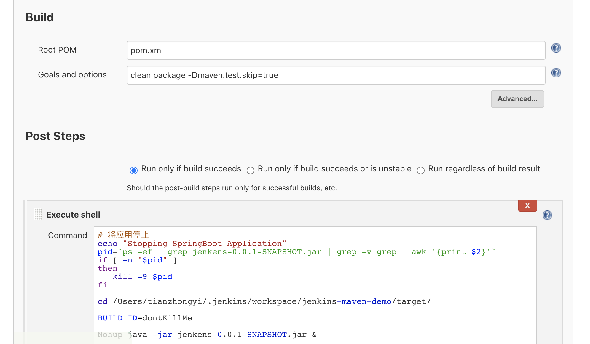


```
# 将应用停止
echo "Stopping SpringBoot Application"
pid=`ps -ef | grep jenkens-0.0.1-SNAPSHOT.jar | grep -v grep | awk '{print $2}'`
if [ -n "$pid" ]
then
   kill -9 $pid
fi

cd /Users/tianzhongyi/.jenkins/workspace/jenkins-maven-demo/target/

BUILD_ID=dontKillMe

Nohup java -jar jenkens-0.0.1-SNAPSHOT.jar &
```

jenkins-maven-demo是这个jenkins任务名字


5.build now

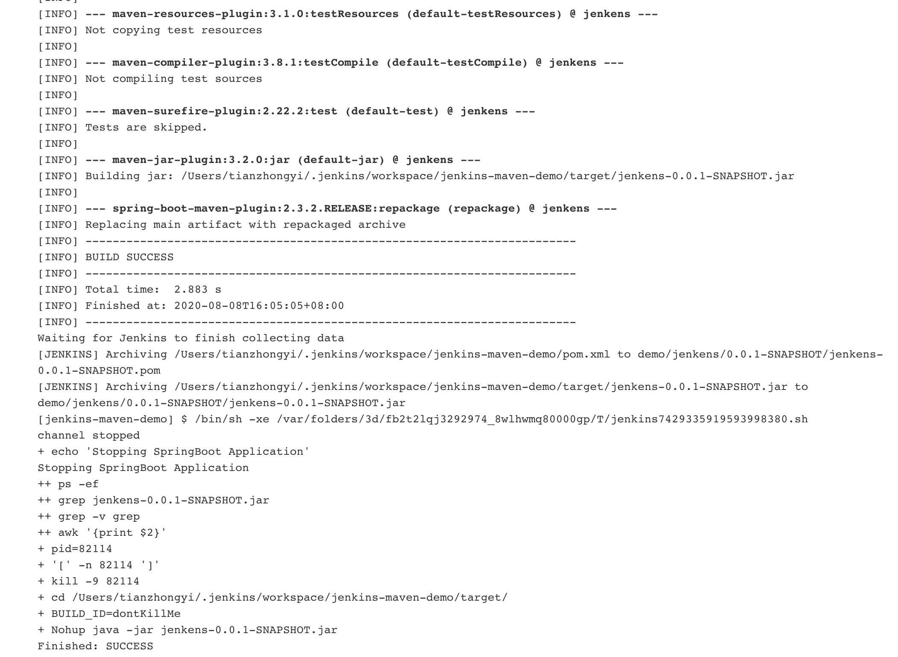

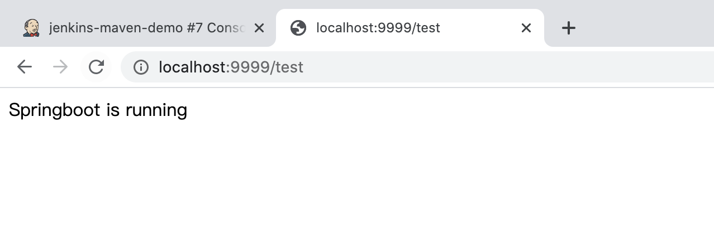

# 使用Pipeline实现集群自动化部署

上一次选择的是使用Maven构建

选用和最初一样的pipeline方式可以自定义添加jekinsfile 从而更灵活的配置项目

示例Jenkinsfile:

```J
node {
   def mvnHome
   def workspace = pwd()
   stage('Preparation') { // for display purposes
      // Get some code from a GitHub repository
      git 'http://192.168.161.118:8080/git/demo.git'
      // Get the Maven tool.
      // ** NOTE: This 'M3' Maven tool must be configured
      // ** in the global configuration.           
      mvnHome = tool 'M3'
   }
   stage('Build') {
      // Run the maven build
      if (isUnix()) {
         sh "'${mvnHome}/bin/mvn' -Dmaven.test.failure.ignore clean package"
 
      } else {
         bat(/"${mvnHome}\bin\mvn" -Dmaven.test.failure.ignore clean package/)
      }
   }
   stage('Deploy') {
      sh "'/scripts/deploy.sh' ${workspace} deploy"
   }
}
```

示例Shell脚本deploy.sh 放在/scripts目录，和JenkinsFile中写的保持一致

```Shell
#!/bin/bash
#集群IP列表，多个用空格分开
#NODE_LIST="192.168.161.118 192.168.161.117"
NODE_LIST="192.168.161.245"
#应用部署到的远程服务器目录
REMOTE_DIR="/home/project" 
#需要部署的项目名称（需和maven的project名一样,多个用空格分开）
#NEED_DEPLOY_PROJECT="user-server user-mgr info-mgr"
NEED_DEPLOY_PROJECT="user-mgr"
# Date/Time Veriables
LOG_DATE='date "+%Y-%m-%d"'
LOG_TIME='date "+%H:%M:%S"' 
CDATE=$(date "+%Y%m%d")
CTIME=$(date "+%H%M%S") 
#Shell Env
SHELL_NAME="deploy.sh"
SHELL_DIR="/deploy/log"
SHELL_LOG="${SHELL_DIR}/${SHELL_NAME}.log" 
#Code Env
JAR_DIR="/deploy/jar"
CONFIG_DIR="/deploy/config"
LOCK_FILE="/tmp/deploy.lock" 
usage(){
    echo  $"Usage: $0 [projectJarPath] [ deploy | rollback ]"
} 
init() {
    create_dir $SHELL_DIR;
    create_dir $JAR_DIR;
    create_dir $CONFIG_DIR;
}
create_dir() {
   if [ ! -d $1 ]; then  
       mkdir -p $1
   fi
}
shell_lock(){
    touch ${LOCK_FILE}
}
shell_unlock(){
    rm -f ${LOCK_FILE}
}
write_log(){
    LOGINFO=$1
    echo "`eval ${LOG_DATE}` `eval ${LOG_TIME}` : ${SHELL_NAME} : ${LOGINFO}"|tee -a ${SHELL_LOG}
}
#拷贝jenkins的工作空间构建的jar包到特定目录，备份，为以后回滚等等操作
copy_jar() { 
    TARGET_DIR=${JAR_DIR}/${CDATE}${CTIME}
    write_log "Copy jenkins workspace jar file to ${TARGET_DIR}"
    mkdir -p $TARGET_DIR
    for project in $NEED_DEPLOY_PROJECT;do
      mkdir -p $TARGET_DIR/${project}
      find $1 -name ${project}*.jar -exec cp {} $TARGET_DIR/${project}/ \;
    done 
} 
#拷贝应用的jar包到远程服务器
scp_jar(){
    SOURCE_DIR=${JAR_DIR}/${CDATE}${CTIME}
    write_log "Scp jar file to remote machine..."
    for node in $NODE_LIST;do
      scp -r ${SOURCE_DIR}/* $node:${REMOTE_DIR}
      write_log "Scp to ${node} complete."
    done
} 
# 杀掉远程服务器上正在运行的项目
cluster_node_remove(){
    write_log "Kill all runing project on the cluster..."
    for project in $NEED_DEPLOY_PROJECT;do
      for node in $NODE_LIST;do
        pid=$(ssh $node "ps aux|grep ${project}|grep -v grep|awk '{print $2}'"|awk '{print $2}')
        if [ ! -n "$pid" ]; then  
      write_log "${project} is not runing..."
    else  
          ssh $node "kill -9 $pid"
      write_log "Killed ${project} at ${node}..."
    fi  
      done
    done
} 
#在远程服务器上启动项目
cluster_deploy(){
    write_log "Up all project on the cluster..."
    for project in $NEED_DEPLOY_PROJECT;do
      for node in $NODE_LIST;do
        ssh $node "cd ${REMOTE_DIR}/${project};nohup java -jar ${project}*.jar >/dev/null 2>&1 &" 
    write_log "Up ${project} on $node complete..."
      done
    done
} 
#回滚（暂未实现）
rollback(){
    echo rollback
} 
#入口
main(){
    if [ -f ${LOCK_FILE} ];then
        write_log "Deploy is running"  && exit;
    fi
    WORKSPACE=$1
    DEPLOY_METHOD=$2
    init;
    case $DEPLOY_METHOD in
    deploy)
        shell_lock;
        copy_jar $WORKSPACE;
        scp_jar;
        cluster_node_remove;
        cluster_deploy;
        shell_unlock;
        ;;
    rollback)
        shell_lock;
        rollback;
        shell_unlock;
        ;;
    *)
        usage;
    esac 
}
main $1 $2
```

