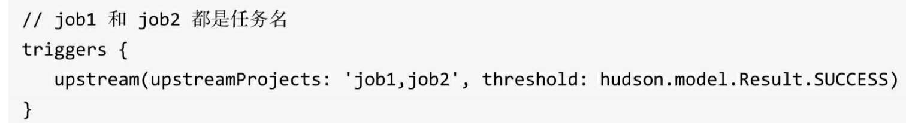

# Hello Jenkins

## 安装启动

安装：

brew install jenkins  需要Java8与docker环境

启动：

​	jenkins


 

访问localhost:8080

输入刚生成的密码


踩坑：

1.安装插件如果不行的话就一直retry直到成功吧 换源的方式试了很多 都没有用 查日志发现还是走的原来的链接  用nginx直接拦的话可能可以（没有试过）

2.如果已经初始化过 可以删除/.jenkins下面的所有文件 重新启动 就可以再次初始化了

3.手动安装插件的时候要注意依赖顺序安装


## Jenkins简单介绍与DevOps

Jenkins是一款使用Java语言开发的开源的自动化服务器。我们通过界面 或Jenkinsfile告诉它执行什么任务，何时执行。理论上，我们可以让它执行任 何任务，但是通常只应用于持续集成和持续交付。

使用Jenkins的过程，如同设计软件生产流水线的过程，这个流水线的起点是代码（git），终点是用户手上


DevOps（Development和Operations的组合）是一种重视软件开发人员 （Dev）和IT运维技术人员（Ops）之间沟通合作的文化、运动或惯例。通过自动化软件交付和架构变更的流程，使得构建、测试、发布软件能够更加快 捷、频繁和可靠。

这就是Jenkins的作用


## pipeline

### 什么是pipeline

某种抽象层次上讲，部署流水线（Deployment pipeline）是指从软件版本控制库（git/svn)到用户手中这一过程的自动化表现形式

Jenkins通常把部署流水线简称为pipeline，在以前的版本中叫做任务

在以前的版本中，pipeline是通过手动操作页面的方式来描述、设置的，在Jenkins2.X之后，支持使用代码来描述一个pipeline

### Jenkinsfile

jenkinsfile就是一个文本文件，也就是pipeline在Jenkins中的表现形式，就如同Dockerfile对于Docker，所有部署流水线的逻辑都写在Jenkinsfile中

### pipeline语法选择

有两种：

1.脚本式：


2.声明式：


## 第一个pipeline

Jenkins-newItem-pipeline


这一个pipeline会输出Hello world

save之后Bulid now


## 从Git中拉取pipeline

首先需要配置凭证


也可以在Kind中选择其他方式比如添加本地秘钥ssh


在git中创建项目 包含Jenkinsfile即可 maven项目是顺手创建的


jenkinsfile的内容是第一个pipeline中的内容


再次创建一个流水线

pileline-git-helloworld


选择Pileline script from SCM


会显示从git中拉取代码的记录 成功输出hello world


此时在项目中将jenkinsfile的输出内容修改为 hello jenkins 

提交代码后再次bulid jenkins


## 使用Maven构建SpringBoot项目

1.需要Jenkins插件Maven Integration、Git plugin

如果Jenkins服务器和项目准备部署的不是同一台服务器的话还需要publis-over-ssh


2.配置JDK与Maven环境


3.准备一个springboot项目到git


写了个最简单的


4.Jenkins new Item


```
# 将应用停止
echo "Stopping SpringBoot Application"
pid=`ps -ef | grep jenkens-0.0.1-SNAPSHOT.jar | grep -v grep | awk '{print $2}'`
if [ -n "$pid" ]
then
   kill -9 $pid
fi

cd /Users/tianzhongyi/.jenkins/workspace/jenkins-maven-demo/target/

BUILD_ID=dontKillMe

Nohup java -jar jenkens-0.0.1-SNAPSHOT.jar &
```

jenkins-maven-demo是这个jenkins任务名字


5.build now


## 使用Pipeline实现集群自动化部署

上一次选择的是使用Maven构建

选用和最初一样的pipeline方式可以自定义添加jekinsfile 从而更灵活的配置项目

示例Jenkinsfile:

```J
node {
   def mvnHome
   def workspace = pwd()
   stage('Preparation') { // for display purposes
      // Get some code from a GitHub repository
      git 'http://192.168.161.118:8080/git/demo.git'
      // Get the Maven tool.
      // ** NOTE: This 'M3' Maven tool must be configured
      // ** in the global configuration.           
      mvnHome = tool 'M3'
   }
   stage('Build') {
      // Run the maven build
      if (isUnix()) {
         sh "'${mvnHome}/bin/mvn' -Dmaven.test.failure.ignore clean package"
 
      } else {
         bat(/"${mvnHome}\bin\mvn" -Dmaven.test.failure.ignore clean package/)
      }
   }
   stage('Deploy') {
      sh "'/scripts/deploy.sh' ${workspace} deploy"
   }
}
```

示例Shell脚本deploy.sh 放在/scripts目录，和JenkinsFile中写的保持一致

```Shell
#!/bin/bash
#集群IP列表，多个用空格分开
#NODE_LIST="192.168.161.118 192.168.161.117"
NODE_LIST="192.168.161.245"
#应用部署到的远程服务器目录
REMOTE_DIR="/home/project" 
#需要部署的项目名称（需和maven的project名一样,多个用空格分开）
#NEED_DEPLOY_PROJECT="user-server user-mgr info-mgr"
NEED_DEPLOY_PROJECT="user-mgr"
# Date/Time Veriables
LOG_DATE='date "+%Y-%m-%d"'
LOG_TIME='date "+%H:%M:%S"' 
CDATE=$(date "+%Y%m%d")
CTIME=$(date "+%H%M%S") 
#Shell Env
SHELL_NAME="deploy.sh"
SHELL_DIR="/deploy/log"
SHELL_LOG="${SHELL_DIR}/${SHELL_NAME}.log" 
#Code Env
JAR_DIR="/deploy/jar"
CONFIG_DIR="/deploy/config"
LOCK_FILE="/tmp/deploy.lock" 
usage(){
    echo  $"Usage: $0 [projectJarPath] [ deploy | rollback ]"
} 
init() {
    create_dir $SHELL_DIR;
    create_dir $JAR_DIR;
    create_dir $CONFIG_DIR;
}
create_dir() {
   if [ ! -d $1 ]; then  
       mkdir -p $1
   fi
}
shell_lock(){
    touch ${LOCK_FILE}
}
shell_unlock(){
    rm -f ${LOCK_FILE}
}
write_log(){
    LOGINFO=$1
    echo "`eval ${LOG_DATE}` `eval ${LOG_TIME}` : ${SHELL_NAME} : ${LOGINFO}"|tee -a ${SHELL_LOG}
}
#拷贝jenkins的工作空间构建的jar包到特定目录，备份，为以后回滚等等操作
copy_jar() { 
    TARGET_DIR=${JAR_DIR}/${CDATE}${CTIME}
    write_log "Copy jenkins workspace jar file to ${TARGET_DIR}"
    mkdir -p $TARGET_DIR
    for project in $NEED_DEPLOY_PROJECT;do
      mkdir -p $TARGET_DIR/${project}
      find $1 -name ${project}*.jar -exec cp {} $TARGET_DIR/${project}/ \;
    done 
} 
#拷贝应用的jar包到远程服务器
scp_jar(){
    SOURCE_DIR=${JAR_DIR}/${CDATE}${CTIME}
    write_log "Scp jar file to remote machine..."
    for node in $NODE_LIST;do
      scp -r ${SOURCE_DIR}/* $node:${REMOTE_DIR}
      write_log "Scp to ${node} complete."
    done
} 
# 杀掉远程服务器上正在运行的项目
cluster_node_remove(){
    write_log "Kill all runing project on the cluster..."
    for project in $NEED_DEPLOY_PROJECT;do
      for node in $NODE_LIST;do
        pid=$(ssh $node "ps aux|grep ${project}|grep -v grep|awk '{print $2}'"|awk '{print $2}')
        if [ ! -n "$pid" ]; then  
      write_log "${project} is not runing..."
    else  
          ssh $node "kill -9 $pid"
      write_log "Killed ${project} at ${node}..."
    fi  
      done
    done
} 
#在远程服务器上启动项目
cluster_deploy(){
    write_log "Up all project on the cluster..."
    for project in $NEED_DEPLOY_PROJECT;do
      for node in $NODE_LIST;do
        ssh $node "cd ${REMOTE_DIR}/${project};nohup java -jar ${project}*.jar >/dev/null 2>&1 &" 
    write_log "Up ${project} on $node complete..."
      done
    done
} 
#回滚（暂未实现）
rollback(){
    echo rollback
} 
#入口
main(){
    if [ -f ${LOCK_FILE} ];then
        write_log "Deploy is running"  && exit;
    fi
    WORKSPACE=$1
    DEPLOY_METHOD=$2
    init;
    case $DEPLOY_METHOD in
    deploy)
        shell_lock;
        copy_jar $WORKSPACE;
        scp_jar;
        cluster_node_remove;
        cluster_deploy;
        shell_unlock;
        ;;
    rollback)
        shell_lock;
        rollback;
        shell_unlock;
        ;;
    *)
        usage;
    esac 
}
main $1 $2
```


# 再谈概念

## 持续集成

软件开发周期：

编码 → 构建 → 集成 → 测试 → 交付 → 部署

持续集成指的是频繁地将代码集成到主干

主要有两个好处：

1. **快速发现错误。**每完成一点更新，就集成到主干，可以快速发现错误，定位错误也比较容易。
2. **防止分支大幅偏离主干。**如果不是经常集成，主干又在不断更新，会导致以后集成的难度变大，甚至难以集成。

目的：

**就是让产品可以快速迭代，同时还能保持高质量**

保证高质量的措施是，代码集成到主干之前，必须经过自动化测试

## 持续交付

持续交付是持续集成的下一步，它指的是频繁地将软件的新版本，交付给质量团队或者用户，以供评审。如果评审通过，代码就进入生产阶段。

## 持续部署

持续部署是持续交付的下一步，指的是代码通过评审以后，自动部署到生产环境。


## Jenkins是什么

如果把软件开发周期看做一条流水线的话，流水线的源头就是代码库，代码库一旦发生改动，那么意味着流水线要进行处理，流水线中会经历编译、打包、部署，以及其他可选诸如测试、通知等步骤，当项目部署后，流水线就结束了。

Jenkins正是对这条流水线进行编排的平台，它具有以下特点：

1. 使用Java语言编写，开源
2. 安装方便快捷，linux可通过yum安装，也可直接通过下载war包或是docker实现快速安装部署
3. 具有Web管理页面
4. 消息通知及测试报告，构建完成时可以通过邮件通知，生成Junit/TestNG测试报告
5. 丰富的插件支持、专门的插件平台：https://plugins.jenkins.io/，生态环境全面。比如代码库可以选择Git/SVN插件、编译可以选择Maven/Grade等，不同语言也可以指定构建工具、发送邮件也有多个扩展插件可以使用：


甚至是可以发送钉钉通知：


6.文件识别，jenkins能跟踪每次构建生成哪些jar包以及使用哪个版本的jar包

7.分布式构建/部署，支持多台服务器一起构建、部署

# pipeline流水线

之前说到Jenkins可以对从代码改变，到最终release中的所有步骤进行控制与编排，也就是说可以对不同的项目进行不同的流水线过程的设计。设计流水线的过程可以通过Jenkins的Web页面UI进行配置（手动点点），也可以编写JenkinsFile，用代码的形式进行编排，通常来说后者是推荐的做法，选择代码方式有以下优点：

1. JenkinsFile也可以用代码库进行管理，所以可以更好地将Pipeline进行版本化控制
2. 基于第一点，pipeline的每次修改对所有人都是可见的，除此之外还可以对pipeline代码进行审查
3. 更好的重用性，在WebUI上点点点的过程是不可重用的，但是代码可以重用


# pipeline代码怎么写

pipeline代码用于描述整条流水线应该怎么做，包括执行编译、打包、测试、输出测试报告、通知、部署等步骤

它是基于Groovy语言的，所以可以适当学习一部分Groovy语言特性，函数定义等

另外在上面提到了pipeline的脚本式与声明式两种语法，后面都会采用声明式


## pipeline最简结构

```groovy
pipeline{
    agent any

    stages{
        stage('Build'){
            steps{
                echo 'Hello jenkins'
            }
        }
    }
}
```

- Pipeline：代表整条流水线，包含整条流水线的逻辑
- stage：阶段，代表流水线的阶段，每个阶段都必须有名称，比如在代码示例中 “Build“就是这个阶段的名称
- Stages：stage的容器，包含一至多个stage
- steps：代表阶段中的一至多个具体步骤的容器，在代码示例中，echo就是一个步骤，在一个stage中有且只有一个steps
- agent：指定流水线的执行位置，流水线中的每个阶段都必须在某个地方（物理机、虚拟机、Docker）执行，agent部分即指定具体在哪里执行

以上每一个部分都是必须的 否则会报错


看一个稍微复杂一些的stages感受一下

编排了Preparation、 Checkout code、SonarQube analysis等步骤，大致阅读：

Preparation阶段进行了清空临时目录的操作

Checkout code阶段进行了拉取项目代码的操作

SonarQube analysis阶段调用sonaqube scanner工具扫描代码

```groovy
stages {
    stage('Preparation') {
        steps {
            sh "rm -rf /tmp/${ env.JOB_NAME }"
        }
    }
    stage('Checkout code') {
        steps {
            echo "starting fetchCode......"
            checkout scm
        }
    }
    stage('SonarQube analysis') {
        steps {
            echo "starting codeAnalyze......"
             script {
                 echo "starting script......"
                 def sonarqubeScannerHome = tool name: 'SonarQube Scanner'
                 withSonarQubeEnv('mywo-sentry') {
                     sh "${sonarqubeScannerHome}/bin/sonar-scanner"
                 }
             }
        }
    }
    stage("SonarQube Quality Gate") {
        when {
            branch xxx
        }
        steps {
            echo "starting waitForQualityGate......"
            script {
                echo "starting script......"
                 timeout(time: 1, unit: 'HOURS') {
                   def qg = waitForQualityGate()
                   if (qg.status != 'OK') {
                      error "Pipeline aborted due to quality gate failure: ${qg.status}"
                   }
                 }
            }
        }
    }
    stage('Compile branch master') {
        when {
            branch 'master'
        }
        steps {
            withMaven(globalMavenSettingsConfig: 'bfa90212-2742-4611-aa71-8e0ec76d0c28', jdk: 'Oracle JDK 8', maven: 'Maven 3', mavenSettingsConfig: '02e95d2b-6bb6-457d-943f-13c63095e500') {
                sh "mvn -Dmaven.test.skip=true  clean package -U -DskipTests=True"
                sh "echo this is master branch."
            }
       }
    }
    stage('Compile branch test') {
        when {
            branch 'test'
        }
        steps {
                sh "mvn -Dmaven.test.skip=true  clean package -U -DskipTests=True"
                sh "echo this is test branch."
        }
    }
    stage('Package & Upload to OSS') {
        when {
            branch 'master'
        }
        steps {
            sh "mkdir -p ${ tempFolder }"
            script {
                def warFilePaths = ['xxxxx']
                def hosts = "xxxx"
                def deploy_user = "app-deploy"
                def target_dir = "/data/services/jartest"
                for ( warFilePath in warFilePaths ) {
                    sh "echo OSS."
                    git_commit_id = sh(returnStdout: true, script: 'git rev-parse --short HEAD').trim() //需要获取shell返回值操作
                    serviceName = sh(returnStdout: true, script: "basename ${ warFilePath } | cut -d . -f 1").trim()
                    sh "mv ${ warFilePath } ${ tempFolder }/ROOT.war"
                    artifact = "${ serviceName }_${ env.BUILD_NUMBER }-${ env.BRANCH_NAME }-${ git_commit_id }.tar.gz"
                    sh "mkdir -p ${ artifactsPath } && tar czf ${ artifactsPath }/${ artifact } -C ${ tempFolder } ROOT.war"
                    sh "upload-flash -f ${ artifactsPath }/${ artifact } -t ${ artifactOssPath }"
                }
            }
        }
    }
  
  
  .........
```


## Post部分

Post部分包含的是在整个pipeline或阶段完成后的一些附加步骤，这一部分是可选的，所以并不在最简结构中。

可以有多种条件块，包括：

- always：不论当前完成状态是什么 都执行
- changed：只要当前完成状态与上一次不同就执行
- success：当前完成状态为成功时执行
- cleanup：清理条件块，无论完成状态，其他条件块执行完成后都执行
- ..................

示例：

```groovy
post {
    always {
        archive "target/**/*.war"
        mail to:"$email_list_a", subject:"OVER: ${currentBuild.fullDisplayName}", body: "${ emailContent }"
    }
    success {
        mail to:"$email_list_a", subject:"SUCCESS: ${currentBuild.fullDisplayName}", body: "Yay, we passed."
    }
    failure {
        mail to:"$email_list_a", subject:"FAILURE: ${currentBuild.fullDisplayName}", body: "Boo, we failed."
    }
    unstable {
        mail to:"me@example.com", subject:"UNSTABLE: ${currentBuild.fullDisplayName}", body: "Huh, we're unstable."
    }
    changed {
        mail to:"me@example.com", subject:"CHANGED: ${currentBuild.fullDisplayName}", body: "Wow, our status changed!"
    }
}
```


## pipeline支持的指令

基本结构之外可以通过各种指令来满足复杂的需求：

Jenkins pipeline支持的指令有：

• environment：用于设置环境变量，可定义在stage或pipeline部分。

• tools：可定义在pipeline或stage部分。它会自动下载并安装我们指定的工 具，并将其加入PATH变量中。

• input：定义在stage部分，会暂停pipeline，提示你输入内容。

• options：用于配置Jenkins pipeline本身的选项，比如options {retry（3）} 指当pipeline失败时再重试2次。options指令可定义在stage或pipeline部分。

• parallel：并行执行多个step。在pipeline插件1.2版本后，parallel开始支持 对多个阶段进行并行执行。

• parameters：与input不同，parameters是执行pipeline前传入的一些参数。

• triggers：用于定义执行pipeline的触发器。

• when：当满足when定义的条件时，阶段才执行。

在使用指令时，需要注意的是每个指令都有自己的“作用域”。如果指令使 用的位置不正确，Jenkins将会报错。


environment示例：

```
environment {
    def serviceName  = ""
    def hosts = "11.11.11.11"
    def deploy_user = "app-deploy"
    def artifactsPath = "devops-artifacts"
    def artifactOssPath = "meiwozufang/${ env.JOB_NAME }"
    def tempFolder = "/tmp/${ env.JOB_NAME }/${ env.BUILD_NUMBER }"
    def tempResultFolder = "/tmp/${ env.JOB_NAME }/results"
    def git_commit_id = ""
    def artifact = ""
    def emailContent = "Hi ALL！已经部署完毕,并执行了自动化脚本，请开始进行人工回归;"
    def target_dir = "/data/services/jartest"
}
```


Tools:

```
tools {
    jdk 'Oracle JDK 8'
}
```


Options:

```
options {
    buildDiscarder(logRotator(numToKeepStr: '5'))
    disableConcurrentBuilds()
}
```


## 配置pipeline

```
options {
    buildDiscarder(logRotator(numToKeepStr: '5'))
    disableConcurrentBuilds()
}
```

buildDiscarder：保存最近历史构建记录的数量。当pipeline执行完成后， 会在硬盘上保存制品和构建执行日志，如果长时间不清理会占用大量空间， 设置此选项后会自动清理。此选项只能在pipeline下的options中使用


disableConcurrentBuilds：同一个pipeline，Jenkins默认是可以同时执行多 次的，如图3-2所示。此选项是为了禁止pipeline同时执行

介绍两个比较常用的选项，其他可参阅参考手册


## 在声明式pipeline中使用脚本

如果要在steps块中写Groovy代码，需要使用script步骤

示例如下：

```groovy
pipeline{
    agent any

    stages{
        stage('Example'){
            steps{
                echo 'Hello jenkins'
                script{
                    def persons = ['张三','李四','王五']
                    for(int i = 0;i < persons.size();i++){
                        echo "Person name : ${persons[i]}"
                    }
                }
            }
        }
    }
}
```


可以看出，在script块中的其实就是Groovy代码。大多数时候，我们是不 需要使用script步骤的。如果在script步骤中写了大量的逻辑，则说明你应该把 这些逻辑拆分到不同的阶段，或者放到共享库中。共享库是一种扩展Jenkins pipeline的技术。


## pipeline内置基础步骤

pipeline内置的一些步骤，不做过多介绍，具体参考手册


# 环境变量与构建工具

环境变量可以被看作是pipeline与Jenkins交互的媒介。比如，可以在 pipeline中通过BUILD_NUMBER变量知道构建任务的当前构建次数。环境变量可以分为Jenkins内置变量和自定义变量

## 内置变量

在pipeline执行时，Jenkins通过一个名为env的全局变量，将Jenkins内置环境变量暴露出来。


env中常用的变量：

• BUILD_NUMBER：构建号，累加的数字。在打包时，它可作为制品名 称的一部分，比如server-2.jar。

• BRANCH_NAME：多分支pipeline项目支持。当需要根据不同的分支做 不同的事情时就会用到，比如通过代码将release分支发布到生产环境中、 master分支发布到测试环境中。

• BUILD_URL：当前构建的页面URL。如果构建失败，则需要将失败的 构建链接放在邮件通知中，这个链接就可以是BUILD_URL。

• GIT_BRANCH：通过git拉取的源码构建的项目才会有此变量。 

在使用env变量时，需要注意不同类型的项目，env变量所包含的属性及其 值是不一样的。比如普通pipeline任务中的GIT BRANCH变量的值为 origin/master，而在多分支pipeline任务中GIT BRANCH变量的值为master。


## 自定义环境变量

当pipeline变得复杂时，我们就会有定义自己的环境变量的需求。声明式 pipeline提供了environment指令，方便自定义变量


这样就相当于执行了 clang -g命令


## 构建工具

tools指令能帮助我们自动下载并安装所指定的构建工具，并将其加入 PATH变量中


使用Maven


自定义构建工具 指定路径后使用该路径下的指令


还支持在不同的stage中指定不同的工具


# pipeline构建SpringBoot

最开始的示例是使用Maven构建SpringBoot的 现在使用pipeline构建

```groovy
pipeline {
   agent any

   environment{
       MVN_HOME = "/Users/tianzhongyi/Desktop/apache-maven-3.6.2/bin"
   }
   stages {
      stage('Build') {
         steps {
            checkout([$class: 'GitSCM', branches: [[name: '*/master']], doGenerateSubmoduleConfigurations: false, extensions: [], submoduleCfg: [], userRemoteConfigs: [[credentialsId: 'ab470d8e-1b62-42c0-b3ae-3446b71fa491', url: 'https://git.wecash.net/tianzhongyi/jenkins-demo-springboot-tzy.git']]])
            
            sh "if (ps -ef| grep java|grep jenkens-0.0.1-SNAPSHOT.jar)then (ps -ef| grep java|grep jenkens-0.0.1-SNAPSHOT.jar| awk '{print \$2}'|xargs kill -9) fi"
            
            sh "${MVN_HOME}/mvn clean package -Dmaven.test.skip=true"
            
            sh "${MVN_HOME}/mvn surefire-report:report"
         }
      }
      stage('Depoly'){
        steps{
            sh '''
        JENKINS_NODE_COOKIE=dontkillme
        Nohup java -jar /Users/tianzhongyi/.jenkins/workspace/test/target/jenkens-0.0.1-SNAPSHOT.jar &
        '''
        }
      }
   }
   post{
       always{
           junit testResults: "**/target/surefire-reports/*.xml"
       }
   }
}
```

也没啥注意的地方 credentialsId是之前配置的凭证id


# Pipeline整合Junit生成测试报告

上面的示例是已经加了生成报告的了

```
 post{
       always{
           junit testResults: "**/target/surefire-reports/*.xml"
       }
   }
```

还有这句： sh "${MVN_HOME}/mvn surefire-report:report"


项目里面随便写两个测试


SimpleTest2是错误的


注意Maven配置要支持maven-surefire-plugin


之后会生成测试报告：


所以路径对应上就可以了


构建之后会看到TestResult 


点进去可以查看到报告


# Pipeline整合Jmeter生成性能报告

将代码改成：


预期一半的请求会返回fail

写一个简单的Jmeter测试用例：10个线程请求20次 断言响应是Springboot is running

将他保存为JmeterDemo.jmx


修改pipeline代码：

```groovy
pipeline {
   agent any

   environment{
       MVN_HOME = "/Users/tianzhongyi/Desktop/apache-maven-3.6.2/bin"
   }
   stages {
      stage('Build') {
         steps {
            checkout([$class: 'GitSCM', branches: [[name: '*/master']], doGenerateSubmoduleConfigurations: false, extensions: [], submoduleCfg: [], userRemoteConfigs: [[credentialsId: 'ab470d8e-1b62-42c0-b3ae-3446b71fa491', url: 'https://git.wecash.net/tianzhongyi/jenkins-demo-springboot-tzy.git']]])
            
            sh "if (ps -ef| grep java|grep jenkens-0.0.1-SNAPSHOT.jar)then (ps -ef| grep java|grep jenkens-0.0.1-SNAPSHOT.jar| awk '{print \$2}'|xargs kill -9) fi"
            
            sh "${MVN_HOME}/mvn clean package -Dmaven.test.skip=true"
            
            sh "${MVN_HOME}/mvn surefire-report:report"
         }
      }
      stage('Depoly'){
        steps{
            sh '''
        JENKINS_NODE_COOKIE=dontkillme
        Nohup java -jar /Users/tianzhongyi/.jenkins/workspace/test/target/jenkens-0.0.1-SNAPSHOT.jar &
        '''
        }
      }
      stage('jmeterTest'){
          steps{
              echo 'Run JMeter Test'
              sh 'sleep 15s'
              echo 'sleep finished'
              sh '/usr/local/Cellar/jmeter/5.2.1/bin/jmeter -n -t /Users/tianzhongyi/JmeterDemo.jmx -l test.jtl'
              step([$class: 'ArtifactArchiver', artifacts: '**/*.jtl'])
          }
      }
   }
   post{
       always{
           junit testResults: "**/target/surefire-reports/*.xml"
       }
   }
}
```

sleep15s是等待springboot服务启动

jmeter的位置是自己本机的jmeter home

生成test.jtl文件 并显示在页面上


结果：


差不多一半的异常 和预期相符


# 触发条件

到目前位置，都是在push代码后，切换到Jenkins界面，手动点击Build now

Jenkins支持按照一定的条件来自动执行


## 时间触发


利用cron表达式进行定时任务


同样是利用cron 但是是定时去代码库看代码是否有变化


## 事件触发

可以通过上游任务触发



就是某个任务完成后，另一个任务就执行


可以通过GitLab通知触发

当源代码发生改变后，GitLab通知Jenkins来触发


# 参考资料

《Jenkins 2.x实践指南》 翟志军

jenkins.io

