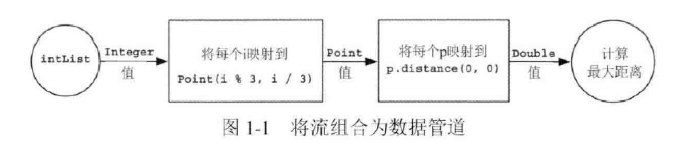
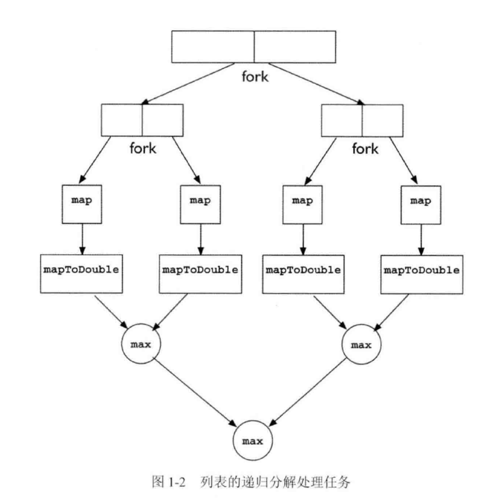
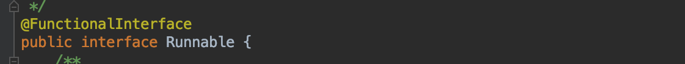
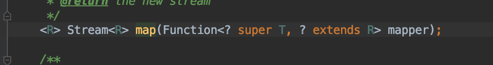
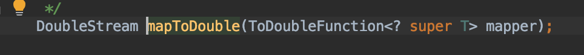
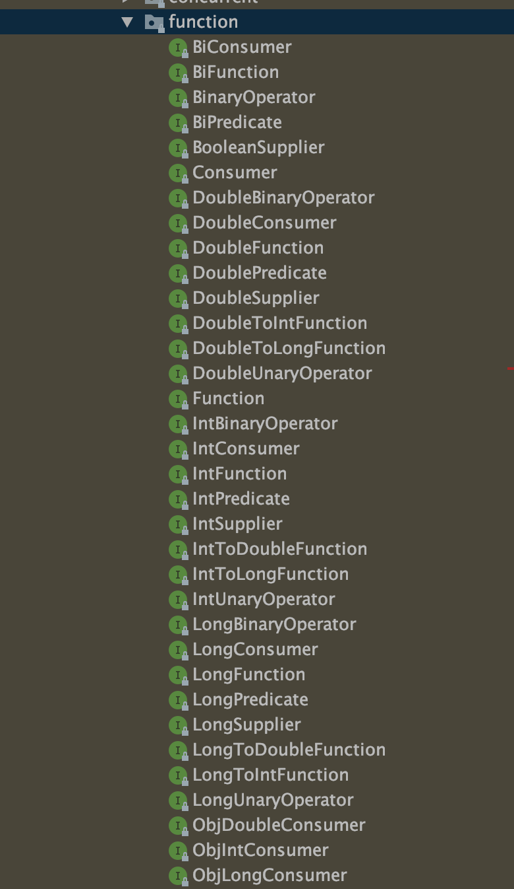
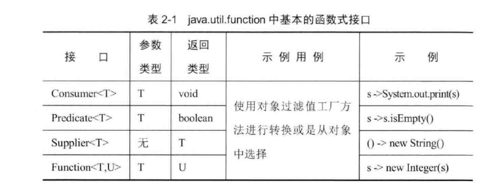
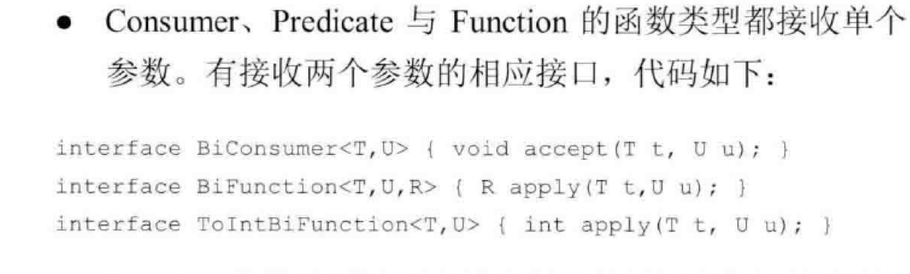
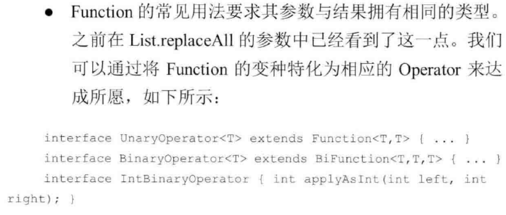

# 1.入门

## 1.1 流处理

流是一系列数据项，一次只生成一项。程序可以从输入流中一个一个读取数据项，然后以同样的方式将数据项写入输出流。一个程序的输出流很可能是另一个程序的输入流。

一个实际的例子是在Unix或Linux中，很多程序都从标准输入（Unix和C中的stdin，Java中的 System.in）读取数据，然后把结果写入标准输出（Unix和C中的stdout，Java中的System.out）。 首先我们来看一点点背景：Unix的cat命令会把两个文件连接起来创建一个流，tr会转换流中的 字符，sort会对流中的行进行排序，而tail -3则给出流的最后三行。Unix命令行允许这些程 序通过管道（|）连接在一起，比如

cat file1 file2 | tr "[A-Z]" "[a-z]" |sort |tail -3

会（假设file1和file2中每行都只有一个词）先把字母转换成小写字母，然后打印出按照词典 排序出现在最后的三个单词。我们说sort把一个行流① 作为输入，产生了另一个行流（进行排序）作为输出，如图1-2所示。请注意在Unix中，命令（cat、tr、sort和tail）是同时执行 的，这样sort就可以在cat或tr完成前先处理头几行。就像汽车组装流水线一样，汽车排队进 入加工站，每个加工站会接收、修改汽车，然后将之传递给下一站做进一步的处理。尽管流水线实际上是一个序列，但不同加工站的运行一般是并行的。

## 1.2 从外部迭代到内部迭代

### 外部迭代

对一个集合的遍历，无论是使用迭代器，for循环，还是增强for，这一类方式进行的遍历都属于**显式**的遍历方式，这种方式称为外部迭代，它的实现都是通过迭代器来实现的，在迭代器中，隐式地指定了遍历的方式为顺序遍历。

### 内部迭代

在集合内部进行迭代的方式称为内部迭代，Collection.forEach()方法即是内部迭代。他只告诉集合“需要做什么”而不是“怎么做”。

```Java
default void forEach(Consumer<? super T> action) {
    Objects.requireNonNull(action);
    for (T t : this) {
        action.accept(t);
    }
}
```

实际上forEach内部使用的仍然是增强for，和外部迭代的本质没有区别，他们的区别是在形式上的区别，是一种风格上的改变。

### 顺序访问的必要性

```java
        List<Point> pointList = Arrays.asList(new Point(1,2),new Point(2,3));

        //1.对每个Point沿着x和y轴各平移1个单位距离
        for(Point p : pointList){
            p.translate(1,1);
        }

        //2.迭代器实现
        Iterator pointItr = pointList.listIterator();
        while(pointItr.hasNext()){
            Point point = (Point)pointItr.next();
            point.translate(1,1);
        }
```

通过 pointList创建一个迭代器对象，通过该对象依次访问pointList中的元素，亦或是使用同样通过迭代器实现的for-each来进行集合的遍历，关键在于，访问pointList中的元素的顺序是由迭代器控制的，这一点我们无法控制，例如针对ArrayList的迭代器会按照先后**顺序**返回列表中的元素

将迭代的顺序模型应用到现实世界中的场景，会发现一些显著的问题。

例如现在需要完成这样一件事情：

有一堆邮件，需要重复以下步骤：按照寄件人姓氏的顺序取出下一封邮件，然后将其按照收信地址的不同，分发给不同的下级处理站。

在这一过程中，显然“按照寄件人姓氏的顺序取出下一封邮件”对结果是毫无影响的，无论是按照什么顺序执行，或是并行执行，对最终的结果都不会产生影响，只要保证不遗漏信件即可。

在Point的例子中同样是这样，对每一个point元素让其着x和y轴各平移1个单位距离，而无论是for循环，还是迭代器，实际上都是按照了point元素放入list的顺序进行读取，这个顺序同样是对结果没有影响的。

当存在更好的策略的情况下，外部迭代导致集合只能连续并且按照固定的顺序处理元素的做法是低效的。

**对于现实任务来说，你只需要知道每封信件都被分发，到底怎么做取决于你自己。同样，我们应该告诉集合应该对他们所包含的每一个元素采取什么动作，而不是像外部迭代一样指定怎么做。**

同样在这个pointList的例子中，遍历集合的顺序对结果不造成影响，那么可以采用并发处理的方式对这个集合进行处理，只需要告诉集合应该做什么。

这个方法有一个显而易见的名字就是forEach

```
pointList.forEach(对每个元素执行translate（1，1));
```

这行代码告诉了pointList，要对他的每个元素执行什么操作，关键在于“**做什么而非怎么做**”，明确的指定怎么做会丧失优化的机会。

### 总结

内部迭代和外部迭代在的本质很多情况下没有区别，比如使用Collections.forEach，他的实现是增强for循环。

引入内部迭代的方式是一种风格、思想上的转变，他让我们把注意力集中在”做什么“，而非”怎么做“，那么这一种转变可以带来哪些好处？在后面的内容会体现出，可以大致总结为以下几点：

1.指定”做什么“的代码比指定”怎么做“的代码更加易读，可以清晰直观的看出写代码的人想要对这个集合做什么操作，而不需要把”怎么做“的代码看完，再分析写代码的人的意图。

2.内部迭代是使用StreamAPI的基础，StreamAPI提供了一系列便捷、高效的对集合进行操作的方式，包括常用的一切操作，使用StreamAPI可以大大减少代码量，也可以带来性能上的提升。

3.对并行流的支持，第二点说到内部迭代是StreamAPI的基础，StreamAPI提供并行流让程序可以更加高效的执行。

4.与Lambda的配合，内部迭代接收一个Function作为入参，配合lambda表达式同样可以让代码更加简洁。


## 1.3 从集合到流

对PointList的例子进行扩展

```Java
List<Integer> integerList = Arrays.asList(1,2,3,4,5);
List<Point> pointList = new ArrayList<>();
for(Integer i : integerList){
    pointList.add(new Point(i,i+1));
}
Double maxDistance = Double.MIN_VALUE;
for(Point p : pointList){
    maxDistance = Math.max(maxDistance,p.distance(0,0));
}
```

这段代码的目的是：

1.创建一个integerList

2.通过这个integerList，生成一个pointList

3.找出这些Point中与原点(0,0)距离最远的点


抛去1.创建integerList的步骤不看

2、3步骤虽然还有优化的空间，但是是日常中常见的代码处理方式，这种处理方式存在哪些问题呢？

1.List<Point> pointList在整个处理过程中，仅仅作为中间存储，当Point足够多时，是一笔不小的内存开销。

2.空列表的最小值Double.MIN_VALUE是一个隐含条件，这种隐含条件是”经验所致“的处理方式，对初学者来说并不友好。

3.代码冗长且可读性低，必须要读完整段代码才能知道最终目的是什么。


这种处理方式是“面向数据”的处理方式



如图所示，可以清晰的感受到从源集合开始，每个元素的转变过程，看着它从Integer变为Point，然后由Point转化为Double，最后所有的Double得到一个最大距离Double。

这一过程，尤其是前两步，可以用另一种方式来感受它：数据在流动

一个原始Integer在流动的过程中，进行了到Point的转化，进行了求到原点距离的double转化，在流动的过程中，不需要做任何的中间存储。图1-1的矩形框就可以看做是对流的操作，可以把它想象为流水线上的某一步，接受一个流，进行某种处理，然后输出一个流，数据始终在流水线传送带上流动，矩形框就如同中间的某一个机器，机器是不会对流水线上的物品进行存储的，它只对其进行加工。

最后的圆圈表示终止操作max，它会消费一个流，它有可能返回一个单个值，如果流为空，也可能什么都不返回，这一点用一个Optional或是专门的原生Optional（本例为OptionalDouble）来处理。

最开始的圆圈表示一个流的起点，流的起点最多的是集合，同样也能从数组、生成函数中得到流。StreamAPI提供了流的生成方法，对于源头是集合的流，使用其stream()方法就可以得到流。

同时配合StreamAPI，可以将最初的代码改造为：

```Java
OptionalDouble optionalDouble = integerList.stream()
        .map(i -> new Point(i,i+1))
        .mapToDouble(p -> p.distance(0,0))
        .max();
```

这段代码初次看到可能觉得陌生，但是它的每一步都比较好理解，从方法名上可以看出对流的每一步操作，并最终返回一个double。

这里只是对流式编程进行一个最初的展示，后面会学习如何编写这种代码，作为学习的奖励，这种处理方式省去了生成中间集合的步骤和消耗，也对并行有更好的支持。


## 1.4 从串行到并行

同样是上一个例子中的对point进行的一系列操作：

1.创建一个integerList

2.通过这个integerList，生成一个pointList

3.找出这些Point中与原点(0,0)距离最远的点


通过integerList生成pointList的过程、和求出所有的与原点距离的过程，都是不需要其他数据协作的，对多线程而言是很好处理的，我们可以编写多线程代码来进行这两步处理，让每一个线程其中几个integer进行处理，最终生成doubleList。

然而最后一步：找出doubleList中的最大值，是相对复杂的，因为他需要与其他线程数据进行对比，当然我们可以通过分解问题的方式来处理，就如同找出年级最高分，可以先拆解为找出每个班的最高分，再把这些最高分进行对比一样，想要找出每个班的最高分，又可以先找出每个小组的最高分……直到子问题足够小可以串行执行。归并排序就是使用这一思想进行处理的。



对子问题拆解，再合并，需要编写递归代码，同样针对不同的情况，需要给出不同的最小子问题规模，显示的编写这段代码并不十分困难，但是其步骤是繁琐的，而使用StreamAPI只需要作出一个改变即可享受到并行处理带来的效率：

```Java
OptionalDouble optionalDouble = integerList.stream()
        .map(i -> new Point(i,i+1))
        .mapToDouble(p -> p.distance(0,0))
        .max();
```

只需要对.stream()进行替换为.parallelStream()即可

```Java
OptionalDouble optionalDouble = integerList.parallelStream()
        .map(i -> new Point(i,i+1))
        .mapToDouble(p -> p.distance(0,0))
        .max();
```


随着单核处理器性能的瓶颈，多核处理器已经成为趋势，并发编程的重要性也越来越高，更好的适应并发编程也是StreamAPI的优势之一。


# 2.Lambda表达式与函数式接口

## 2.1从Runnable说起

```Java
new Thread(new Runnable() {
    @Override
    public void run() {
        System.out.println("Hello World");
    }
}).start();

```

这是一段常见的使用匿名内部类的方式来创建线程的代码

```Java
 new Thread(() -> System.out.println("Hello World")).start();
```

这是使用lambda表达式实现的同一效果。

可以看到，在这个例子中，lambda表达式”代替“了匿名内部类，lambda的使用与匿名内部类类似，在一些需要创建类而又不想新建.java文件时，比如自定义排序时调用Collections.sort，创建 new Comparator匿名内部类，还有上文写到的new Runnable。


## 2.2 将代码（函数）进行传递

很多时候我们想做的其实是把一段代码或者说一个函数作为参数来进行传递，就如同Runnable的例子中，实际上想要的只是System.out.println("Hello World");这一句核心代码，但是由于Java面向对象的性质，我们必须为此实例化一个对象。对于那些比较简单的，并且不会被多次使用的函数来说，可以使用匿名内部类（如同上面所写的那样）来进行实例化，但是这样仍然很麻烦。


## 2.3 lambda语法与核心思想：可推导，就可省略

在2.1节中的new Thread中，有哪些部分是不需要的呢？

```Java
  new Thread(new Runnable() {
            @Override
            public void run() {
                System.out.println("Hello World");
            }
        }).start();
```

1.new Thread方法接收一个Runnble 所以必须要new

2.为了实现run方法，必须写public void run()

而实际上我们真正关心的只有System.out.println("Hello World");这一句话

那么为什么可以用

```Java
 new Thread(() -> System.out.println("Hello World")).start();
```

来代替呢

这里是lambda的最核心的思想：

**如果编译器可以从上下文推导出某些内容，那么这些内容就不需要写**

在这里哪些内容是可推导的？

1.new Thread方法接收Runnable类型的参数  所以可以省略new Runnable

2.Runnable 中的只有一个抽象方法 run，所以重写的必然是这个 run 方法，所以可以省略 run 方法的声明部分（public void run）


在目前为止，可以先简单把lambda看做匿名内部类的简化写法，虽然他们在其他部分仍有不同（2.5节）

lambda语法：

```java
(parameters) -> expression
或
(parameters) ->{ statements; }
```

以下是lambda表达式的重要特征:

- **可选类型声明：**不需要声明参数类型，编译器可以统一识别参数值。
- **可选的参数圆括号：**一个参数无需定义圆括号，但多个参数需要定义圆括号。
- **可选的大括号：**如果主体包含了一个语句，就不需要使用大括号。
- **可选的返回关键字：**如果主体只有一个表达式返回值则编译器会自动返回值，大括号需要指定明表达式返回了一个数值。


下面是lambda表达式的几个简单例子：

```Java
// 1. 不需要参数,返回值为 5  
() -> 5  
  
// 2. 接收一个参数(数字类型),返回其2倍的值  
x -> 2 * x  
  
// 3. 接受2个参数(数字),并返回他们的差值  
(x, y) -> x – y  
  
// 4. 接收2个int型整数,返回他们的和  
(int x, int y) -> x + y  
  
// 5. 接受一个 string 对象,并在控制台打印,不返回任何值(看起来像是返回void)  
(String s) -> System.out.print(s)
```


## 2.4 函数式接口

函数式接口(Functional Interface)就是一个有且仅有一个抽象方法，但是可以有多个非抽象方法的接口。

函数式接口可以被隐式转换为 lambda 表达式。

Lambda 表达式和方法引用（实际上也可认为是Lambda表达式）上。

如定义了一个函数式接口如下：

```Java
@FunctionalInterface
interface GreetingService 
{
    void sayMessage(String message);
}
```

那么就可以使用Lambda表达式来表示该接口的一个实现(注：JAVA 8 之前一般是用匿名类实现的)：

```Java
GreetingService greetService1 = message -> System.out.println("Hello " + message);
```

函数式接口可以对现有的函数友好地支持 lambda。

JDK 1.8 之前已有的函数式接口: 

- java.lang.Runnable
- java.util.concurrent.Callable
- java.security.PrivilegedAction
- java.util.Comparator
- java.io.FileFilter
- java.nio.file.PathMatcher
- java.lang.reflect.InvocationHandler
- java.beans.PropertyChangeListener
- java.awt.event.ActionListener
- javax.swing.event.ChangeListener

刚才提到的Runnable、Comparator都在其中




JDK 1.8 新增加的函数接口：

- java.util.function

 FunctionalInterface这个注解会检查该接口是否只有一个抽象方法

只有一个抽象方法这一点是lambda”可推导“的重要前提，只有知道具体要实现的是什么抽象方法，才可以根据方法声明中的参数类型和返回值来确定入参、出参类型。


在第一章的pointList的例子中，使用到了以下代码：

```Java
OptionalDouble optionalDouble = integerList.parallelStream()
        .map(i -> new Point(i,i+1))
        .mapToDouble(p -> p.distance(0,0))
        .max();
```

其中，map接收一个Function




mapToDouble接收一个ToDoubleFunction




在Java8新增的java.util.function中，提供了多种函数式接口：



他们都是通过下面四种核心类型，采用三种演化方式演化而来



演化方式1：原生特化

使用指定好的原生类型替换掉类型参数


演化方式2：参数数量的改变




演化方式3：Function的特殊形式



拥有了这些”入门套件“，可以覆盖大部分需要使用lambda表达式的情况，同样可以自己编写函数式接口来满足特殊的需要。


## 2.5 变量作用域

1.lambda 表达式只能引用标记了 final 的外层局部变量，这就是说不能在 lambda 内部修改定义在域外的局部变量，否则会编译错误。

2.lambda 表达式的局部变量可以不用声明为 final，但是必须不可被后面的代码修改（即隐性的具有 final 的语义）

3.在 Lambda 表达式当中不允许声明一个与局部变量同名的参数或者局部变量。


## 2.6 方法引用 ::

方法引用就是让你根据已有的方法实现来创建 Lambda表达式

这种方式可读性会更好

比如原lambda：(Apple a) ->  a.getWeight()

可以直接写成Apple::getWeight


# 3. 流概念

## 3.1 流是什么

Stream（流）是Java8引入的一套新的API

它是用来对**数据集合**进行处理的


## 3.2 为什么要使用流

集合是使用最多的API，我们经常需要对一个数据集合进行过滤，筛选，查找，映射等过程

假如现在有一个菜肴（Dish)对象，它的属性如下：

```java
 private final String name;
    private final boolean vegetarian;
    private final int calories;
    private final Type type;
    
    public enum Type { MEAT, FISH, OTHER }
```

对于一个Dish List

我们可能需要找出所有热量低于一定值的菜

这种时候就需要遍历这个List，然后在遍历的过程中使用if判断

这种写法更倾向于“对问题的实现”

而如果是在SQL中，可以直接写出以下语句：

select * from dishlist where calories < 400

这种写法更偏向于“对问题的描述”，你不需要考虑怎么实现，实现是SQL执行器的工作

使用流同样可以达到这个目的：只需要描述问题，不需要考虑实现

这是使用流的第一个原因


第二个原因是当集合元素数量非常多时，为了提高性能，需要做并行处理，而在代码中显式的写多线程处理代码非常麻烦，流同样可以帮你实现这一点。


第三个原因是流内部的实现利用了短路、延迟载入的特性，同时还不需要创建于销毁中间集合，所以性能上使用流来操作集合要更好


## 3.3 流操作

流操作分为两类：

1.中间操作

2.终端操作


中间操作会从一个流返回另一个流，这让多个中间操作可以连接起来成为流水线

终端操作会消费一个流，产生一个**不是流**的结果。

除非流水线上触发一个终端操作，否则中间操作不会执行


# 4. 使用流

## 4.1 创建流

可以从集合中.stream()来创建流

也可以从IO中得到流或者创建无限流


## 4.2 筛选和切片

1.用谓词（一个返回boolean的函数）筛选

示例:

.filter(Dish::isVegetarian) 等效于 .filter(dish -> dish.isVegetarian())

.filter(dish -> dish.getName.equals("xxx"))


2.去重

.distinct()


3.截断

.limit(n) 会得到流的前n个元素


4.跳过

.skip(n)会跳过流的前n个元素


## 4.3 映射

.map()

```java
<R> Stream<R> map(Function<? super T, ? extends R> mapper);
```

他接收一个函数作为参数 这个函数会被应用在每个元素上 根据这个函数返回内容的不同 会改变流的类型

比如

.map(Dish::getName)后 Stream的类型就从Dish变成了String


### flatmap

考虑一个像`[[1,2,3]，[4,5,6]，[7,8,9]]`这样的具有“两个层次”的结构

扁平化意味着将其转化为“一个一级”结构：`[1,2,3,4,5,6,7,8,9]`


## 4.4 查找和匹配

.allMatch()

.anyMatch()

.noneMatch() 都接受一个谓词 返回一个boolean

会利用短路机制提升性能


.findAny()返回当前流中的任意元素

.findFirst()若一个流有出现顺序，可以用来返回第一个元素

find通常在filter后使用


## 4.5 归约

.reduce()

将流中的元素反复结合起来，得到一个值，这样的操作叫做归约操作

