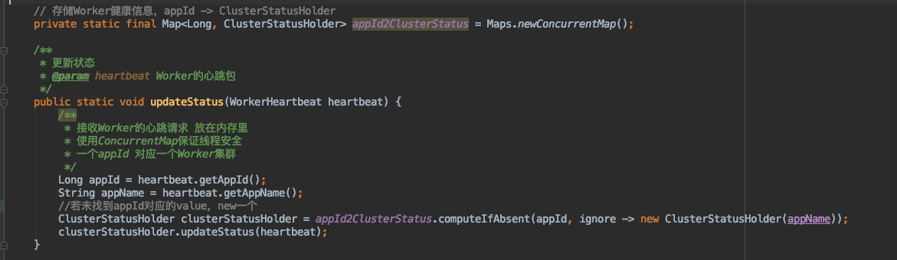
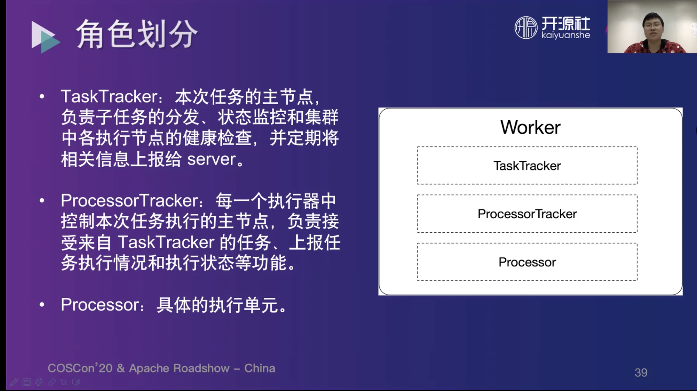

# Server和Worker之间的通信

server和worker之间可多对多

但是没有依赖服务注册组件 如何做到服务发现/高可用？

**使用分组隔离，让某一个集群的worker全部连接到某一个server**

这样这个server就有了整个worker集群的完整信息


1.worker启动时，请求任意一台server

2.server去数据库查是否有这个worker集群对应的注册信息

3.1 若有 则这个worker集群已属于某一个server，那么先检测这个server是否存活，若存活则返回该server信息给worker，让worker注册上去 若不存活，则同3.2

3.2 若无或曾经的server不存活，则自己作为这个集群的worker的server


服务发现：ServerDiscoveryService


这个地方有一个问题：

遍历ServerAddress的方式，是否会导致多个worker集群都注册到同一个server 也就是地址中排行第一的server地址 

测试发现会到另一个server 没找到负载的代码

且 如果某个worker的server挂了 worker集群会迁移到另一个server上


# 多语言处理

```
ProcessorTracker
```

```
initProcessor
```

```
ScriptProcessor
在worker本机生成脚本 然后使用指令执行
```

```
提供"http", "https", "ftp"三种开头的脚本下载链接
```

 

# server启动流程


# 接口

1.根据appName和password，查appId

http://127.0.0.1:7700/openApi/assert

post 传参form-data


2.saveJob

更新与新建同一个接口 不传id则为新建

Post Json


3.fetchJob


## 需补充

----JOB

1.多条件查询job List

已有条件：

ID：等于 大于 小于

任务名称： 等于 模糊

任务描述：模糊

时间表达式类型：K/V都有 IN LIST

 执行类型，单机/广播/MR：V IN LIST

 执行器类型，Java/Shell ：V IN LIST

执行器信息：等于 模糊

任务状态：V IN LIST

下次执行时间：大于 小于

 报警用户ID列表：模糊

任务创建时间：大于 小于

任务修改时间：大于 小于


---INSTANCE

2.根据jobId、appId、实例状态 查实例List

3.根据instanceId查log 及下载log 需要mongo

---WORKFLOW

4.多条件查询workflow List

--WORKFLOW INSTANCE

数据库内容长度 实际上是限制了节点通信长度


# Notes

1.com.google.common.base.Stopwatch计时器 用于耗时计算

2.解析配置文件:PropertyUtils

3.获取本机IP 随机端口号等NetUtils

4.通过SpringIOC取指定Bean SpringUtils.getBean(XXX.class); 该class需被容器管理

5.实现InitializingBean 会在Spring容器初始化时执行afterPropertiesSet方法

6.com.google.common.cache.Cache 

```
/**
 * cache.get方法，第一个参数是key，第二个参数是一个回调函数
 * 当通过第一个参数获取value时，如果存在则直接返回旧值 return
 * 如果不存在，则通过传入的第二个参数（方法）来加载value，把这个value加入缓存并return
 */
```

7.JPA自定义表前缀和实体类去掉DO 作为表名 PowerJobPhysicalNamingStrategy

8.Actor没有使用Spring容器进行管理，所以在其中需要用SpringUtils.getBean来获取被Spring管理的类，（如果需要Actor也被Spring容器管理，应该需要设置为多例，Actor是否需要用Spring管理？它的生命周期比较特殊）

9.JPA 大于小于等于 模糊  IN PowerQuery QueryConvertUtils

10.@Autowired构造方法注入IdGenerateService

11. @Async("BeanName") 使用线程池异步处理 ThreadPoolConfig 见https://blog.csdn.net/qq_38796327/article/details/90599867
12.  @Scheduled 方法的定时执行 OmsScheduleService.timingSchedule
13. 11/12可以配合使用
14. @RequestBody需要实体类有Getter方法 且为默认getter的方法名 @Accessors(chain = true, fluent = false)会影响Getter/Setter方法名
15. mysql索引长度限制 唯一索引String长度为191
16. Lists.partition 将list集合按指定长度进行切分，返回新的List<List<??>>集合
17. Spring自带定时任务@Scheduled(fixedRate = SCHEDULE_RATE) 需开启 @EnableScheduling(可标注在Class Spring启动类)
18. 自带定时任务和@Async可以配合使用
19. 


# Server-ServerActor

处理来自worker的请求

## 处理Worker的心跳请求

作用：接收Worker发来的心跳请求，包含机器健康状态、容器部署状态等

存储与内存中，一个appId对应一个Worker集群


 WorkerManagerService.updateStatus(heartbeat);




## 处理instance（任务实例）状态

Spring容器管理的InstanceManager 全局唯一实例

 getInstanceManager().updateStatus(req);


任务实例与任务详情的对应关系存储在InstanceMetadataService的Cache<Long, JobInfoDO> instanceId2JobInfoCache中

任务从Server派发至Worker时装载缓存

任务实例完成时卸载缓存


对实例信息进行DB的更新

对实例状态进行判断（固定速率和固定延时任务只需要落库，不需要后续判断）

若失败，则执行重试策略 重新进行派发 dispatchService.redispatch

若完成(成功或失败但重试次数到达上限)，则对完成的任务实例进行收尾：上报日志数据、workflow特殊处理、告警、主动移除缓存


## 处理在线日志请求

 InstanceLogService.submitLogs

 提交日志记录，持久化到本地数据库中


## 处理 Worker容器部署请求

todo


## 处理worker 请求获取当前任务所有处理器节点的请求

 WorkerManagerService.getSortedAvailableWorker

 获取有序的当前所有可用的Worker地址（按得分高低排序，排在前面的健康度更高）

数据来源是ServerActor接收到的Worker的心跳请求 会存储Worker集群的信息


# Server-FriendActor

 处理server与server之间的请求

##  处理存活检测的请求

返回一个请求与响应的时间差


##  处理查询Worker节点的请求

 获取当前连接到该Server的Worker信息

数据来源同样是Server-ServerActor中的处理Worker的心跳请求的缓存


##  onReceiveRemoteProcessReq

todo


# Server-ServerTroubleshootingActor

处理server异常信息

## onReceiveDeadLetter

就打了个日志


# 分布式唯一ID

 IdGenerateService

先装配DefaultServerIdProvider 执行其构造方法 入库

再装配IdGenerateService 执行其构造方法 


# 线程池

 ThreadPoolConfig

 创建了三个线程池 分别用于不同的任务

##  omsTimingPool：用于执行定时任务的线程池

 


##  omsBackgroundPool：用于执行后台任务的线程池


##   taskScheduler：用于定时调度的线程池


# 任务调度

 OmsScheduleService.timingSchedule

每15s会执行一次，查询本机需要负责的任务，执行调度

通过Lists.partition 控制每次并发执行10个任务

## CRON Job

时间轮


# feature

1.工作流前端优化 浏览器缓存位置

2.工作流支持节点参数个性化、禁用、失败跳过

3.工作流原地重试、标记成功

4.实例参数传递

5.接入权限系统 以用户的角度登录 而不是以APP登录 一个用户可以有多个APP 提供账号内切换APP的通道 对接门户？


# point

1.提供openAPI，比如业务方想要在节假日触发任务，节假日这个概念他自己实现

2.工作流的每个节点本身都是powerjob任务，因此享受任务的所有基础能力：故障转移，MapReduce，在线运维，实时日志等

3.为什么需要分布式计算？任务调度---离线任务---大批量数据处理---分布式计算  这四者密不可分，如果再引入一个分布式计算框架就有些麻烦，市面上的分布式计算框架多是面对数据的，而powerjob的分布式计算是面向业务的

4.




