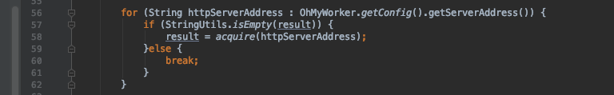
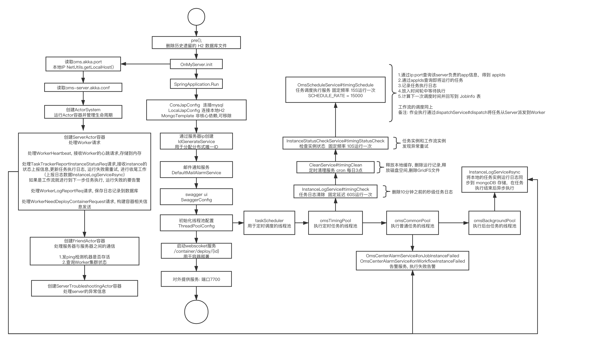
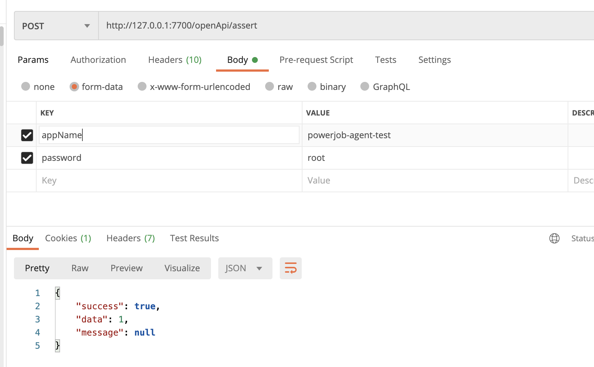
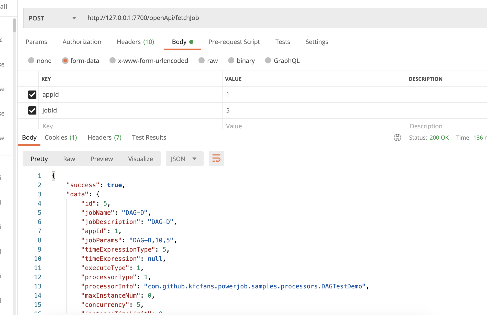

# Server和Worker之间的通信

server和worker之间可多对多

但是没有依赖服务注册组件 如何做到服务发现/高可用？

**使用分组隔离，让某一个集群的worker全部连接到某一个server**

这样这个server就有了整个worker集群的完整信息


1.worker启动时，请求任意一台server

2.server去数据库查是否有这个worker集群对应的注册信息

3.1 若有 则这个worker集群已属于某一个server，那么先检测这个server是否存活，若存活则返回该server信息给worker，让worker注册上去 若不存活，则同3.2

3.2 若无或曾经的server不存活，则自己作为这个集群的worker的server


服务发现：ServerDiscoveryService



这个地方有一个问题：

遍历ServerAddress的方式，是否会导致多个worker集群都注册到同一个server 也就是地址中排行第一的server地址 

测试发现会到另一个server 没找到负载的代码

且 如果某个worker的server挂了 worker集群会迁移到另一个server上


# 多语言处理

```
ProcessorTracker
```

```
initProcessor
```

```
ScriptProcessor
在worker本机生成脚本 然后使用指令执行
```

```
提供"http", "https", "ftp"三种开头的脚本下载链接
```

 

# server启动流程




# 接口

1.根据appName和password，查appId

http://127.0.0.1:7700/openApi/assert

post 传参form-data




2.saveJob

更新与新建同一个接口 不传id则为新建

Post Json


3.fetchJob




## 需补充

----JOB

1.多条件查询job List

---INSTANCE

2.根据jobId、appId、实例状态 查实例List

3.根据instanceId查log 及下载log 需要mongo

---WORKFLOW

4.多条件查询workflow List

--WORKFLOW INSTANCE

数据库内容长度 实际上是限制了节点通信长度


