# 不同环境下排查问题的方式不同

1.开发环境比较简单，最多就是把程序调试到JDK或者三方类库内部进行分析

2.测试环境可以使用JDK自带的jvisualvm或阿里的Arthas，附加到远程的JVM进程排查，另外由于压测一般是在测试环境进行，所以更容易模拟出真实的场景

3.生产环境的问题排查一般不允许调试工具从远程附加进程，另外一般是以恢复生产为先，难以留出充足的时间和现场去排查问题，主要依靠日志、监控和快照


对于日志：

- 确保错误和异常可以被完整记录，不要出现只打印e.getMessage这种情况，而是要把堆栈信息也打印全
- 使用合理的日志优先级INFO、DEBUG、WARN和ERROR

对于监控：

- 主机层面，对CPU、内存、磁盘、网络等资源做监控，如果应用部署在虚拟机或k8s集群中，那么除了对物理机做基础资源监控外，还需要对虚拟机做同样的监控，总之要保证**一层OS做一层监控**
- 网络层面，需要监控专线带宽，交换机基本情况、网络延迟
- 所有的中间件和存储都要做好监控
- 应用层面，需要监控JVM进程的类加载、内存、GC、线程等常见指标，此外还要手机保存应用日志和GC日志

对于快照：

- 应用进程在某一时刻的快照，通常情况下会为生产环境的Java应用设置-XX:+HeapDumpOnOutOfMemoryError和-XX:HeapDumpPath=...这两个JVM参数，用于在出现OOM时保留堆快照，然后使用MAT等工具来分析堆快照


# 分析定位问题的套路

程序的问题通常来自以下三个方面

1.程序发布后的Bug，回滚后可以立即解决，这类问题可以在回滚后慢慢分析

2.外部因素，比如主机、中间件、数据库的问题，这类问题按照主机层面的问题和组件方面的问题分为两类：

主机层面的问题，可以使用工具排查：

- CPU相关：top、vmstat、pidstat、ps
- 内存相关：free、top、ps、vmstat、cachestat、sar
- IO相关：lsof、iostat、pidstat、sar、iotop、df、du
- 网络相关：ifconfig、ip、nslookup、dig、ping、tcpdump、iptables

组件的问题：可以从以下方面排查：

- 排查组件所在的主机是否有问题
- 排查组件进程的基本情况，观察监控指标
- 查看组件的日志输出
- 进入组件控制台，查看其运作情况


3.因为系统资源不够造成系统假死的问题，通常先通过重启和扩容解决问题，之后再进行分析，条件允许的话可以留出一个节点作为现场，一般分为CPU高、内存泄漏/OOM、IO问题、网络问题四个方面


1）**对于CPU使用高的问题，分析流程：**

- 使用top -Hp pid 命令查看进程中哪个线程CPU使用高
- 输入大写的P将线程按照CPU使用率排序
- 在使用jstack命令输出的线程栈中搜索这个线程ID，定位出问题的线程当时的调用栈

如果没有直接使用top的权限，可以多次运行jstack命令进行对比


如果没有现场了，CPU使用高一般是下面的因素引起的：

- 突发压力，可以通过负载均衡的流量或日志量来确认，诸如Nginx等反向代理都会记录URL，也可以通过监控观察JVM线程数的情况，如果资源使用不正常，比如产生了几千个线程，就要考虑调参
- GC，通过GC Log确认，如果确认是GC的压力，那么内存使用也很可能不正常，按照内存问题分析流程进一步分析
- 程序中的死循环逻辑或不正常的处理流程，结合日志分析


2）对于内存泄漏或OOM问题，最简单的分析方式就是堆转储后使用MAT进行分析，堆转储包含了堆现场全貌和线程栈信息，一般观察支配树图、直方图就可以马上看到占用大量内存的对象，可以快速定位到内存相关问题。另外需要注意的是，Java对内存的使用不仅仅是堆，还包括线程自身使用的内存（线程个数*每一个线程的线程栈）和元数据区，每一个内存区都可能产生OOM，可以结合监控观察线程数、已加载类数量等指标进行分析，还需要看一下JVM参数设置是否合理


3）IO相关的问题，需要注意代码块中的资源释放问题，除此之外通常都不是由Java进程内部因素引发的


4）网络相关的问题，一般也是由外部因素引起的，对于连通性问题，通常结合异常信息比较容易定位，对于性能或瞬断问题，可以先尝试使用ping等工具简单判断，如果不行再使用tcpdump或Wireshark来分析


# 分析和定位问题注意事项

1.考虑**出现的现象**是原因还是结果，比如发现业务逻辑执行慢且线程数增多时，考虑是程序逻辑有问题或外部依赖慢导致的业务逻辑执行慢，还是请求量增大使得线程数增多，应用本身的CPU资源不足再加上上下文切换导致慢

2.考虑通过分类寻找规律

3.分析问题需要根据调用拓扑来，比如Nginx返回502，不一定是下游服务的问题，可能是nginx自身和组件的问题

4.考虑资源限制类问题，观察各种曲线指标，如果发现曲线慢慢上升然后稳定在一个水平线上，那么一般就是资源达到了限制

5.**考虑资源相互影响**，比如内存泄漏会造成FullGC，而FullGC会引起CPU使用增加，又比如将数据缓存在内存队列中进行异步IO，当网络或磁盘出现问题时，可能导致内存的暴涨

6.排查网络问题要考虑三个方面：客户端、服务端、传输问题

7.快照类工具和趋势类工具需要结合使用

8.不要轻易怀疑监控

9.因为监控缺失而无法定位到根因的话，相同问题就有再次出现的风险


# JDK自带的工具

## JPS

得到Java进程列表


## JINFO

jinfo pid

打印JVM的各种参数


## JVISUALVM

直接命令行输入启动

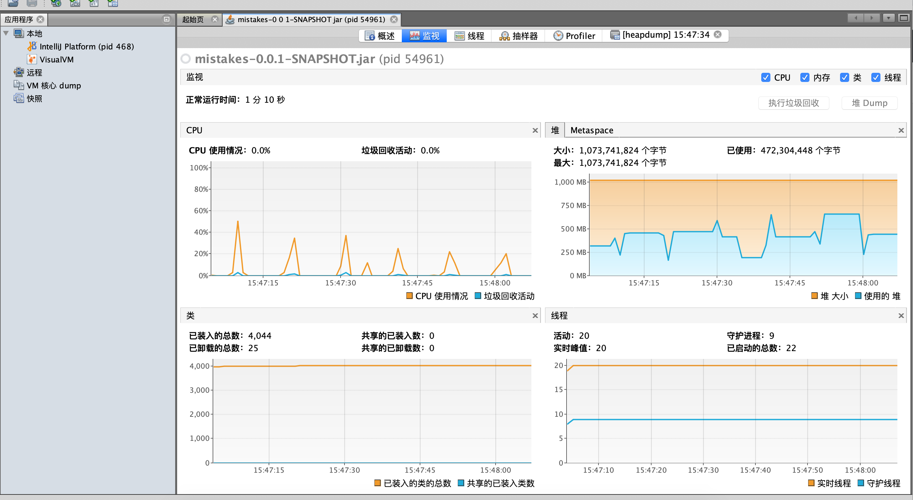

可以观测到CPU使用率，GC评率，内存占用情况，活动线程数，各class的实例个数等信息

可以直接在这里进行手动GC和堆Dump操作

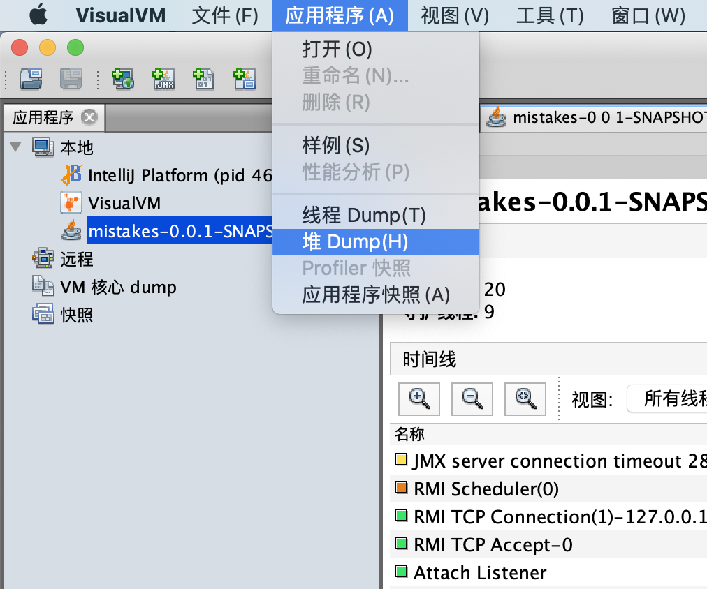

一般来说 分析线程Dump，看其线程状态，是否阻塞，是否死锁

分析堆Dump，主要场景是内存不足、GC异常、怀疑代码内存泄漏，哪些对象占用了太多的堆栈空间


## JCONSOLE

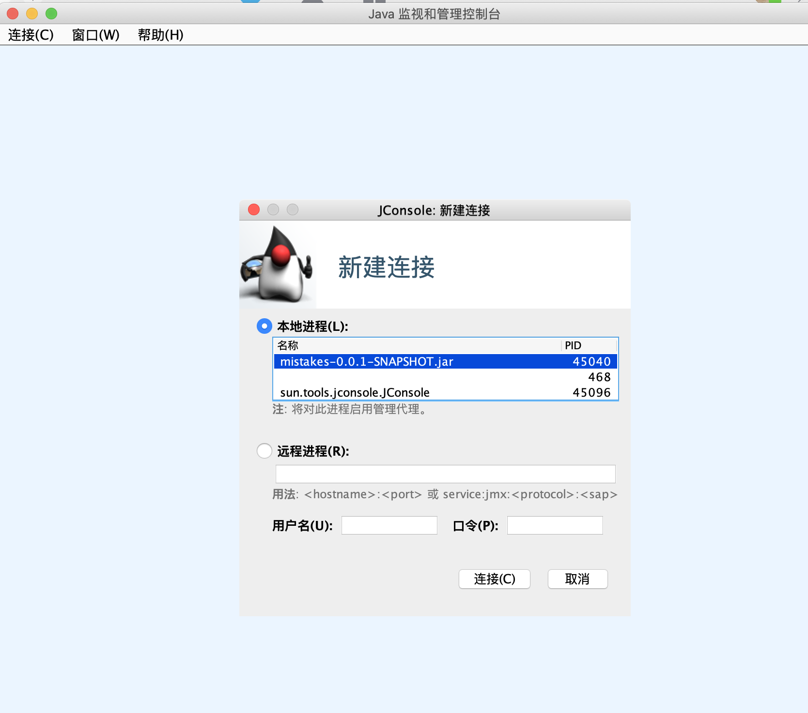

可以连接到远程进程

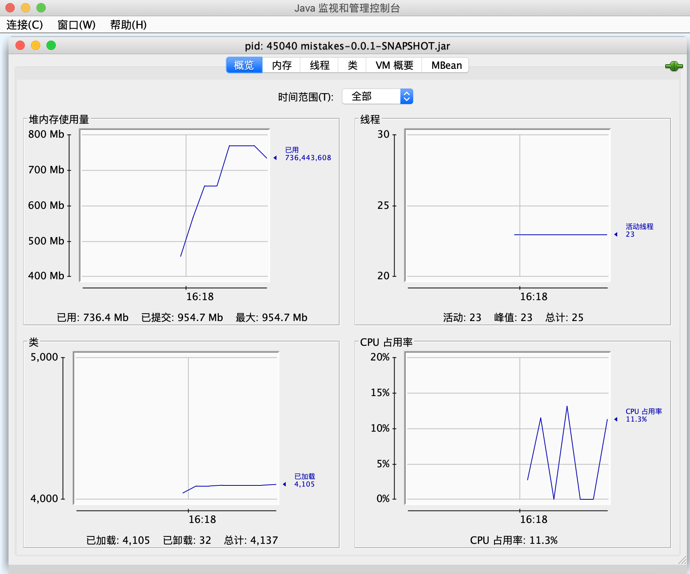

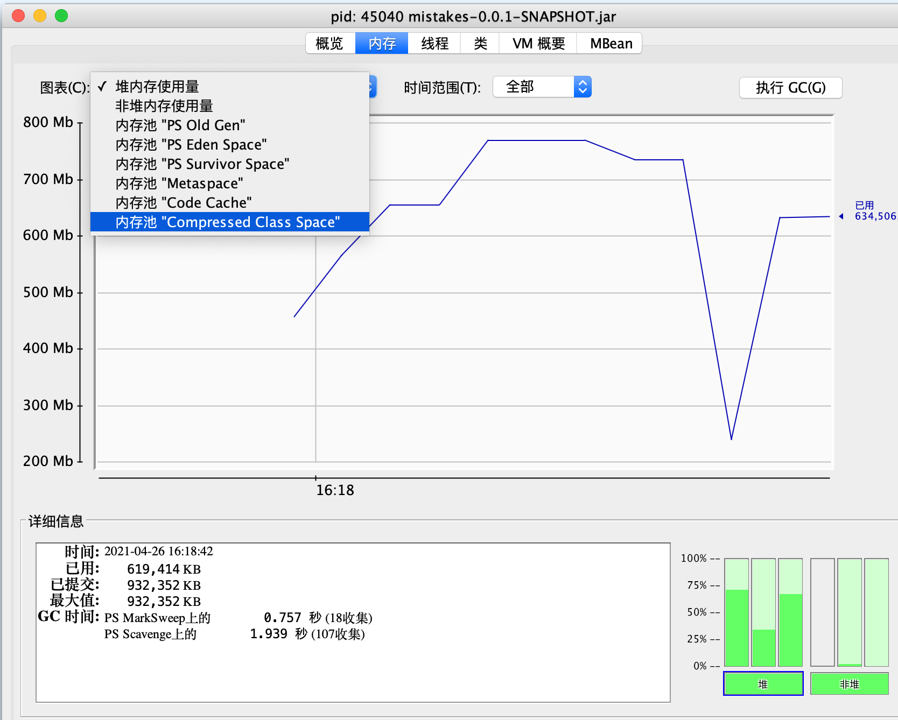

综合性的图形界面监控工具


## JSATA

没有图形界面 又希望看到GC趋势，可以使用jstat

可以以固定频率输出JVM的各种监控指标

比如使用jstat -gcuti pid 间隔（毫秒） 次数

来输出GC和内存占用汇总信息

```

➜  ~ jstat -gcutil 23940 5000 100
  S0     S1     E      O      M     CCS    YGC     YGCT    FGC    FGCT    CGC    CGCT     GCT
  0.00 100.00   0.36  87.63  94.30  81.06    539   14.021    33    3.972   837    0.976   18.968
  0.00 100.00   0.60  69.51  94.30  81.06    540   14.029    33    3.972   839    0.978   18.979
  0.00   0.00   0.50  99.81  94.27  81.03    548   14.143    34    4.002   840    0.981   19.126
  0.00 100.00   0.59  70.47  94.27  81.03    549   14.177    34    4.002   844    0.985   19.164
  0.00 100.00   0.57  99.85  94.32  81.09    550   14.204    34    4.002   845    0.990   19.196
  0.00 100.00   0.65  77.69  94.32  81.09    559   14.469    36    4.198   847    0.993   19.659
  0.00 100.00   0.65  77.69  94.32  81.09    559   14.469    36    4.198   847    0.993   19.659
  0.00 100.00   0.70  35.54  94.32  81.09    567   14.763    37    4.378   853    1.001   20.142
  0.00 100.00   0.70  41.22  94.32  81.09    567   14.763    37    4.378   853    1.001   20.142
  0.00 100.00   1.89  96.76  94.32  81.09    574   14.943    38    4.487   859    1.007   20.438
  0.00 100.00   1.39  39.20  94.32  81.09    575   14.946    38    4.487   861    1.010   20.442
```

可以看到S0 S1 E（Eden） O（老年代） M（元数据区）占用百分比 等


## JSTACK

jstack + 线程id

抓取线程栈

```

➜  ~ jstack 23940
2020-01-29 13:08:15
Full thread dump Java HotSpot(TM) 64-Bit Server VM (11.0.3+12-LTS mixed mode):

...

"main" #1 prio=5 os_prio=31 cpu=440.66ms elapsed=574.86s tid=0x00007ffdd9800000 nid=0x2803 waiting on condition  [0x0000700003849000]
   java.lang.Thread.State: TIMED_WAITING (sleeping)
  at java.lang.Thread.sleep(java.base@11.0.3/Native Method)
  at java.lang.Thread.sleep(java.base@11.0.3/Thread.java:339)
  at java.util.concurrent.TimeUnit.sleep(java.base@11.0.3/TimeUnit.java:446)
  at org.geekbang.time.commonmistakes.troubleshootingtools.jdktool.CommonMistakesApplication.main(CommonMistakesApplication.java:41)
  at jdk.internal.reflect.NativeMethodAccessorImpl.invoke0(java.base@11.0.3/Native Method)
  at jdk.internal.reflect.NativeMethodAccessorImpl.invoke(java.base@11.0.3/NativeMethodAccessorImpl.java:62)
  at jdk.internal.reflect.DelegatingMethodAccessorImpl.invoke(java.base@11.0.3/DelegatingMethodAccessorImpl.java:43)
  at java.lang.reflect.Method.invoke(java.base@11.0.3/Method.java:566)
  at org.springframework.boot.loader.MainMethodRunner.run(MainMethodRunner.java:48)
  at org.springframework.boot.loader.Launcher.launch(Launcher.java:87)
  at org.springframework.boot.loader.Launcher.launch(Launcher.java:51)
  at org.springframework.boot.loader.JarLauncher.main(JarLauncher.java:52)

"Thread-1" #13 prio=5 os_prio=31 cpu=17851.77ms elapsed=574.41s tid=0x00007ffdda029000 nid=0x9803 waiting on condition  [0x000070000539d000]
   java.lang.Thread.State: TIMED_WAITING (sleeping)
  at java.lang.Thread.sleep(java.base@11.0.3/Native Method)
  at java.lang.Thread.sleep(java.base@11.0.3/Thread.java:339)
  at java.util.concurrent.TimeUnit.sleep(java.base@11.0.3/TimeUnit.java:446)
  at org.geekbang.time.commonmistakes.troubleshootingtools.jdktool.CommonMistakesApplication.lambda$null$1(CommonMistakesApplication.java:33)
  at org.geekbang.time.commonmistakes.troubleshootingtools.jdktool.CommonMistakesApplication$$Lambda$41/0x00000008000a8c40.run(Unknown Source)
  at java.lang.Thread.run(java.base@11.0.3/Thread.java:834)


...
```


# Wireshark 网络分析工具

可以捕捉某个网卡的网络流量

比如在查看mysql问题时，捕捉tcp.port == 6657

可以直接把TCP数据包解析为MYSQL协议，直接在窗口中显示MySQL的SQL查询语句

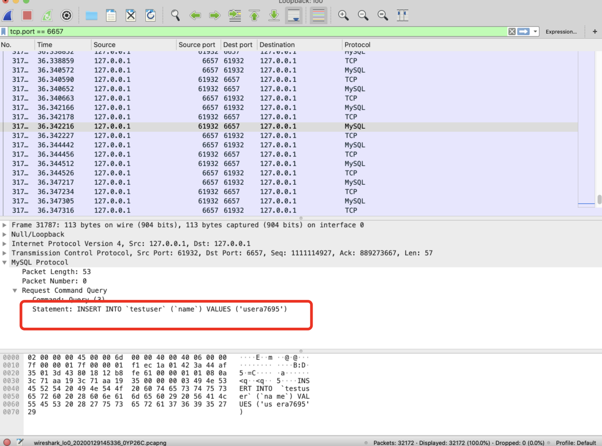

遇到诸如Connection reset 、Broken pipe等网络问题时，可以利用Wireshark来定位问题


# 使用MAT分析OOM问题

对于排查OOM问题、分析程序堆内存使用情况，可以分析堆转储

堆转储，包含了堆线程全貌和线程栈信息，对于生产环境，可以通过设置

-XX:+HeapDumpOnOutOfMemoryError -XX:HeapDumpPath = .

来使得在发生OOM时进行堆转储，生成.hprof文件 文件名一般为java_pid29569.hprof

之前使用的jvisualvm的堆转储分析功能并不是很强大，只能查看类使用内存的直方图，无法有效跟踪内存使用的引用关系，更推荐使用Memory Analyzer（MAT）做堆转储的分析


编写测试程序：

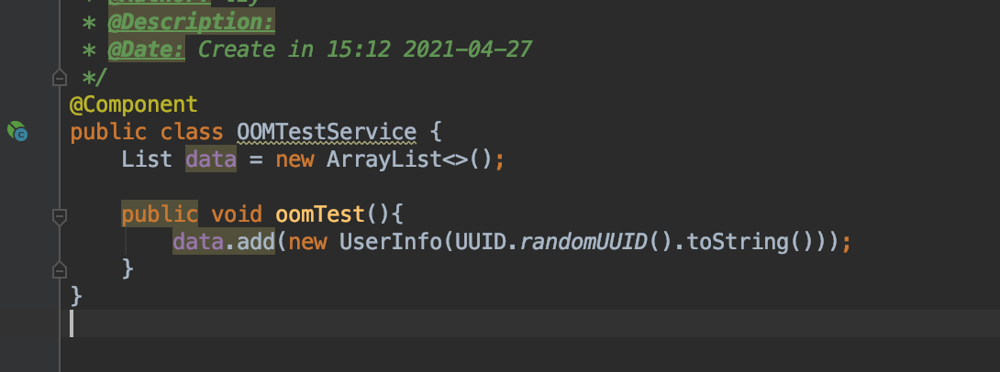

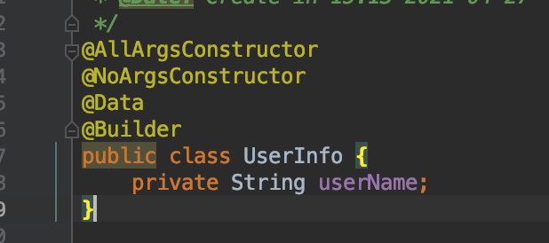


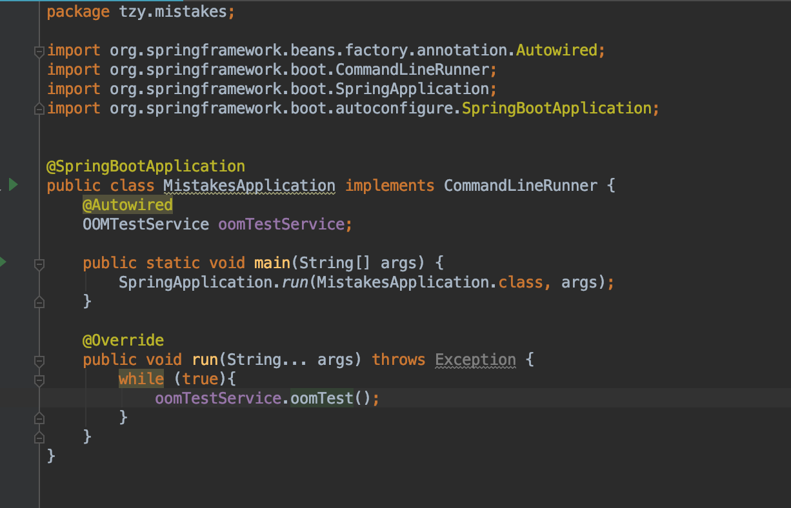

程序运行后会一直向名为data的ArrayList中加入UserInfo的实例直到OOM发生

设置启动参数：

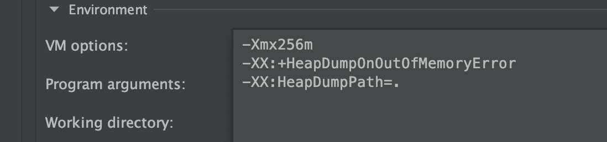


启动一段时间后OOM发生，生成堆转储文件

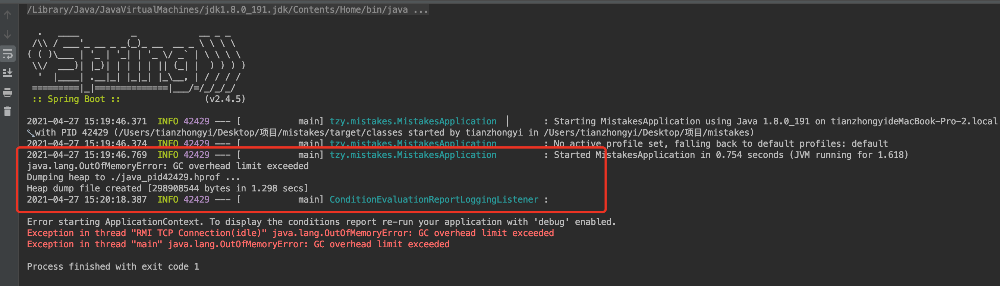

使用 MAT 分析 OOM 问题，一般可以按照以下思路进行：

1.通过支配树功能或直方图功能查看消耗内存最大的类型，来分析内存泄露的大概原因；

2.查看那些消耗内存最大的类型、详细的对象明细列表，以及它们的引用链，来定位内存泄露的具体点；

3.配合查看对象属性的功能，可以脱离源码看到对象的各种属性的值和依赖关系，帮助我们理清程序逻辑和参数；

4.辅助使用查看线程栈来看 OOM 问题是否和过多线程有关，甚至可以在线程栈看到 OOM 最后一刻出现异常的线程


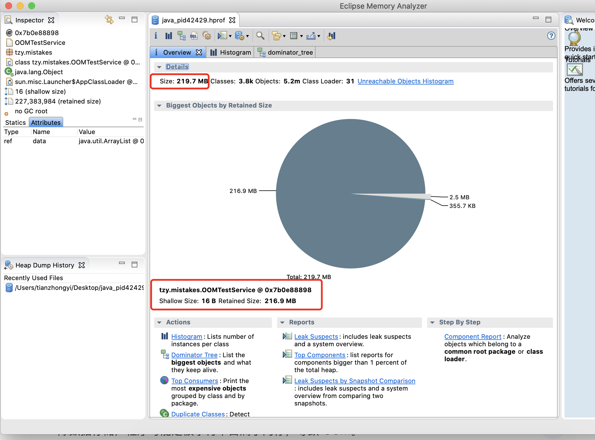

整个堆占219.7MB的空间，其中比例最大的是tzy.mistakes.OOMTestService的实例@0x7b，他占据了216.9MB的空间

这和程序的结果一致，Spring会生成单例的OOMTestService对象，然后这个对象中持有的ArrayList会一直被放入UserInfo实例


### 通过直方图定位

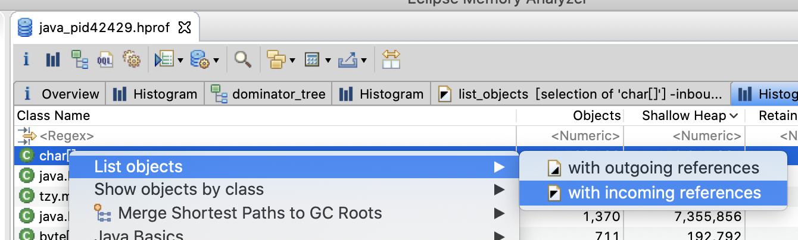

查看引用链

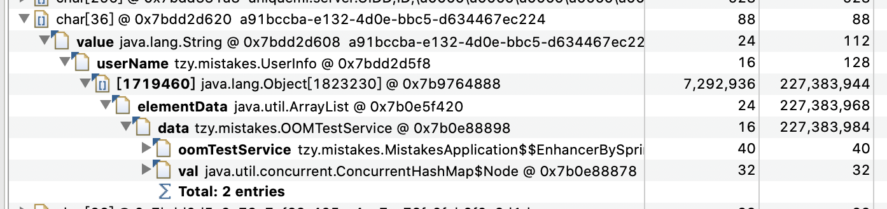

可以一步步看到，char[]属于userName字段，属于ArrayList内部的elementData，属于OOMTestService实例的ArrayList data字段


### 通过支配树查看

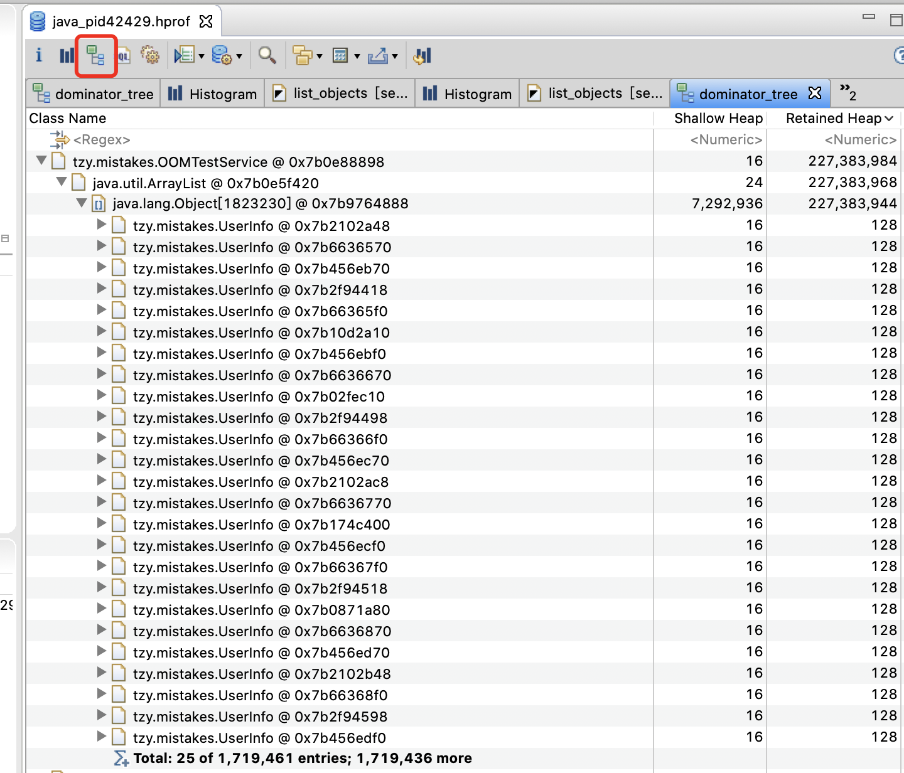

整个路径是OOMTestService ArrayList UserInfo对象

此时已经定位到问题是一直向ArrayList中添加UserInfo对象导致的


### 使用线程栈查看正在执行的逻辑

先执行的方法先入栈，所以栈顶的方法是正在执行的方法

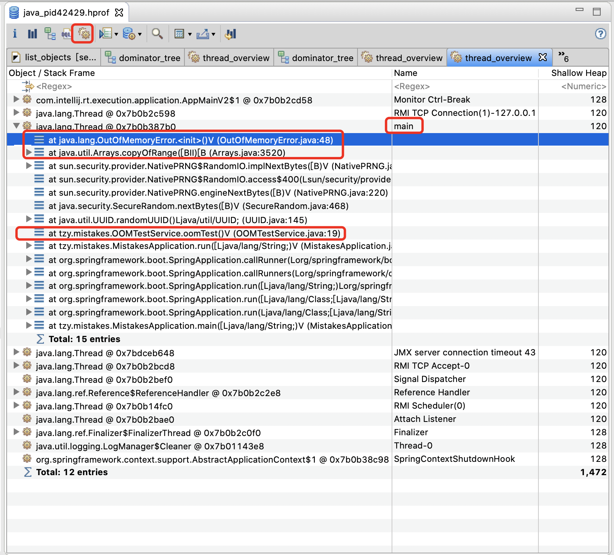

可以看到，在执行Arrays的copyOfRange时OOM发生，是在产生UUID时发生的

实际调用在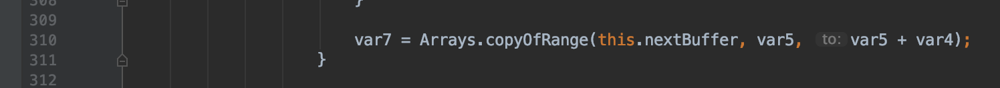

但是根源在于OOMTestService.oomTest()方法，OOM的发生不一定是在错误分支的代码，也可能是正常分支，因为错误逻辑或根源逻辑导致堆空间不足，而在执行正常逻辑时发生，这个需要结合对象占用具体分析。


### OQL

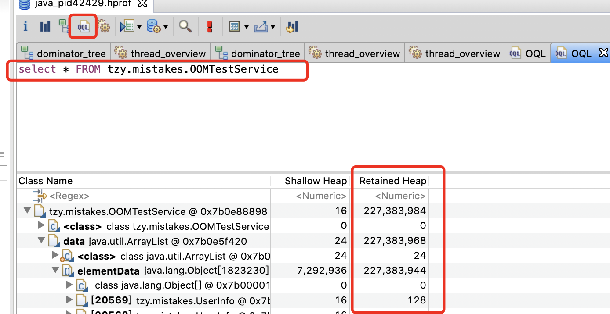

还可以通过OQL方式来查询

Retained Heap（深堆）代表对象本身和对象关联的对象占用的内存，Shallow Heap（浅堆）代表对象本身占用的内存

OOMTestService对象的实例，本身占用16kb，但是引用的对象占用了200+MB，导致了OOM


# 使用Arthas分析高CPU问题

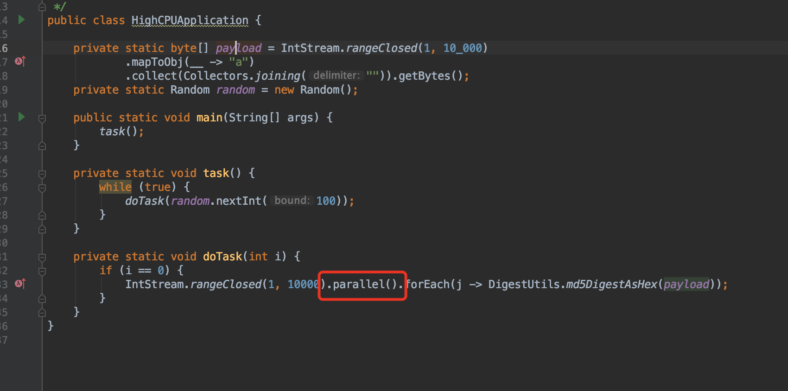

Stream默认的并行流会使用ForkJoinPool，默认线程数是机器核心数，本机是8核

程序会循环生成0-100的随机数，若生成的数为0，则会开启MD5计算，耗费CPU资源


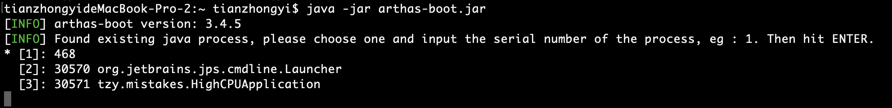

启动arthas

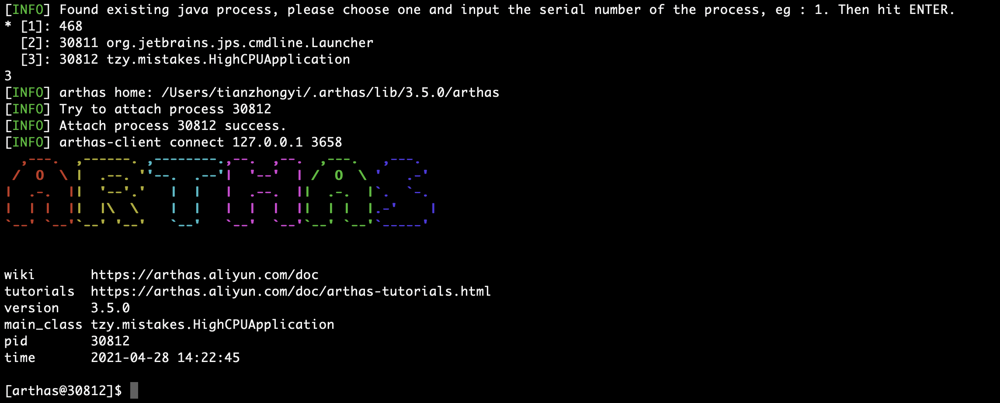

监控HighCPUApplication

dashboard指令用于展示整体情况

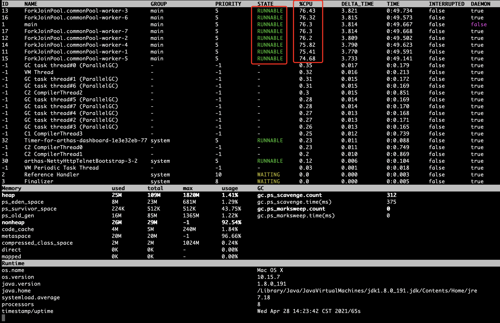

发现几个ForkJoinPool的工作线程占用了最多的CPU资源


使用指令：

thread -n 8

查看使用CPU最多的8个线程栈

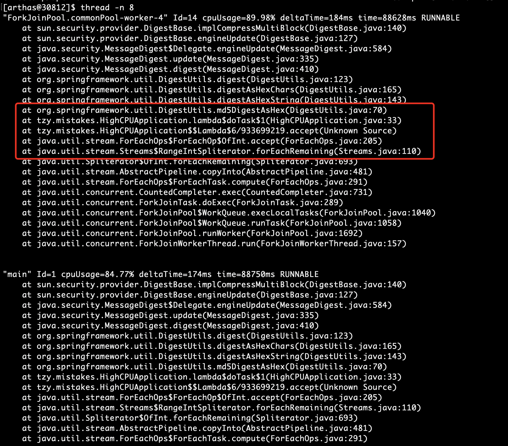

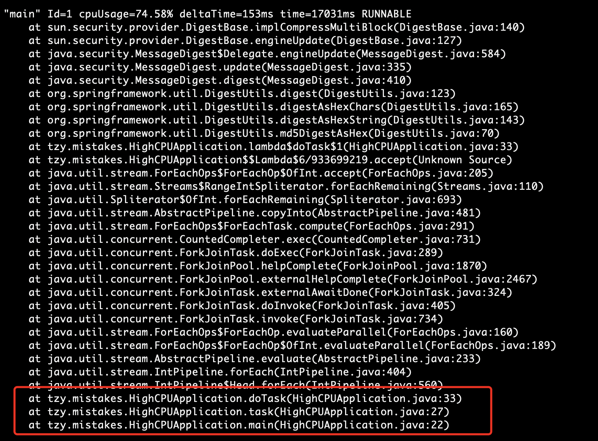

可以看出工作线程的资源消耗在计算md5中，而HighCPUApplication的main方法中的doTask方法需要重点关注

使用反编译命令：

jad tzy.mistakes.HighCPUApplication

对HighCPUApplication进行反编译

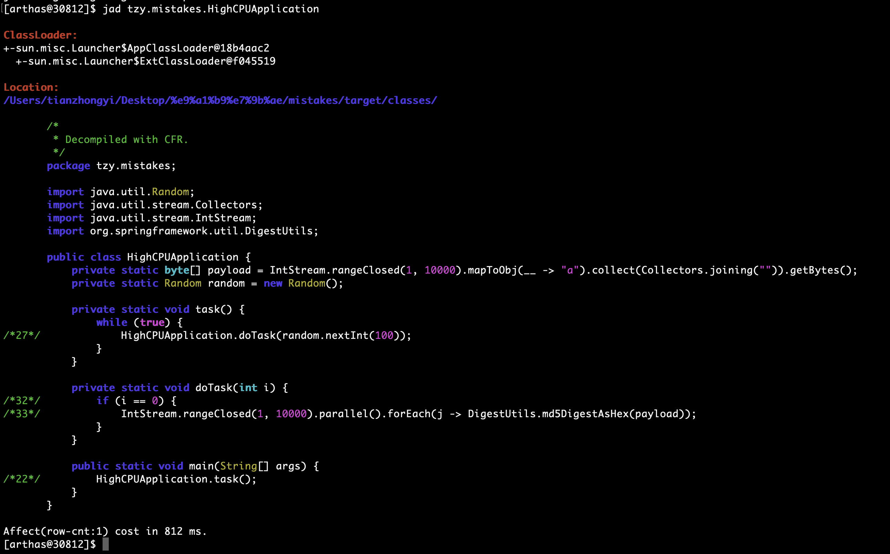

可以看到调用链


使用指令：

 watch tzy.mistakes.HighCPUApplication doTask '{params}' '#cost>100' -x 2

监听doTask方法超过100ms的调用

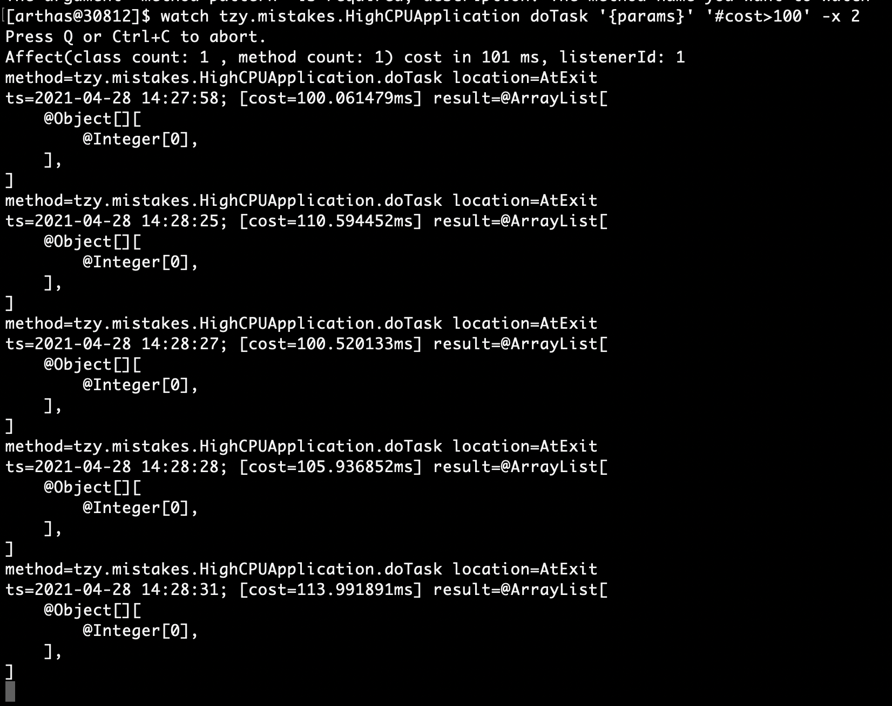

可以看到入参超过100ms的doTask方法的调用，入参都是0

符合代码预期


通过Arthas排查CPU问题的一般流程：

- 通过 dashboard + thread 命令，基本可以在几秒钟内一键定位问题，找出消耗 CPU 最多的线程和方法栈；
- 然后，直接 jad 反编译相关代码，来确认根因；
- 此外，如果调用入参不明确的话，可以使用 watch 观察方法入参，并根据方法执行时间来过滤慢请求的入参。此外，如果调用入参不明确的话，可以使用 watch 观察方法入参，并根据方法执行时间来过滤慢请求的入参。

还可以使用redefine来热更新线上代码，直接修复问题


Arthas命令列表https://arthas.aliyun.com/doc/commands.html#arthas


# 闪银

## Nightingale夜莺

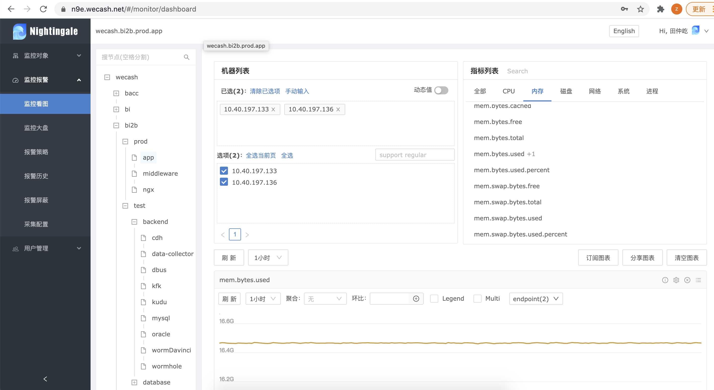

监控大盘 各机器各指标图标

报警管理


## 普罗米修斯


## ELK


## 分布式链路追踪

