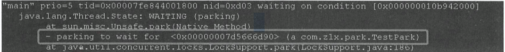
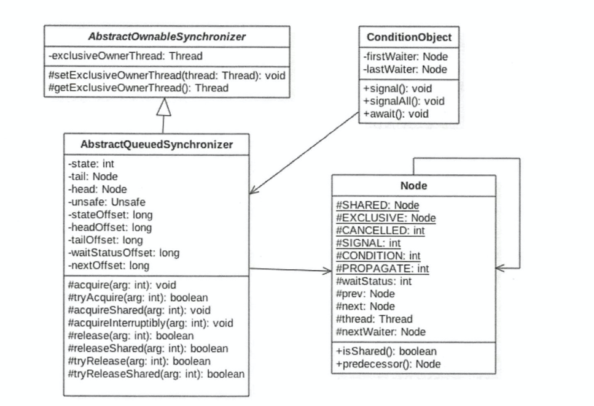
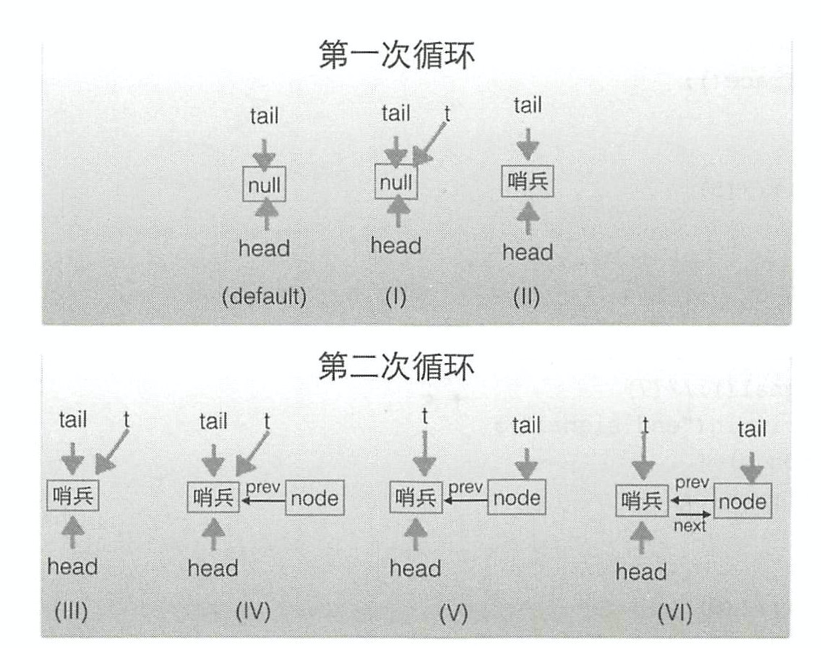
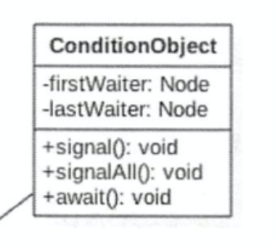

# 9.JUC包下的锁解析

## 9.1 LockSupport工具类

```java
public static void park(Object blocker); // 暂停当前线程
public static void parkNanos(Object blocker, long nanos); // 暂停当前线程，不过有超时时间的限制
public static void parkUntil(Object blocker, long deadline); // 暂停当前线程，直到某个时间
public static void park(); // 无期限暂停当前线程
public static void parkNanos(long nanos); // 暂停当前线程，不过有超时时间的限制
public static void parkUntil(long deadline); // 暂停当前线程，直到某个时间
public static void unpark(Thread thread); // 恢复当前线程
public static Object getBlocker(Thread t);//获取使用第一个方法时传入的blocker
```

park和unpark的用法类似于wait和notify

```Java
import java.util.concurrent.TimeUnit;
import java.util.concurrent.locks.LockSupport;

/**
 * @Author: tzy
 * @Description:
 * @Date: Create in 15:35 2020-07-09
 */
public class LockTest {

    public static void main(String[] args) {
        Thread parkThread = new Thread(new ParkThread());
        parkThread.start();
        for(int i=0;i<2;i++){
            System.out.println("开始线程唤醒");
            LockSupport.unpark(parkThread);
            System.out.println("结束线程唤醒");
        }
    }
    static class ParkThread implements Runnable{
        @Override
        public void run() {
            try {
                TimeUnit.SECONDS.sleep(1);
            } catch (InterruptedException e) {
                e.printStackTrace();
            }
            for(int i=0;i<2;i++){
                System.out.println("开始线程阻塞");
                LockSupport.park();
                System.out.println("结束线程阻塞");
            }
        }
    }
}
```

相比wait/notify组合 使用park/unpark有如下优点：

1.wait/notify必须先获得对象的锁

2.notify唤醒时不能控制顺序或是指定某个线程唤醒 park/unpark可以

3.必须先wait再notify


原理：

LockSupport和每个使用它的线程都有一个许可(permit)关联。permit相当于1，0的开关，默认是0，调用一次unpark就加1变成1，调用一次park会消费permit, 也就是将1变成0，同时park立即返回。再次调用park会变成block（因为permit为0了，会阻塞在这里，直到permit变为1）, 这时调用unpark会把permit置为1。每个线程都有一个相关的permit, permit最多只有一个，重复调用unpark也不会积累。

每个java线程都有一个Parker实例，Parker类是这样定义的：

```c++
class Parker : public os::PlatformParker {  
private:  
  volatile int _counter ;  
  ...  
public:  
  void park(bool isAbsolute, jlong time);  
  void unpark();  
  ...  
}  
class PlatformParker : public CHeapObj<mtInternal> {  
  protected:  
    pthread_mutex_t _mutex [1] ;  
    pthread_cond_t  _cond  [1] ;  
    ...  
}
```

LockSupport就是通过控制变量 `_counter `来对线程阻塞唤醒进行控制的。原理有点类似于信号量机制。

- 当调用 `park()`方法时，会将 _counter 置为 0，同时判断前值 < 1 说明前面被 `unpark`过，则直接退出，否则将使该线程阻塞。
- 当调用 `unpark()`方法时，会将 _counter 置为 1，同时判断前值 < 1 会进行线程唤醒，否则直接退出。
  形象的理解，线程阻塞需要消耗凭证(permit)，这个凭证最多只有1个。当调用 park方法时，如果有凭证，则会直接消耗掉这个凭证然后正常退出；但是如果没有凭证，就必须阻塞等待凭证可用；而 unpark则相反，它会增加一个凭证，但凭证最多只能有1个。
- 为什么可以先唤醒线程后阻塞线程？
  因为 unpark获得了一个凭证，之后调用 park因为有凭证消费，故不会阻塞。
- 为什么唤醒两次后阻塞两次会阻塞线程。
  因为凭证的数量最多为 1，连续调用两次 unpark 和 调用一次 unpark 效果一样，只会增加一个凭证；而调用两次 park却需要消费两个凭证。

park方法还有一个传入Object blocker的重载方法



使用带blocker参数的park方法，线程堆栈可以提供更多有关阻塞对象的信息。

## 9.2 抽象同步队列AQS

AbstractQueuedSynchronizer抽象同步队列

他是实现同步器的基础组件，并发包中的锁的底层就是使用AQS实现的

虽然在开发中的大部分情况下不会直接使用AQS，但是还是有必要了解他的原理




AQS是一个FIFO的双向队列，内部通过Node类型的tail和head节点记录队首队尾元素

Node：

SHARED和EXCLUSIVE用来标记改线程是获取共享资源时还是获取独占资源时被阻塞后放入AQS队列的

waitStatus记录当前线程状态，可以为CANCELLED(线程被取消) SIGNAL（线程需要被唤醒）CONDITION（线程在条件队列中等待）PROPAGATE（释放共享资源时需要通知其他节点）这几种状态

prev记录当前Node的前驱，next记录后继

AQS中的第一个变量state是关键变量，不同的组件用state来表述不同的含义，比如在ReentrantLock中，state用来表示当前线程获取锁的可重入次数，

对于读写锁ReentrantWriteLock来说，state的高16位用来表示读锁的次数，低16位用来表示写锁的可重入次数

对于Semaphore来说，state用来表示当前可用信号的个数

对于CountDownlatch来说，state用来表示计数器当前的值


AQS拥有内部类ConditionObject 用来结合锁实现线程同步

```Java
public class ConditionObject implements Condition, java.io.Serializable {
    private static final long serialVersionUID = 1173984872572414699L;
    /** First node of condition queue. */
    private transient Node firstWaiter;
    /** Last node of condition queue. */
    private transient Node lastWaiter;
```

他可以直接访问AQS对象内部的变量，比如state状态值和AQS队列

ConditionObject是条件变量，每个条件变量对应一个条件队列（单向链表队列），这个队列用来存放条件变量的await方法后被阻塞的线程


对于AQS来说，线程同步的关键是对状态值state进行操作，根据state是否属于一个线程，操作state的方式分为独占方式和共享方式。

**独占方式**获取的资源是和具体的线程绑定的，即如果一个线程获取到了资源，就会标记是这个线程获取到了，其他线程再尝试操作state获取资源时会发现当前该资源不是自己持有的，就会在获取失败后被阻塞。比如独占锁ReentrantLock的实现，当一个线程获取了ReentrantLock的锁后，在AQS内部会首先使用CAS操作把state状态值从0设置为1.然后设置当前锁的持有者为当前线程，当该线程再次获取锁时，发现他就是锁的持有者，就会把状态值从1变成2，即重入次数。此时若是另一个线程获取锁时发现自己并不是该锁的持有者，就会被放入AQS阻塞队列后挂起。

共享方式的资源是与具体线程无关的，当多个线程去请求资源时，通过CAS方式竞争获取资源，当一个线程获取到了资源后，另外一个线程再次去获取时如果当前资源还能满足他的需要，则当前线程只需要使用CAS进行获取即可。比如Semaphore信号量，当一个线程通过acquire()方法获取信号量时，会首先看当前信号量个数是否满足需要，不满足则把当前线程放入阻塞队列，如果满足则通过自旋CAS获取信号量。

### **独占方式：**

```Java
public final void acquire(long arg) {
    if (!tryAcquire(arg) &&
        acquireQueued(addWaiter(Node.EXCLUSIVE), arg))
        selfInterrupt();
}

public final void acquireInterruptibly(long arg)
            throws InterruptedException {
        if (Thread.interrupted())
            throw new InterruptedException();
        if (!tryAcquire(arg))
            doAcquireInterruptibly(arg);
    }

public final boolean release(long arg) {
        if (tryRelease(arg)) {
            Node h = head;
            if (h != null && h.waitStatus != 0)
                unparkSuccessor(h);
            return true;
        }
        return false;
    }
```

主要看acquire方法

```Java
if (!tryAcquire(arg) &&
        acquireQueued(addWaiter(Node.EXCLUSIVE), arg))
        selfInterrupt();
```

当一个线程调用acquire(int arg)方法获取独占资源时，会首先使用tryAcquire方法尝试获取资源，具体做法是设置state变量的值，成功则直接返回，失败则会进行acquireQueued(addWaiter(Node.EXCLUSIVE), arg)操作，即把当前线程封装成类型为Node.EXCLUSIVE（独占）的Node节点后插入到AQS阻塞队列的尾部，并调用LockSupport.park(this)方法挂起自己

```Java
static void selfInterrupt() {
    Thread.currentThread().interrupt();
}
```


当一个线程调用release(int arg)方法时会尝试使用tryRelease操作释放资源，这里同样是去设置状态变量state的值，然后调用LockSupport.unpark(thread)方法激活AQS队列里面的一个被阻塞的线程，这个被激活的线程则使用tryAcquire尝试，看当前状态变量state的值是否能满足自己的需要，满足则该线程被激活，否则继续在AQS队列中挂起

```Java
public final boolean release(long arg) {
    if (tryRelease(arg)) {
        Node h = head;
        if (h != null && h.waitStatus != 0)
            unparkSuccessor(h);
        return true;
    }
    return false;
}
```

**注意：**

占用和释放资源的tryAcquire方法和tryRelease方法在AQS类中并没有具体实现，而是需要让具体的子类来实现，由子类来根据他们各自的场景去定义state变量如何被修改，方法什么情况下返回true，什么情况下返回false

### 共享方式：

```Java
public final void acquireShared(long arg) {
    if (tryAcquireShared(arg) < 0)
        doAcquireShared(arg);
}
```

获取资源时首先调用tryAcquireShared设置状态变量state的值，成功则直接返回，失败则将当前线程封装为Node.SHARED的节点后插入到AQS阻塞队列的尾部，并使用LockSupport.park(this)方法挂起自己

释放时同独占资源一样

同样AQS的tryAcquireShared和releaseAcquireShared也没有具体实现。

**基于AQS实现的锁除了重写这些方法以外，还要重写isHeldExclusively方法，来判断锁是被当前线程独占还是被共享。**


另外 加Interruptibly的方法，与不带的方法意思是对不对中断进行响应，即线程在调用不带Interruptibly关键字的方法获取资源时或者获取资源失败被挂起时，其他线程中断了该线程，那么该线程不会因为被中断而抛出异常，还是会继续获取资源或者被挂起，也就是说不对中断进行响应。


### AQS入队操作

```Java
private Node enq(final Node node) {
    for (;;) {
        Node t = tail;
        if (t == null) { // Must initialize
            if (compareAndSetHead(new Node()))
                tail = head;
        } else {
            node.prev = t;
            if (compareAndSetTail(t, node)) {
                t.next = node;
                return t;
            }
        }
    }
}
```



### 条件变量的支持



和Object中的方法相比，await()相当于调用共享变量的wait()，signal相当于notify，signalAll相当于notifyAll

从整体上来看Object的wait和notify/notify是与对象监视器配合完成线程间的等待/通知机制，而Condition与Lock配合完成等待通知机制，前者是java底层级别的，后者是语言级别的，具有更高的可控制性和扩展性。两者除了在使用方式上不同外，在功能特性上还是有很多的不同：

Condition能够支持不响应中断，而通过使用Object方式不支持；
Condition能够支持多个等待队列（new 多个Condition对象），而Object方式只能支持一个；
Condition能够支持超时时间的设置，而Object不支持

ConditionObject内部维护一个单向联表，通过firstWaiter和lastWaiter分别指向表头和表尾，当调用await时，需要向队尾插入元素：

```Java
 public final void await() throws InterruptedException {
            if (Thread.interrupted())
                throw new InterruptedException();
   //1.创建新的node节点，并插入到条件队列末尾
            Node node = addConditionWaiter();
   //2. 释放当前线程获取的锁
            int savedState = fullyRelease(node);
            int interruptMode = 0;
            while (!isOnSyncQueue(node)) {
             //3. 调用park方法阻塞当前线程
                LockSupport.park(this);
                if ((interruptMode = checkInterruptWhileWaiting(node)) != 0)
                    break;
            }
   					//4.自旋等待获取到lock
            if (acquireQueued(node, savedState) && interruptMode != THROW_IE)
                interruptMode = REINTERRUPT;
            if (node.nextWaiter != null) // clean up if cancelled
                unlinkCancelledWaiters();
   				//5. 被中断的情况
            if (interruptMode != 0)
                reportInterruptAfterWait(interruptMode);
        }
```

addConditionWaiter()是简单的在单向联表尾部插入元素的操作

```Java
private Node addConditionWaiter() {
    Node t = lastWaiter;
    // If lastWaiter is cancelled, clean out.
    if (t != null && t.waitStatus != Node.CONDITION) {
        unlinkCancelledWaiters();
        t = lastWaiter;
    }
    Node node = new Node(Thread.currentThread(), Node.CONDITION);
    if (t == null)
        firstWaiter = node;
    else
        t.nextWaiter = node;
    lastWaiter = node;
    return node;
}
```

fullyRelease(Node node):

```Java
final int fullyRelease(Node node) {
    boolean failed = true;
    try {
        int savedState = getState();
      //1.若成功释放锁
        if (release(savedState)) {
            failed = false;
            return savedState;
        } else {
          //2.不成功则抛出异常
            throw new IllegalMonitorStateException();
        }
    } finally {
        if (failed)
          //3. 不成功则取消线程
            node.waitStatus = Node.CANCELLED;
    }
}
```

再看如何从await方法中退出：

```Java
 while (!isOnSyncQueue(node)) {
             //3. 调用park方法阻塞当前线程
                LockSupport.park(this);
                if ((interruptMode = checkInterruptWhileWaiting(node)) != 0)
                    break;
            }
1是走到break 即被中断 
2是while中的条件不满足 从而跳出while
```

```Java
/**
 * Returns true if a node, always one that was initially placed on
 * a condition queue, is now waiting to reacquire on sync queue.
 * @param node the node
 * @return true if is reacquiring
 */
final boolean isOnSyncQueue(Node node) {
    if (node.waitStatus == Node.CONDITION || node.prev == null)
        return false;
    if (node.next != null) // If has successor, it must be on queue
        return true;
    /*
     * node.prev can be non-null, but not yet on queue because
     * the CAS to place it on queue can fail. So we have to
     * traverse from tail to make sure it actually made it.  It
     * will always be near the tail in calls to this method, and
     * unless the CAS failed (which is unlikely), it will be
     * there, so we hardly ever traverse much.
     */
    return findNodeFromTail(node);
}
```

这段代码是判断当前node是否在AQS的阻塞队列，只有当其他线程调用了signal/signalAll方法，当前node才会从Condition的条件队列中移动到AQS的阻塞队列中。

当调用signal时，从队首拿出元素放入AQS阻塞队列中，激活这个线程

```Java
public final void signal() {
  //1.先检测当前线程是否已经获取到lock
    if (!isHeldExclusively())
        throw new IllegalMonitorStateException();
  //2.获取等待队列中的第一个节点
    Node first = firstWaiter;
    if (first != null)
        doSignal(first);
}
```

```Java
private void doSignal(Node first) {
    do {
        if ( (firstWaiter = first.nextWaiter) == null)
            lastWaiter = null;
//1.将头结点从当前条件队列中移除 转移到AQS阻塞队列中
        first.nextWaiter = null;
    } while (!transferForSignal(first) &&
             (first = firstWaiter) != null);
}
```

```Java
final boolean transferForSignal(Node node) {
    /*
     * If cannot change waitStatus, the node has been cancelled.
     */
  //1 更新状态
    if (!compareAndSetWaitStatus(node, Node.CONDITION, 0))
        return false;

    /*
     * Splice onto queue and try to set waitStatus of predecessor to
     * indicate that thread is (probably) waiting. If cancelled or
     * attempt to set waitStatus fails, wake up to resync (in which
     * case the waitStatus can be transiently and harmlessly wrong).
     */
  //2 将该节点移入同步队列 这个enq函数在 9.2.AQS入队操作 中有解析过
    Node p = enq(node);
    int ws = p.waitStatus;
    if (ws > 0 || !compareAndSetWaitStatus(p, ws, Node.SIGNAL))
        LockSupport.unpark(node.thread);
    return true;
}
```

此时 await中的while循环跳出


### 基于AQS实现自定义同步器

基于AQS实现一个不可重入的独占锁，要借助AQS来实现锁，需要重写下列方法：

```Java
<p>To use this class as the basis of a synchronizer, redefine the
* following methods, as applicable, by inspecting and/or modifying
* the synchronization state using {@link #getState}, {@link
* #setState} and/or {@link #compareAndSetState}:
*
* <ul>
* <li> {@link #tryAcquire}
* <li> {@link #tryRelease}
* <li> {@link #tryAcquireShared}
* <li> {@link #tryReleaseShared}
* <li> {@link #isHeldExclusively}
* </ul>
```

由于是独占锁，所以不需要实现两个Shared方法

实现自定义同步器的关键在于定义state变量的含义

在上面提到：

AQS中的第一个变量state是关键变量，不同的组件用state来表述不同的含义，比如在ReentrantLock中，state用来表示当前线程获取锁的可重入次数，

对于读写锁ReentrantWriteLock来说，state的高16位用来表示读锁的次数，低16位用来表示写锁的可重入次数

对于Semaphore来说，state用来表示当前可用信号的个数

对于CountDownlatch来说，state用来表示计数器当前的值

那么对于一个不可重入的独占锁，state只需要用来表述该锁是否被占用即可

定义0表示目前锁空闲，1表示已经被持有

具体lock的使用如下：

```Java
*   // The sync object does all the hard work. We just forward to it.
*   private final Sync sync = new Sync();
*
*   public void lock()                { sync.acquire(1); }
*   public boolean tryLock()          { return sync.tryAcquire(1); }
*   public void unlock()              { sync.release(1); }
*   public Condition newCondition()   { return sync.newCondition(); }
*   public boolean isLocked()         { return sync.isHeldExclusively(); }
*   public boolean hasQueuedThreads() { return sync.hasQueuedThreads(); }
*   public void lockInterruptibly() throws InterruptedException {
*     sync.acquireInterruptibly(1);
*   }
*   public boolean tryLock(long timeout, TimeUnit unit)
*       throws InterruptedException {
*     return sync.tryAcquireNanos(1, unit.toNanos(timeout));
*   }
```

其中 acquire release方法在独占方式中介绍过，他们已经包含了入队 阻塞 等操作

核心就在于实现tryAcquire tryRelease isHeldExclusively这三个函数

具体实现如下：

```Java
import java.util.concurrent.TimeUnit;
import java.util.concurrent.locks.AbstractQueuedSynchronizer;
import java.util.concurrent.locks.Condition;
import java.util.concurrent.locks.Lock;

/**
 * @Author: tzy
 * @Description:
 * @Date: Create in 16:49 2020-07-13
 */
public class NonReentrantLock implements Lock,java.io.Serializable {
    private final Sync sync = new Sync();
    @Override
    public void lock() {
        sync.acquire(1);
    }

    @Override
    public void lockInterruptibly() throws InterruptedException {
        sync.acquireInterruptibly(1);
    }

    @Override
    public boolean tryLock() {
        return sync.tryAcquire(1);
    }

    @Override
    public boolean tryLock(long time, TimeUnit unit) throws InterruptedException {
        return sync.tryAcquireNanos(1,unit.toNanos(time));
    }

    @Override
    public void unlock() {
        sync.release(1);
    }

    @Override
    public Condition newCondition() {
        return sync.newCondition();
    }

    private static class Sync extends AbstractQueuedSynchronizer{
        protected boolean tryAcquire(int arg) {
            /**
             * 预期是0 可以获得锁 若CAS成功，则设置当前线程为锁持有者 并返回true
             * 若CAS失败，说明竞争锁失败，则返回false，在acquire方法中，tryAcquire为false将加入阻塞队列中
             */
            if(compareAndSetState(0,1)){
                setExclusiveOwnerThread(Thread.currentThread());
                return true;
            }
            return false;
        }
        protected  boolean tryRelease(int arg){
            if(getState() == 0) {
                //未加锁时不能释放锁
                    throw new IllegalMonitorStateException();
            }
            setExclusiveOwnerThread(null);
            setState(0);
            return true;
        }
        protected boolean isHeldExclusively(){
            return getState() == 1;
        }
        Condition newCondition(){
            return new ConditionObject();
        }
    }
}
```

### 基于自定义同步器实现的生产者消费者模型

核心：保证统一资源被多个线程并发访问时的完整性，保证资源在任意时刻只能被一个线程访问

思路：

1.当缓冲区满时，生产者阻塞，放弃锁，让其他线程执行

2.当缓冲区空时，消费者阻塞，放弃锁，让其他线程执行

3.当生产者放入一个元素后，放弃锁，唤醒消费者

4.当消费者消费一个元素后，放弃锁，唤醒生产者

```Java
import java.util.LinkedList;
import java.util.concurrent.locks.Condition;
import java.util.concurrent.locks.ReentrantLock;

public class Producer_Consumer_Test {
    public static final int MAX_CAP = 10;
    static LinkedList<Object> list = new LinkedList<>();
    static ReentrantLock lock = new ReentrantLock();
    static Condition consumerWait = lock.newCondition();
    static Condition producerWait = lock.newCondition();

    class Producer implements Runnable {
        @Override
        public void run() {
            while (true) {
                try {
                    lock.lock();
                    while (list.size() == MAX_CAP) {
                        try {
                            System.out.println("当前已有" + list.size() + "个产品，缓冲区已满，请等待消费者消费");
                            producerWait.await();
                        } catch (InterruptedException e) {
                            e.printStackTrace();
                        }
                    }
                    list.add(new Object());
                    System.out.println("生产了一个产品，当前产品个数为 " + list.size());
                    consumerWait.signal();
                } finally {
                    lock.unlock();
                }
            }
        }
    }
    class Consumer implements Runnable {
        @Override
        public void run() {
            while (true) {
                try {
                    lock.lock();
                    while (list.size() == 0) {
                        try {
                            System.out.println("当前已有" + list.size() + "个产品，缓冲区已空，请等待生产者生产");
                            consumerWait.await();
                        } catch (InterruptedException e) {
                            e.printStackTrace();
                        }
                    }
                    list.remove();
                    System.out.println("消费了一个产品，当前产品个数为 " + list.size());
                    producerWait.signal();
                } finally {
                    lock.unlock();
                }
            }
        }
    }
    public static void main(String[] args) throws InterruptedException {
        Producer_Consumer_Test test = new Producer_Consumer_Test();
        test.runTest();
    }
    public void runTest() {
        for (int i = 0; i < 3; i++) {
            new Thread(new Producer()).start();
            new Thread(new Consumer()).start();
        }
    }
}
```

两个注意点：

1.使用两个Condition 区分消费者等待队列和生产者等待队列，可以更准确的唤醒。

2.使用while进行判断 避免虚假唤醒

虚假唤醒：

这是一个硬件层面的问题，不太好从应用层面上解释

在Condition的JavaDoc中写到：

```Java
  * <li>Some other thread invokes the {@link #signal} method for this
     * {@code Condition} and the current thread happens to be chosen as the
     * thread to be awakened; or
     * <li>Some other thread invokes the {@link #signalAll} method for this
     * {@code Condition}; or
     * <li>A &quot;<em>spurious wakeup</em>&quot; occurs.
     * </ul>
```

signal、signalAll或是spurious wakeup都可能唤醒一个线程

在Object类中也写道：

```Java
     * A thread can also wake up without being notified, interrupted, or
     * timing out, a so-called <i>spurious wakeup</i>.  While this will rarely
     * occur in practice, applications must guard against it by testing for
     * the condition that should have caused the thread to be awakened, and
     * continuing to wait if the condition is not satisfied.  In other words,
     * waits should always occur in loops, like this one:
     * <pre>
     *     synchronized (obj) {
     *         while (&lt;condition does not hold&gt;)
     *             obj.wait(timeout);
     *         ... // Perform action appropriate to condition
     *     }
     * </pre>
```

尽管这种现象很少发生，但是还是要采取措施避免他造成的影响，措施就是用while代替if进行判断

硬件层面的解释参考：https://stackoverflow.com/questions/8594591/why-does-pthread-cond-wait-have-spurious-wakeups


## 9.3 ReentrantLock


ReentrantLock是可重入的独占锁，内部是使用AQS来实现的

根据构造函数来创造公平/非公平锁

```Java
public ReentrantLock(boolean fair) {
    sync = fair ? new FairSync() : new NonfairSync();
}
```

默认是非公平的

```Java
public ReentrantLock() {
    sync = new NonfairSync();
}
```

ReentrantLock的lock()委托给了sync

```Java
public void lock() {
    sync.lock();
}
```

先看非公平锁是怎么实现的：

```Java
final void lock() {
  //CAS设置状态值
    if (compareAndSetState(0, 1))
        setExclusiveOwnerThread(Thread.currentThread());
    else
        acquire(1);
}
```

CAS若期望状态值为0，则设置为1

若CAS成功，则设置该锁持有者为当前线程

若当前CAS失败

则调用acquire（1）

```Java
public final void acquire(int arg) {
    if (!tryAcquire(arg) &&
        acquireQueued(addWaiter(Node.EXCLUSIVE), arg))
        selfInterrupt();
}
```

tryAcquire方法需要我们自己实现，若返回false，则将其挂起并加入AQS阻塞队列

```Java
protected final boolean tryAcquire(int acquires) {
    return nonfairTryAcquire(acquires);
}
```

非公平锁实现的tryAcquire：

```Java
final boolean nonfairTryAcquire(int acquires) {
    final Thread current = Thread.currentThread();
    int c = getState();
  //1
    if (c == 0) {
        if (compareAndSetState(0, acquires)) {
            setExclusiveOwnerThread(current);
            return true;
        }
    }
  //2
    else if (current == getExclusiveOwnerThread()) {
        int nextc = c + acquires;
        if (nextc < 0) // overflow
            throw new Error("Maximum lock count exceeded");
        setState(nextc);
        return true;
    }
    return false;
}
```

1处再次判断状态值是不是0，若是0则同外层操作

2处判断当前线程是不是锁持有者，若是，则状态值+1，表示重入次数+1

若都不是，则返回false，放入AQS阻塞队列


非公平锁的非公平体现：

场景：线程A在之前获取并一直持有锁，此时线程B尝试获取锁失败，进入nonfairTryAcquire的2处后进入阻塞队列，然后线程A释放锁，线程C尝试获取锁直接成功（可能直接从lock处CAS成功，也可能从nofairTryAcquire的1处成功）从时间上来说线程B是先于线程C尝试获取锁的，但是线程C先获取了锁。


而公平锁的tryAcquire方法:

```Java
/**
 * Fair version of tryAcquire.  Don't grant access unless
 * recursive call or no waiters or is first.
 */
protected final boolean tryAcquire(int acquires) {
    final Thread current = Thread.currentThread();
    int c = getState();
    if (c == 0) {
      //这里
        if (!hasQueuedPredecessors() &&
            compareAndSetState(0, acquires)) {
            setExclusiveOwnerThread(current);
            return true;
        }
    }
    else if (current == getExclusiveOwnerThread()) {
        int nextc = c + acquires;
        if (nextc < 0)
            throw new Error("Maximum lock count exceeded");
        setState(nextc);
        return true;
    }
    return false;
}
```

做了一个处理：

```Java
public final boolean hasQueuedPredecessors() {
    // The correctness of this depends on head being initialized
    // before tail and on head.next being accurate if the current
    // thread is first in queue.
    Node t = tail; // Read fields in reverse initialization order
    Node h = head;
    Node s;
    return h != t &&
        ((s = h.next) == null || s.thread != Thread.currentThread());
}
```

如果当前线程节点有前驱结点则返回true，此时tryAcquire会直接返回false，因为在公平策略下，若有前驱节点，则应该等待前驱节点先获取锁。

如果当前AQS队列为空（h==t)，或者当前线程节点是AQS的第一个节点则返回false(s.thread==current)，此时当前线程可以去尝试获取锁。

如果出现h!=t时 又出现(s=h.next) == null的情况，则说明有一个元素将要作为AQS的第一个队列节点进入队列，因为enq函数的第一个元素入队是两步操作，首先创建一个哨兵头结点，然后将第一个元素插入到哨兵节点后面，此时返回true


## 9.4读写锁ReentrantReadWriteLock

