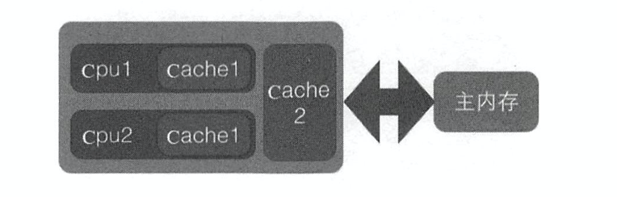

# 3.ThreadLocal源码

当创建一个变量后 ，每个线程对其进行访问的时候访问的是自己线程的变量

```java
/**
 * @Author: tzy
 * @Description:
 * @Date: Create in 11:28 2020-07-01
 */
public class ThreadLocalTest {
    static ThreadLocal<Order> threadLocal=new ThreadLocal<Order>();
    static void print(String str){
        //打印当前线程本地内存中loaclVariable变量值
        System.out.println(str+":"+threadLocal.get().toString());
    }

    public static void main(String[] args) {
        final Thread thread1=new Thread(new Runnable() {
            public void run() {
                threadLocal.set(new Order(1,"order1"));
                print("thread1");
            }
        });
        final Thread thread2=new Thread(new Runnable() {
            public void run() {
                threadLocal.set(new Order(2,"order2"));
                print("thread2");
            }
        });
        thread1.start();
        thread2.start();
    }
}

```


1.Thread类中存在变量：

```java
 /* ThreadLocal values pertaining to this thread. This map is maintained
     * by the ThreadLocal class. */
    ThreadLocal.ThreadLocalMap threadLocals = null;

    /*
     * InheritableThreadLocal values pertaining to this thread. This map is
     * maintained by the InheritableThreadLocal class.
     */
    ThreadLocal.ThreadLocalMap inheritableThreadLocals = null;
```

以threadLocals说明：

默认情况下，这一变量为null，在首次调用set方法时会初始化

2.threadLocals变量的类型是ThreadLocalMap，这是一个定制的HashMap

```java
 /**
     * ThreadLocalMap is a customized hash map suitable only for
     * maintaining thread local values. No operations are exported
     * outside of the ThreadLocal class. The class is package private to
     * allow declaration of fields in class Thread.  To help deal with
     * very large and long-lived usages, the hash table entries use
     * WeakReferences for keys. However, since reference queues are not
     * used, stale entries are guaranteed to be removed only when
     * the table starts running out of space.
     */
```

之所以使用Map结构是因为一个Thread可以持有多个ThreadLocal

如下：

```java
static ThreadLocal<Order> threadLocal1=new ThreadLocal<Order>();
static ThreadLocal<Order> threadLocal2=new ThreadLocal<Order>();
static ThreadLocal<String> threadLocal3=new ThreadLocal<String>();
```

ThreadLocalMap以ThreadLocal的实例变量的hash值为key，set进入的object为value

1处获取当前线程，2处根据线程拿到ThreadLocalMap，getMap(t)如下：

```Java
ThreadLocalMap getMap(Thread t) {
        return t.threadLocals;
    }
```

仅是返回了当前Thread持有的threadLocals对象(步骤1中说明)，但此时为空，所以进入3处createMap(t,value)

```Java
void createMap(Thread t, T firstValue) {
    t.threadLocals = new ThreadLocalMap(this, firstValue);
}
```

```Java
ThreadLocalMap(ThreadLocal<?> firstKey, Object firstValue) {
    table = new Entry[INITIAL_CAPACITY];
    int i = firstKey.threadLocalHashCode & (INITIAL_CAPACITY - 1);
    table[i] = new Entry(firstKey, firstValue);
    size = 1;
    setThreshold(INITIAL_CAPACITY);
}
```

创建了新的ThreadLocalMap并放入第一个值并让Thread持有的threadLocals对象指向他

4.get逻辑

```Java
public T get() {
    Thread t = Thread.currentThread();
    ThreadLocalMap map = getMap(t);
    if (map != null) {
      //1
        ThreadLocalMap.Entry e = map.getEntry(this);
        if (e != null) {
            @SuppressWarnings("unchecked")
            T result = (T)e.value;
            return result;
        }
    }
  //2
    return setInitialValue();
}
```

1处为正常情况，在map中getEntry，与HashMap中相似

2处在未初始化的情况下会进入，调用setInitialValue()方法

```java
private T setInitialValue() {
    T value = initialValue();
    Thread t = Thread.currentThread();
    ThreadLocalMap map = getMap(t);
    if (map != null)
        map.set(this, value);
    else
        createMap(t, value);
    return value;
}
```

其中initialValue()方法仅返回null，相当于调用了set方法传入null，在这一过程中会创建map并赋给Thread中的threadlocals变量


5.继承性

ThreadLocal不支持继承性，即子线程无法访问到父线程threadLocal中的元素，在1中的    ThreadLocal.ThreadLocalMap inheritableThreadLocals = null; 使用这一变量则可以让子线程拿到父线程Threadlocal中的元素

```java
/**
 * @Author: tzy
 * @Description:
 * @Date: Create in 17:53 2020-07-01
 */
public class InheritableThreadLocalTest {
    public static ThreadLocal<String> threadLocal = new InheritableThreadLocal<String>();

    public static void main(String[] args) {
        threadLocal.set("Hello");
        Thread thread=new Thread(new Runnable() {
            public void run() {
                System.out.println("test  "+threadLocal.get());
            }
        });
        thread.start();
    }
}
```


InheritableThreadLocal源码：

```Java
public class InheritableThreadLocal<T> extends ThreadLocal<T> {
    /**
     * Computes the child's initial value for this inheritable thread-local
     * variable as a function of the parent's value at the time the child
     * thread is created.  This method is called from within the parent
     * thread before the child is started.
     * <p>
     * This method merely returns its input argument, and should be overridden
     * if a different behavior is desired.
     *
     * @param parentValue the parent thread's value
     * @return the child thread's initial value
     */
    protected T childValue(T parentValue) {
        return parentValue;
    }

    /**
     * Get the map associated with a ThreadLocal.
     *
     * @param t the current thread
     */
    ThreadLocalMap getMap(Thread t) {
       return t.inheritableThreadLocals;
    }

    /**
     * Create the map associated with a ThreadLocal.
     *
     * @param t the current thread
     * @param firstValue value for the initial entry of the table.
     */
    void createMap(Thread t, T firstValue) {
        t.inheritableThreadLocals = new ThreadLocalMap(this, firstValue);
    }
```

他继承了ThreadLocal并复写了其中的三个方法

从getMap和createMap的复写中可以看到，单纯地把t.threadLocals替换成了t.inheritableThreadLocals

也就是说，在InheritableThreadLocal中，用t.inheritableThreadLocals替换了t.threadLocals

子线程究竟如何访问父线程的变量，要从Thread的初始化看起：

```Java
public Thread(Runnable target) {
    init(null, target, "Thread-" + nextThreadNum(), 0);
}
```

Thread的构造器调用init方法：init中的关键代码如下：

```Java
Thread parent = currentThread();
if (inheritThreadLocals && parent.inheritableThreadLocals != null)
            this.inheritableThreadLocals =
                ThreadLocal.createInheritedMap(parent.inheritableThreadLocals);
```

如果父线程的inheritableThreadLocals不为空，会进入这一段代码

而父线程的getMap返回的是inheritableThreadLocals这个变量，所以ThreadLocal的set操作和get操作都会让这一变量不为空，那么会调用createInheritedMap方法

```Java
static ThreadLocalMap createInheritedMap(ThreadLocalMap parentMap) {
    return new ThreadLocalMap(parentMap);
}
```

```Java
private ThreadLocalMap(ThreadLocalMap parentMap) {
    Entry[] parentTable = parentMap.table;
    int len = parentTable.length;
    setThreshold(len);
    table = new Entry[len];

    for (int j = 0; j < len; j++) {
        Entry e = parentTable[j];
        if (e != null) {
            @SuppressWarnings("unchecked")
            ThreadLocal<Object> key = (ThreadLocal<Object>) e.get();
            if (key != null) {
                Object value = key.childValue(e.value);
                Entry c = new Entry(key, value);
                int h = key.threadLocalHashCode & (len - 1);
                while (table[h] != null)
                    h = nextIndex(h, len);
                table[h] = c;
                size++;
            }
        }
    }
}
```

在此处用《取出父线程Map中所有元素 放入子线程Map》中的方式把父线程中 inheritableThreadLocals 变量里面的本地变量 复制一份保存到子线程的 inheritableThreadLocals 变量里面

那么在什么情况下需要子线程可以获取父线程的 threadlocal 变量呢？情况还是蛮多 的，比如子线程需要使用存放在 threadlocal 变量 中的用户 登录信息，再比如 一些 中间件 需 要把统一的 id 追踪 的整个调用链路记录下来 其实子线程使用父线程中的 threadlocal 方 法有多种方式，比如创建线程时传入父线程中的变量，并将其复制到子线程中，或者在父线程中构造一个 map 作为参数传递给子线程，但是这些都改变了我们的使用习惯，所以在这些情况下 InheritableThreadLocal 就显得比较有用 

# 4.Unsafe类

 Rt.jar包中的Unsafe类提供了硬件级别的原子性操作

- 操纵对象属性
- 操纵数组元素
- 线程挂起与恢复、CAS

如何使用：

Unsafe类中提供了getUnsafe()方法：

```Java
@CallerSensitive
public static Unsafe getUnsafe() {
    Class var0 = Reflection.getCallerClass();
    if (!VM.isSystemDomainLoader(var0.getClassLoader())) {
        throw new SecurityException("Unsafe");
    } else {
        return theUnsafe;
    }
}
```

其中 用VM.isSystemDomainLoader(var0.getClassLoader()来判断是不是Bootstrap类加载器加载的，Unsafe 类是 rt.jar 包提供的,rt.jar包里面的类是使用Bootstrap类加载器加载的,而我们的启动 main 函数所在的类是使用AppClassLoader加载的，所以在 main 函数里面加载 Unsafe 类时，根据委托机制，会委托给 Bootstrap 去加载 Unsafe 类。 如果没有这段代码的限制，那么我们的应用程序就可以随意使用 Unsafe 做事情了， 而 Unsafe 类可以直接操作内存，这是不安全的，所以 JDK 开发组特意做了这个限制 ，不让开发人员在正规渠道使用 Unsafe 类 ，而是在此jar 包里面的核心类中使用Unsafe 功能 。

使用反射可以绕过这一限制：

```Java
public static Unsafe getUnsafe() throws NoSuchFieldException, IllegalAccessException {
    Field field=Unsafe.class.getDeclaredField("theUnsafe");
    field.setAccessible(true);
    Unsafe unsafe=(Unsafe)field.get(Unsafe.class);
    return unsafe;
}
```

## 操纵对象属性

```Java
import sun.misc.Unsafe;

import java.lang.reflect.Field;

/**
 * @Author: tzy
 * @Description:
 * @Date: Create in 14:54 2020-07-03
 */
public class UnSafeTest {
    public static void main(String[] args) throws NoSuchFieldException, IllegalAccessException {
        Order order=new Order(1,0L,"order1");
        Unsafe unsafe=getUnsafe();
        long idOffest=unsafe.objectFieldOffset(Order.class.getDeclaredField("id"));
        long longOffest=unsafe.objectFieldOffset(Order.class.getDeclaredField("longField"));
        long messageOffest=unsafe.objectFieldOffset(Order.class.getDeclaredField("message"));
        System.out.println(idOffest);
        System.out.println(longOffest);
        System.out.println(messageOffest);
        System.out.println("before: "+order.toString());
        String newMessage = "order2";
        unsafe.putObject(order,messageOffest,newMessage);
        System.out.println("after: "+order.toString());
    }
    public static Unsafe getUnsafe() throws NoSuchFieldException, IllegalAccessException {
        Field field=Unsafe.class.getDeclaredField("theUnsafe");
        field.setAccessible(true);
        Unsafe unsafe=(Unsafe)field.get(Unsafe.class);
        return unsafe;
    }
}
```

## 修改数组元素

```Java
public static void main(String[] args) throws NoSuchFieldException, IllegalAccessException {
    Unsafe unsafe=getUnsafe();
    int[] arr=new int[]{1,2,3,4,5};
    //获取数组第一个元素的偏移地址
    int baseOffset=unsafe.arrayBaseOffset(arr.getClass());
    System.out.println(baseOffset);
    //获取数组中元素的增量地址
    int indexScale=unsafe.arrayIndexScale(arr.getClass());
    System.out.println(indexScale);
    //通过baseOffset+i*indexScale的方式就可以找到数组中第i个元素的地址 从而进行修改 此处将下标为2的元素（3）改为0
    unsafe.putInt(arr,baseOffset+2*indexScale,0);
    for(int i:arr)
        System.out.print(i+"  ");
}
```

## 线程挂起与恢复、CAS

CAS:

```Java
 public final native boolean compareAndSwapObject(Object var1, long var2, Object var4, Object var5);
 public final native boolean compareAndSwapInt(Object var1, long var2, int var4, int var5);
 public final native boolean compareAndSwapLong(Object var1, long var2, long var4, long var6);
```

4个入参分别为obj,offest,expect,update

若obj对象在offest偏移量上的值与预期值expect相同，则更新为update，并返回true，否则不修改并返回false

```Java
public static void main(String[] args) throws NoSuchFieldException, IllegalAccessException {
    Order order=new Order(1,0L,"order1");
    Unsafe unsafe=getUnsafe();
    long idOffest=unsafe.objectFieldOffset(Order.class.getDeclaredField("id"));
    long longOffest=unsafe.objectFieldOffset(Order.class.getDeclaredField("longField"));
    long messageOffest=unsafe.objectFieldOffset(Order.class.getDeclaredField("message"));
    boolean casChange=unsafe.compareAndSwapObject(order,messageOffest,"order2","newOrder");
    System.out.print(casChange + "  "+order.toString());
}
```

```Java
//获取对象obj在某个偏移量上的变量对应volatile语义的值
Object message=unsafe.getObjectVolatile(Object order,long messageOffest);
//设置对象obj在某个偏移量上的变量对应volatile语义的值为value
unsafe.putObjectVolatile(Object order,long messageOffestl,Object value);
//有延迟的上一方法，并且不保证修改对其他线程立刻可见，只有在变量使用volatile修饰并且预计会被意外修改时才使用
unsafe.putOrderedObject(Object order,long messageOffestl,Object value);
```

线程挂起与恢复

```Java
void park(boolean isAbsolute,long time);
void unpark(Object thread);
```

park方法：阻塞当前线程，其中参数isAbsolute为false且time为0时表示一直阻塞，time大于0表示等待指定的time后阻塞线程会被唤醒，isAbsolute如果为true，表名时间是绝对时间，为false则为增量时间。

当其他线程调用了当前阻塞线程的interrupt方法而中断了当前线程时，当前线程也会返回，而当其他线程调用了unPark方法并且把当前线程作为参数也会返回


JDK 8 新增：

```Java
public final int getAndSetInt(Object var1, long var2, int var4) {
    int var5;
    do {
        var5 = this.getIntVolatile(var1, var2);
    } while(!this.compareAndSwapInt(var1, var2, var5, var4));

    return var5;
}
```

getAndSetInt while循环中使用CAS

```Java
public final int getAndAddInt(Object var1, long var2, int var4) {
    int var5;
    do {
        var5 = this.getIntVolatile(var1, var2);
    } while(!this.compareAndSwapInt(var1, var2, var5, var5 + var4));

    return var5;
}
```

与上一方法类似

# 5.伪共享

为了解决CPU与主内存之间的运行速度差问题，会在CPU与主内存之间添加一级或多级高速缓冲存储器（Cache）。这个Cache一般是被集成到CPU内部的，所以也叫CPU Cache



不同CPU拥有自己的cache，而cache内部是按行存储的，cache行是cache与主内存进行数据交换的单位

当CPU需要访问某个变量时，去cache中查找是否有该变量，若没有则去主存中获取，然后把该变量所在内存区域的一个cache行大小的内存复制到cache中，这就导致了一个cache行中会存储多个变量

此时有如下情况：cpu1、2的cache中都存在x、y变量，cpu1对x变量进行了更新，根据缓存一致性协议，cpu2的cache2中的变量x、y均会失效，这就是伪共享。

相比将每一个变量单独放到一个缓存行，性能会有所下降。

## 伪共享是如何产生的

主存数据存入缓存中时，根据局部性原理，会把该变量所在内存中大小为缓存行的内存放入缓存行，由于放入的是地址连续的多个变量，所以尤其在数组中体现最为明显，这一举措在单线程访问时是有利的：

```Java
/**
 * @Author: tzy
 * @Description:
 * @Date: Create in 10:33 2020-07-03
 */
public class CacheTest {
    public static void main(String[] args) {
        long[][] array = new long[2048][2048];
        long startTime = System.currentTimeMillis();
        for(int i=0;i<2048;i++){
            for(int j=0;j<2048;j++)
                //另一种方式：换成arr[j][i]
                array[i][j]=i*2+j;
        }
        long endTime = System.currentTimeMillis();
        System.out.println(endTime-startTime);
    }
}
```

这段代码的两种方式有显著的性能差异

所以在单线程下顺序修改一个缓存行中的多个变量，可以利用局部性原理，加快程序的运行，而在多线程环境下并发修改一个缓存行中的多个变量时就会竞争缓存行，从而导致性能的下降

## 如何避免伪共享

JDK8之前一般通过字节填充的方式来避免该问题，即在创建一个变量时使用填充字段来填满变量所在的缓存行：

```Java
public final static class FilledLong{
    public volatile long value = 0L;
    public long p1,p2,p3,p4,p5,p6;
}
```

假如缓存行为64个字节，7个long占56个字节，对象头8个字节，刚好64个字节占满一个缓存行。

在JDK8中提供了一个注解

```Java
@sun.misc.Contended
```

可以标注在变量上，也是使用填充的方法来填满缓存行。

Thread类中就有这一注解的使用

```Java
/** The current seed for a ThreadLocalRandom */
@sun.misc.Contended("tlr")
long threadLocalRandomSeed;

/** Probe hash value; nonzero if threadLocalRandomSeed initialized */
@sun.misc.Contended("tlr")
int threadLocalRandomProbe;

/** Secondary seed isolated from public ThreadLocalRandom sequence */
@sun.misc.Contended("tlr")
int threadLocalRandomSecondarySeed;
```

默认情况下该注解只用于Java核心类，如果要在用户路径下的类使用该注解，则要添加JVM参数-XX:RestrictContended

填充的宽度默认为128，同样可以通过-XX:ContendedPaddingWidth来设置


# 6.ThreadLocalRandom类源码

## Random的局限性

使用Random时，调用构造函数new Random();

```Java
public Random() {
    this(seedUniquifier() ^ System.nanoTime());
}
```

```Java
public Random(long seed) {
    if (getClass() == Random.class)
        this.seed = new AtomicLong(initialScramble(seed));
    else {
        // subclass might have overriden setSeed
        this.seed = new AtomicLong();
        setSeed(seed);
    }
}
```

可以指定参数作为种子，若不指定则随机种子（系统时间扰动后）

接下来看生成下一个随机数的nextInt方法：

```Java
public int nextInt(int bound) {
    if (bound <= 0)
        throw new IllegalArgumentException(BadBound);
//(1)
    int r = next(31);
    int m = bound - 1;
    if ((bound & m) == 0)  // i.e., bound is a power of 2
        r = (int)((bound * (long)r) >> 31);
    else {
        for (int u = r;
             u - (r = u % bound) + m < 0;
             u = next(31))
            ;
    }
    return r;
}
```

(1)处的next方法：

```java
protected int next(int bits) {
    long oldseed, nextseed;
    AtomicLong seed = this.seed;
    do {
        oldseed = seed.get();
        nextseed = (oldseed * multiplier + addend) & mask;
    } while (!seed.compareAndSet(oldseed, nextseed));
    return (int)(nextseed >>> (48 - bits));
}
```

实际上是根据旧种子生成新种子，内部使用了AtomicLong和CAS操作来保证next方法的原子性

在多线程环境下可能会出现多个线程拿同一个旧种子去生成新种子的情况，导致生成了同一个随机数

所以（根据旧种子生成新种子）这一过程需要保持原子性，在next函数的实现中：

```Java
public final boolean compareAndSet(long expect, long update) {
    return unsafe.compareAndSwapLong(this, valueOffset, expect, update);
}
```

多线程环境下使用单个Random实例生成随机数时，多个线程会竞争同一个原子变量的更新操作，由于这个操作是CAS操作，同时只有一个线程会成功，所以会造成大量线程在while中进行自旋重试，这会降低并发性能。

解决方法1：

缓存多个Random实例 不同线程使用不同的Random实例

解决方法2：

ThreadLocal<Random>实现当前线程独有的Random

解决方法3：

使用ThreadLocalRandom（JUC包下）


## ThreadLocalRandom解析

使用：

```Java
import java.util.concurrent.ThreadLocalRandom;

/**
 * @Author: tzy
 * @Description:
 * @Date: Create in 11:51 2020-07-03
 */
public class RandomTest {
    public static void main(String[] args) {
        for (int i = 0; i < 10; i++) {
            new Player().start();
        }
    }
    private static class Player extends Thread {
        @Override
        public void run() {
            System.out.println(getName() + ": " + ThreadLocalRandom.current().nextInt(100));
        }
    }
}
```

原理：

Random的缺点是多个线程会使用同一个原子性种子变量，从而导致了对原子变量更新的竞争

而ThreadLocalRandom在每个线程内部维护一个种子变量，则每个线程生成随机数时使用的老种子是自己线程独有的老种子，并使用新种子更新老种子，这样就不会有并发问题和竞争问题。

在Thread中有以下三个变量：

```Java
// The following three initially uninitialized fields are exclusively
// managed by class java.util.concurrent.ThreadLocalRandom. These
// fields are used to build the high-performance PRNGs in the
// concurrent code, and we can not risk accidental false sharing.
// Hence, the fields are isolated with @Contended.

/** The current seed for a ThreadLocalRandom */
@sun.misc.Contended("tlr")
long threadLocalRandomSeed;

/** Probe hash value; nonzero if threadLocalRandomSeed initialized */
@sun.misc.Contended("tlr")
int threadLocalRandomProbe;

/** Secondary seed isolated from public ThreadLocalRandom sequence */
@sun.misc.Contended("tlr")
int threadLocalRandomSecondarySeed;
```

其中thereadLocalRandomSeed就是线程自己的种子，这就是一个普通的long变量，因为他是线程独立的

当线程调用ThreadLocalRandom类的current方法时，ThreadLocalRandom会负责初始化这个种子

ThreadLocalRandom是一个工具类，不需要实例化具体对象，他内部有一个instance

```Java
/** The common ThreadLocalRandom */
static final ThreadLocalRandom instance = new ThreadLocalRandom();
```

这个变量是static的，当多个线程通过current方法获取ThreadLocalRandom实例时，获取的是同一个实例，但是由于具体的种子是存放在线程里面的，ThreadLocalRandom的实例里只包含一些线程无关的通用算法，所以是线程安全的

1.Unsafe机制 在ThreadLocalRandom的静态代码块中

```Java
// Unsafe mechanics
    private static final sun.misc.Unsafe UNSAFE;
    private static final long SEED;
    private static final long PROBE;
    private static final long SECONDARY;
    static {
        try {
            UNSAFE = sun.misc.Unsafe.getUnsafe();
            Class<?> tk = Thread.class;
          //获取Thread类中threadLocalRandomSeed变量在Thread实例里面的偏移量
            SEED = UNSAFE.objectFieldOffset
                (tk.getDeclaredField("threadLocalRandomSeed"));
          //同上
            PROBE = UNSAFE.objectFieldOffset
                (tk.getDeclaredField("threadLocalRandomProbe"));
          //同上
            SECONDARY = UNSAFE.objectFieldOffset
                (tk.getDeclaredField("threadLocalRandomSecondarySeed"));
        } catch (Exception e) {
            throw new Error(e);
        }
    }
```

这里使用Unsafe拿到Thread类中三个相关变量的偏移量，后面会根据这个偏移量进行操作


2.ThreadLocalRandom.current()方法

```Java
public static ThreadLocalRandom current() {
    if (UNSAFE.getInt(Thread.currentThread(), PROBE) == 0)
        localInit();
    return instance;
}
```

这个方法返回instance实例，并执行初始化过程，若Thread中的threadLocalRandomProbe的值为0（默认为0）则说明没有进行初始化过程，则执行localInit()方法进行初始化

```Java
static final void localInit() {
    int p = probeGenerator.addAndGet(PROBE_INCREMENT);
    int probe = (p == 0) ? 1 : p; // skip 0
    long seed = mix64(seeder.getAndAdd(SEEDER_INCREMENT));
    Thread t = Thread.currentThread();
    UNSAFE.putLong(t, SEED, seed);
    UNSAFE.putInt(t, PROBE, probe);
}
```

这里的probeGenerator和seeder都是Atomic变量，保证多个线程同时初始化时不会有相同的初始化结果

初始化完成后通过unsafe，写回当前线程，probe赋为1，下次调用current时就不会进行初始化


3.int nextInt(int bound)方法

```Java
public int nextInt(int bound) {
    if (bound <= 0)
        throw new IllegalArgumentException(BadBound);
    int r = mix32(nextSeed());
    int m = bound - 1;
    if ((bound & m) == 0) // power of two
        r &= m;
    else { // reject over-represented candidates
        for (int u = r >>> 1;
             u + m - (r = u % bound) < 0;
             u = mix32(nextSeed()) >>> 1)
            ;
    }
    return r;
}
```

```Java
private static int mix32(long z) {
    z = (z ^ (z >>> 33)) * 0xff51afd7ed558ccdL;
    return (int)(((z ^ (z >>> 33)) * 0xc4ceb9fe1a85ec53L) >>> 32);
}
```

mix32根据当前线程中的种子计算新种子，然后根据新种子和bound计算随机数

4.nextSeed()方法

```Java
final long nextSeed() {
    Thread t; long r; // read and update per-thread seed
    UNSAFE.putLong(t = Thread.currentThread(), SEED,
                   r = UNSAFE.getLong(t, SEED) + GAMMA);
    return r;
}
```

r = UNSAFE.getLong(t, SEED) 获取当前线程中的threadLocalRandomSeed变量的值，在这个值的基础上加上GAMMA值作为新种子，然后用Unsafe的putLong方法把新种子放入线程的threadLocalRandomSeed中