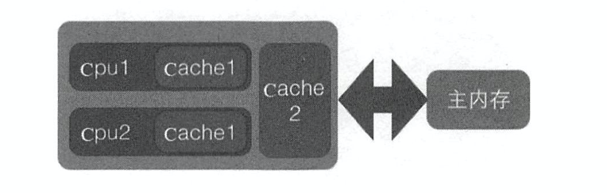
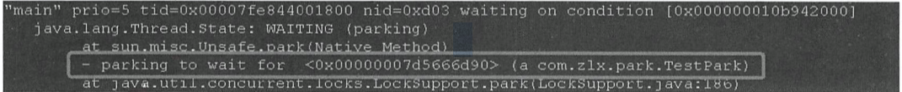
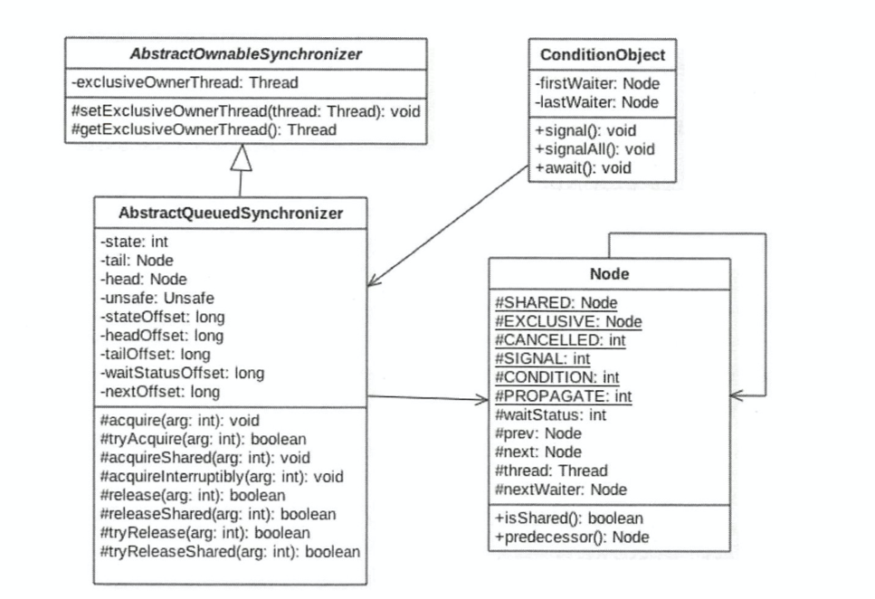
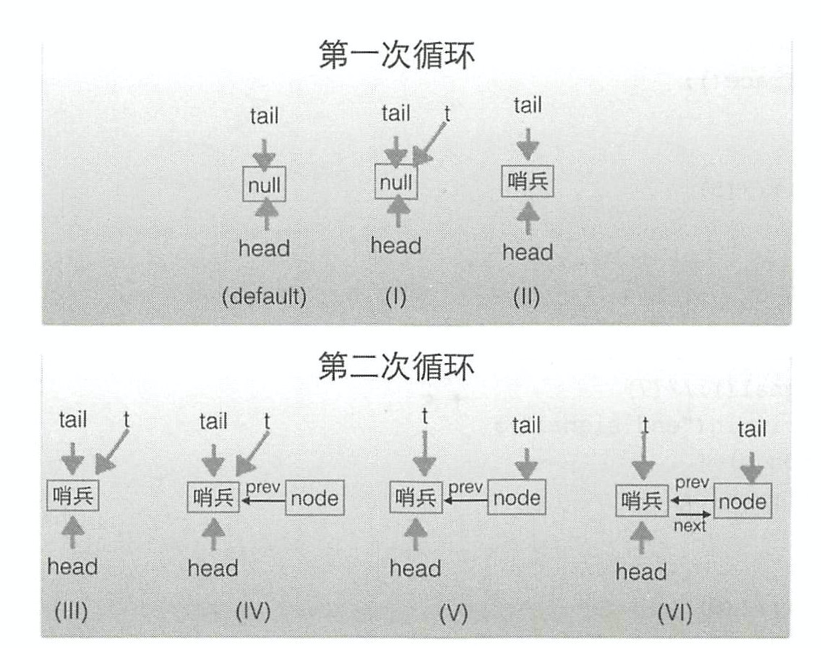

# 1.基础

## 1.1 从单核到多核

由于物理属性的限制，CPU的主频频率发展暂时遇到了瓶颈，所以硬件设计师们不再一味追求单核的运算速度，而是尝试将多个核心整合到独立的CPU中。


## 1.2 同步(Synchronous)与异步(Asynchronous) 阻塞(Blocking)与非阻塞(Non-Blocking)

**同步与异步关注于方法调用过程，即消息通信机制**

同步：调用发生后，在没有得到结果之前，该调用不返回，由调用者主动等待调用结果

异步：调用发生后，这个调用直接返回，由于是直接返回，所以**没有返回结果**，在调用真正完成后，被调用者通过状态、通知、回调函数等方式通知调用者。

**阻塞与非阻塞关注与于调用者在等待调用结果时的自身行为**

阻塞：调用者发起调用后，在没有得到结果前，当前线程被挂起。

非阻塞：调用不会阻塞当前线程，即此时可以去干其他的事情，当然也需要偶尔查看是否调用完成。

异步调用简单例子

```Java
import java.util.concurrent.Callable;
import java.util.concurrent.FutureTask;

/**
 * @Author: tzy
 * @Description:
 * @Date: Create in 10:08 2020-07-01
 */
public class AsyTest implements Callable<Order> {
    public Order call() throws Exception {
        Thread.sleep(2000);
        return new Order(1,"测试");
    }

    public static void main(String[] args) {
        FutureTask<Order> futureTask = new FutureTask<Order>(new AsyTest());
        new Thread(futureTask).start();
        try{
            Order order=futureTask.get();
            System.out.println(order.toString());
        }
        catch (Exception e){
            e.printStackTrace();
        }
    }
}
```


## 1.3 并发(Concurrency)和并行(Parallelism)

并发偏重于多个任务交替执行，而并行才是严格意义上的同时执行

对于外部观察者来说，在并发中，即使交替执行任务A和B，A、B之间是串行并发的，也会造成多任务并行执行的错觉

例子：爬山时，由于山路危险，要求游客在走路时低头看路，站定不动时才可以看风景，”看风景“和”走路“之间是并发执行的，它们并不能”同时执行“，但是仍然会给人 ”同时走路和看风景“的错觉


## 1.4 临界资源/临界区

临界资源：一次只允许一个线程使用的资源

临界区：访问临界资源的那段代码


## 1.5 死锁、饥饿、活锁

死锁：指两个或两个以上的进程在执行过程中，由于竞争资源或者由于彼此通信而造成的一种阻塞的现象，若无外力作用，它们都将无法推进下去

饥饿：某一个/多个线程因为种种原因（如优先级过低）一直无法获得所需要的资源，导致一直无法执行，与死锁相比，饥饿是有可能在未来一段时间内解决的，如高优先级的线程已经完成任务，不再抢占资源

活锁：指的是任务或者执行者没有被阻塞，由于某些条件没有满足，导致一直重复尝试—失败—尝试—失败的过程。处于活锁的实体是在不断的改变状态，活锁有可能自行解开 

活锁例子1：电梯进出互相谦让 但是又撞上

活锁例子2：两个互相冲突的任务重试时间都是1s，第一次冲突后1s后再次冲突，一直循环下去


## 1.6 并发级别

### 1.6.1 阻塞

如果一个线程是阻塞的，那么在他得到资源之前，是无法继续执行的

在使用synchronized关键字或是重入锁时，得到的就是阻塞的线程

### 1.6.2 无饥饿

非公平锁会允许高优先级的线程插队，这就可能导致低优先级的线程饥饿

公平锁则是”无饥饿“的

### 1.6.3 无障碍

是一种最弱的非阻塞调度

如果两个线程的并发级别都是无障碍的，意味着他们都可以直接进入临界区，而不用考虑临界资源是否被占用，那么大家就可以修改共享数据，如果改坏了就对自己所做的修改进行回滚

这是一种乐观策略，认为线程之间发生冲突的概率不大

但是当临界区实际存在严重的冲突时，线程都会不断回滚自己进行的操作，导致无法走出临界区

典型是CAS

### 1.6.4 无锁

无障碍的级别中，可能会出现的一种情况是所有线程都走不出临界区

无锁级别则保证必然有一个线程能够离开临界区

他可能会包含一个无穷循环，不断进行对共享变量的修改，直到他胜出，这种情况下，总有一个线程是可以胜出的，至于竞争失败的线程，他们必须不断重试直到获胜，如果运气不好也可能出现类似于饥饿的现象导致线程停止

### 1.6.5 无等待

无锁只要求有一个线程可以在有限步内完成，无等待则在他的基础上更进一步，要求所有线程都在有限步内完成，这样就不会导致饥饿。

典型是的无等待结构：RCU（Read Copy Update) 基本思想是对数据的读可以不加控制，但是写数据的时候，先取得原始数据的副本，接着只修改副本数据，修改完成后，在**合适的时机**回写数据。

## 1.7 并行对性能起多大的影响

在程序中，有的步骤可以并行进行，而有的步骤必须串行进行（程序依赖上一步的结果，必须按顺序执行）

CPU处理器的个数和代码中能够并行执行的代码比例这两者共同决定了能够起到多大的性能优化作用

## 1.8 Java内存模型 JMM

### 1.8.1 原子性 Atomicity

原子性指的是一个操作是不可中断的，即使在多个线程一起执行，并且发生冲突的时候，一旦一个原子性操作开始，他是不会受到干扰的。

比如对静态全局变量int i的赋值，线程A赋值为1，线程B赋值为2，无论这两个线程怎么样工作，i的值要么是1要么是2

但是如果在32位Java虚拟机下对long型数据赋值，这个操作并非原子性操作，因为long有64位，对long数据的读写需要32位虚拟机进行2次操作，多个线程之间有可能会互相干扰，转换成二进制之后的前32位和后32位可能互相混淆从而出现期望之外的数字

### 1.8.2 可见性 Visibility

**当一个线程对共享变量做了修改后其他线程可以立即感知到该共享变量的改变，**从 Java 内存模型我们就能看出来多线程访问共享变量都要经过线程工作内存到主存的复制和主存到线程工作内存的复制操作，所以普通共享变量就无法保证可见性了；**Java 提供了 volatile 修饰符来保证变量的可见性，每次使用 volatile 变量都会主动从主存中刷新，除此之外 synchronized、Lock、final 都可以保证变量的可见性。**


### 1.8.3 有序性 Ordering

指令重排对于提高CPU处性能是必要的

但是有些原则是指令重排不能违背的：happen-before规则

Happens-Before的八个规则（摘自《深入理解Java虚拟机》12.3.6章节）：

- 程序次序规则：一个线程内，按照代码顺序，书写在前面的操作先行发生于书写在后面的操作；
- 管程锁定规则：一个unLock操作先行发生于后面对同一个锁的lock操作；（此处后面指时间的先后）
- volatile变量规则：对一个变量的写操作先行发生于后面对这个变量的读操作；（此处后面指时间的先后）
- 线程启动规则：Thread对象的start()方法先行发生于此线程的每个一个动作；
- 线程终结规则：线程中所有的操作都先行发生于线程的终止检测，我们可以通过Thread.join()方法结束、Thread.isAlive()的返回值手段检测到线程已经终止执行；
- 线程中断规则：对线程interrupt()方法的调用先行发生于被中断线程的代码检测到中断事件的发生；
- 对象终结规则：一个对象的初始化完成先行发生于他的finalize()方法的开始；
- 传递性：如果操作A先行发生于操作B，而操作B又先行发生于操作C，则可以得出操作A先行发生于操作C；
  

## 


# 2.线程相关知识

## 2.1 线程的生命周期

```
public enum State {
        /**
         * Thread state for a thread which has not yet started.
         
         */
        NEW,

        /**
         * Thread state for a runnable thread.  A thread in the runnable
         * state is executing in the Java virtual machine but it may
         * be waiting for other resources from the operating system
         * such as processor.
         */
        RUNNABLE,

        /**
         * Thread state for a thread blocked waiting for a monitor lock.
         * A thread in the blocked state is waiting for a monitor lock
         * to enter a synchronized block/method or
         * reenter a synchronized block/method after calling
         * {@link Object#wait() Object.wait}.
         */
        BLOCKED,

        /**
         * Thread state for a waiting thread.
         * A thread is in the waiting state due to calling one of the
         * following methods:
         * <ul>
         *   <li>{@link Object#wait() Object.wait} with no timeout</li>
         *   <li>{@link #join() Thread.join} with no timeout</li>
         *   <li>{@link LockSupport#park() LockSupport.park}</li>
         * </ul>
         *
         * <p>A thread in the waiting state is waiting for another thread to
         * perform a particular action.
         *
         * For example, a thread that has called <tt>Object.wait()</tt>
         * on an object is waiting for another thread to call
         * <tt>Object.notify()</tt> or <tt>Object.notifyAll()</tt> on
         * that object. A thread that has called <tt>Thread.join()</tt>
         * is waiting for a specified thread to terminate.
         */
        WAITING,

        /**
         * Thread state for a waiting thread with a specified waiting time.
         * A thread is in the timed waiting state due to calling one of
         * the following methods with a specified positive waiting time:
         * <ul>
         *   <li>{@link #sleep Thread.sleep}</li>
         *   <li>{@link Object#wait(long) Object.wait} with timeout</li>
         *   <li>{@link #join(long) Thread.join} with timeout</li>
         *   <li>{@link LockSupport#parkNanos LockSupport.parkNanos}</li>
         *   <li>{@link LockSupport#parkUntil LockSupport.parkUntil}</li>
         * </ul>
         */
        TIMED_WAITING,

        /**
         * Thread state for a terminated thread.
         * The thread has completed execution.
         */
        TERMINATED;
    }
```

NEW：刚创建还未调用start()的线程

RUNNABLE：这个状态的线程正在虚拟机中执行，但有可能在等待操作系统资源，比如处理器资源（并不是阻塞）

BLOCKED：这个状态的线程正在等待监视器锁来进入同步代码块，或者是在Object.wait()方法后再次进入同步代码块

WAITING：这个线程处于等待状态，调用Object.wait()方法、Thread.join()方法、LockSupport.park()方法都可以进入这一状态

TIME_WAITING:同样是等待状态，但是指定了处于这一状态的时间，调用Thread.sleep(long miles)、Object.wait(long miles)、Thread.join(long miles)都可以进入这一状态

调用Object.notify()、 Object.notifyAll()、Thread.join()、LockSupport.unpark(Thread) 解除wating状态

TERMINATED：线程已完成执行


各状态触发代码：

```java

/**
 * @Author: tzy
 * @Description:
 * @Date: Create in 14:09 2020-06-21
 */
public class ThreadTest{
    final static Object lock =new Object();
    public static void main(String[] args) throws InterruptedException {
        Thread t1=new Thread(new Thread1());
        System.out.println("1"+t1.getState());//NEW
        t1.start();
        System.out.println("2"+t1.getState());//RUNNABLE
        Thread.sleep(1000);
        System.out.println("3"+t1.getState());//TERMINATED

        Thread t2=new Thread(new Thread2(),"thread2");
        synchronized (lock){
            try {
                t2.start();
                Thread.sleep(1000);
                System.out.println("4"+t2.getState());//BLOCKED
            }
            catch (InterruptedException e){
                e.printStackTrace();
            }
        }

        Thread t3=new Thread(new Thread3(),"thread3");
        t3.start();
        try {
            Thread.sleep(1000);
        }
        catch (InterruptedException e){
            e.printStackTrace();
        }
        synchronized (lock){
            System.out.println("5"+t3.getState());//WAITING
            //用notifyAlll/notify来唤醒在等待的t3线程
            lock.notifyAll();
        }


        Thread t4=new Thread(new Thread4(),"thread4");
        t4.start();
        try {
            Thread.sleep(1500);
        }
        catch (InterruptedException e){
            e.printStackTrace();
        }
        System.out.println("7"+t4.getState());//TIME_WAITING

    }


    static class Thread1 implements Runnable{
        public void run() {
            System.out.println("thread test1");
        }
    }

    static class Thread2 implements Runnable{
        public void run() {
            synchronized (lock){
                System.out.println("thread test2 state:"+Thread.currentThread().getState());//RUNNABLE
            }
        }
    }

    static class Thread3 implements Runnable{
        public void run() {
            try {
                synchronized (lock){
                    lock.wait();
                    System.out.println("thread test3 state:"+Thread.currentThread().getState());
                }
            } catch (InterruptedException e) {
                e.printStackTrace();
            }
        }
    }
    static class Thread4 implements Runnable{
        public void run() {
            try {
                Thread.sleep(3000);
                System.out.println("thread test4 state:"+Thread.currentThread().getState());
            } catch (InterruptedException e) {
                e.printStackTrace();
            }
        }
    }
}
```


## 2.2终止线程

### 2.2.1 stop()

Thread提供了一个stop()方法来终止线程，但是它是一个被标注为废弃的方法

原因是使用stop来终止线程时，会立即释放这个线程所拥有的锁，这可能会导致一致性问题的发生

```java
/**
 * @Author: tzy
 * @Description:
 * @Date: Create in 16:12 2020-06-21
 */
public class TheadTest2 {
    static Object lock = new Object();
    static class Thread1 implements Runnable{

        public void run() {
            synchronized (lock){
                try {
                    System.out.println("hello");
                    Thread.sleep(5000);
                } catch (InterruptedException e) {
                    e.printStackTrace();
                }
            }
        }
    }

    public static void main(String[] args) throws InterruptedException {
        Thread t1=new Thread(new Thread1());
        t1.start();
        Thread.sleep(1000);
        t1.stop();
        synchronized (lock){
            System.out.println("main get lock");
        }
    }
}


```

main函数本应在4s后才能得到锁，但是由于t1.stop()，main立刻得到了锁

### 2.2.2 标识符

在thread中设置一个volatile的标识符和供外界调用的改变这一状态的方法，一旦这个状态改变，线程做一些自定义的操作后就自动退出。

```java
/**
 * @Author: tzy
 * @Description:
 * @Date: Create in 16:12 2020-06-21
 */
public class TheadTest2 {
    static Object lock = new Object();
    static class Thread1 implements Runnable{
        volatile boolean flag=false;
        public void stopMe(){
            flag=true;
        }
        public void run() {
            while(true){
                if(flag){
                    System.out.println("stop me");
                    break;
                }
                synchronized (lock){
                    try {
                        System.out.println("hello");
                        Thread.sleep(3000);
                    } catch (InterruptedException e) {
                        e.printStackTrace();
                    }
                }
            }
        }
    }

    public static void main(String[] args) throws InterruptedException {
        Thread1 thread1=new Thread1();
        Thread t1=new Thread(thread1);
        t1.start();
        Thread.sleep(1000);
        thread1.stopMe();
        synchronized (lock){
            System.out.println("main get lock");
        }
    }
}


```

stopMe方法在主线程sleep1s后调用，但是主线程并没有立刻得到lock，而是等待线程中sleep(3000)结束后释放锁，主线程才得到锁

标识符这一方法在循环体中出现wait()或是sleep()时并不能起作用

### 2.2.3 线程中断

Thread.interrupt(); 中断一个线程

Thread.isInterrupted();判断是否被中断

Thread.Interrupted();判断是否被中断，并清除标记状态


这一方法和上一方法相似，都是通过标识符的方式来操作

如果线程在sleep中被打断，则会抛出一个InterruptedException

捕获他后可以立刻退出线程，也可以做一些保证数据一致性和完整性的处理

捕获这个异常后标记会被清除，所以可以在catch中再次标记


```
/**
 * @Author: tzy
 * @Description:
 * @Date: Create in 16:12 2020-06-21
 */
public class TheadTest2 {
    static Object lock = new Object();
    static class Thread1 implements Runnable{
        public void run() {
            while(true){
                if(Thread.currentThread().isInterrupted()){
                    System.out.println("Interrupted");
                    break;
                }
                synchronized (lock){
                    try {
                        System.out.println("hello");
                        Thread.sleep(5000);
                    } catch (InterruptedException e) {
                        System.out.println("interrupted when sleep");

                        //do something here

                        Thread.currentThread().interrupt();
                    }
                }
            }
        }
    }

    public static void main(String[] args) throws InterruptedException {
        Thread1 thread1=new Thread1();
        Thread t1=new Thread(thread1);
        t1.start();
        Thread.sleep(1000);
        t1.interrupt();
        synchronized (lock){
            System.out.println("main get lock");
        }
    }
}

```

## 2.3 通知(notify)和等待(wait)

线程A调用obj.wait()方法后会停止继续执行，直到其他线程调用obj.notify()来唤醒他

obj这一对象成为了多个线程间的一个通信手段

调用obj.wait()方法的对象会进入obj对象的等待队列中

notify后会随机选择一个进行唤醒 所以这是一个非公平的过程

要调用wait和notify方法，必须要先得到obj对象的监视器

wait在执行后，会释放这个监视器

sleep则不会释放锁


wait只会释放调用wait方法的object的锁，线程中已获取的其他锁不会被释放


## 2.4 join

等待线程结束终止

```java
public static void main(String[] args) throws InterruptedException {
    Thread thread1=new Thread(new Runnable() {
        public void run() {
            try {
                Thread.sleep(1000);
            }
            catch (InterruptedException e){
                e.printStackTrace();
            }
            System.out.println("thread1 over");
        }
    });
    Thread thread2=new Thread(new Runnable() {
        public void run() {
            try {
                Thread.sleep(2000);
            }
            catch (InterruptedException e){
                e.printStackTrace();
            }
            System.out.println("thread2 over");
        }
    });
    thread1.start();
    thread2.start();
    System.out.println("wait all child thread over");
    thread1.join();
    thread2.join();
    System.out.println("all child thread over");
}
```

在这一例子中  main线程会等待thread1 和 thread2 执行完毕后打印最后一句话

## 2.5 yield

```java
/**
 * @Author: tzy
 * @Description:
 * @Date: Create in 11:09 2020-07-01
 */
public class YieldTest implements Runnable {
    YieldTest(){
        Thread t=new Thread(this);
        t.start();
    }
    public void run() {
        for (int i = 0; i < 5; i++) {
            System.out.println(Thread.currentThread().getName()+"正在执行"+i);
            //当i=2时让Thread0出CPU执行权
            if (i == 2 && Thread.currentThread().getName().equals("Thread-0")) {
                //                System.out.println(Thread.currentThread() + "yield");
//                Thread.yield();
            }
        }
        System.out.println(Thread.currentThread().getName()+"over");
    }

    public static void main(String[] args) {
        new YieldTest();
        new YieldTest();
    }
}

```

此时0线程总是先于1线程结束

```
Thread-0正在执行0
Thread-0正在执行1
Thread-0正在执行2
Thread-0正在执行3
Thread-0正在执行4
Thread-0over
Thread-1正在执行0
Thread-1正在执行1
Thread-1正在执行2
Thread-1正在执行3
Thread-1正在执行4
Thread-1over
```

解开注释的两行后

```
Thread-0正在执行0
Thread-0正在执行1
Thread-0正在执行2
Thread[Thread-0,5,main]yield
Thread-1正在执行0
Thread-1正在执行1
Thread-1正在执行2
Thread-1正在执行3
Thread-1正在执行4
Thread-1over
Thread-0正在执行3
Thread-0正在执行4
Thread-0over
```

## 2.6.CAS中ABA问题的产生原因 环形转换

```Java
public final native boolean compareAndSwapInt(Object var1, long var2, int var4, int var5);
```

boolean compareAndSwapLong(Object obj,long valueOffset,long expect, long update）方

法 ： 其中 compareAndSwap 的意 思是 比较并交换。 CAS 有四 个操作数 ， 分别为 ： 对

象内存位置 、 对象中 的变量的偏移量 、 变量预期值和新的值 。 其操作含义是 ， 如果

对象 obj 中内存偏移量为 valueOffset 的变量值为 expect ，则 使用新 的值 update 替换

旧的值 expect。 这是处理器提供的 一个原子性指令 。

关于 CAS 操作有个经 典的 ABA 问 题 ， 具体 如下： 假如 线程 I 使用 CAS 修改初始值 为 A 的变量 X ， 那么线程 I 会首先去获取当前变量 X 的值（为 A ） ， 然后使用 CAS 操作尝 试修改 X 的值为 B ， 如果使用 CAS 操作成功 了 ， 那么程序运行一定是正确的 吗 ？其实未必， 这是因为有可能在线程 I 获取变量 X 的值 A 后，在执行 CAS 前，线程 II 使用 CAS 修改 了 变量 X 的值为 B ，然后又使用 CAS 修改 了 变量 X 的值为 A 。 所以 虽然线程 I 执行 CAS 时 X 的值是 A ， 但是这个 A 己经不是线程 I 获取时 的 A 了 。 这就是 ABA 问题 。

ABA 问 题 的产生是因为变量 的状态值产生 了 环形转换，就是变量的值可 以从 A 到 B, 然后再从 B 到 A。如果变量的值只能朝着一个方向转换 ，比如 A 到 B , B 到 C， 不构成环 形，就不会存在 问 题。 JDK 中 的 AtomicStampedReference 类给每个变量 的状态值都配备了 一个时间戳 ， 从而避免了 ABA 问题 的产生。

# 3.ThreadLocal源码

当创建一个变量后 ，每个线程对其进行访问的时候访问的是自己线程的变量

```java
/**
 * @Author: tzy
 * @Description:
 * @Date: Create in 11:28 2020-07-01
 */
public class ThreadLocalTest {
    static ThreadLocal<Order> threadLocal=new ThreadLocal<Order>();
    static void print(String str){
        //打印当前线程本地内存中loaclVariable变量值
        System.out.println(str+":"+threadLocal.get().toString());
    }

    public static void main(String[] args) {
        final Thread thread1=new Thread(new Runnable() {
            public void run() {
                threadLocal.set(new Order(1,"order1"));
                print("thread1");
            }
        });
        final Thread thread2=new Thread(new Runnable() {
            public void run() {
                threadLocal.set(new Order(2,"order2"));
                print("thread2");
            }
        });
        thread1.start();
        thread2.start();
    }
}

```


1.Thread类中存在变量：

```java
 /* ThreadLocal values pertaining to this thread. This map is maintained
     * by the ThreadLocal class. */
    ThreadLocal.ThreadLocalMap threadLocals = null;

    /*
     * InheritableThreadLocal values pertaining to this thread. This map is
     * maintained by the InheritableThreadLocal class.
     */
    ThreadLocal.ThreadLocalMap inheritableThreadLocals = null;
```

以threadLocals说明：

默认情况下，这一变量为null，在首次调用set方法时会初始化

2.threadLocals变量的类型是ThreadLocalMap，这是一个定制的HashMap

```java
 /**
     * ThreadLocalMap is a customized hash map suitable only for
     * maintaining thread local values. No operations are exported
     * outside of the ThreadLocal class. The class is package private to
     * allow declaration of fields in class Thread.  To help deal with
     * very large and long-lived usages, the hash table entries use
     * WeakReferences for keys. However, since reference queues are not
     * used, stale entries are guaranteed to be removed only when
     * the table starts running out of space.
     */
```

之所以使用Map结构是因为一个Thread可以持有多个ThreadLocal

如下：

```java
static ThreadLocal<Order> threadLocal1=new ThreadLocal<Order>();
static ThreadLocal<Order> threadLocal2=new ThreadLocal<Order>();
static ThreadLocal<String> threadLocal3=new ThreadLocal<String>();
```

ThreadLocalMap以ThreadLocal的实例变量的hash值为key，set进入的object为value

1处获取当前线程，2处根据线程拿到ThreadLocalMap，getMap(t)如下：

```Java
ThreadLocalMap getMap(Thread t) {
        return t.threadLocals;
    }
```

仅是返回了当前Thread持有的threadLocals对象(步骤1中说明)，但此时为空，所以进入3处createMap(t,value)

```Java
void createMap(Thread t, T firstValue) {
    t.threadLocals = new ThreadLocalMap(this, firstValue);
}
```

```Java
ThreadLocalMap(ThreadLocal<?> firstKey, Object firstValue) {
    table = new Entry[INITIAL_CAPACITY];
    int i = firstKey.threadLocalHashCode & (INITIAL_CAPACITY - 1);
    table[i] = new Entry(firstKey, firstValue);
    size = 1;
    setThreshold(INITIAL_CAPACITY);
}
```

创建了新的ThreadLocalMap并放入第一个值并让Thread持有的threadLocals对象指向他

4.get逻辑

```Java
public T get() {
    Thread t = Thread.currentThread();
    ThreadLocalMap map = getMap(t);
    if (map != null) {
      //1
        ThreadLocalMap.Entry e = map.getEntry(this);
        if (e != null) {
            @SuppressWarnings("unchecked")
            T result = (T)e.value;
            return result;
        }
    }
  //2
    return setInitialValue();
}
```

1处为正常情况，在map中getEntry，与HashMap中相似

2处在未初始化的情况下会进入，调用setInitialValue()方法

```java
private T setInitialValue() {
    T value = initialValue();
    Thread t = Thread.currentThread();
    ThreadLocalMap map = getMap(t);
    if (map != null)
        map.set(this, value);
    else
        createMap(t, value);
    return value;
}
```

其中initialValue()方法仅返回null，相当于调用了set方法传入null，在这一过程中会创建map并赋给Thread中的threadlocals变量


5.继承性

ThreadLocal不支持继承性，即子线程无法访问到父线程threadLocal中的元素，在1中的    ThreadLocal.ThreadLocalMap inheritableThreadLocals = null; 使用这一变量则可以让子线程拿到父线程Threadlocal中的元素

```java
/**
 * @Author: tzy
 * @Description:
 * @Date: Create in 17:53 2020-07-01
 */
public class InheritableThreadLocalTest {
    public static ThreadLocal<String> threadLocal = new InheritableThreadLocal<String>();

    public static void main(String[] args) {
        threadLocal.set("Hello");
        Thread thread=new Thread(new Runnable() {
            public void run() {
                System.out.println("test  "+threadLocal.get());
            }
        });
        thread.start();
    }
}
```


InheritableThreadLocal源码：

```Java
public class InheritableThreadLocal<T> extends ThreadLocal<T> {
    /**
     * Computes the child's initial value for this inheritable thread-local
     * variable as a function of the parent's value at the time the child
     * thread is created.  This method is called from within the parent
     * thread before the child is started.
     * <p>
     * This method merely returns its input argument, and should be overridden
     * if a different behavior is desired.
     *
     * @param parentValue the parent thread's value
     * @return the child thread's initial value
     */
    protected T childValue(T parentValue) {
        return parentValue;
    }

    /**
     * Get the map associated with a ThreadLocal.
     *
     * @param t the current thread
     */
    ThreadLocalMap getMap(Thread t) {
       return t.inheritableThreadLocals;
    }

    /**
     * Create the map associated with a ThreadLocal.
     *
     * @param t the current thread
     * @param firstValue value for the initial entry of the table.
     */
    void createMap(Thread t, T firstValue) {
        t.inheritableThreadLocals = new ThreadLocalMap(this, firstValue);
    }
```

他继承了ThreadLocal并复写了其中的三个方法

从getMap和createMap的复写中可以看到，单纯地把t.threadLocals替换成了t.inheritableThreadLocals

也就是说，在InheritableThreadLocal中，用t.inheritableThreadLocals替换了t.threadLocals

子线程究竟如何访问父线程的变量，要从Thread的初始化看起：

```Java
public Thread(Runnable target) {
    init(null, target, "Thread-" + nextThreadNum(), 0);
}
```

Thread的构造器调用init方法：init中的关键代码如下：

```Java
Thread parent = currentThread();
if (inheritThreadLocals && parent.inheritableThreadLocals != null)
            this.inheritableThreadLocals =
                ThreadLocal.createInheritedMap(parent.inheritableThreadLocals);
```

如果父线程的inheritableThreadLocals不为空，会进入这一段代码

而父线程的getMap返回的是inheritableThreadLocals这个变量，所以ThreadLocal的set操作和get操作都会让这一变量不为空，那么会调用createInheritedMap方法

```Java
static ThreadLocalMap createInheritedMap(ThreadLocalMap parentMap) {
    return new ThreadLocalMap(parentMap);
}
```

```Java
private ThreadLocalMap(ThreadLocalMap parentMap) {
    Entry[] parentTable = parentMap.table;
    int len = parentTable.length;
    setThreshold(len);
    table = new Entry[len];

    for (int j = 0; j < len; j++) {
        Entry e = parentTable[j];
        if (e != null) {
            @SuppressWarnings("unchecked")
            ThreadLocal<Object> key = (ThreadLocal<Object>) e.get();
            if (key != null) {
                Object value = key.childValue(e.value);
                Entry c = new Entry(key, value);
                int h = key.threadLocalHashCode & (len - 1);
                while (table[h] != null)
                    h = nextIndex(h, len);
                table[h] = c;
                size++;
            }
        }
    }
}
```

在此处用《取出父线程Map中所有元素 放入子线程Map》中的方式把父线程中 inheritableThreadLocals 变量里面的本地变量 复制一份保存到子线程的 inheritableThreadLocals 变量里面

那么在什么情况下需要子线程可以获取父线程的 threadlocal 变量呢？情况还是蛮多 的，比如子线程需要使用存放在 threadlocal 变量 中的用户 登录信息，再比如 一些 中间件 需 要把统一的 id 追踪 的整个调用链路记录下来 其实子线程使用父线程中的 threadlocal 方 法有多种方式，比如创建线程时传入父线程中的变量，并将其复制到子线程中，或者在父线程中构造一个 map 作为参数传递给子线程，但是这些都改变了我们的使用习惯，所以在这些情况下 InheritableThreadLocal 就显得比较有用 

# 4.Unsafe类

 Rt.jar包中的Unsafe类提供了硬件级别的原子性操作

- 操纵对象属性
- 操纵数组元素
- 线程挂起与恢复、CAS

如何使用：

Unsafe类中提供了getUnsafe()方法：

```Java
@CallerSensitive
public static Unsafe getUnsafe() {
    Class var0 = Reflection.getCallerClass();
    if (!VM.isSystemDomainLoader(var0.getClassLoader())) {
        throw new SecurityException("Unsafe");
    } else {
        return theUnsafe;
    }
}
```

其中 用VM.isSystemDomainLoader(var0.getClassLoader()来判断是不是Bootstrap类加载器加载的，Unsafe 类是 rt.jar 包提供的,rt.jar包里面的类是使用Bootstrap类加载器加载的,而我们的启动 main 函数所在的类是使用AppClassLoader加载的，所以在 main 函数里面加载 Unsafe 类时，根据委托机制，会委托给 Bootstrap 去加载 Unsafe 类。 如果没有这段代码的限制，那么我们的应用程序就可以随意使用 Unsafe 做事情了， 而 Unsafe 类可以直接操作内存，这是不安全的，所以 JDK 开发组特意做了这个限制 ，不让开发人员在正规渠道使用 Unsafe 类 ，而是在此jar 包里面的核心类中使用Unsafe 功能 。

使用反射可以绕过这一限制：

```Java
public static Unsafe getUnsafe() throws NoSuchFieldException, IllegalAccessException {
    Field field=Unsafe.class.getDeclaredField("theUnsafe");
    field.setAccessible(true);
    Unsafe unsafe=(Unsafe)field.get(Unsafe.class);
    return unsafe;
}
```

## 操纵对象属性

```Java
import sun.misc.Unsafe;

import java.lang.reflect.Field;

/**
 * @Author: tzy
 * @Description:
 * @Date: Create in 14:54 2020-07-03
 */
public class UnSafeTest {
    public static void main(String[] args) throws NoSuchFieldException, IllegalAccessException {
        Order order=new Order(1,0L,"order1");
        Unsafe unsafe=getUnsafe();
        long idOffest=unsafe.objectFieldOffset(Order.class.getDeclaredField("id"));
        long longOffest=unsafe.objectFieldOffset(Order.class.getDeclaredField("longField"));
        long messageOffest=unsafe.objectFieldOffset(Order.class.getDeclaredField("message"));
        System.out.println(idOffest);
        System.out.println(longOffest);
        System.out.println(messageOffest);
        System.out.println("before: "+order.toString());
        String newMessage = "order2";
        unsafe.putObject(order,messageOffest,newMessage);
        System.out.println("after: "+order.toString());
    }
    public static Unsafe getUnsafe() throws NoSuchFieldException, IllegalAccessException {
        Field field=Unsafe.class.getDeclaredField("theUnsafe");
        field.setAccessible(true);
        Unsafe unsafe=(Unsafe)field.get(Unsafe.class);
        return unsafe;
    }
}
```

## 修改数组元素

```Java
public static void main(String[] args) throws NoSuchFieldException, IllegalAccessException {
    Unsafe unsafe=getUnsafe();
    int[] arr=new int[]{1,2,3,4,5};
    //获取数组第一个元素的偏移地址
    int baseOffset=unsafe.arrayBaseOffset(arr.getClass());
    System.out.println(baseOffset);
    //获取数组中元素的增量地址
    int indexScale=unsafe.arrayIndexScale(arr.getClass());
    System.out.println(indexScale);
    //通过baseOffset+i*indexScale的方式就可以找到数组中第i个元素的地址 从而进行修改 此处将下标为2的元素（3）改为0
    unsafe.putInt(arr,baseOffset+2*indexScale,0);
    for(int i:arr)
        System.out.print(i+"  ");
}
```

## 线程挂起与恢复、CAS

CAS:

```Java
 public final native boolean compareAndSwapObject(Object var1, long var2, Object var4, Object var5);
 public final native boolean compareAndSwapInt(Object var1, long var2, int var4, int var5);
 public final native boolean compareAndSwapLong(Object var1, long var2, long var4, long var6);
```

4个入参分别为obj,offest,expect,update

若obj对象在offest偏移量上的值与预期值expect相同，则更新为update，并返回true，否则不修改并返回false

```Java
public static void main(String[] args) throws NoSuchFieldException, IllegalAccessException {
    Order order=new Order(1,0L,"order1");
    Unsafe unsafe=getUnsafe();
    long idOffest=unsafe.objectFieldOffset(Order.class.getDeclaredField("id"));
    long longOffest=unsafe.objectFieldOffset(Order.class.getDeclaredField("longField"));
    long messageOffest=unsafe.objectFieldOffset(Order.class.getDeclaredField("message"));
    boolean casChange=unsafe.compareAndSwapObject(order,messageOffest,"order2","newOrder");
    System.out.print(casChange + "  "+order.toString());
}
```

```Java
//获取对象obj在某个偏移量上的变量对应volatile语义的值
Object message=unsafe.getObjectVolatile(Object order,long messageOffest);
//设置对象obj在某个偏移量上的变量对应volatile语义的值为value
unsafe.putObjectVolatile(Object order,long messageOffestl,Object value);
//有延迟的上一方法，并且不保证修改对其他线程立刻可见，只有在变量使用volatile修饰并且预计会被意外修改时才使用
unsafe.putOrderedObject(Object order,long messageOffestl,Object value);
```

线程挂起与恢复

```Java
void park(boolean isAbsolute,long time);
void unpark(Object thread);
```

park方法：阻塞当前线程，其中参数isAbsolute为false且time为0时表示一直阻塞，time大于0表示等待指定的time后阻塞线程会被唤醒，isAbsolute如果为true，表名时间是绝对时间，为false则为增量时间。

当其他线程调用了当前阻塞线程的interrupt方法而中断了当前线程时，当前线程也会返回，而当其他线程调用了unPark方法并且把当前线程作为参数也会返回


JDK 8 新增：

```Java
public final int getAndSetInt(Object var1, long var2, int var4) {
    int var5;
    do {
        var5 = this.getIntVolatile(var1, var2);
    } while(!this.compareAndSwapInt(var1, var2, var5, var4));

    return var5;
}
```

getAndSetInt while循环中使用CAS

```Java
public final int getAndAddInt(Object var1, long var2, int var4) {
    int var5;
    do {
        var5 = this.getIntVolatile(var1, var2);
    } while(!this.compareAndSwapInt(var1, var2, var5, var5 + var4));

    return var5;
}
```

与上一方法类似

# 5.伪共享

为了解决CPU与主内存之间的运行速度差问题，会在CPU与主内存之间添加一级或多级高速缓冲存储器（Cache）。这个Cache一般是被集成到CPU内部的，所以也叫CPU Cache



不同CPU拥有自己的cache，而cache内部是按行存储的，cache行是cache与主内存进行数据交换的单位

当CPU需要访问某个变量时，去cache中查找是否有该变量，若没有则去主存中获取，然后把该变量所在内存区域的一个cache行大小的内存复制到cache中，这就导致了一个cache行中会存储多个变量

此时有如下情况：cpu1、2的cache中都存在x、y变量，cpu1对x变量进行了更新，根据缓存一致性协议，cpu2的cache2中的变量x、y均会失效，这就是伪共享。

相比将每一个变量单独放到一个缓存行，性能会有所下降。

## 伪共享是如何产生的

主存数据存入缓存中时，根据局部性原理，会把该变量所在内存中大小为缓存行的内存放入缓存行，由于放入的是地址连续的多个变量，所以尤其在数组中体现最为明显，这一举措在单线程访问时是有利的：

```Java
/**
 * @Author: tzy
 * @Description:
 * @Date: Create in 10:33 2020-07-03
 */
public class CacheTest {
    public static void main(String[] args) {
        long[][] array = new long[2048][2048];
        long startTime = System.currentTimeMillis();
        for(int i=0;i<2048;i++){
            for(int j=0;j<2048;j++)
                //另一种方式：换成arr[j][i]
                array[i][j]=i*2+j;
        }
        long endTime = System.currentTimeMillis();
        System.out.println(endTime-startTime);
    }
}
```

这段代码的两种方式有显著的性能差异

所以在单线程下顺序修改一个缓存行中的多个变量，可以利用局部性原理，加快程序的运行，而在多线程环境下并发修改一个缓存行中的多个变量时就会竞争缓存行，从而导致性能的下降

## 如何避免伪共享

JDK8之前一般通过字节填充的方式来避免该问题，即在创建一个变量时使用填充字段来填满变量所在的缓存行：

```Java
public final static class FilledLong{
    public volatile long value = 0L;
    public long p1,p2,p3,p4,p5,p6;
}
```

假如缓存行为64个字节，7个long占56个字节，对象头8个字节，刚好64个字节占满一个缓存行。

在JDK8中提供了一个注解

```Java
@sun.misc.Contended
```

可以标注在变量上，也是使用填充的方法来填满缓存行。

Thread类中就有这一注解的使用

```Java
/** The current seed for a ThreadLocalRandom */
@sun.misc.Contended("tlr")
long threadLocalRandomSeed;

/** Probe hash value; nonzero if threadLocalRandomSeed initialized */
@sun.misc.Contended("tlr")
int threadLocalRandomProbe;

/** Secondary seed isolated from public ThreadLocalRandom sequence */
@sun.misc.Contended("tlr")
int threadLocalRandomSecondarySeed;
```

默认情况下该注解只用于Java核心类，如果要在用户路径下的类使用该注解，则要添加JVM参数-XX:RestrictContended

填充的宽度默认为128，同样可以通过-XX:ContendedPaddingWidth来设置


# 6.ThreadLocalRandom类源码

## Random的局限性

使用Random时，调用构造函数new Random();

```Java
public Random() {
    this(seedUniquifier() ^ System.nanoTime());
}
```

```Java
public Random(long seed) {
    if (getClass() == Random.class)
        this.seed = new AtomicLong(initialScramble(seed));
    else {
        // subclass might have overriden setSeed
        this.seed = new AtomicLong();
        setSeed(seed);
    }
}
```

可以指定参数作为种子，若不指定则随机种子（系统时间扰动后）

接下来看生成下一个随机数的nextInt方法：

```Java
public int nextInt(int bound) {
    if (bound <= 0)
        throw new IllegalArgumentException(BadBound);
//(1)
    int r = next(31);
    int m = bound - 1;
    if ((bound & m) == 0)  // i.e., bound is a power of 2
        r = (int)((bound * (long)r) >> 31);
    else {
        for (int u = r;
             u - (r = u % bound) + m < 0;
             u = next(31))
            ;
    }
    return r;
}
```

(1)处的next方法：

```java
protected int next(int bits) {
    long oldseed, nextseed;
    AtomicLong seed = this.seed;
    do {
        oldseed = seed.get();
        nextseed = (oldseed * multiplier + addend) & mask;
    } while (!seed.compareAndSet(oldseed, nextseed));
    return (int)(nextseed >>> (48 - bits));
}
```

实际上是根据旧种子生成新种子，内部使用了AtomicLong和CAS操作来保证next方法的原子性

在多线程环境下可能会出现多个线程拿同一个旧种子去生成新种子的情况，导致生成了同一个随机数

所以（根据旧种子生成新种子）这一过程需要保持原子性，在next函数的实现中：

```Java
public final boolean compareAndSet(long expect, long update) {
    return unsafe.compareAndSwapLong(this, valueOffset, expect, update);
}
```

多线程环境下使用单个Random实例生成随机数时，多个线程会竞争同一个原子变量的更新操作，由于这个操作是CAS操作，同时只有一个线程会成功，所以会造成大量线程在while中进行自旋重试，这会降低并发性能。

解决方法1：

缓存多个Random实例 不同线程使用不同的Random实例

解决方法2：

ThreadLocal<Random>实现当前线程独有的Random

解决方法3：

使用ThreadLocalRandom（JUC包下）


## ThreadLocalRandom解析

使用：

```Java
import java.util.concurrent.ThreadLocalRandom;

/**
 * @Author: tzy
 * @Description:
 * @Date: Create in 11:51 2020-07-03
 */
public class RandomTest {
    public static void main(String[] args) {
        for (int i = 0; i < 10; i++) {
            new Player().start();
        }
    }
    private static class Player extends Thread {
        @Override
        public void run() {
            System.out.println(getName() + ": " + ThreadLocalRandom.current().nextInt(100));
        }
    }
}
```

原理：

Random的缺点是多个线程会使用同一个原子性种子变量，从而导致了对原子变量更新的竞争

而ThreadLocalRandom在每个线程内部维护一个种子变量，则每个线程生成随机数时使用的老种子是自己线程独有的老种子，并使用新种子更新老种子，这样就不会有并发问题和竞争问题。

在Thread中有以下三个变量：

```Java
// The following three initially uninitialized fields are exclusively
// managed by class java.util.concurrent.ThreadLocalRandom. These
// fields are used to build the high-performance PRNGs in the
// concurrent code, and we can not risk accidental false sharing.
// Hence, the fields are isolated with @Contended.

/** The current seed for a ThreadLocalRandom */
@sun.misc.Contended("tlr")
long threadLocalRandomSeed;

/** Probe hash value; nonzero if threadLocalRandomSeed initialized */
@sun.misc.Contended("tlr")
int threadLocalRandomProbe;

/** Secondary seed isolated from public ThreadLocalRandom sequence */
@sun.misc.Contended("tlr")
int threadLocalRandomSecondarySeed;
```

其中thereadLocalRandomSeed就是线程自己的种子，这就是一个普通的long变量，因为他是线程独立的

当线程调用ThreadLocalRandom类的current方法时，ThreadLocalRandom会负责初始化这个种子

ThreadLocalRandom是一个工具类，不需要实例化具体对象，他内部有一个instance

```Java
/** The common ThreadLocalRandom */
static final ThreadLocalRandom instance = new ThreadLocalRandom();
```

这个变量是static的，当多个线程通过current方法获取ThreadLocalRandom实例时，获取的是同一个实例，但是由于具体的种子是存放在线程里面的，ThreadLocalRandom的实例里只包含一些线程无关的通用算法，所以是线程安全的

1.Unsafe机制 在ThreadLocalRandom的静态代码块中

```Java
// Unsafe mechanics
    private static final sun.misc.Unsafe UNSAFE;
    private static final long SEED;
    private static final long PROBE;
    private static final long SECONDARY;
    static {
        try {
            UNSAFE = sun.misc.Unsafe.getUnsafe();
            Class<?> tk = Thread.class;
          //获取Thread类中threadLocalRandomSeed变量在Thread实例里面的偏移量
            SEED = UNSAFE.objectFieldOffset
                (tk.getDeclaredField("threadLocalRandomSeed"));
          //同上
            PROBE = UNSAFE.objectFieldOffset
                (tk.getDeclaredField("threadLocalRandomProbe"));
          //同上
            SECONDARY = UNSAFE.objectFieldOffset
                (tk.getDeclaredField("threadLocalRandomSecondarySeed"));
        } catch (Exception e) {
            throw new Error(e);
        }
    }
```

这里使用Unsafe拿到Thread类中三个相关变量的偏移量，后面会根据这个偏移量进行操作


2.ThreadLocalRandom.current()方法

```Java
public static ThreadLocalRandom current() {
    if (UNSAFE.getInt(Thread.currentThread(), PROBE) == 0)
        localInit();
    return instance;
}
```

这个方法返回instance实例，并执行初始化过程，若Thread中的threadLocalRandomProbe的值为0（默认为0）则说明没有进行初始化过程，则执行localInit()方法进行初始化

```Java
static final void localInit() {
    int p = probeGenerator.addAndGet(PROBE_INCREMENT);
    int probe = (p == 0) ? 1 : p; // skip 0
    long seed = mix64(seeder.getAndAdd(SEEDER_INCREMENT));
    Thread t = Thread.currentThread();
    UNSAFE.putLong(t, SEED, seed);
    UNSAFE.putInt(t, PROBE, probe);
}
```

这里的probeGenerator和seeder都是Atomic变量，保证多个线程同时初始化时不会有相同的初始化结果

初始化完成后通过unsafe，写回当前线程，probe赋为1，下次调用current时就不会进行初始化


3.int nextInt(int bound)方法

```Java
public int nextInt(int bound) {
    if (bound <= 0)
        throw new IllegalArgumentException(BadBound);
    int r = mix32(nextSeed());
    int m = bound - 1;
    if ((bound & m) == 0) // power of two
        r &= m;
    else { // reject over-represented candidates
        for (int u = r >>> 1;
             u + m - (r = u % bound) < 0;
             u = mix32(nextSeed()) >>> 1)
            ;
    }
    return r;
}
```

```Java
private static int mix32(long z) {
    z = (z ^ (z >>> 33)) * 0xff51afd7ed558ccdL;
    return (int)(((z ^ (z >>> 33)) * 0xc4ceb9fe1a85ec53L) >>> 32);
}
```

mix32根据当前线程中的种子计算新种子，然后根据新种子和bound计算随机数

4.nextSeed()方法

```Java
final long nextSeed() {
    Thread t; long r; // read and update per-thread seed
    UNSAFE.putLong(t = Thread.currentThread(), SEED,
                   r = UNSAFE.getLong(t, SEED) + GAMMA);
    return r;
}
```

r = UNSAFE.getLong(t, SEED) 获取当前线程中的threadLocalRandomSeed变量的值，在这个值的基础上加上GAMMA值作为新种子，然后用Unsafe的putLong方法把新种子放入线程的threadLocalRandomSeed中


# 7.JUC包中原子操作源码解析

JUC包提供了一系列原子性操作类

均以Long类型举例，实现原理类似

## 7.1 原子变量操作类

AtomicLong

```Java
public class AtomicLong extends Number implements java.io.Serializable {
    private static final long serialVersionUID = 1927816293512124184L;

    // setup to use Unsafe.compareAndSwapLong for updates
  //1.获取Unsafe实例
    private static final Unsafe unsafe = Unsafe.getUnsafe();
  //2.存储value变量的偏移量
    private static final long valueOffset;

    /**
     * Records whether the underlying JVM supports lockless
     * compareAndSwap for longs. While the Unsafe.compareAndSwapLong
     * method works in either case, some constructions should be
     * handled at Java level to avoid locking user-visible locks.
     */
  //3.判断JVM是否支持Long类型的无锁CAS
    static final boolean VM_SUPPORTS_LONG_CAS = VMSupportsCS8();

    /**
     * Returns whether underlying JVM supports lockless CompareAndSet
     * for longs. Called only once and cached in VM_SUPPORTS_LONG_CAS.
     */
    private static native boolean VMSupportsCS8();

    static {
        try {
          //4.利用unsafe获取value在自身类中的偏移量
            valueOffset = unsafe.objectFieldOffset
                (AtomicLong.class.getDeclaredField("value"));
        } catch (Exception ex) { throw new Error(ex); }
    }
	//5.存放实际变量值 被声明为volatile 在多线程下保证可见性
    private volatile long value;

    /**
     * Creates a new AtomicLong with the given initial value.
     *
     * @param initialValue the initial value
     */
    public AtomicLong(long initialValue) {
        value = initialValue;
    }

    /**
     * Creates a new AtomicLong with initial value {@code 0}.
     */
    public AtomicLong() {
    }
```

主要函数：

```Java
public final long getAndIncrement() {
    return unsafe.getAndAddLong(this, valueOffset, 1L);
}

/**
 * Atomically decrements by one the current value.
 *
 * @return the previous value
 */
public final long getAndDecrement() {
    return unsafe.getAndAddLong(this, valueOffset, -1L);
}

/**
 * Atomically adds the given value to the current value.
 *
 * @param delta the value to add
 * @return the previous value
 */
public final long getAndAdd(long delta) {
    return unsafe.getAndAddLong(this, valueOffset, delta);
}
```

等 主要都是借助unsafe的getAndAddLong来实现的 区别不大

```Java
public final long getAndAddLong(Object var1, long var2, long var4) {
    long var6;
    do {
        var6 = this.getLongVolatile(var1, var2);
    } while(!this.compareAndSwapLong(var1, var2, var6, var6 + var4));

    return var6;
}
```

compareAndSwapLong的4个入参分别为obj,offest,expect,update

若obj对象在offest偏移量上的值与预期值expect相同，则更新为update，并返回true，否则不修改并返回false

这里首先用getLongVolatile方法 获取了var1对象在var2偏移量上的变量值，然后下一步用cas方法进行尝试

```Java
public final boolean compareAndSet(long expect, long update) {
    return unsafe.compareAndSwapLong(this, valueOffset, expect, update);
}
```

同样是调用unsafe的CAS实现的CAS操作

```Java
public final void set(long newValue) {
    value = newValue;
}

/**
 * Eventually sets to the given value.
 *
 * @param newValue the new value
 * @since 1.6
 */
public final void lazySet(long newValue) {
    unsafe.putOrderedLong(this, valueOffset, newValue);
}
```

两个set方法 后者不保证其他线程能立刻察觉，但是性能上有优势

测试 lazySet确实快：

```Java
import java.util.concurrent.atomic.AtomicLong;

/**
 * @Author: tzy
 * @Description:
 * @Date: Create in 19:52 2020-07-07
 */
public class AtomicTest {
    static AtomicLong atomicLong = new AtomicLong();
    public static void main(String[] args) {
        long startTime = System.currentTimeMillis();
        for (int i = 0; i < 10; i++) {
            new Player().start();
        }
        long endTime = System.currentTimeMillis();
        System.out.println(endTime-startTime);
    }
    private static class Player extends Thread {
        @Override
        public void run() {
            for(int i=0;i<1000000;i++)
                //或者改成set(i)
                atomicLong.lazySet(i);
        }
    }
}
```

JDK 8 新增的几个方法：getAndUpdate、updateAndGet、getAndAccumulate、accumulateAndGet

```Java
//将旧值传给updateFunction得到新值，然后比较更新，如失败则重复循环，直至成功返回旧值
public final int getAndUpdate(IntUnaryOperator updateFunction) {
    int prev, next;
    do {
        prev = get();
        next = updateFunction.applyAsInt(prev);
    } while (!compareAndSet(prev, next));
    return prev;
}
//将旧值传给updateFunction得到新值，然后比较更新，如失败则重复循环，直至成功返回新值
public final int updateAndGet(IntUnaryOperator updateFunction) {
    int prev, next;
    do {
        prev = get();
        next = updateFunction.applyAsInt(prev);
    } while (!compareAndSet(prev, next));
    return next;
}
//将旧值和x传给accumulatorFunction得到新值，然后比较更新，如失败则重复循环，直至成功返回旧值
public final int getAndAccumulate(int x,
                                  IntBinaryOperator accumulatorFunction) {
    int prev, next;
    do {
        prev = get();
        next = accumulatorFunction.applyAsInt(prev, x);
    } while (!compareAndSet(prev, next));
    return prev;
}
//将旧值和x传给accumulatorFunction得到新值，然后比较更新，如失败则重复循环，直至成功返回新值
public final int accumulateAndGet(int x,
                                  IntBinaryOperator accumulatorFunction) {
    int prev, next;
    do {
        prev = get();
        next = accumulatorFunction.applyAsInt(prev, x);
    } while (!compareAndSet(prev, next));
    return next;
}
```

## 7.2 特殊说明：AtomicReference

在解决ABA问题时经常出现的一个类，与其他Atomic类相似，但是比较的是引用

## 7.3 JDK 8 新增的原子操作类LongAdder

简单介绍：

Atomic原子类通过CAS提供了非阻塞的原子性操作，他的性能相比使用阻塞算法的同步器来说已经有了一定提升。

使用Atomic原子类时，主要的性能瓶颈在于，在高并发时，大量线程会去竞争同一个原子变量，但是同时只有一个线程的CAS操作可以成功，这就导致了大量竞争失败的线程，在while中一直自旋尝试，从而浪费CPU资源

JDK8新增了一个原子性递增/递减类LongAdder用来克服上述Atomic原子类在高并发下的缺点，他的核心思想是：把多个线程竞争的同一个变量，分解为多个变量，让这些线程去竞争多个资源

LongAdder内部维护一个Cell数组，每个Cell里面有一个初始值为0的long型变量，不同的线程会竞争Cell数组中的不同Cell，而且如果某个线程竞争失败，他并不会在当前Cell上一直自旋，而是会去尝试其他Cell，最后，在获取LongAdder当前值时，是把所有Cell变量的value值累加后返回的。


代码分析：

```Java
public class LongAdder extends Striped64 implements Serializable {
```

LongAdder继承了Striped64类

```Java
//1.
@sun.misc.Contended static final class Cell {
  //2.
    volatile long value;
    Cell(long x) { value = x; }
    final boolean cas(long cmp, long val) {
        return UNSAFE.compareAndSwapLong(this, valueOffset, cmp, val);
    }

    // Unsafe mechanics
  //3.
    private static final sun.misc.Unsafe UNSAFE;
    private static final long valueOffset;
    static {
        try {
            UNSAFE = sun.misc.Unsafe.getUnsafe();
            Class<?> ak = Cell.class;
            valueOffset = UNSAFE.objectFieldOffset
                (ak.getDeclaredField("value"));
        } catch (Exception e) {
            throw new Error(e);
        }
    }
}
//4.
/** Number of CPUS, to place bound on table size */
static final int NCPU = Runtime.getRuntime().availableProcessors();

/**
 * Table of cells. When non-null, size is a power of 2.
 */
//下面这三个变量都为5.
transient volatile Cell[] cells;

/**
 * Base value, used mainly when there is no contention, but also as
 * a fallback during table initialization races. Updated via CAS.
 */
transient volatile long base;

/**
 * Spinlock (locked via CAS) used when resizing and/or creating Cells.
 */
transient volatile int cellsBusy;
```

1.Contended注解 避免伪共享

2.内部维护一个volatile的变量value

3.unsafe拿到value的偏移量，用于cas

4.获得CPU数量，这个数量将作为cells数组的大小上线，因为最多同时存在CPU数量个线程竞争资源

5.cells数组就是用来分摊竞争压力的数组，base字段是当竞争未产生时直接在此累加的变量，cellBusy用来实现自旋锁，状态只有0和1，当创建Cell元素，扩容Cell数组、或者初始化Cell数组时，使用CAS操作该变量来保证同时只有一个线程可以进行其中之一的操作。


**long sum()**

```Java
public long sum() {
    Cell[] as = cells; Cell a;
    long sum = base;
    if (as != null) {
        for (int i = 0; i < as.length; ++i) {
            if ((a = as[i]) != null)
                sum += a.value;
        }
    }
    return sum;
}
```

返回当前的值，内部操作是累加cell数组内部所有cell元素的value值再加上base

由于计算的时候没有对Cell数组加锁，所以在累加过程中可能有其他线程进行了修改或者扩容

所以这个函数的值并不非常精确，并不能拿到调用这个方法时的实际快照值

**void reset()**

```Java
public void reset() {
    Cell[] as = cells; Cell a;
    base = 0L;
    if (as != null) {
        for (int i = 0; i < as.length; ++i) {
            if ((a = as[i]) != null)
                a.value = 0L;
        }
    }
}
```

重置操作，把base置为0，若cell数组有元素，则元素置为0


主要看add方法

```Java
public void add(long x) {
    Cell[] as; long b, v; int m; Cell a;
  //caseBase处为1
    if ((as = cells) != null || !casBase(b = base, b + x)) {
        boolean uncontended = true;
        if (as == null || (m = as.length - 1) < 0 ||
            //getProbe处为2
            (a = as[getProbe() & m]) == null ||
            //3
            !(uncontended = a.cas(v = a.value, v + x)))
          //4
            longAccumulate(x, null, uncontended);
    }
}
```

1处caseBase：

```Java
final boolean casBase(long cmp, long val) {
    return UNSAFE.compareAndSwapLong(this, BASE, cmp, val);
}
```

在cell为空的时候在基础变量base上进行累加，这个时候就和Atomic原子类操作一样

如果不为空则会执行下面的代码：

2处getProbe：

```Java
static final int getProbe() {
    return UNSAFE.getInt(Thread.currentThread(), PROBE);
}
```

当前线程一个访问cells数组中的哪一个cell是通过getProbe()&m计算的，其中m是当前cells数组元素个数-1，getProbe()获取了当前线程中变量threadLocalRandomProbe的值，他是线程独立的，在代码4中被初始化


3处是对2中获取到应该访问的那个cells数组中的cell元素的操作，使用cas的方法

```Java
final boolean cas(long cmp, long val) {
    return UNSAFE.compareAndSwapLong(this, valueOffset, cmp, val);
}
```

将值累加进去


4.处是在当前线程映射的元素不存在 或者存在但是CAS操作失败的时候执行的，他用来初始化和扩容cells数组

看这段代码：

```Java
final void longAccumulate(long x, LongBinaryOperator fn,
                          boolean wasUncontended) {
    int h;
  //1.若probe为0（默认值）则调用ThreadLocalRandom.current();进行初始化probe
    if ((h = getProbe()) == 0) {
        ThreadLocalRandom.current(); // force initialization
        h = getProbe();
        wasUncontended = true;
    }
    boolean collide = false;                // True if last slot nonempty
    for (;;) {
        Cell[] as; Cell a; int n; long v;
      //2
        if ((as = cells) != null && (n = as.length) > 0) {
          //3
            if ((a = as[(n - 1) & h]) == null) {
                if (cellsBusy == 0) {       // Try to attach new Cell
                    Cell r = new Cell(x);   // Optimistically create
                    if (cellsBusy == 0 && casCellsBusy()) {
                        boolean created = false;
                        try {               // Recheck under lock
                            Cell[] rs; int m, j;
                            if ((rs = cells) != null &&
                                (m = rs.length) > 0 &&
                                rs[j = (m - 1) & h] == null) {
                                rs[j] = r;
                                created = true;
                            }
                        } finally {
                            cellsBusy = 0;
                        }
                        if (created)
                            break;
                        continue;           // Slot is now non-empty
                    }
                }
                collide = false;
            }
            else if (!wasUncontended)       // CAS already known to fail
                wasUncontended = true;      // Continue after rehash
          //4 当前Cell存在 则执行CAS 
          else if (a.cas(v = a.value, ((fn == null) ? v + x :
                                         fn.applyAsLong(v, x))))
                break;
          //5 当前Cell数组元素大于CPU个数  
          else if (n >= NCPU || cells != as)
                collide = false;            // At max size or stale
          //6 是否有冲突 
          else if (!collide)
                collide = true;
          //7 如果当前元素没有达到CPU个数 并且有冲突则扩容 calCellsBusy()用CAS操作把cellBusy设为1
          else if (cellsBusy == 0 && casCellsBusy()) {
                try {
                    if (cells == as) {      // Expand table unless stale
                      //7.1 
                      Cell[] rs = new Cell[n << 1];
                        for (int i = 0; i < n; ++i)
                            rs[i] = as[i];
                        cells = rs;
                    }
                } finally {
                  //7.2 扩容完成后 把cellsBusy设回0 下面初始化也是这个流程
                    cellsBusy = 0;
                }
            //7.3 重置冲突标记
                collide = false;
                continue;                   // Retry with expanded table
            }
          //7.4 重新计算hash值，用xorshift算法
            h = advanceProbe(h);
        }
      //8 初始化Cell数组
        else if (cellsBusy == 0 && cells == as && casCellsBusy()) {
            boolean init = false;
            try {                           // Initialize table
                if (cells == as) {
                  //8.1 初始化大小为2
                    Cell[] rs = new Cell[2];
                  //8.2
                    rs[h & 1] = new Cell(x);
                    cells = rs;
                    init = true;
                }
            } finally {
                cellsBusy = 0;
            }
            if (init)
                break;
        }
        else if (casBase(v = base, ((fn == null) ? v + x :
                                    fn.applyAsLong(v, x))))
            break;                          // Fall back on using base
    }
}
```

 cellsBusy是一个标识符，为0说明当前cells数组没有在被初始化/扩容/新建元素

用CAS来占用标记，结束操作后还原

8.1中说明cells初始化大小为2，，然后使用h&1计算当前线程应该访问cell数组的哪个位置，也就是当前线程的threadLocalRandomProbe & cell元素个数-1


7中是cell数组扩容的逻辑，要进入7需要满足两个条件，当前cell元素个数小于当前机器CPU个数并且当前多个线程访问了cells数组中的同一个cell元素，从而导致某一个CAS操作失败

扩容后新元素的值是null，只有使用到的时候才会初始化

整个Cell数组都是遵循延迟加载策略的，这是由于Cells占用的内存是相对比较大的

7.4对CAS失败的线程重新计算当前线程的随机值threadLocalRandomProbe，以减少下次访问cells元素时的冲突机会


## 7.4 LongAccumulator类

LongAdder是一个特殊的LongAccumulator

```Java
public LongAccumulator(LongBinaryOperator accumulatorFunction,
                       long identity) {
    this.function = accumulatorFunction;
    base = this.identity = identity;
}
```

传入的LongBinaryOrerator：

```Java
@FunctionalInterface
public interface LongBinaryOperator {

    /**
     * Applies this operator to the given operands.
     *
     * @param left the first operand
     * @param right the second operand
     * @return the operator result
     */
    long applyAsLong(long left, long right);
}
```

是一个可以自己实现运算规则的表达式

即，LongAccumulator在LongAdder的基础上可以自定义运算规则，还可以设置非0的初始值


# 8. CopyOnWriteArrayList

## 8.1 ArrayList为什么是线程不安全的

```Java
import java.util.ArrayList;
import java.util.Collections;
import java.util.List;

/**
 * @Author: tzy
 * @Description:
 * @Date: Create in 09:52 2020-07-09
 */

public class ListTest implements Runnable {
    //线程不安全
    private List threadList = new ArrayList();
    //线程安全
    //private List threadList = Collections.synchronizedList(new ArrayList());
    @Override
    public void run() {
        try {
            Thread.sleep(10);
        } catch (InterruptedException e) {
            e.printStackTrace();
        }
        //把当前线程名称加入list中
        threadList.add(Thread.currentThread().getName());
    }
    public static void main(String[] args) throws InterruptedException {
        ListTest listThread = new ListTest();
        for (int i = 0; i < 100; i++) {
            Thread thread = new Thread(listThread, "Thread:"+String.valueOf(i));
            thread.start();
        }
        //等待子线程执行完
        Thread.sleep(2000);
        System.out.println(listThread.threadList.size());
        //输出list中的值
        for (int i = 0; i < listThread.threadList.size(); i++) {
            if (listThread.threadList.get(i) == null) {
                System.out.println();
            }
            System.out.print(listThread.threadList.get(i) + " ");
        }
    }
}
```

新建100个线程，将每个线程的名字加入ArrayList

结束后List中预期会有100个元素

但是实际上会出现：

1.元素不足100个，有的值没有出现

2.报错Exception in thread "Thread:26" java.lang.ArrayIndexOutOfBoundsException: 33
	at java.util.ArrayList.add(ArrayList.java:463)
	at ListTest.run(ListTest.java:24)
	at java.lang.Thread.run(Thread.java:748)

3.元素内容为null

出现这一结果的原因是在ArrayList的add方法中：

```Java
public boolean add(E e) {
    ensureCapacityInternal(size + 1);  // Increments modCount!!
    elementData[size++] = e;
    return true;
}
```

其中： elementData[size++] = e;

赋值和size++是两条语句

1. elementData[size] = e；
2. size ++；
假设A线程执行完第一条语句时，CPU暂停执行A线程转而去执行B线程，此时ArrayList的size并没有加一，这时在ArrayList中B线程就会覆盖掉A线程赋的值，而此时，A线程和B线程先后执行size++，便会跳过一个size不赋值，出现值为null的情况

而报错OutOfBounds的情况，是由于扩容机制导致

A线程在执行ensureCapacity(size+1)后没有继续执行，此时恰好minCapacity等于oldCapacity，B线程再去执行，同样由于minCapacity等于oldCapacity，ArrayList并没有增加长度，B线程可以继续执行赋值（elementData[size] = e）并size ++也执行了，此时，CPU又去执行A线程的赋值操作，由于size值加了1，size值大于了ArrayList的最大长度，
因此便出现了ArrayIndexOutOfBoundsException异常。

## 8.2 CopyOnWriteArrayList解析

并发包中的并发List只有CopyOnWriteArrayList，他是一个线程安全的ArrayList，对其进行的写操作都是在快照上进行的，采用了写时复制策略

```Java
public class CopyOnWriteArrayList<E>
    implements List<E>, RandomAccess, Cloneable, java.io.Serializable {
    private static final long serialVersionUID = 8673264195747942595L;

    /** The lock protecting all mutators */
    final transient ReentrantLock lock = new ReentrantLock();

    /** The array, accessed only via getArray/setArray. */
    private transient volatile Object[] array;
```

使用一个可重入锁来保证同时只有一个线程对array进行修改

array字段使用volatile声明，让其他线程可以捕捉到他的变化

初始化：

```Java
/**
 * Creates an empty list.
 */
public CopyOnWriteArrayList() {
    setArray(new Object[0]);
}

/**
 * Creates a list containing the elements of the specified
 * collection, in the order they are returned by the collection's
 * iterator.
 *
 * @param c the collection of initially held elements
 * @throws NullPointerException if the specified collection is null
 */
public CopyOnWriteArrayList(Collection<? extends E> c) {
    Object[] elements;
    if (c.getClass() == CopyOnWriteArrayList.class)
        elements = ((CopyOnWriteArrayList<?>)c).getArray();
    else {
        elements = c.toArray();
        // c.toArray might (incorrectly) not return Object[] (see 6260652)
        if (elements.getClass() != Object[].class)
            elements = Arrays.copyOf(elements, elements.length, Object[].class);
    }
    setArray(elements);
}

/**
 * Creates a list holding a copy of the given array.
 *
 * @param toCopyIn the array (a copy of this array is used as the
 *        internal array)
 * @throws NullPointerException if the specified array is null
 */
public CopyOnWriteArrayList(E[] toCopyIn) {
    setArray(Arrays.copyOf(toCopyIn, toCopyIn.length, Object[].class));
}
```

可以从已存在的集合中生成CopyOnWriteArrayList，把集合中所有元素拷贝过去

若无入参，则初始化数组长度为0


添加元素 add(E e)方法 其他方法差不多：

```Java
/**
 * Appends the specified element to the end of this list.
 *
 * @param e element to be appended to this list
 * @return {@code true} (as specified by {@link Collection#add})
 */
public boolean add(E e) {
  //1
    final ReentrantLock lock = this.lock;
    lock.lock();
    try {
        Object[] elements = getArray();
        int len = elements.length;
      //2
        Object[] newElements = Arrays.copyOf(elements, len + 1);
        newElements[len] = e;
      //3
        setArray(newElements);
        return true;
    } finally {
        lock.unlock();
    }
}
```

1处获取独占锁并加锁

2处复制整个array至新数组，在新数组末尾添加这次插入的元素

3.使用新数组替换老数组


get元素：

```Java
public E get(int index) {
    return get(getArray(), index);
}
```

```Java
final Object[] getArray() {
    return array;
}
```

```Java
private E get(Object[] a, int index) {
    return (E) a[index];
}
```

get方法实际由两个步骤组成，1获取array数组，2在array数组中取指定下标的值

若A线程完成步骤1后，B线程进行了remove操作，删除了数组中的某个元素，完成后A线程执行步骤2，此时仍然能拿到删除前的元素，这就是写时复制策略造成的弱一致性问题


修改指定元素

```Java
public E set(int index, E element) {
    final ReentrantLock lock = this.lock;
    lock.lock();
    try {
        Object[] elements = getArray();
        E oldValue = get(elements, index);

        if (oldValue != element) {
            int len = elements.length;
            Object[] newElements = Arrays.copyOf(elements, len);
            newElements[index] = element;
            setArray(newElements);
        } else {
          //这里！！！！！！！！1
            // Not quite a no-op; ensures volatile write semantics
            setArray(elements);
        }
        return oldValue;
    } finally {
        lock.unlock();
    }
}
```

这里要注意的点就是注释的地方，若是指定位置要修改的元素和新值时一致的，也要重新设置一次array，虽然他的内容完全没有改变，这是为了保证volatile语义


弱一致性的迭代器：

```Java
The "snapshot" style iterator method uses a
* reference to the state of the array at the point that the iterator
* was created. This array never changes during the lifetime of the
* iterator, so interference is impossible and the iterator is
* guaranteed not to throw {@code ConcurrentModificationException}.
* The iterator will not reflect additions, removals, or changes to
* the list since the iterator was created.  Element-changing
* operations on iterators themselves ({@code remove}, {@code set}, and
* {@code add}) are not supported. These methods throw
* {@code UnsupportedOperationException}.
```

在获取迭代器时，这个迭代器持有的是当前数组的快照，从而保证在获取迭代器后，其他线程对list的修改是不可见的，

同时，不支持使用迭代器进行remove set add操作，因为在快照上进行这些操作是没有意义的


缺点及改进：

```Java
* <p>This is ordinarily too costly, but may be <em>more</em> efficient
* than alternatives when traversal operations vastly outnumber
* mutations, and is useful when you cannot or don't want to
* synchronize traversals, yet need to preclude interference among
* concurrent threads. 
```

由于每次写操作都会新建数组并复制所有元素，所以消耗很大，只适合在读多写少的场景下使用

**个人理解：可以使用两个数组来交替使用，用一个标识符控制当前在使用哪一个数组，当写操作来的时候，用一个数组处理，结束后把对另一个数组进行同样的操作，加锁期间读操作读取的是不进行处理的那个数组**


# 9.JUC包下的锁解析

## 9.1 LockSupport工具类

```java
public static void park(Object blocker); // 暂停当前线程
public static void parkNanos(Object blocker, long nanos); // 暂停当前线程，不过有超时时间的限制
public static void parkUntil(Object blocker, long deadline); // 暂停当前线程，直到某个时间
public static void park(); // 无期限暂停当前线程
public static void parkNanos(long nanos); // 暂停当前线程，不过有超时时间的限制
public static void parkUntil(long deadline); // 暂停当前线程，直到某个时间
public static void unpark(Thread thread); // 恢复当前线程
public static Object getBlocker(Thread t);//获取使用第一个方法时传入的blocker
```

park和unpark的用法类似于wait和notify

```Java
import java.util.concurrent.TimeUnit;
import java.util.concurrent.locks.LockSupport;

/**
 * @Author: tzy
 * @Description:
 * @Date: Create in 15:35 2020-07-09
 */
public class LockTest {

    public static void main(String[] args) {
        Thread parkThread = new Thread(new ParkThread());
        parkThread.start();
        for(int i=0;i<2;i++){
            System.out.println("开始线程唤醒");
            LockSupport.unpark(parkThread);
            System.out.println("结束线程唤醒");
        }
    }
    static class ParkThread implements Runnable{
        @Override
        public void run() {
            try {
                TimeUnit.SECONDS.sleep(1);
            } catch (InterruptedException e) {
                e.printStackTrace();
            }
            for(int i=0;i<2;i++){
                System.out.println("开始线程阻塞");
                LockSupport.park();
                System.out.println("结束线程阻塞");
            }
        }
    }
}
```

相比wait/notify组合 使用park/unpark有如下优点：

1.wait/notify必须先获得对象的锁

2.notify唤醒时不能控制顺序或是指定某个线程唤醒

3.必须先wait再notify


原理：

LockSupport和每个使用它的线程都有一个许可(permit)关联。permit相当于1，0的开关，默认是0，调用一次unpark就加1变成1，调用一次park会消费permit, 也就是将1变成0，同时park立即返回。再次调用park会变成block（因为permit为0了，会阻塞在这里，直到permit变为1）, 这时调用unpark会把permit置为1。每个线程都有一个相关的permit, permit最多只有一个，重复调用unpark也不会积累。

每个java线程都有一个Parker实例，Parker类是这样定义的：

```c++
class Parker : public os::PlatformParker {  
private:  
  volatile int _counter ;  
  ...  
public:  
  void park(bool isAbsolute, jlong time);  
  void unpark();  
  ...  
}  
class PlatformParker : public CHeapObj<mtInternal> {  
  protected:  
    pthread_mutex_t _mutex [1] ;  
    pthread_cond_t  _cond  [1] ;  
    ...  
}
```

LockSupport就是通过控制变量 `_counter `来对线程阻塞唤醒进行控制的。原理有点类似于信号量机制。

- 当调用 `park()`方法时，会将 _counter 置为 0，同时判断前值 < 1 说明前面被 `unpark`过，则直接退出，否则将使该线程阻塞。
- 当调用 `unpark()`方法时，会将 _counter 置为 1，同时判断前值 < 1 会进行线程唤醒，否则直接退出。
  形象的理解，线程阻塞需要消耗凭证(permit)，这个凭证最多只有1个。当调用 park方法时，如果有凭证，则会直接消耗掉这个凭证然后正常退出；但是如果没有凭证，就必须阻塞等待凭证可用；而 unpark则相反，它会增加一个凭证，但凭证最多只能有1个。
- 为什么可以先唤醒线程后阻塞线程？
  因为 unpark获得了一个凭证，之后调用 park因为有凭证消费，故不会阻塞。
- 为什么唤醒两次后阻塞两次会阻塞线程。
  因为凭证的数量最多为 1，连续调用两次 unpark 和 调用一次 unpark 效果一样，只会增加一个凭证；而调用两次 park却需要消费两个凭证。

park方法还有一个传入Object blocker的重载方法



使用带blocker参数的park方法，线程堆栈可以提供更多有关阻塞对象的信息。

## 9.2 抽象同步队列AQS

AbstractQueuedSynchronizer抽象同步队列

他是实现同步器的基础组件，并发包中的锁的底层就是使用AQS实现的

虽然在开发中的大部分情况下不会直接使用AQS，但是还是有必要了解他的原理




AQS是一个FIFO的双向队列，内部通过Node类型的tail和head节点记录队首队尾元素

Node：

SHARED和EXCLUSIVE用来标记改线程是获取共享资源时还是获取独占资源时被阻塞后放入AQS队列的

waitStatus记录当前线程状态，可以为CANCELLED(线程被取消) SIGNAL（线程需要被唤醒）CONDITION（线程在条件队列中等待）PROPAGATE（释放共享资源时需要通知其他节点）这几种状态

prev记录当前Node的前驱，next记录后继

AQS中的第一个变量state是关键变量，不同的组件用state来表述不同的含义，比如在ReentrantLock中，state用来表示当前线程获取锁的可重入次数，

对于读写锁ReentrantWriteLock来说，state的高16位用来表示读锁的次数，低16位用来表示写锁的可重入次数

对于Semaphore来说，state用来表示当前可用信号的个数

对于CountDownlatch来说，state用来表示计数器当前的值


AQS拥有内部类ConditionObject 用来结合锁实现线程同步

```Java
public class ConditionObject implements Condition, java.io.Serializable {
    private static final long serialVersionUID = 1173984872572414699L;
    /** First node of condition queue. */
    private transient Node firstWaiter;
    /** Last node of condition queue. */
    private transient Node lastWaiter;
```

他可以直接访问AQS对象内部的变量，比如state状态值和AQS队列

ConditionObject是条件变量，每个条件变量对应一个条件队列（单向链表队列），这个队列用来存放条件变量的await方法后被阻塞的线程


对于AQS来说，线程同步的关键是对状态值state进行操作，根据state是否属于一个线程，操作state的方式分为独占方式和共享方式。

**独占方式**获取的资源是和具体的线程绑定的，即如果一个线程获取到了资源，就会标记是这个线程获取到了，其他线程再尝试操作state获取资源时会发现当前该资源不是自己持有的，就会在获取失败后被阻塞。比如独占锁ReentrantLock的实现，当一个线程获取了ReentrantLock的锁后，在AQS内部会首先使用CAS操作把state状态值从0设置为1.然后设置当前锁的持有者为当前线程，当该线程再次获取锁时，发现他就是锁的持有者，就会把状态值从1变成2，即重入次数。此时若是另一个线程获取锁时发现自己并不是该锁的持有者，就会被放入AQS阻塞队列后挂起。

共享方式的资源是与具体线程无关的，当多个线程去请求资源时，通过CAS方式竞争获取资源，当一个线程获取到了资源后，另外一个线程再次去获取时如果当前资源还能满足他的需要，则当前线程只需要使用CAS进行获取即可。比如Semaphore信号量，当一个线程通过acquire()方法获取信号量时，会首先看当前信号量个数是否满足需要，不满足则把当前线程放入阻塞队列，如果满足则通过自旋CAS获取信号量。

### **独占方式：**

```Java
public final void acquire(long arg) {
    if (!tryAcquire(arg) &&
        acquireQueued(addWaiter(Node.EXCLUSIVE), arg))
        selfInterrupt();
}

public final void acquireInterruptibly(long arg)
            throws InterruptedException {
        if (Thread.interrupted())
            throw new InterruptedException();
        if (!tryAcquire(arg))
            doAcquireInterruptibly(arg);
    }

public final boolean release(long arg) {
        if (tryRelease(arg)) {
            Node h = head;
            if (h != null && h.waitStatus != 0)
                unparkSuccessor(h);
            return true;
        }
        return false;
    }
```

主要看acquire方法

```Java
if (!tryAcquire(arg) &&
        acquireQueued(addWaiter(Node.EXCLUSIVE), arg))
        selfInterrupt();
```

当一个线程调用acquire(int arg)方法获取独占资源时，会首先使用tryAcquire方法尝试获取资源，具体做法是设置state变量的值，成功则直接返回，失败则会进行acquireQueued(addWaiter(Node.EXCLUSIVE), arg)操作，即把当前线程封装成类型为Node.EXCLUSIVE（独占）的Node节点后插入到AQS阻塞队列的尾部，并调用LockSupport.park(this)方法挂起自己

```Java
static void selfInterrupt() {
    Thread.currentThread().interrupt();
}
```


当一个线程调用release(int arg)方法时会尝试使用tryRelease操作释放资源，这里同样是去设置状态变量state的值，然后调用LockSupport.unpark(thread)方法激活AQS队列里面的一个被阻塞的线程，这个被激活的线程则使用tryAcquire尝试，看当前状态变量state的值是否能满足自己的需要，满足则该线程被激活，否则继续在AQS队列中挂起

```Java
public final boolean release(long arg) {
    if (tryRelease(arg)) {
        Node h = head;
        if (h != null && h.waitStatus != 0)
            unparkSuccessor(h);
        return true;
    }
    return false;
}
```

**注意：**

占用和释放资源的tryAcquire方法和tryRelease方法在AQS类中并没有具体实现，而是需要让具体的子类来实现，由子类来根据他们各自的场景去定义state变量如何被修改，方法什么情况下返回true，什么情况下返回false

### 共享方式：

```Java
public final void acquireShared(long arg) {
    if (tryAcquireShared(arg) < 0)
        doAcquireShared(arg);
}
```

获取资源时首先调用tryAcquireShared设置状态变量state的值，成功则直接返回，失败则将当前线程封装为Node.SHARED的节点后插入到AQS阻塞队列的尾部，并使用LockSupport.park(this)方法挂起自己

释放时同独占资源一样

同样AQS的tryAcquireShared和releaseAcquireShared也没有具体实现。

基于AQS实现的锁除了重写这些方法以外，还要重写isHeldExclusively方法，来判断锁是被当前线程独占还是被共享。


另外 加Interruptibly的方法，与不带的方法意思是对不对中断进行响应，即线程在调用不带Interruptibly关键字的方法获取资源时或者获取资源失败被挂起时，其他线程中断了该线程，那么该线程不会因为被中断而抛出异常，还是会继续获取资源或者被挂起，也就是说不对中断进行响应。


### AQS入队操作

```Java
private Node enq(final Node node) {
    for (;;) {
        Node t = tail;
        if (t == null) { // Must initialize
            if (compareAndSetHead(new Node()))
                tail = head;
        } else {
            node.prev = t;
            if (compareAndSetTail(t, node)) {
                t.next = node;
                return t;
            }
        }
    }
}
```



### 条件变量的支持

