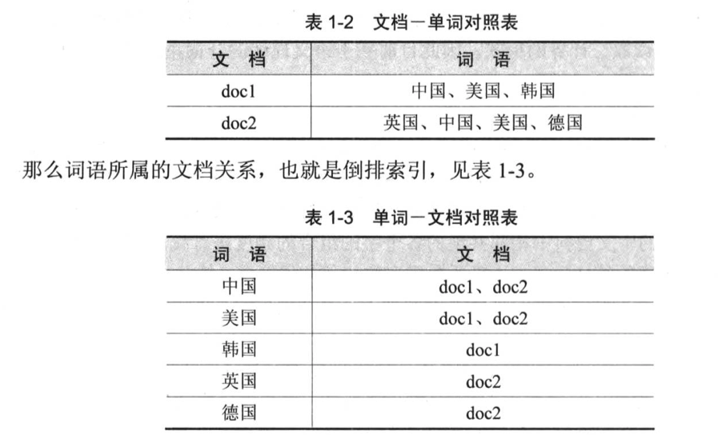
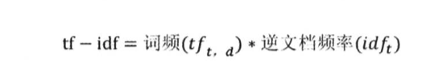

# 1.信息检索模型

## 1.1 术语

文档:信息检索的对象

词条化:将字符序列拆分为子序列的过程

词项:拆分后的词

词项-文档关联矩阵 倒排矩阵

## 1.2 分词算法

词典匹配 将输入的字符串与机器字典词条匹配 需要提供词典

语义理解 模拟人脑对语句的理解

词频统计 词通常是稳定的字的组合，相邻的字搭配出现的频率高，则说明可能是一个固定的词

分词算法直接可以相互配合

## 1.3 倒排索引

也称反向索引

记录词在哪些文档中出现

## 1.4 布尔检索模型

利用AND、OR、NOT将检索词连接起来，形成布尔表达式

NOT>AND>OR

优点：

1. 与思维习惯一致、表达直观清晰
2. 方便扩检与缩检，只需增加逻辑与/或
3. 易于计算机实现

缺点：

1. 只有二元标准，缺乏文档分级(rank)概念，不能对重要性、相关度进行排序
2. 没有反应概念之间内在的语义联系，难以将查询需求转换为准确的布尔表达式
3. 完全匹配导致结果过少

## 1.5 tf-idf权重计算

如果一个词项在一篇文档中出现的频率很高，那么说明其重要性比较高，但是如果这个词项在文档集中的其他文档中出现的频率也很高，说明可能是通用常见的词

## 1.6 向量空间模型

利用余弦公式得到向量的夹角，夹角越小则说明相似度越高

## 1.7 概率检索模型

给定一个查询，返回的文档能够按照查询和用户需求的相关性得分高低来排序。

# 2.Lucene

