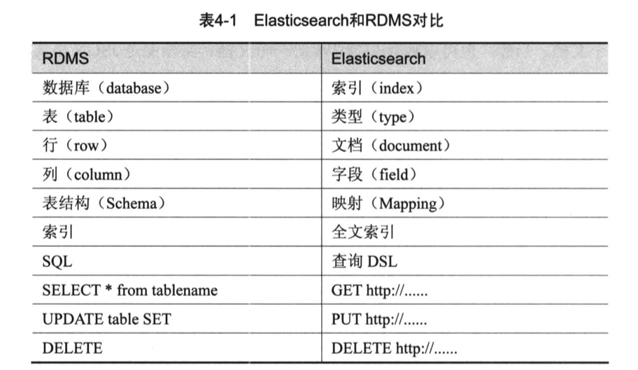
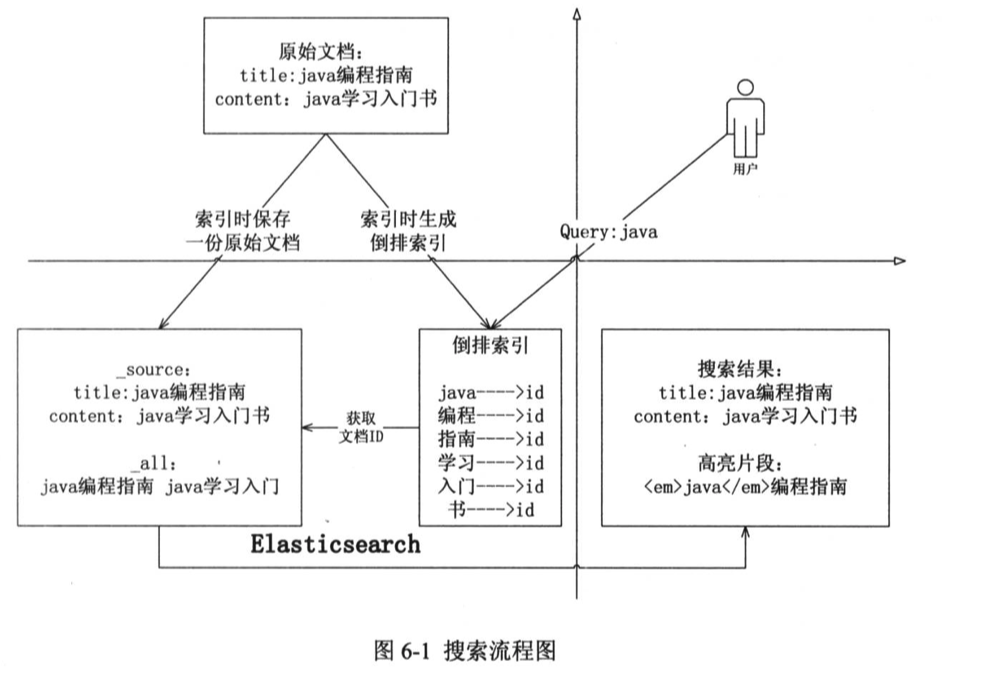
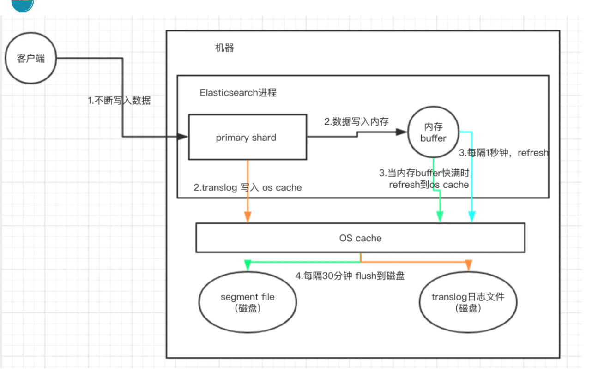

# 1.信息检索模型

## 1.1 术语

文档:信息检索的对象

词条化:将字符序列拆分为子序列的过程

词项:拆分后的词

词项-文档关联矩阵 倒排矩阵


## 1.2 分词算法

词典匹配 将输入的字符串与机器字典词条匹配 需要提供词典

语义理解 模拟人脑对语句的理解

词频统计 词通常是稳定的字的组合，相邻的字搭配出现的频率高，则说明可能是一个固定的词

分词算法直接可以相互配合


## 1.3 倒排索引

也称反向索引

记录词在哪些文档中出现


## 1.4 布尔检索模型

利用AND、OR、NOT将检索词连接起来，形成布尔表达式

NOT>AND>OR

优点：

1. 与思维习惯一致、表达直观清晰
2. 方便扩检与缩检，只需增加逻辑与/或
3. 易于计算机实现

缺点：

1. 只有二元标准，缺乏文档分级(rank)概念，不能对重要性、相关度进行排序
2. 没有反应概念之间内在的语义联系，难以将查询需求转换为准确的布尔表达式
3. 完全匹配导致结果过少


## 1.5 tf-idf权重计算

如果一个词项在一篇文档中出现的频率很高，那么说明其重要性比较高，但是如果这个词项在文档集中的其他文档中出现的频率也很高，说明可能是通用常见的词


## 1.6 向量空间模型

利用余弦公式得到向量的夹角，夹角越小则说明相似度越高


## 1.7 概率检索模型

给定一个查询，返回的文档能够按照查询和用户需求的相关性得分高低来排序。


# 2.Lucene

一个开源的全文检索引擎工具包

是ES的底层核心 使用Java编写

核心步骤：

1. 查询分析
2. 分词技术
3. 关键词检索
4. 搜索排序

提供功能：

1. 搜索排名
2. 多种查询类型：短语、通配符、近似、范围等
3. 字段级别搜索
4. 高亮
5. 可选排序模型，包括向量空间模型和概率检索模型（BM25）

……

# 3.ElasticSearch

## 3.1核心概念

 **Near Realtime**

近实时，有两层意思：

- 从写入数据到数据可以被搜索到有一个小延迟（大概是 1s）
- 基于 es 执行搜索和分析可以达到秒级

**Cluster 集群**

集群包含多个节点，每个节点属于哪个集群都是通过一个配置来决定的，对于中小型应用来说，刚开始一个集群就一个节点很正常。

**Node 节点**

Node 是集群中的一个节点，节点也有一个名称，默认是随机分配的。默认节点会去加入一个名称为 `elasticsearch` 的集群。如果直接启动一堆节点，那么它们会自动组成一个 elasticsearch 集群，当然一个节点也可以组成 elasticsearch 集群。

**Document & field**

文档是 es 中最小的数据单元，一个 document 可以是一条客户数据、一条商品分类数据、一条订单数据，通常用 json 数据结构来表示。每个 index 下的 type，都可以存储多条 document。一个 document 里面有多个 field，每个 field 就是一个数据字段。

```
{
    "product_id": "1",
    "product_name": "iPhone X",
    "product_desc": "苹果手机",
    "category_id": "2",
    "category_name": "电子产品"
}
```

**Index**

索引包含了一堆有相似结构的文档数据，比如商品索引。一个索引包含很多 document，一个索引就代表了一类相似或者相同的 ducument。

**Type**

类型，每个索引里可以有一个或者多个 type，type 是 index 的一个逻辑分类，比如商品 index 下有多个 type：日化商品 type、电器商品 type、生鲜商品 type。每个 type 下的 document 的 field 可能不太一样。

**shard**

单台机器无法存储大量数据，es 可以将一个索引中的数据切分为多个 shard，分布在多台服务器上存储。有了 shard 就可以横向扩展，存储更多数据，让搜索和分析等操作分布到多台服务器上去执行，提升吞吐量和性能。每个 shard 都是一个 lucene index。

**replica**

任何一个服务器随时可能故障或宕机，此时 shard 可能就会丢失，因此可以为每个 shard 创建多个 replica 副本。replica 可以在 shard 故障时提供备用服务，保证数据不丢失，多个 replica 还可以提升搜索操作的吞吐量和性能。primary shard（建立索引时一次设置，不能修改，默认 5 个），replica shard（随时修改数量，默认 1 个），默认每个索引 10 个 shard，5 个 primary shard，5个 replica shard，最小的高可用配置，是 2 台服务器。

shard 分为 primary shard 和 replica shard。而 primary shard 一般简称为 shard，而 replica shard 一般简称为 replica。

## 3.2搜索流程



## 3.3 分片

ES的一个索引可以拆分为多个分片，每个分片存储部分数据，分布在不同的节点上，同时每个分片又有主分片和副本分片，主分片负责写入数据，写入后同步到其他副本分片中，主分片与副本分片存在选举机制。

和ZK的设计理念类似，但是不同的是，ZK只有leader对外提供读写，而ES的follower也可以对外提供读。

## 3.4 并发控制

ES使用乐观锁机制，通过控制版本号字段来进行并发控制。

## 3.5 读写流程

写文档：

1. 客户端选择一个ES节点发送请求，这个节点成为协调节点
2. 协调节点对文档进行路由，**路由规则为hash**，找到这个文档应该存储到哪一个分片
3. 协调节点将请求转发给应存储到的分片的主分片所在的节点，由该节点处理实际处理请求
4. 主分片所在节点处理后，将数据同步到他的所有副本分片
5. 协调节点发现主分片和副本分片均处理完毕后，返回响应至客户端


读文档：

1. 客户端发送请求到任意一个节点，该节点成为协调节点
2. 协调节点对文档ID进行路由，**路由规则与写文档时一致** ，找到这个文档所在的分片
3. 找到文档所在的分片后，这个分片有包括主分片和副本分片在内的多个副本，会使用负载均衡算法在这些副本（包括主分片）中选择一个节点
4. 被选择的节点返回文档给协调节点
5. 协调节点返回文档给客户端


搜索过程：

1. 客户端发送请求到任意一个节点，该节点成为协调节点
2. 协调节点进行分词等操作后，去查询索引的所有分片（假如这个索引有5个分片，每个分片有1主3副，那么一共有20个节点，对于每个分片，会在4个节点中负载均衡选一个来处理，也就是一共有5个节点来处理请求）
3. 每个接收到请求的节点，将满足查询条件的数据找出N个，N为客户端请求的记录数，也就是说任意一个节点的请求数量都能满足全局的请求数量，返回给协调节点，此时并不是返回整个文档，只是返回关键数据如doc_id、相关度优先级等
4. 协调节点得到这些返回的数据后，进行全局排序，截取前N个数据的doc_id
5. 协调节点根据doc_id，再次请求对应的分片（再次负载均衡），得到全量数据
6. 协调节点返回结果至客户端

## 3.6 写数据底层原理

1）先写入buffer，在buffer里的时候数据是搜索不到的；同时将数据写入translog日志文件。
 2）如果buffer快满了，或者到一定时间，就会将buffer数据refresh到一个新的segment file中，但是此时数据不是直接进入segment file的磁盘文件的，而是先进入os cache的。这个过程就是refresh。
 每隔1秒钟，es将buffer中的数据写入一个新的segment file，每秒钟会产生一个新的磁盘文件，segment file，这个segment file中就存储最近1秒内buffer中写入的数据。
 但是如果buffer里面此时没有数据，那当然不会执行refresh操作咯，每秒创建换一个空的segment file，如果buffer里面有数据，默认1秒钟执行一次refresh操作，刷入一个新的segment file中。
 操作系统里面，磁盘文件其实都有一个东西，叫做os cache，操作系统缓存，就是说数据写入磁盘文件之前，会先进入os cache，先进入操作系统级别的一个内存缓存中去。
 只要buffer中的数据被refresh操作，刷入os cache中，就代表这个数据就可以被搜索到了。

为什么叫es是准实时的？NRT，near real-time，准实时。默认是每隔1秒refresh一次的，所以es是准实时的，因为写入的数据1秒之后才能被看到。

可以通过es的restful api或者java api，手动执行一次refresh操作，就是手动将buffer中的数据刷入os cache中，让数据立马就可以被搜索到。

只要数据被输入os cache中，buffer就会被清空了，因为不需要保留buffer了，数据在translog里面已经持久化到磁盘去一份了




丢数据问题：

1.写入某个主分片
2.主分片写入内存buffer(es进程内)
3.写translog到os cache
4.内存buff每隔1秒refresh到os cache中
5.translog不断变大 达到一定阈值触发commit操作 先把buffer中的数据refresh到oscache 清空buffer 然后将一个commit point写入磁盘文件 里面标识这个commit point对应的所有segmentfile 然后强行将os cache中目前所有数据写入磁盘 清空现有translog 这一操作也叫flush操作
6.translog也会先写入os cache 默认5秒刷入磁盘 **所以可能会丢失5秒的数据**


对于删除和更新

删除实际上是在commit的时候生成一个.del文件，里面将doc表示为删除状态，而不是实际删除，在将多个segmentfile合并时会实际删除被标识的doc
更新操作是先标识删除然后写入一条新的

## 3.7 性能优化

1. OS cache如果够大，那么很多索引会在内存中，查询速度快
2. 文档的数据可以只存需要用来检索的**少数字段**，其他放在mysql/hbase里面
3. 数据预热，热点数据进入OS cache
4. 冷热分离，冷热数据索引层面分开，然后放在不同的机器，这样可以让OS cache的热数据尽量不被冷数据冲刷掉
5. 避免深度分页，深度分页会让每个分片都去查大量数据，性能很差，可以改为下拉翻页，不允许指定页数
6. 合理设置分片数和副本数

