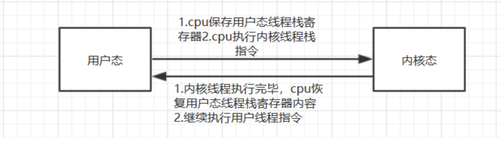

# 用户态与内核态

进程可以分为两种类型，一是操作系统自身运行时的内核类进程，即**操作系统进程**。另一种进程不是操作系统自身的进程，而是用户自己启动的程序产生的进程，即**用户进程**。

操作系统自身也是一个程序，操作系统启动后，会产生很多的内核进程在后台工作，这些内核进程都非常重要，是保证操作系统正常运行的必要进程，比如负责调度类的进程（管理CPU资源的进程），内存管理类进程（分配和回收内存的进程）等。

这些对硬件资源进行调度的权限是至关重要的，只有操作系统能够拥有这种权限，用户进程是不可以进行这些操作的。

**进程必须通过CPU来执行**，而操作系统进程的重要程度远远大于用户进程，所以必须保证操作系统进程在任何需要执行的时候，获得CPU的控制权。

总结一下两点：

1.操作系统要拥有最高的权限，其他用户进程都不能拥有这些权限。

2.操作系统要在任何有需要的时候暂停CPU正在执行的某个进程，让自己拿到CPU的控制权。

**要让操作系统具备最高权限，并让用户进程不具备最高权限，CPU提供了两种运行模式：内核模式和用户模式。**

内核模式和用户模式这两种进程状态是CPU提供的控制，而不是操作系统提供的。在CPU中一个称为PSW（program status word，程序状态字）的寄存器中保存了和进程有关的一些控制位，例如内核模式和用户模式的进程状态。

这两种模式描述了进程的工作状态，是工作在内核模式下还是工作在用户模式下。在内核模式下，表示具备了最高权限，操作系统自身进程都是工作在内核模式下；在用户模式下，**执行的代码将受到一些限制**，用户进程都是工作在用户模式下，该模式下的进程**不能执行一些关键性的操作**，比如用户进程必须不能让它自己也变成内核态进程工作在内核模式下，这样的话，权限的限制就没有意义了。

工作在这两种状态下的进程也称为内核态进程和用户态进程。通常，为了在描述问题时区分内核模式和用户模式的进程，也会把这两种模式称为用户空间和内核空间。

如何保证在需要的时候，能够立即切换回操作系统呢？

通过中断

# 中断

要想在任何需要的时候回到操作系统，这相当于是改变了CPU的正常执行流程，所以一个非常熟悉的字眼——中断（Interrupt）就出现了。通过中断，可以保证回到操作系统，从而将CPU的控制权交给操作系统。

中断的字面意思就是打断正常执行流程，但是注意，它表示的是打断流程而不是终止流程，这是不同的概念。中断是操作系统中非常重要的机制，正如上面所描述的：中断用于保证CPU控制权交给操作系统，从而让操作系统可以执行某些操作。

中断分为硬件中断和软件中断。

任何硬件，都有自己的IRQ（中断请求），都可以在需要的时候通过总线向CPU发送硬件中断通知。比如时钟中断，当进程执行耗光时间片时将产生一个时钟中断，使得能够立刻进入操作系统并调度下一个要执行的进程，时钟中断是操作系统具有安全感的保证，只要时钟开始运行后，就意味着操作系统最终总能够获取到CPU控制权。再比如硬盘的IO中断，当硬盘读取所请求的数据完成后，就会发送硬盘IO中断，CPU接到该中断后就会切换到操作系统，让操作系统去处理这个中断事件。

软件也可以发送中断，比如请求一个系统调用（system call），关于系统调用，后面再介绍。

无论是软中断还是硬件中断，最终的目的都是为了回到操作系统，将CPU交给操作系统。那么，中断是如何回到操作系统的呢？换句话说，中断时是如何进入内核态的呢？内核态又如何回到用户态呢？

要进入内核态只需执行特殊的指令即可，一般称之为trap指令，这个单词的意思是“陷阱”，所以进入内核态也被称为”陷入内核态“

当操作系统的相关指令执行完毕之后，同样通过执行特殊的指令回到用户态，一般称之为return-from-trap指令。

中断既然是打断CPU的执行流程，那么可能需要重新回到中断点继续正常的执行流程。所以，在发生中断时，需要保存好中断点以及相关的一些状态，以便能够在处理完中断后恢复执行流程继续向下执行。

所以，中断就像是突发事件，处理完成后如果恢复到断点处，那么对整个流程来说，中断就像是从未发生过的事一样，但却实实在在的被处理了。但是，中断后并不一定会恢复到断点处，因为中断处理程序可能会在恢复断点前直接退出这个执行流程，比如有些硬件中断表示一些异常现象（比如除0异常），这些异常可能会导致终止进程。

# 系统调用

用户进程工作在用户态，它是受限的，很多涉及到硬件的操作都无法执行，但是它们又想要取得结果，就只能请求工作在内核态的操作系统帮助完成这些操作，并将操作结果交给用户进程。

系统调用（system call）就是操作系统提供给用户进程请求操作系统做一些特权操作的接口，即为用户进程提供服务的窗口。在Linux下可以通过man syscalls命令查看Linux提供的所有系统调用。

理解系统调用其实很简单，比如有一个程序想要读取a.log文件（例如head -n 1 a.log），读取之前必须先打开文件，但是用户进程是没有权限打开文件的，所以用户进程只能发送一个open()的系统调用请求操作系统去帮忙打开这个文件，操作系统打开这个文件后会将打开的结果——文件描述符交给用户进程，用户进程通过这个文件描述符就能去操作这个文件。再进一步，用户进程想要从这个打开的文件中读取一行数据，用户进程是没有权限读取文件的，只能发送一个read()系统调用请求操作系统去读取这一行数据，操作系统读取这行数据后就能交给用户进程。

不难发现，系统调用open()和read()都像是函数。其实它们确实都是函数，只不过是比较特殊的由操作系统提供的，一般是由汇编语言编写或参杂了部分汇编代码，因为它们要和硬件交互。

系统调用后的主要过程：

1.发起系统调用，请求操作系统帮忙执行某些操作，这会产生软中断；
2.软中断导致陷入内核，CPU控制权交给操作系统，操作系统处理中断，即执行被请求的操作；
3.如果一切正常，操作系统在完成操作后会恢复到断点处继续向下执行，这会回到用户态；
4.用户进程取得操作系统操作的成果，继续向下执行。

# 内核态与用户态切换消耗

1、切换线程上下文，需要保护和恢复寄存器数据

2、切换到执行内核线程的时候，内核代码对用户不信任，需要进行额外的检查。

3、内核线程执行完返回过程有很多额外工作，比如检查是否需要调度等

4、如果被切换的线程属于不同用户程序间切换的话，那么还要更新cr3寄存器，这样会更换每个程序的虚拟内存到物理内存映射表的地址

# 零拷贝

简单说明：

假设从文件1读，然后写入到文件2:

传统的拷贝需要经过
io设备1->内核空间->用户空间->内核空间->io设备2

从上面的流程可以看到内核->用户,用户->内核，这两次复制多余了。所谓的零拷贝，就是不经过用户空间，直接变成:
io设备1->内核空间->内核空间->io设备2

这样子除了节省了一次拷贝的时间，还避免了用户模式和内核模式切换的时间，也让cpu有了更多空闲。

在jdk1.4之后的transferTo方法就是零拷贝的实现。
所以下次两个文件之间的复制，或者文件到socket的复制，应该想到使用transferTo方法。

# 参考资料

1.https://www.junmajinlong.com/os/index/

2.https://zhuanlan.zhihu.com/p/100014103