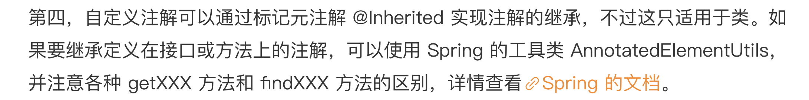

​	

https://github.com/JosephZhu1983/java-common-mistakes


# 1.使用了并发工具类库，线程安全就高枕无忧了吗

1.ThreadLocal内存泄漏，原因是tomcat线程复用，快速复现可以通过设置tomcat核心线程数为1，解决方案在finally代码块中显式清除threadlocal中的数据

2.ConcurrentHashMap只能保证提供的原子性读写操作是线程安全的，对于如putAll这样的聚合操作仍是线程不安全的，在多线程环境下需要加锁

3.利用ConcurrentHashMap的computeIfAbsent（底层为CAS）来做符合逻辑操作，这虽然不是原子性操作，但是是线程安全的，配合LongAdder可以用于多线程环境下的计数器

4.CopyOnWriteArrayList虽然是线程安全的ArrayList，但是其实现方式是：每次修改数据时都会复制一份数据出来，这样读数据时不需要加锁，并保证数据最终一致性，所以有明显的适用场景即读多写少，或者强调无锁读的场景，在大量写的场景时会严重影响性能


# 2.代码加锁：不要让“锁”事成为烦心事

1.在业务代码中加锁，除了考虑锁的粒度，还可以从以下角度优化：

- 对于读写比例差异明细的场景，考虑使用ReentrantReadWriteLock细化区分读写锁
- 考虑使用StampedLock的乐观锁特性
- 不要轻易开启公平锁特性，会影响性能

2.业务逻辑中有多把锁时要考虑死锁问题，通常的规避方案是避免无限等待（如设置等待时间上限）和循环等待（如给获取锁排序）


# 3.线程池：业务代码最常用也最容易犯错的组件

1.线程池的声明需要手动进行，newFixedThreadPool的工作队列使用了一个无界队列，在任务较多且执行慢的情况下，队列会快速挤压，导致OOM；而newCachedThreadPool会无限制的创建工作线程，同样会导致OOM


2.线程池默认的工作行为：

- 不会初始化corePoolSize个线程，而是有任务来了才创建工作线程
- 当核心线程满了之后不会立即扩容线程池，而是把任务堆积到工作队列中
- 当工作队列满了后扩容线程池，直到线程个数达到maximumPoolSize
- 如果队列已满并已达到最大线程数后还有任务进来，按照拒绝策略处理
- 当线程数大于核心线程数时，线程等待keepAliveTime后还是没有任务需要处理的话，收缩线程到核心线程数

也可以通过一些手段来改变这些默认行为 如：

- 声明线程池后立即调用prestartAllCoreThreads方法来启动所有核心线程
- 传入true给allowCoreThreadTimeOut方法，让核心线程同样在空闲时间被回收

线程池总是先用工作队列来存放来不及处理的任务，满了之后再扩容线程数，当工作队列设置的很大时，最大线程数这个参数基本不起作用，因为队列很难满，或者满了再去扩容已经于事无补，但是把工作队列设置的很小时，可能又很容易触发拒绝策略


可以改造线程池来实现：优先开启更多的线程，而把队列当做后备方案

大致思路：

- 由于线程池在工作队列满了的情况下无法入队，会扩容线程池，那么可以重写队列的offer方法，造成这个队列已满的假象
- 由于重写了这一方法，在达到最大线程数线程池会触发拒绝策略，所以需要自定义一个拒绝策略，这个时候再把任务真正插入队列

**tomcat中就有类似的实现**


3.明确线程池是否需要复用，还是每次业务逻辑开始，就开启一个线程池，这种方式是较为不合理的，通常情况下线程池都是复用的

​	

4.复用线程池不代表始终使用同一个线程池，可以根据任务的性质来选用不同的线程池，IO密集型任务和CPU计算密集型任务的偏好是不同的

- 对于IO密集任务，可以考虑更多的线程数，而不需要太大的队列
- 对于CPU密集任务，线程数量不宜过多，可以设置为CPU核心数量左右的线程数量，需要较长的队列来做缓冲

如果希望减少任务间的互相干扰，考虑按需使用隔离的线程池


5.监控线程池是非常重要的


# 4.连接池：别让连接池帮了倒忙

1.鉴别客户端SDK是否基于连接池，如果SDK没有使用连接池，而是直接使用TCP连接，首先会有较大的开销，其次因为TCP基于字节流，在多线程环境下若对同一连接进行复用，可能会产生线程安全问题

- 连接池和连接分离的API：通过一个XXXPool获得XXXConnection
- 内部带有连接池的API：对外提供一个XXXClient类，这个类内部维护了线程池，使用时无需考虑连接的获取和归还
- 非连接池的API：一般命名为XXXConnection，每次使用需要创建和断开连接，且通常是线程不安全的，使用时可以考虑自己封装一个线程池


2.多线程使用Jedis时，如果复用Jedis对象，其实是复用底层的RedisOutPutStream来写入命令，无法保证整条命令以一个原子操作写入Socket，也无法确保写入、读取前没有其他数据写到远端，应该通过Jedis提供的线程安全的类JedisPool来获取Jedis实例，JedisPool可以声明为static在多个线程之间共享，扮演连接池的角色，使用时通过try-with-resources从JedisPool获取和归还Jedis实例。


3.程序退出时，可以通过shutdownhook在程序退出之前关闭连接池资源


4.使用池时，一定要复用池，否则其使用代价会比每次创建单一对象更大，复用方式可以把XXXClient声明为static，只创建一次，并且在JVM关闭前通过addShutDownHook钩子关闭连接池


5.在Spring中可以把XXXClient资源定义为Bean，通过@PostConstruct和@PreDestory来加载和释放资源


6.合理配置连接池参数


# 5.HTTP调用：你考虑到超时、重试、并发了吗？

1.网络请求需要考虑的三点：

- 框架设置的默认超时是否合理
- 考虑到网络的不稳定，可以在超时后进行重试，但是需要考虑接口的幂等性设计
- 考虑框架是否会想浏览器一样限制并发连接数，以免在高并发情况下HTTP调用的并发限制成为瓶颈


对于HTTP调用，虽然应用层走的是HTTP协议，但网络层面始终是TCP/IP协议，作为一个面向连接的协议，在传输数据前需要建立连接，几乎所有的网络框架都会提供这样两个超时参数：

- 连接超时参数ConnectTimeout，让用户配置建立连接的最长等待时间
- 读取超时参数ReadTimeout，从Socket上读取数据的最长等待时间


**对于第一个参数：连接超时参数，需要注意以下点：**

1. 连接超时参数不需要配置的特别长，一般来说TCP三次握手的时间在毫秒级到秒级，如果很久无法建立连接，可能是网络或者防火墙的配置问题，这种情况下如果几秒没连上，那么可能永远也连不上了，所以这个参数可以设置到1~5秒，失败时也可以快速失败
2. 排查连接超时问题，要搞清楚连接的是哪里，主要注意的是如果使用了nginx反向代理，那么实际上客户端连接的是nginx而不是服务端


**对于第二个参数：读取超时参数，需要注意以下点：**

1. 出现了读取超时，服务端的执行并不会中断
2. 读取超时并不只是数据传输的最长耗时，实际上其中的（绝大部分）时间，都是服务端处理业务逻辑的时间
3. 对于同步调用，如果超时时间很长，那么在等待服务端返回数据的同时，客户端（通常是Tomcat线程）也在等待，当下游服务出现大量超时的情况，客户端也会被迫创建大量线程，可能崩溃，对于定时任务/异步任务来说，读取超时参数可以配置的长一些，而对于面向客户响应或者是微服务的同步接口调用，通常不会设置超过30s的读取超时，针对不同的下游服务的处理时间不同，可能还需要为不同的服务端接口设置不同的客户端读取超时时间


**Feign和Ribbon的超时时间知识点：**

1. 默认情况下Feign的读取超时是1s，有点短
2. 要配置Feign的读取超时，就必须同时配置连接超时参数，才能生效
3. 针对单独的Feign Client设置超时时间，可以覆盖全局的超时
4. 除了配置Feign的超时参数，也可以配置Ribbon的超时参数，同时配置的话以Feign为准


**Ribbon的自动重试请求：**

Ribbon对于Get请求，在出现问题时（如读取超时），Ribbon会自动重试一次


**并发限制了爬虫的抓取能力**

1.对于Java自带的HttpClient，他对于同一个主机/域名的最大并发请求数为2，这个默认值太小，可能会限制效率

2.主机整体最大并发数为20，也就是HttpClient整体的并发度


# 6.20%的业务代码的Spring声明式事务，可能都没处理正确

1.注意Spring事务的生效规则

- @Transactional注解除非在特殊配置（如使用AspectJ静态织入实现AOP），否则**只有定义在public方法上的@Transactional才能生效**，原因是Spring默认通过动态代理的方式实现AOP，而private方法无法被代理到，Spring自然也无法动态增强事务处理逻辑
- **必须通过代理过的类 从外部 调用目标方法才能生效** 如果在本Service中使用一个未打注解的方法调用一个打事务注解的方法，事务无法生效，因为通过this自调用，是没有机会走到Spring的代理类的，可以用注入自身的例子来尝试，注入自身实际上注入的是代理类


2.注意事务生效后回滚的规则

- 只有异常**传播出了**被标记@Transactional注解的方法，事务才能回滚，如果希望自己捕获异常进行处理，那么异常就不会被传播出方法，此时应该在catch代码块中使用TransactionAspectSupport.currentTransactionStatus().setRollbackOnly()方法来手动回滚
- 默认情况下，出现RuntimeException（非受检异常）或Error时，Spring才会进行回滚，可以通过设置@Transactional(rollbackFor = Exception.class)来使遇到所有异常都回滚事务


3.如果涉及多次数据库操作，并希望将它们作为独立的事务进行提交或回滚，需要进一步细化配置事务传播方式，也就是@Transactional注解的Propagation属性


# 7.数据库索引：索引并不是万能药

1.InNoDB是如何存储数据的

以页为单位保存在磁盘中，页大小一般为16KB

各个数据页组成一个双向链表，每个数据页的记录按照主键顺序组成单向联表，每个数据页中有一个页目录，可以通过页目录进行二分查找，页目录通过槽把记录分成不同的小组，槽指向小组的第一条记录


2.聚簇索引和二级索引

**聚簇索引**

叶子节点会保存数据，由于数据在物理上只会保存一份，所以包含实际数据的聚簇索引只有一个，默认情况下会使用主键作为聚簇索引的索引键，没有主键则会使用第一个不包含NULL值的唯一列


**二级索引**

为了实现非主键字段的快速搜索，引出了二级索引，也叫做非聚簇索引/辅助索引，同样使用B+树，索引键是自定义的业务属性，而叶子节点中存储的不再是实际数据，**而是主键**，获取主键值后再去聚簇索引中获得数据行，这一过程叫做**回表**


3.额外创建二级索引的代价

- 维护代价：N个二级索引就是N棵B+树，对数据的增删改还要修改这N个二级索引
- 空间代价：占用N棵树的空间
- 回表代价：只使用二级索引无法找到数据，还是需要通过聚簇索引来回表


如果索引本身包含需要查询的所有数据列，那么就不需要回表就可以拿到需要的所有数据，这种情况叫做**覆盖索引**


4.关于索引开销的最佳实践

- 不需要一开始就创建索引，而是明确业务场景/数据量足够大导致查询变慢时在针对需要的字段创建索引
- 尽量索引轻量级的字段，比如可以索引int字段就不要索引varchar字段，索引字段也可以是部分前缀，创建索引的时候指定字段索引的长度
- 不要使用SELECT * ，而是只取出必要的字段，可以考虑使用联合索引来做覆盖索引，避免回表


5.索引失效的情况分析

- 索引只能匹配列前缀，比如使用LIKE的时候，搜索指定后缀的情况无法走索引，指定前缀则可以走索引，所以如果希望按照后缀搜索也走索引的话，可以把数据反过来存，用的时候再倒过来
- 条件涉及函数操作无法走索引
- 联合索引只能匹配左边的列，优化器会把多个where条件按照索引顺序排序，但是范围查询会使联合索引断开，这是因为在一个范围值确定后，后面的记录等同于全表扫描了


6.数据库基于成本决定是否走索引

Mysql在查询数据之前，会对多种可能的方案做执行计划，然后对成本分析决定走哪一个计划

成本主要包括IO成本和CPU成本

- IO成本指的是从磁盘把数据加载到内存的成本，默认情况下读取1个数据页的成本为1	
- CPU成本是判断数据与条件是否相等的CPU操作的成本，默认情况下为0.2

MySQL会存储行数和数据长度（用于计算页数量）来计算全表扫描的成本

MySQL选择索引，并不是按照where条件中列的顺序进行的

同样即使列有索引，甚至可能有多个索引方案，MySQL也可能不走索引


# 8. 判等问题：程序里如何确定你就是你？


对于自定义类型，如果类型需要参与判等，那么需要同时实现equals和hashCode方法，并确保逻辑一致

默认的hashCode方法是native方法

```javascript
Thread state combined with xorshift (https://en.wikipedia.org/wiki/Xorshift)
```

生成一个线程状态和随机数的结合

如果要自定义hasiCode，可以直接使用Objects.hash方法来实现，也可以通过IDE的代码生成功能或者Lombok来生成

如果类型也要参与比较，那么compareTo方法的逻辑同样需要和equals、hashCode方法一致


Lombok的@EqualsAndHashCode注解实现equals和hashCode的时候，默认使用所有非static、非transient的字段，且不考虑父类，可以使用@EqualsAndHashCode.Exclude来排除一些字段，并设置callSuper = true来让子类的equals和hashCode调用父类的相应方法


# 9. 数值计算：注意精度、舍入和溢出问题

1.直接使用浮点数参与运算会丢失精度


**2.使用BigDecimal表示和计算浮点数，务必使用字符串的构造方法来初始化BigDecimal**，如果只有Double类型的话，可以使用BigDecimal.valueOf方法


3.**浮点数的字符串格式化也要通过BigDecimal进行**


4.**对于BigDecimal，如果用equals来做判等，会比较小数位长度，比如1.0和1是不相等的**，可以用compareTo方法来比较value，

这一点在使用HashSet/HashMap的时候也会出现问题，解决办法有两个

- 使用TreeSet方法替换HashSet，TreeSet不使用hashCode和equals来比较元素，而是使用compareTo
- 把BigDecimal存入HashSet或HashMap前，先试用stripTrailiingZeros去掉尾部的0，比较的时候也去掉


5.注意数值溢出问题，超过int/long等最大值

- 用Math类的addExact/subtractExact等方法进行数值运算，这些方法会在数值溢出时主动抛出RuntimeException
- 使用大数类BigInteger


# 10. 集合类：坑满地的List列表操作

1.不能直接使用Arrays.asList来转换**基本类型数组** 可以把它转换为包装类的数组 或是使用Arrays.stream(int数组).boxed().collect(Collectors.toList())


2.**使用Arrays.asList返回的List不支持增删操作，并且对元素的修改会影响原数组**，这是因为Arrays.asList返回的List并不是java.util.ArrayList，而是Arrays的内部类ArrayList，这个内部类不支持增删操作，并且直接使用了原始的数组，所以对这个ArrayList的修改会影响到原数组，修复的方式就是用一个new ArrayList(Arrays.asList(xxx))来重新初始化一个ArrayList


3.subList方法切片，所返回的subList相当于原始List的视图，对它的操作会影响原始List，并且会导致原始List不被回收，解决方案：

- 使用List subList = new ArrayList<>(list.sublist(1,2))的方法构建独立的ArrayList
- 使用Stream的skip和limit来实现sublist的目的


4.想当然的认为链表适合元素增删的场景，而选用LinkedList作为数据结构，在真实场景中读写增删一般是平衡的，而且增删不可能只对头尾对象进行操作，如果对中间位置进行增删，是要先拿到这个位置的元素的指针的，而这个操作同样是O(n)的，所以链表的性能不一定优于ArrayList


5.对List迭代中进行remove操作，应该使用迭代器来进行迭代，并使用迭代器的remove方法，否则会抛出异常


# 11.空值处理：分不清楚的null和恼人的空指针

Arthas 阿尔萨斯 生产环境的Java错误排查工具

# 12.异常处理：别让自己在出问题的时候变为瞎子

1.框架的全局异常捕获，应该只在最上层（Controller层）进行兜底，给出友好的提示，业务层的异常还是最好自己处理

2.finally代码块中若出现异常，则会覆盖try代码块中的异常，或者使用addSuppressed方法将finally代码块中的异常附加到try的原异常中

3.对于线程池中出现的异常，如果通过execute方法执行，那么异常会导致线程退出，造成大量线程重复创建，如果通过submit方法提交，那么应该使用Future的get方法获取结果和异常，否则异常就会被生吞

4.对于实现了Closeable接口的资源，应使用tyr with resources方法来获取资源


# 13.日志：日志记录真没你想象的那么简单


# 14.文件IO：实现高效正确的文件读写并非易事

1.文件读写要确定字符编码一致


2.使用Files.readAllLines读取文件，会放到一个List<Stirng>中返回，当文件足够大时就会OOM，此时应该使用Files.lines方法，它返回的是一个Stream，可以通过limit来控制每次读的量，**但是要注意的是**，要使用try with resources来包裹获取Stream的代码，否则不会释放资源


3.进行文件字节流操作的时候，一般情况下不考虑进行逐字节操作，使用缓冲区进行批量读写减少IO次数，性能会好很多，一般可以考虑直接使用缓冲输入输出流BufferedXXXStream，追求极限性能的话可以考虑使用FileChannel进行流转发，即使用FileChannel.transFreTo，在一些高版本的操作系统上，可以实现DMA（直接内存访问），也就是数据从磁经过总线直接发送到目标文件，无需经过CPU和内存


# 17.别以为“自动挡”就不可能出现OOM

内存分析工具MAT

1.遇到HashMap value重复创建时，可以利用HashSet的去重特性

2.在容量评估时，不能认为数据在程序中也是一份，比如各种DTO，POJO，VO

3.WeakHashMap的实现是Key在哈希表内部是弱引用的，垃圾回收器只要扫描到了弱引用就会把它加入GC队列，但如果Value中有对key对象的强引用，依然会导致无法被GC，Spring提供了ConcurrentReferenceHashMap类，可以使用弱引用和软引用做缓存，Key和Value同时被包装为弱引用/软引用

4.Tomcat的max-http-header-size参数会导致一个请求使用很大的内存，请求里很多时可能导致OOM

5.XX:+HeapDumpOnOutOfMemoryError -XX:HeapDumpPath=. -XX:+PrintGCDateStamps -XX:+PrintGCDetails -Xloggc:gc.

详细的gc日志和dump现场


# 18.当反射、注解和泛型遇到OOP时，会有哪些坑？

1.反射的getMethods和gerDeclaredMethods前者可以查询到父类方法，后者只能查询到当前类

2.反射进行方法调用时要注意过滤桥接方法，会出现在泛型擦除发生时

3.


# 19.Spring框架：IoC和AOP是扩展的核心

IOC：相比于解耦和方便，更重要的是IOC带来了更多的可能性，如果以容器来依托管理所有的框架、业务对象，那我们不仅可以无侵入地调整对象的关系，还可以无侵入地随时调整对象的属性，甚至是实现对象的替换，带来的可能性是无限的。比如我们要监控的对象如果是Bean，实现就会非常简单。


AOP：体现了松耦合，高内聚的精髓，在切面集中实现横切关注点（缓存、权限、日志等），然后通过切点配置把代码注入到合适的地方。


让Spring容器管理对象，要考虑对象默认的Scope单例是否合适，对于有状态的类型，单例可能产生内存泄漏问题


如果要为单例的Bean注入Prototype的Bean，绝不仅仅是修改Scope属性这么简单，由于单例的Bean在容器启动时就会完成一次性初始化，所以注入的仍是同一个Bean，最简单的解决方案是，把Prototype的Bean设置为通过代理注入，也就是设置proxyMode属性为TARGET_CALSS


如果一组相同类型的Bean是有顺序的，需要明确使用@Order注解来设置顺序


# 20.Spring框架：框架帮我们做了很多工作也带来了复杂度


# 21.代码重复：搞定代码重复的三个绝招

1.借助Spring容器的工厂模式：

抽象类AbstarctXXX 具体的实现基础它

使用时AbstractXXX xxx = (AbstarctXXX)applicationContext.getBean(子类名)

xxx.process即可

子类名的获取用枚举来固定


2.利用属性拷贝工具


3.使用自定义注解


# 22.接口设计：系统间对话的语言，一定要统一


# 23.缓存设计：缓存可以锦上添花也可以落井下石

1.选择合适的Redis过期算法


Key范围+Key算法搭配角度

范围有allkeys和volatile两种

算法有LRU、TTL、LFU三种


从算法角度来说LFU可能优于LRU，因为可能一个使用频率非常低的key恰好在几秒前被用到了一次，而导致了某个使用频率很高但是短时间内恰好没有被用到的key被删除


从Key范围角度来说，allkeys可以确保key即使没有TTL也能回收，如果客户端总是”忘记“设置缓存的过期时间，那么可以使用这个算法，而volatile会更稳妥一些，如果客户端把Redis当做长期缓存使用，只在启动时初始化一次缓存，那么如果用allkeys就可能会出错


2.注意缓存雪崩问题，短时间内大量缓存失效，就会导致数据库压力大

一般由两种可能：

1. 缓存系统挂了
2. 应用层面大量的key在同一时间过期

对于第一种原因，需要依赖高可用配置，不属于缓存设计的问题

对于第二种原因，对于同一批过期的大量key，可以加一点随机延迟，也可以让缓存不主动过期，然后启动一个后台线程，定时把数据库数据更新到缓存


3.缓存击穿问题，某个key属于极端热点数据，如果这个key突然过期，那么会在瞬间出现大量并发请求打到数据库，可以考虑的方案一：使用进程内的锁进行限制，每个节点都最多以一个并发请求数据库，方案二：不使用锁进行限制，而是使用Semaphore的工具限制并发数，限制一定量的线程同时请求数据库


4.缓存穿透问题：原始数据压根不存在，而被恶意请求一个不存在的值，造成数据库压力

，方案一：对于不存在的数据，同样设置一个特殊的Value到缓存中，这样会把大量无效的数据加入缓存。方案二：使用布隆过滤器做前置过滤，如果布隆过滤器认为值不存在，那么一定不存在，无需查询缓存也无需查询数据库。对于极小概率的误判请求，才会最终让非法key走到缓存/数据库。这两个方案也可以同时使用


5.注意缓存数据同步策略

数据库与缓存同步的几种方式：

- 先更新缓存，再更新数据库
- 先更新数据库，再更新缓存
- 先删除缓存，再更新数据库，访问的时候加载数据到缓存
- 先更新数据库，再删除缓存，访问的时候加载数据到缓存


对于方案一：不可行，数据库压力集中，设计复杂，还有超时和事务等原因，更新数据库失败的可能性比更新缓存更大，可能因为数据库更新失败，导致缓存和数据库的数据不一致

对于方案二：不可行，一是如果线程A和B先后完成数据库更新，而更新缓存却是按照B、A的顺序，那么就会导致数据不一致，二是我们并不知道缓存中的数据是否会被访问，不一定要把所有数据都放入缓存

对于方案三：不可行，在并发情况下，可能删除缓存后还没来得及更新数据库，就有另一个线程先读取了旧值，然后加载到了缓存中。

对于方案四：可行，但在极端情况下也会导致数据不一致，但是概率相较其他方案是最低的，极端情况的例子是：更新数据的时间节点恰好是缓存失效的瞬间，这时A先读取到了旧值，然后B操作数据库完成更新并且删除了缓存之后，A再把旧值加入缓存。

需要注意的是，更新数据库后删除缓存的操作可能失败，如果失败则考虑把任务加入延时队列进入延迟重试，确保数据可以删除，缓存可以及时更新，因为删除是幂等操作，所以即使重复删除也没什么问题。

同样需要注意的是，**对于缓存一致性问题，目标是避免长期不一致**，对于方案四，可能出现A线程在更新数据库之后，删除缓存之前，查到了值，那这个值是旧值的情况，这种情况是无法避免的，并且是短期的不一致，下次查询就正常了，如果要保证绝对一致，那么先删除缓存，然后往队列中插入一个数据的修改标识，在标识仍为修改时拒绝查询，那这样还需要保证在删缓存---插入标识之间是原子性的，还要引入锁，**所以既然已经缓存了，要考虑是否真的需要保证绝对一致**。而且在方案中，需要重点考虑的是”正常流程“下的不一致问题，而不是”某一步操作失败“导致的不一致问题，这些问题都是可以修补的。


# 24.业务代码写完，就意味着生产就绪了？

1.使用SpringBootActuaor做健康监测、暴露应用信息和指标健康

比如内部使用的重要线程池


2.Pinpoint全链路追踪

原理：请求进入第一个组件时先生成一个TraceID，作为整个调用链（Trace）的唯一标识，对于每次操作，都记录耗时和相关信息形成一个Span挂在到调用链上，Span和Span之间同样可以形成树状关联，出现远程/跨系统调用时，把TraceID进行透传，最后把数据汇总到数据库，通过UI查看树状调用链


# 25.异步处理好用，但非常容易用错

异步处理主要场景

1. 服务于主流程的分支流程，如在注册流程中，写数据库是主流程，但注册后发送欢迎短信是分支流程，时效性不强
2. 用户不需要实时看到结果的流程，比如下单后的配货，送货流程可以进行异步处理，每个阶段完成后，再给用户发推送或短信

异步处理因为可以有MQ中间件的介入用于任务的缓冲的分发，所以相比于同步处理，在应对流量洪峰、实现模块解耦和消息广播方面有功能优势


**异步处理需要消息补偿闭环**

对于异步处理流程，必须考虑补偿或者说建立主备双活流程


蓝线主线 绿色备线

考虑到极端的MQ中间件失效的情况，需要补偿JOB的处理吞吐能力达到主线的能力水平


**注意消息模式是广播还是工作队列**

对于RocketMQ，如果消费者属于一个组，那么消息只会由同一个组的一个消费者来实现，如果消费者属于不同组，那么每个组都能消费一遍

对于RabbitMQ来说，消息路由采用的模式是队列+交换器，配置比较复杂，RabbitMQ的直接交互器根据routingKey对消息进行路由。

对于工作队列模式，将实例设置为同一个QUEUE即可

对于广播模式，首先都需要接到通知的不同的服务，设置为不同的QUEUE，然后同一服务下的多个实例，用同一个QUEUE即可


**别让死信堵塞了消息队列**

消费者报错会让消息再次进入消息队列，所以消费者抛出AmqpRejectAndDontRequeueException异常可以避免重复进入队列

但是更好的处理方案是对于同一条消息，能先进行几次重试，如果还是不行的话，再把消息投递到专门的一个死信队列，对于死信队列的数据可能只进行报警

SpringAMQP提供了非常方便的解决方案：

- 定义死信交换器和死信队列，他们都是普通的交换器和队列
- 通过RetryInterceptorBuilder构建一个RetryOperationsInterceptor，用于处理失败时候的重试，如果指定规则重试后仍然失败则把消息丢入死信交换器


# 26.数据存储：NoSQL与RDBMS如何取长补短、相辅相成？

NoSQL：可分为缓存数据库、时间序列数据库、全文搜索数据库、文档数据库、图数据库等


**Redis **


一般而言使用Redis都是针对某一个Key来使用，而不能在业务代码中使用keys命令从Redis中搜索数据，这不是Redis的擅长


**InfluxDB**

时序数据库

对包含时间数据的聚合和统计的效率高

无法update数据

必须包含时间戳，数据只与时间戳关联，不适合普通的业务数据


**Elasticsearch**

全文索引


**结合NoSQL和MySQL应对高并发的复合数据库架构**


重要的业务主数据只能保存在MySQL这样的RDBMS中，原因有三：

1. RDBMS已经经过了几十年的验证，非常成熟
2. RDBMS用户数量众多，Bug修复快，版本稳定，可靠性高
3. RDBMS强调ACID，能确保数据完整

有两种类型的查询任务可以交给MySQL来做，性能会比较好

- 按照主键ID的查询，直接查询聚簇索引，其性能会很高。但是当单表数据量超过亿级后，性能也会衰退，而且单个数据库无法承受超大的查询并发，因此可以把数据表进行Sharding操作，均匀拆分到多个数据库实例中保存
- 按照各种条件进行范围查询，查出主键ID，对二级索引进行查询得到主键，主需要查询一颗B+树。但索引的值不宜过大，比如对大varchar索引不太合适，一般对int/bigint这种进行索引性能会更好，因此可以在MySQL中建立一张索引表，除了保存主键外，主要是保存各种关联表的外键，和尽可能少的varchar字段，在这种表的大部分列上建立二级索引


**mongo**

mongo是文档型数据库，以json格式存储，横向扩展只需要增加分片

不支持表的关联查询，对事务支持比较差

对非重要数据，而且数据结构不固定的，插入量又很大的原始数据，比如爬虫原始数据，可以考虑Mongo

