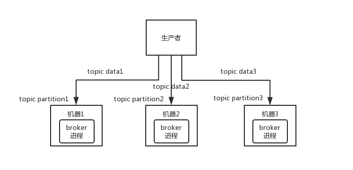
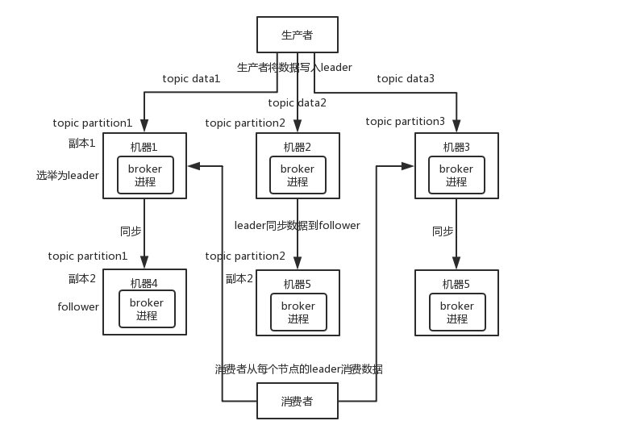
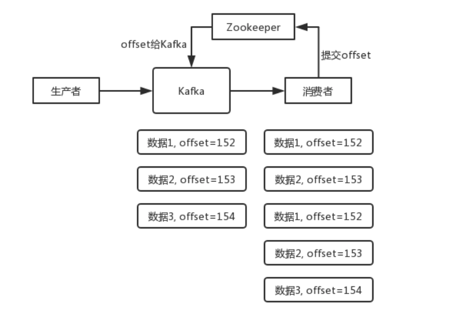

# 1.为什么用消息队列

解耦 异步 削峰

点对点通信

# 2.引入MQ可能出现的问题

1.系统可用性降低，若MQ故障，会导致系统故障

2.系统复杂性提高，要考虑如何避免重复消费，消费顺序，堆积消息过多怎么办，丢消息怎么办等问题

3.一致性问题，某个子系统执行失败了，整个请求后台逻辑并没有完全完成，导致系统数据不一致

# 3.各消息队列的区别

| 特性              | ActiveMQ       | RabbitMQ                                         | Kafka                          | RocketMQ                              |
| ----------------- | -------------- | ------------------------------------------------ | ------------------------------ | ------------------------------------- |
| PRODUCER-COMSUMER | 支持           | 支持                                             | 支持                           | 支持                                  |
| PUBLISH-SUBSCRIBE | 支持           | 支持                                             | 支持                           | 支持                                  |
| REQUEST-REPLY     | 支持           | 支持                                             | -                              | 支持                                  |
| API完备性         | 高             | 高                                               | 高                             | 低（静态配置）                        |
| 多语言支持        | 支持，JAVA优先 | 语言无关                                         | 支持，JAVA优先                 | 支持                                  |
| 单机呑吐量        | 万级           | 万级                                             | 十万级                         | 单机万级                              |
| 消息延迟          | -              | 微秒级                                           | 毫秒级                         | -                                     |
| 可用性            | 高（主从）     | 高（主从）                                       | 非常高（分布式）               | 高                                    |
| 消息丢失          | 低             | 低                                               | 经过参数优化配置 可以做到0丢失 | 经过参数优化配置 可以做到0丢失        |
| 消息重复          | -              | 可控制                                           | 理论上会有重复                 | -                                     |
| 文档的完备性      | 高             | 高                                               | 高                             | 中                                    |
| 提供快速入门      | 有             | 有                                               | 有                             | 无                                    |
| 首次部署难度      | -              | 低                                               | 中                             | 高                                    |
| 特点              | -              | erlang语言开发 性能好 延时低 管理页面好 难以改造 | 大数据领域永远滴神             | Java开发 可定制 接口简单易用 阿里背书 |

# 4.如何保证消息队列的高可用

## 4.1RabbitMQ的高可用

RabbitMQ有三种模式：单机模式 普通集群模式 镜像集群模式

1）单机模式

2）普通集群模式

在多台机器上启动多个实例，但是创建的queue只会在某一个实例上，其他的的实例会持有这个queue的元数据，而没有实际数据，所以当某个消费者连到了并不拥有实际数据的某个mq实例，那么这个实例需要去queue实际所在的实例上拉取数据过来。

这种方式并不好，消费者要么每次随机连接一个实例，然后让这个实例去帮忙拉取实际数据，要么就固定连接queue所在实例

前者会造成不必要的性能开销

后者会导致单个实例性能瓶颈

优点是消费者可以连多个实例，对消费者来说增加了吞吐量

缺点1：可能在MQ集群内部产生大量的数据传输

缺点2：可用性低，如果queue实际所在的节点宕机，就无法消费了

3）镜像集群模式

与普通集群模式不同的是，每个queue的元数据和实际数据，在每一个MQ实例中都会存在

也就是说生产者写数据的时候，会同步完整数据到每一个MQ实例中

这样的话消费者连接任意节点，都可以直接消费

同时也保证了高可用，某个节点宕机之后，其他的节点可以继续让消费者消费

但是也带来了问题：

1.性能开销巨大，每一个消息要同步到所有的机器

2.拓展性缺失，假如某个queue负载很重，试图加机器，但是新增的机器也会包含这个queue所有的节点，就没办法线性扩展queue了

如何开启：

管理控制台后台新增策略，指定的时候要求数据同步到所有节点，也可以要求同步到指定数量的节点，再次创建queue的时候，应用这个策略，就会自动把数据同步到其他的节点

## 4.2 Kafka的高可用

Kafka 一个最基本的架构认识：由多个 broker 组成，每个 broker 是一个节点；你创建一个 topic，这个 topic 可以划分为多个 partition，每个 partition 可以存在于不同的 broker 上，每个 partition 就放一部分数据。

这就是**天然的分布式消息队列**，就是说一个 topic 的数据，是**分散放在多个机器上的，每个机器就放一部分数据**。

实际上 RabbmitMQ 之类的，并不是分布式消息队列，它就是传统的消息队列，只不过提供了一些集群、HA(High Availability, 高可用性) 的机制而已，因为无论怎么玩儿，RabbitMQ 一个 queue 的数据都是放在一个节点里的，镜像集群下，也是每个节点都放这个 queue 的完整数据。

Kafka 0.8 以前，是没有 HA 机制的，就是任何一个 broker 宕机了，那个 broker 上的 partition 就废了，没法写也没法读，没有什么高可用性可言。

比如说，我们假设创建了一个 topic，指定其 partition 数量是 3 个，分别在三台机器上。但是，如果第二台机器宕机了，会导致这个 topic 的 1/3 的数据就丢了，因此这个是做不到高可用的。

Kafka 0.8 以后，提供了 HA 机制，就是 replica（复制品） 副本机制。每个 partition 的数据都会同步到其它机器上，形成自己的多个 replica 副本。所有 replica 会选举一个 leader 出来，那么生产和消费都跟这个 leader 打交道，然后其他 replica 就是 follower。写的时候，leader 会负责把数据同步到所有 follower 上去，读的时候就直接读 leader 上的数据即可。只能读写 leader？很简单，**要是你可以随意读写每个 follower，那么就要关注数据一致性的问题**，系统复杂度太高，很容易出问题。Kafka 会均匀地将一个 partition 的所有 replica 分布在不同的机器上，这样才可以提高容错性。

这么搞，就有所谓的**高可用性**了，因为如果某个 broker 宕机了，没事，那个 broker上面的 partition 在其他机器上都有副本的。如果这个宕机的 broker 上面有某个 partition 的 leader，那么此时会从 follower 中**重新选举**一个新的 leader 出来，大家继续读写那个新的 leader 即可。这就有所谓的高可用性了。

**写数据**的时候，生产者就写 leader，然后 leader 将数据落地写本地磁盘，接着其他 follower 自己主动从 leader 来 pull 数据。一旦所有 follower 同步好数据了，就会发送 ack 给 leader，leader 收到所有 follower 的 ack 之后，就会返回写成功的消息给生产者。（当然，这只是其中一种模式，还可以适当调整这个行为）

**消费**的时候，只会从 leader 去读，但是只有当一个消息已经被所有 follower 都同步成功返回 ack 的时候，这个消息才会被消费者读到。

# 5.如何保证消息不被重复消费

kafka会用zookeeper来保存消费者当前读到的offset

但是这个保存是定时定期的，如果消费者重启，仍然有可能消费到消费过的数据

所以需要**由消费者来保证幂等性**

具体场景需要结合业务，有几个思路：

1.要写库的时候，根据主键ID查一下，如果有了就update，没有就insert

2.如果是写Redis，可以不用管，写set自带幂等性

3.使用数据库的唯一键

4.根据业务场景，添加全局唯一标识，用这个标识来校验

# 6.如何防止消息丢失

消息队列的数据丢失可能出现三种情况

1.生产者发送消息到消息队列时丢失，即队列没有收到消息

2.消息队列收到消息，暂存在内存中，还没来得及消费，就挂掉了，内存中的数据丢失

3.消费者消费到了某条消息，但是还没来得及处理，消费者就挂了，消息队列以为消费者已经消费了这条消息

## 6.1RabbitMQ

对于这三种情况，RabbitMQ的处理方式如下：

**1.生产者---->队列时丢失**

RabbitMQ提供了两种方式

第一种是事务功能

发送数据前开启事务，成功后提交事务，若接收到异常报错，则回滚事务

另一种是confirm机制

每次写消息都会分配一个唯一ID，如果写入队列成功，MQ会回传一个ack消息，如果MQ接受失败，会回传一个nack消息，告诉生产者去重试。生产者可以在内存中维护每个消息ID的状态，如果超过一定时间还没有接收到回调，可以直接重发

事务机制是同步的，开启事务后会阻塞，使得吞吐量下降，confirm是异步的，发送消息之后就可以发另一个消息。

**2.RabbitMQ丢失了数据**

 需要开启MQ的持久化功能

罕见情况是还没持久化就挂了，这个可能会导致少量数据丢失

设置持久化的两个步骤：

1)创建queue时将其设置为持久化，这样可以保证持久化queue的元数据，但是不会去持久化队列里的数据

2)发消息时将消息的deliverMode设置为2，此时MQ就会将消息持久化到磁盘

需要同时开启这两个设置

另外如果是消息到了MQ中，但是没来得及持久化然后MQ挂了，那也会导致内存中的数据丢失，此时可以跟生产者的confirm机制配合，当消息被持久化到磁盘时才发送ack

**3.消费者丢了数据**

消费者刚接到消息，还没处理就挂了，MQ认为消费者已经消费，实际上没有消费。

需要关闭Rabbit的自动ACK，改为当消费者处理完之后在代码里调用API

这样如果没有ack，MQ就会把消息交给其他的consumer处理

## 6.2Kafka

**1.消费者丢了数据**

和RabbitMQ的处理思路一致，需要关闭自动提交offset，在处理完后手动提交offset，可以保证消息不丢

但是可能会有重复消费，这时需要保证幂等性

**2.Kafka丢了数据**

由于只有leader读写数据，当某个数据写到leader的时候，还没有同步到follower时，leader挂了

此时重新选举出的leader是会丢失刚才那条数据的

需要设置4个参数：

- topic设置replication.factor参数：每个partition的副本个数，必须大于等于2
- Kafka服务端设置min.insync.replicas参数：必须大于1，要求leader必须感知到至少1个follower还跟自己保持联系，这样可以确保leader挂了还有至少一个follower
- product端设置acks=all ：要求每条数据，必须在写入所有的replica之后，才认为写成功
- product端设置retries=一个很大的值：要求一旦写入失败，就进行无限重试

**3.生产者丢了数据**

按照上述思路设置acks=all和retries后，是可以保证不丢数据的

# 7.如何保证消息按顺序消费

1）为什么要保证消息按顺序消费

比如同步mysql binlog时，原有顺序为新增-修改记录，而消费顺序变为先修改再新增，就会出现问题

2）消息队列消费顺序错乱的场景

- RabbitMQ：一个queue，多个consumer，比如生产者向MQ发送了三条消息，顺序为A B C，然后三个consumer各自取出一条，结果消费者2先执行完B
- Kafka：对于kafka而言，一个拥有多个partition的topic，可以通过指定某个key，比如订单id，那么这个订单相关的数据，一定会被分发到同一个partition中，且这个partition中的数据一定是有序的。让每个partition对应一个消费者，即可保证消费顺序正确。

RabbitMQ的解决方案：在有多个consumer的情况下，将queue拆分，让每一个consumer对应一个queue，生产者可以根据类hash算法，将消息分发到不同的queue，由于生产者产生数据是有序的，通过hash算法的顺序也是有序的，那么对于每个queue而言，其消息也是有序的。也可以就用一个queue和一个consumer，然后这个consumer内部用内存队列排队，然后分发给底层不同的worker来处理。

对于Kafka而言，他能保证消费者取出的顺序是有序的，但是如果**消费者想要使用多线程**的话，就无法保证消费顺序了，对于RabbitMQ，同样有这个问题。

解决方案：同样使用类hash算法，写N个内存queue，让每个线程持有一个内存队列，具有相同key的数据都存到同一个内存queue中，这样也可以保证顺序消费

# 8.如何处理消息积压

1. 先修复消费者的问题，确保其恢复消费速度，然后将现有消费者停掉/改写为3中的消费者
2. 新建一个topic，partition数量为原来的N倍，临时建立原来N倍的queue
3. 用一个临时的分发数据的消费者程序来消费堆积的消息，这个消费者不做任何耗时的处理，直接把原有的堆积消息写入2中新建的topic中
4. 临时加机器部署原消费者，让其去消费新建的topic中的数据，相当于临时将queue和consumer资源都扩大了
5. 等快速消费完积压的数据后，恢复原先部署的架构

可能出现的问题：

1.新增了N倍的消费者，那么消费速率就是原来的N倍，要考虑数据库/其他调用方的资源是否足够

2.对恢复速度要求不是特别高的话，不需要2、3、4步骤，直接将原有消费者资源增加即可

3.**MQ消息过期失效**，如果设置了消息过期时间，如RabbitMQ，那只能补数据批量恢复

4.**MQ写满**，没什么办法，对于已经丢失的数据只能补，如果方案一的消费速度还是没跟上的话，就临时丢弃数据