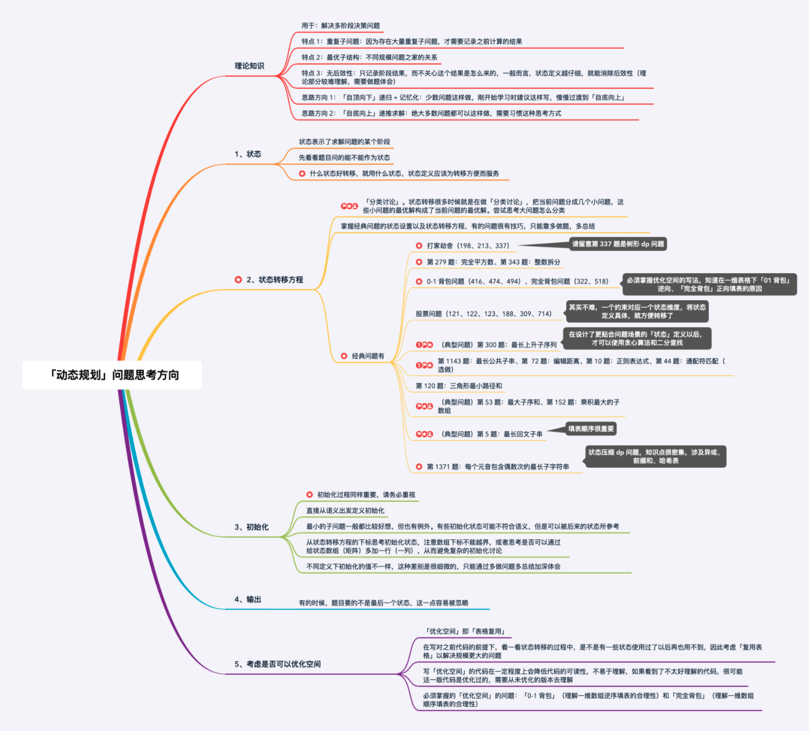

# 暴力递归

暴力递归就是尝试

1.把问题转化为规模缩小了的同类问题的子问题

2.有明确的不需要继续进行递归的条件（base case）

3.有当得到了子问题的结果之后的决策过程

4.不记录每一个子问题的解（记录子问题的解就是动态规划）

## 暴力递归的典型问题

1.汉诺塔：每次操作都需要把除最底层外的元素移到中间人（中间人即三根棍子中除去起点和终点之外的那根棍子）上，然后把底层元素移到目的地，再把中间人上的元素移到目的地，移动过程每次都会让问题规模-1，当要移动的元素只有一个时可以直接移动(base case) 

2.从左往右的尝试模型1：背包问题，当前index货物要或者不要，递归到下一个index，返回**各可能性的Max**

3.从左往右的尝试模型2：111能够形成多少字母 1为A 11为K ，当前index是独立还是组合，返回**各可能性的合**

3.范围上尝试的模型：取纸牌，博弈论问题，**定义int f(arr,L,R)代表在L到R范围内的先手玩家能够拿到的最高分数**，base case是只剩一张牌的时候，再定义一个后手函数 

4.N皇后问题

# 动态规划

1.将暴力递归中遇到的**重复解**记录下来（即暴力递归中参数一致的情况），避免重复计算，是最简单的动态规划，也叫做记忆化递归，不去考虑填表顺序，依赖规则，边界情况，仅仅是把暴力递归中在returen前将要return的值返回下来

2.暴力递归的分析过程抽象出来，就是动态规划的转移方程

3.记忆化递归的解法为“自顶向下”，而递推思路是“自底向上”，即先从最小的问题规模开始，一步一步将大表填满

# 动态规划题目类型

1.计数：

-有多少种方式走到右下角

-有多少种方法选出K个数使得和是SUM

2.求最值：

-从左上角走到右下角路径的最大数字和

-最长上升子序列长度

3.求存在性：
-取石子游戏，先手是否必胜

-能不能选出K个数使得和是SUM

