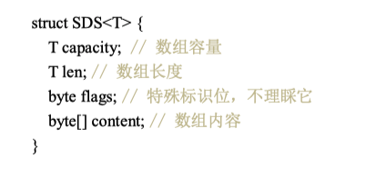
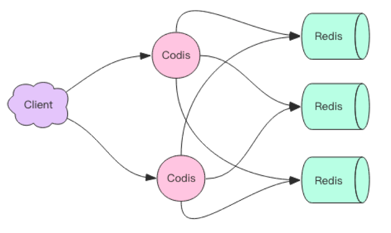
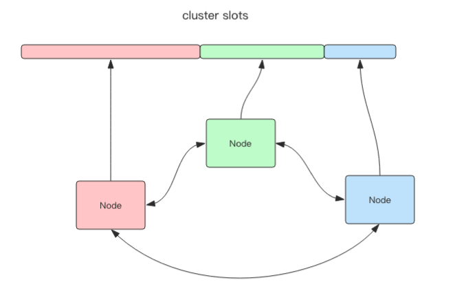

# 数据类型

## String

**用途**：常见KV存储、缓存用户信息

**数据结构**：SDS

1.使用泛型T 而不是直接使用int 是在字符串比较短时可以使用byte和short表示

2.C语言的字符串标准形式若要获取长度，需要O(N)时间复杂度，而SDS由于记录了数组长度，所以是O(1)的

3.杜绝缓冲区溢出（比如拼接字符串时没有为原字符串分配足够多的空间）

4.减少修改字符串时带来的内存重分配次数，C字符串每次增长或缩短时都需要对数组进行内存重分配，而SDS使用了空间预分配策略，小于1MB时分配一倍，大于1MB时分配1MB，同时使用惰性空间释放策略，当SDS缩短时，不立即回收，而是使用free属性记录下来，也提供真正释放的API

5.二进制安全 C字符串必须符合某种编码，并且因为空字符被解析为结尾，所以不能包含空字符，这些限制使得C字符串不能保存图片、音频这样的二进制数据，而SDS没有这种限制

6.兼容部分C字符串函数

## List

相当于Java中的LinkedList，O(1)的插入删除，O(n)的索引定位

**用途：**异步队列、通过控制进出端，可以实现栈和队列

**底层实现**： adlist.h/listNode和adlist.h/list，也有压缩链表和快速链表

### 链表

**用途：**被广泛用于实现Redis的各种功能，如列表数据类型、发布与订阅、慢查询、监视器等

**数据结构：**每个节点都记录前驱节点和后继节点、链表自身记录头尾节点、链表长度

**特点：**

1.双端

2.无环：表头节点的prev和表尾节点的next都指向null

3.带有长度计数器，所以获取长度本应该为O(n)，只需要O(1)

4.多态：使用void *指针保存节点值，可用于保存不同类型的值

## Hash

和Java中的HashMap相似，是无序字典，同样采用数组+链表的结构，使用拉链法解决哈希冲突

**用途**：可以用来存储用户信息，不同于使用String序列化后存储，使用hash来存储可以对字段单独存储，这样在获取用户信息时可以进行部分获取，但是相比之下hash结构的存储消耗也要高于String

**特点：**

1.每个字典带有两个hash表，一个平常使用，另一个仅在rehash时使用

2.rehash时采用的是渐进式rehash方式，在rehash时，对原表的增删改查还会把这个索引上的所有键值对rehash到新表(对原表插入则只会插入到新表)，这样原表终会为空，rehash结束，相当于把整次rehash的压力分摊到了每一次增删改查上

3.当没有进行BGSAVE(见持久化)时，负载因子>1会进行rehash，在进行时，负载因子>5会进行rehash，当负载因子<0.1时会缩容，扩容缩容的目标容量均为最接近的一个2的n次方，这一点和HashMap一样

## Set

## ZSet

## 压缩链表ziplist

## 快速链表quicklist

# 线程模型

是单线程的 指的是整个文件事件处理器是单线程的

## 文件事件处理器 

redis 内部使用文件事件处理器 `file event handler`，这个文件事件处理器是单线程的，所以 redis 才叫做单线程的模型。它采用 IO 多路复用机制同时监听多个 socket，将产生事件的 socket 压入内存队列中，事件分派器根据 socket 上的事件类型来选择对应的事件处理器进行处理。

文件事件处理器的结构包含 4 个部分：

- 多个 socket
- IO 多路复用程序及其队列
- 文件事件分派器
- 事件处理器（连接应答处理器、命令请求处理器、命令回复处理器）

多个 socket 可能会并发产生不同的操作，每个操作对应不同的文件事件，但是 IO 多路复用程序会监听多个 socket，会将产生事件的 socket 放入队列中排队，事件分派器每次从队列中取出一个 socket，根据 socket 的事件类型交给对应的事件处理器进行处理。

客户端发送set请求后，会尝试读取命令回复，所以会有readable和writable两个事件入队

当一个socket同时可读写的时候，服务器会先处理读后处理写

## IO多路复用简单描述

IO复用模型的思路是使用一个单独的线程去处理多个socket fd，这个线程对fd进行管理，由它来对它所管理的fd进行监控，当有数据准备好时，再分配对应的线程去读取数据。

此时socket应该采用非阻塞模式

这样在整个过程中只有socket调用select/poll/epoll这些函数的时候会阻塞，收发消息是不会阻塞的

这个所谓的监控线程有多种实现：

select是最常见的也是性能最低的 只能监听1024个描述符 采用轮询的方式对每一个描述符询问是否可用

poll和select区别不大 没有最大连接数的限制 原因是它基于链表

epoll采用了事件通知机制的思想，当描述符就绪，内核会callback来激活这个fd（但是其实内部是有一个等待队列和一个就绪队列的，激活是将fd放入就绪队列，对就绪队列中的处理仍然需要轮询，这样避免了对所有fd的轮询）

## IO多路复用实现

通过包装常见的select/epoll(linux)/kqueue(freeBSD/macOS)这些IO多路复用的函数库来实现

Redis为这些库实现了相同的API，所以IO多路复用的底层是可以互换的

程序会在编译时根据系统环境选择性能最高的IO多路复用函数库作为底层实现

evport->epoll->kqueue->select

 evport不常见 在Solaris 10系统上

# 过期时间

通过一个过期字典来保存数据库中所有键的过期时间

key为指针 指向键空间的某个键对象

value为long long的过期时间

Redis 使用惰性删除和定期删除两种策略来删除过期的键：惰性删除策略只在碰到过期键时才进行删除操作，定期删除策略则每隔一段时间主动查找并删除过期键

执行SAVE命令或者BGSAVE命令所产生的新RDB文件不会包含已经过期的键。
执行BGREWRITEAOF命令所产生的重写AOF文件不会包含已经过期的键。
当一个过期键被删除之后，服务器会追加一条DEL命令到现有AOF文件的末尾，显式地删除过期键。
当主服务器删除一个过期键之后，它会向所有从服务器发送一条DEL命令，显式地删除过期键。
从服务器即使发现过期键也不会自作主张地删除它，而是等待主节点发来DEL命令，这种统一、中心化的过期键删除策略可以保证主从服务器数据的一致性。
当Redis命令对数据库进行修改之后，服务器会根据配置向客户端发送数据库通知

## 大量key同时过期

如果有大量的key会同时过期，则应该在过期时间加上一个随机时间，避免同时过期造成的卡顿

## Redis处理时间事件

最为精准的方式自然是每个过期key在指定时间后一定会被删除

那么需要使用Redis的时间事件来处理

Redis会把时间事件放入一个**无序链表**中，时间事件处理器会遍历整个链表来触发已到达的时间事件

这个遍历过程是O(N)的，所以Redis并没有采用这种方式来处理过期键

# 持久化

## RDB

RDB会生成一个经过压缩的二进制文件，保存某个时间点上的数据库状态（非空数据库以及它们的键值对）

通过两个指令可以生成RDB文件 一个是SAVE 一个是BGSAVE

SAVE会阻塞Redis服务器进程，在RDB文件创建完毕之前，Redis无法对外提供服务

BGSAVE会派生出一个子进程，由子进程负责创建RDB文件，父进程（服务器进程）继续处理命令请求

**BGSAVE为什么可以不阻塞？**

子进程刚产生时，和父进程共享内存中的代码段和数据段，这是linux的机制，所以子进程可以对这些数据进行遍历并写入磁盘，此时父进程会继续提高服务，那么内存中的数据就会被修改，这个时候会使用操作系统的COW机制（Copy On Write）进行数据段页面的分离，

数据段是有很多个**内存页**组合而成，当父进程某一些数据进行修改时，数据必定在某一个页上，此时会将这一页复制一份分离出来，然后对这个复制的页面进行修改，子进程仍按照原页去写RDB

随着父进程修改的数据越来越多，被复制的页也越来越多，但是始终不会超过原内存大小的2倍

另一点是Redis实例里冷数据的比例往往较高，短暂的RDB过程中几乎不会有多少页被复制

子进程是按照自己被派生出来的那一瞬间的数据进行序列化写磁盘的

**什么时候进行RDB？**

可以通过设置指令，若服务器在N秒内对数据库进行了M次修改，则会执行BGSAVE

Redis内部会有计数器来统计修改了多少次数据库，并会周期性检查是否满足条件

**只使用RDB的话 可能会丢数据**

因为快照是隔一段时间生成一次的

## AOF

对每条写入命令存储日志，以append-only方式写入一个日志文件中，在redis重启时，通过回放写入的指令来重新构建数据集

**AOF重写**

日志体积会越来越大，会对其进行瘦身

原理是开辟一个子进程，对内存中的数据进行遍历，转换为一系列Redis操作指令，序列化到一个新的AOF文件中

再加上这期间的增量AOF日志

**fsync**

在写AOF日志时，实际上是将内容写到一个fd的内存缓存中，然后内核异步将内存数据刷到磁盘

此时若内核没有来得及刷磁盘就宕机了，那么就会丢失内存中的日志

可以通过Linux提供的fsync(int fd)来将指定fd的内容强制从内存刷入磁盘

此时有一个取舍 若每一个指令都要刷一次 那么性能就会很低

所以生产环境一般是1s左右刷一次 在性能和数据安全性直接做一个折中

**有三种AOF持久化策略**

每条指令刷一次 每1s刷一次 不自动刷

## 对比与混合持久化

**1.数据完整性**

由于RDB的间隔大于AOF，所以完整性来说AOF>RDB

**2.对性能的影响**

由于AOF每秒刷一次磁盘，自然会影响性能

而RDB是由fork的子进程处理的，对客户端的服务只在机器资源层面受到影响

RDB>AOF

**3.可读性**

RDB生成的是二进制文件

AOF存储的是可读的指令集 

AOF>RDB

**4.大小**

对于同一份数据来说，AOF日志文件通常比RDB快照数据文件更大

**5.数据恢复**

RDB是简单粗暴的数据快照

而AOF相比之下更加复杂，它需要重放所有指令

出现问题的几率是要更大一点的

而且RDB的恢复速度要快于AOF

**混合持久化**

先用快照文件进行快速恢复到某个时间节点

然后这个时间节点到宕机这段时间的数据用AOF来恢复

# 主从架构与主从(从从)同步

主从架构 -> 读写分离 -> 水平扩容支撑读高并发

主节点进行写入，从节点只进行读取

Redis有两种同步方式：

1.全量同步：master执行bgsave，生成RDB快照文件，同步给slave，slave接收到RDB后清空旧数据，然后重新加载RDB到内存中

2.增量同步：master将指令流放在**内存buffer**中，**异步**地同步给slave，master和slave都会维护一个offset，通过这个**偏移量**来确认同步进度，这个复制内存buffer是一个定长的环形数组，如果数组满了，就会从头覆盖前面的内容，所以当网络状况不好时，会需要全量同步

**增加从节点**

slave刚加入到集群时，会先进性一次快照同步，完成后再进行增量同步（运行期间）

**无盘复制**

全量同步时，master可以不用将RDB落库，而是一边遍历内存，一边序列化内容发送到slave

**Wait指令与最终一致性**

在CAP理论中，Redis提供AP的服务，当网络分区发生时，master并不会终止对外提供服务，主从节点的数据出现不一致，当网络恢复后，从节点会追赶落后的数据，保持**最终一致性**

wait指令可以让异步复制变为同步复制，保证系统的**强一致性**，这一指令在3.0版本后出现

提供两个参数：从库数量N和等待时间t(t可为无限)

执行wait指令后，会将这之前所有的写操作同步到N个从库并最多等待t秒，如果出现了网络分区，那么master就会阻塞在wait上，丧失可用性以保障一致性

# 哨兵 Sentinel

Sentinel（哨岗、哨兵）是Redis的高可用性（high availability）解决方案：由一个或多个Sentinel实例（instance）组成的Sentinel系统（system）可以监视任意多个主服务器，以及这些主服务器属下的所有从服务器，并在被监视的主服务器进入下线状态时，自动将下线主服务器属下的某个从服务器升级为新的主服务器，然后由新的主服务器代替已下线的主服务器继续处理命令请求，当旧的主服务器恢复后，会成为新的从服务器。

**Sentinel本质上只是一个运行在特殊模式下的Redis服务器**

它将普通Redis服务器的部分代码替换为Sentinel专用代码，所以关闭了某些指令，开启了新的功能。

Sentinel作用流程如下：

1.启动Sentinel服务，创建连向**主**服务器的网络连接，会建立两个连接，一个用于发送命令，另一个是订阅连接，订阅了主服务器的sentinel:hello频道

2.Sentinel默认以每10s一次的频率，向被监视的Master发送INFO命令，Master回复它自身的信息和它属下的Slave的信息（包括IP和端口），以便Sentinel发现

3.Sentinel发现Master有Slave后，同样会建立两个连接至Slave

4.Sentinel默认以10s一次的频率向Slave发送INFO命令，得到Slave的回复，其中包括slave的信息、它的master的信息，和slave的**优先级、复制偏移量**，这些信息会用于选出新的master

5.Sentinel以2s一次的频率向所有他监控的master和slave的sentinel:hello频道发送订阅消息

6.由于Sentinel都会订阅了这个频道，所以这个消息也会被其他Sentinel收到，借此Sentinel之间可以互相发现

7.Sentinel互相发现后，会互相建立连接 如图所示：

并进行信息交换

8.Sentinel以每秒一次的频率向所有与他建立连接的实例（master、slave、其他Sentinel）发送PING命令，并通过返回的PING命令判断实例是否在线，若未在设置时间内收到回复，则认为该实例 **主观下线**，由于每个Sentinel都可以配置不同的回复时间，或是Sentinel自身的网络问题导致没有收到回复，所以主观下线并不一定代表真实下线

9.当Sentinel认为一个master主观下线，为了确认这个master是否真实下线，他会向同样监视这一master的其他Sentinel进行询问，看它们是否也认为该master进入下线状态，当认为某个master下线的Sentinel数量达到配置的数量后，master会被标记为**客观下线**

10.当一个master被判断为客观下线后，监视这个master的各个Sentinel会选举出一个领头Sentinel，规则为：提议自己、先到先得、超过半数、反复进行至成功 也就是Raft算法 详见 《Redis设计与实现》16.8 https://read.douban.com/reader/ebook/7519526/

11.选举出领头Sentinel后，该Sentinel会负责对这个客观下线的master进行**故障转移**，挑选出一个slave，将其设置为master，将原来的slave对原master的复制改为对新master的复制 （选出新的master的过程主要包括slave健康状态的筛选、优先级排序、复制偏移量排序）

**要点：**

1.由于选举出领头Sentinel需要**半数以上**，所以Sentinel至少需要3个实例

2.Sentinel机制无法保证消息不丢失，因为主从异步复制机制，master挂掉后，slave还没来得及同步部分数据，如果主从延迟特别大，丢失的数据就会很多，可以通过限制 **至少有N个从节点在M秒内同步** 来保证消息尽可能少丢失

3.哨兵的自动发现机制是通过redis的 **pub/sub** 系统实现的每个哨兵都往sentinel:hello这个channel发消息，其他的哨兵也可以消费到这个消息，从而感知到其他哨兵的存在

# 集群

## 主从/哨兵/集群对比

主从：是备份关系，从库的数据是主库的**全量**复制，目的是提供备份以及通过主写从读来提高并发

哨兵：在主从架构的基础上保证高可用，当主服务器故障后，由哨兵负责切换从服务器为主服务器

集群：与主从不同的是，集群的数据是**分片**的，集群中的多个主服务器各自持有一部分的完整数据，通过哈希算法负责一部分的请求，在集群中，**从服务器不再负责任何请求**，单纯作为HA的备份

## Codis与Cluster

要将多台Redis实例整合到一起，需要一个**Redis集群方案**

Codis是前豌豆荚中间件团队开发开源的组件，Cluster是Redis官方提供的组件，在Cluster出现前，通常使用Codis

### Codis

Codis是代理中间件，客户端将请求发送至Codis，Codis再将请求转发至后面的Redis实例，再得到结果，转发回客户端

Codis上挂接的所有Redis实例构成一个Redis集群，可以动态扩容

Codis是无状态的，所以可以启动多个Codis以增加QPS和容灾

**分片原理**

Codis默认将key划分为1024(可修改)个slot(槽位)，首先对客户端传入的key进行crc32计算哈希值，再对1024求余得到对应的slot

每个slot都会映射到后面多个Redis实例之一，Codis会在内部维护slot与Redis实例的映射关系

**映射关系同步**

Codis使用了**集中式管理**来做槽位关系同步

即将这些数据都放在**ZK**中并提供观察与监听

**迁移**

Codis对Redis进行了改造，增加了一个 **遍历指定slot下所有key**的指令，通过这个指令扫描出待迁移槽位的所有key，然后挨个迁移到新的节点，在迁移过程中请求仍会打到旧槽位，但是数据不一定在旧槽位了，如果数据仍在旧槽位，会立即强制对这个key进行迁移，迁移后再将请求转发到新槽位

**自动均衡**

Codis提供了自动均衡功能，在系统空闲时间观察每个Redis实例对应的slot数量，如果不平衡，就会自动进行迁移

### Cluster

**去中心化**

与Codis最大的不同就是**去中心化**，所有的Redis节点都互相通信，并互相持有元数据，不再需要另外的分布式存储来存储节点槽位信息

**分片原理**

将所有数据划分为16384个slot，每个Redis节点负责其中一部分slot，**所有的slot都必须被负责**，当客户端连接集群时，会得到一份集群的槽位配置信息，当客户端查找某个key时，可以直接定位到目标节点，也可能出现槽位配置信息过期情况，会用到**跳转机制**

同样会使用crc32算法对key进行哈希，然后对16384取模得到具体槽位

增加或减少master时，就把一部分slot进行迁移

**跳转**

当客户端向一个节点请求某个ke y，然而该节点发现这个key所在的槽位并不是自己管理，他会告诉客户端应该跳转到哪个节点去获取数据，客户端得到反馈后，会**纠正本地的槽位映射表**

**迁移**

提供了redis-trib工具，进行手动迁移，Redis迁移的单位是slot，在迁移时请求先打到旧节点，若不存在，则让新节点处理。

**容错**

Cluster可以为每个master设置若干slave，这些slave并不对外提供服务，当master故障时，slave被提升为master

**可能下线与确定下线**

和哨兵中的主观下线与客观下线类似，一个节点认为某个节点失联不代表它真的下线了，集群会进行一次协商，当大多数节点都认为该节点失联，才会进行主从切换

### 

# 应用

## 1.分布式锁

**原子操作：**不会被线程调度机制打断的操作，这种操作一旦开始，就会一直运行到结束，中间不允许线程切换

**方案演进过程：**A客户端使用setnx(set if not exist)指令来站一个”坑“，另外的客户端发现坑被占了，就不执行，A执行完后通过del指令释放这个”坑“

**会出现的问题1：**在A线程执行期间若发生错误或意外宕机，导致del指令没有得到执行，那么这个坑就永远不会被释放

**解决方案1**：在setnx之后，若set成功，使用expire指令给这个key设置一个过期时间

**会出现的问题2**：setnx和expire两条指令之间若宕机，同样会出现问题1，关键在于setnx和expire两条指令是分隔开的，并不是原子操作

**解决方案2**：在redis2.8之前，可以通过引入第三方组件来完成，redis2.8之后，新增了这两个操作的组合的原子指令

**会出现的问题3**：由于过期时间的设置，有可能出现A客户端任务执行超出过期时间限制，然后释放了锁，B客户端得到锁并开始执行，此时A客户端执行完成，释放锁，实际上释放的是B的锁，此时C客户端会进入，与B客户端产生并发问题

**解决方案3**：为了避免这个问题，尽量不要使用分布式锁执行太长的任务，小部分错误情况可以人工介入，更加稳妥的办法是在setnx的时候设置一个随机数，del的时候验证这个数是否一致，若一致再删除，这样就不会出现其他客户端释放了自己的锁的情况

**会出现的问题4**：同样，由于验证与删除之间不是原子性的，redis也不存在del if equals这种指令，所以需要借助Lua脚本来执行，Lua脚本可以保证多个指令的原子性执行

**可重入锁**：若要实现可重入锁，则使用ThreadLocal来计数

**拓展：**集群中的分布式锁

1.A客户端从leader申请到锁

2.leader数据还未来得及同步到follower时，leader宕机，新的follower成为leader

3.由于新的leader中没有A客户端的加锁信息，所以此时B客户端加锁成功，A、B同时持有锁

**解决方法：**RedLock方法，加锁/释放锁时需要半数以上节点同意，增加了较大的成本

**锁冲突处理**  若没有争抢到锁，即加锁失败

1.直接抛出异常，提示用户重试，可以前端代码实现

2.sleep重试，会阻塞当前线程，当锁冲突比较频繁或是队列中消息很多时并不合适。如果出现个别死锁key导致的加锁失败，消息永远得不到处理

3.丢进**延时队列**，过一会再试，Redis延时队列的实现见下

## 2.简易消息队列

当只需要一个 **只有一组消费者 **的消息队列时，为了避免使用RabbitMQ/Kafka之类的专业消息队列的成本，可以使用Redis的List结构实现消息队列。

通过在一端push，在另一端pop，即可完成异步消息队列

**问题1：**没有ACK机制，无法保证可靠性

**问题2：**当队列空时，pop操作等于空轮询，浪费资源

**解决方案：**当pop为空时，sleep1s

**问题3：**sleep会导致延迟，如果只有一个消费者，那么就会有1s的延迟，如果有多个消费者的话会好一些，因为sleep的时间是错开的

**解决方案**：除了减少sleep时间外，可以使用blpop/brpop来代替普通pop，这是**阻塞读**，当pop不到消息时，会进入休眠状态，有数据之后会立即醒来。

**问题4：**空闲连接，阻塞读若长时间休眠，则会变成空闲连接，服务器为了节省资源会断开这个连接，那么此时bpop就会抛出异常，此时需要catch住异常后进行重试。

## 3.延时队列

通过zset来实现，将消息序列化为字符串作为zset的key，这个消息的到期处理时间作为score，然后用多个线程轮询zset获取到期的任务进行处理，多个线程只是为了保障可用性，同时还需要考虑并发争抢任务的问题。

通过zrangebyscore**取一条**

## 4.位图bitmap

对于用户签到数据，如果每条数据都用K/V的方式存储，当用户量大的时候内存开销是非常大的。而位图(BitMap)是由一组bit位组成的，每个bit位对应0和1两个状态，**虽然内部还是采用String类型存储，但Redis提供了一些指令用于直接操作位图**，可以把它看作是一个bit数组，数组的下标就是偏移量。它的优点是内存开销小、效率高且操作简单，很适合用于签到这类场景

https://www.cnblogs.com/liujiduo/p/10396020.html

## 5.去重计数器HyperLogLog

场景：需要统计网站每个网页每天的UV数据（去重后的用户数量），同一个用户一天之内的多次请求只能计数一次，那就需要每个网页请求都要带上唯一标识的用户ID

可以为每一个页面设置一个独立的set集合存储所有当天访问过此页面的用户ID，但是存储所有用户ID非常浪费空间

hyperLogLog是Redis内置的一种数据结构，提供不精确的去重计数方案，标准误差为0.81%

提供pfadd和pfcount两个指令来增加计数和获取计数

把每个用户ID用pfadd加入即可

还提供pfmerge用于把多个pf计数值合并累加

这个数据结构只需要占据约12K的空间

原理：简单的说是给定一系列随机整数，记录下低位连续零位的最大长度k，通过这个k来估算随机数的数量

## 6.布隆过滤器

hyperLogLog可以用于精确度要求不高的统计场景

但是想要知道某一个值是不是在hyperLogLog里面是不行的

这个时候可以使用布隆过滤器

布隆过滤器是一个不完全精确的set结构，当使用contains方法判断某个对象是否存在时，可能会误判，contains返回true时，实际上可能并不存在于set中，但是返回false时，则一定不存在于set中

场景：

1.用新闻客户端看新闻时，会不断推荐新的内容，每次推荐时要去掉那些用户已经看过的内容，如果从历史记录里面筛选，过滤掉已经存在的记录，无论是使用数据库去exist还是用缓存，当数据量大时性能会出现问题

2.可以用于推送新内容的场景，虽然极小一部分新内容会被认为被看过，但是可以完全保证推荐给客户的内容是无重复的。

3.爬虫系统中需要对URL进行去重，已经爬过的网页就不用再爬了

4.NoSQL领域使用广泛，当用户查询某个row时，先通过内存中的布隆过滤器过滤掉大量不存在的row请求，然后再去磁盘查询，可以减少IO量

5.邮箱系统的垃圾邮件过滤功能

使用：Redis4.0后以插件形式

bf.add添加元素

bf.exists查询元素是否存在

原理：一个大型的位数组和多个不同的无偏（能够较为均匀的计算hash值)的hash函数

在向布隆过滤器中添加key时，使用多个hash函数对key进行hash运算，每个hash函数都会计算出一个索引值，将这个索引值对数组长度取模，然后将数组的目标位置为1

询问是否存在时，同样使用这些hash函数对key进行运算，看看是否位数组中这几个位置是否都为1，只要有一个位为0，那么就说明元素不存在，若都为1，则极有可能存在

通过参数配置可以在存储空间、运算时间、错误率中平衡

