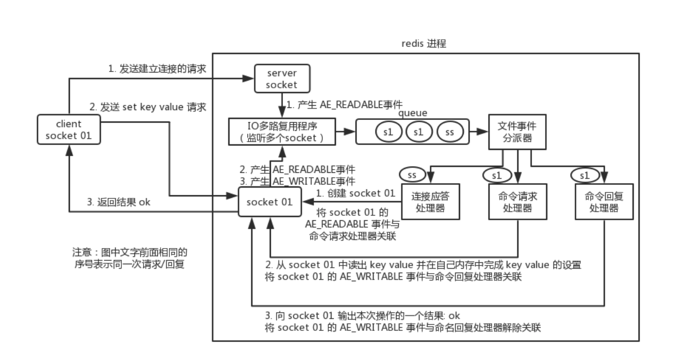

# 线程模型

是单线程的 指的是整个文件事件处理器是单线程的

## 文件事件处理器 

redis 内部使用文件事件处理器 `file event handler`，这个文件事件处理器是单线程的，所以 redis 才叫做单线程的模型。它采用 IO 多路复用机制同时监听多个 socket，将产生事件的 socket 压入内存队列中，事件分派器根据 socket 上的事件类型来选择对应的事件处理器进行处理。

文件事件处理器的结构包含 4 个部分：

- 多个 socket
- IO 多路复用程序及其队列
- 文件事件分派器
- 事件处理器（连接应答处理器、命令请求处理器、命令回复处理器）

多个 socket 可能会并发产生不同的操作，每个操作对应不同的文件事件，但是 IO 多路复用程序会监听多个 socket，会将产生事件的 socket 放入队列中排队，事件分派器每次从队列中取出一个 socket，根据 socket 的事件类型交给对应的事件处理器进行处理。

客户端发送set请求后，会尝试读取命令回复，所以会有readable和writable两个事件入队

当一个socket同时可读写的时候，服务器会先处理读后处理写

## IO多路复用简单描述

IO复用模型的思路是使用一个单独的线程去处理多个socket fd，这个线程对fd进行管理，由它来对它所管理的fd进行监控，当有数据准备好时，再分配对应的线程去读取数据。

此时socket应该采用非阻塞模式

这样在整个过程中只有socket调用select/poll/epoll这些函数的时候会阻塞，收发消息是不会阻塞的

这个所谓的监控线程有多种实现：

select是最常见的也是性能最低的 只能监听1024个描述符 采用轮询的方式对每一个描述符询问是否可用

poll和select区别不大 没有最大连接数的限制 原因是它基于链表

epoll采用了事件通知机制的思想，当描述符就绪，内核会callback来激活这个fd（但是其实内部是有一个等待队列和一个就绪队列的，激活是将fd放入就绪队列，对就绪队列中的处理仍然需要轮询，这样避免了对所有fd的轮询）

## IO多路复用实现

通过包装常见的select/epoll(linux)/kqueue(freeBSD/macOS)这些IO多路复用的函数库来实现

Redis为这些库实现了相同的API，所以IO多路复用的底层是可以互换的

程序会在编译时根据系统环境选择性能最高的IO多路复用函数库作为底层实现

evport->epoll->kqueue->select

 evport不常见 在Solaris 10系统上

# 过期时间

通过一个过期字典来保存数据库中所有键的过期时间

key为指针 指向键空间的某个键对象

value为long long的过期时间

Redis 使用惰性删除和定期删除两种策略来删除过期的键：惰性删除策略只在碰到过期键时才进行删除操作，定期删除策略则每隔一段时间主动查找并删除过期键

执行SAVE命令或者BGSAVE命令所产生的新RDB文件不会包含已经过期的键。
执行BGREWRITEAOF命令所产生的重写AOF文件不会包含已经过期的键。
当一个过期键被删除之后，服务器会追加一条DEL命令到现有AOF文件的末尾，显式地删除过期键。
当主服务器删除一个过期键之后，它会向所有从服务器发送一条DEL命令，显式地删除过期键。
从服务器即使发现过期键也不会自作主张地删除它，而是等待主节点发来DEL命令，这种统一、中心化的过期键删除策略可以保证主从服务器数据的一致性。
当Redis命令对数据库进行修改之后，服务器会根据配置向客户端发送数据库通知

## Redis处理时间事件

最为精准的方式自然是每个过期key在指定时间后一定会被删除

那么需要使用Redis的时间事件来处理

Redis会把时间事件放入一个**无序链表**中，时间事件处理器会遍历整个链表来触发已到达的时间事件

这个遍历过程是O(N)的，所以Redis并没有采用这种方式来处理过期键

# 持久化

## RDB

RDB会生成一个经过压缩的二进制文件，保存某个时间点上的数据库状态（非空数据库以及它们的键值对）

通过两个指令可以生成RDB文件 一个是SAVE 一个是BGSAVE

SAVE会阻塞Redis服务器进程，在RDB文件创建完毕之前，Redis无法对外提供服务

BGSAVE会派生出一个子进程，由子进程负责创建RDB文件，父进程（服务器进程）继续处理命令请求

**BGSAVE为什么可以不阻塞？**

子进程刚产生时，和父进程共享内存中的代码段和数据段，这是linux的机制，所以子进程可以对这些数据进行遍历并写入磁盘，此时父进程会继续提高服务，那么内存中的数据就会被修改，这个时候会使用操作系统的COW机制（Copy On Write）进行数据段页面的分离，

数据段是有很多个**内存页**组合而成，当父进程某一些数据进行修改时，数据必定在某一个页上，此时会将这一页复制一份分离出来，然后对这个复制的页面进行修改，子进程仍按照原页去写RDB

随着父进程修改的数据越来越多，被复制的页也越来越多，但是始终不会超过原内存大小的2倍

另一点是Redis实例里冷数据的比例往往较高，短暂的RDB过程中几乎不会有多少页被复制

子进程是按照自己被派生出来的那一瞬间的数据进行序列化写磁盘的

**什么时候进行RDB？**

可以通过设置指令，若服务器在N秒内对数据库进行了M次修改，则会执行BGSAVE

Redis内部会有计数器来统计修改了多少次数据库，并会周期性检查是否满足条件

**只使用RDB的话 可能会丢数据**

因为快照是隔一段时间生成一次的

## AOF

对每条写入命令存储日志，以append-only方式写入一个日志文件中，在redis重启时，通过回放写入的指令来重新构建数据集

**AOF重写**

日志体积会越来越大，会对其进行瘦身

原理是开辟一个子进程，对内存中的数据进行遍历，转换为一系列Redis操作指令，序列化到一个新的AOF文件中

再加上这期间的增量AOF日志

**fsync**

在写AOF日志时，实际上是将内容写到一个fd的内存缓存中，然后内核异步将内存数据刷到磁盘

此时若内核没有来得及刷磁盘就宕机了，那么就会丢失内存中的日志

可以通过Linux提供的fsync(int fd)来将指定fd的内容强制从内存刷入磁盘

此时有一个取舍 若每一个指令都要刷一次 那么性能就会很低

所以生产环境一般是1s左右刷一次 在性能和数据安全性直接做一个折中

## 对比与混合持久化

**1.数据完整性**

由于RDB的间隔大于AOF，所以完整性来说AOF>RDB

**2.对性能的影响**

由于AOF每秒刷一次磁盘，自然会影响性能

而RDB是由fork的子进程处理的，对客户端的服务只在机器资源层面受到影响

RDB>AOF

**3.可读性**

RDB生成的是二进制文件

AOF存储的是可读的指令集 

AOF>RDB

**4.大小**

对于同一份数据来说，AOF日志文件通常比RDB快照数据文件更大

**5.数据恢复**

RDB是简单粗暴的数据快照

而AOF相比之下更加复杂，它需要重放所有指令

出现问题的几率是要更大一点的

而且RDB的恢复速度要快于AOF

**混合持久化**

先用快照文件进行快速恢复到某个时间节点

然后这个时间节点到宕机这段时间的数据用AOF来恢复

# 主从架构与主从(从从)同步

主从架构 -> 读写分离 -> 水平扩容支撑读高并发

主节点进行写入，从节点只进行读取

Redis有两种同步方式：

1.全量同步：master执行bgsave，生成RDB快照文件，同步给slave，slave接收到RDB后清空旧数据，然后重新加载RDB到内存中

2.增量同步：master将指令流放在**内存buffer**中，**异步**地同步给slave，master和slave都会维护一个offset，通过这个**偏移量**来确认同步进度，这个复制内存buffer是一个定长的环形数组，如果数组满了，就会从头覆盖前面的内容，所以当网络状况不好时，会需要全量同步

**增加从节点**

slave刚加入到集群时，会先进性一次快照同步，完成后再进行增量同步（运行期间）

**无盘复制**

全量同步时，master可以不用将RDB落库，而是一边遍历内存，一边序列化内容发送到slave

**Wait指令与最终一致性**

在CAP理论中，Redis提供AP的服务，当网络分区发生时，master并不会终止对外提供服务，主从节点的数据出现不一致，当网络恢复后，从节点会追赶落后的数据，保持**最终一致性**

wait指令可以让异步复制变为同步复制，保证系统的**强一致性**，这一指令在3.0版本后出现

提供两个参数：从库数量N和等待时间t(t可为无限)

执行wait指令后，会将这之前所有的写操作同步到N个从库并最多等待t秒，如果出现了网络分区，那么master就会阻塞在wait上，丧失可用性以保障一致性

# 哨兵 Sentinel

Sentinel（哨岗、哨兵）是Redis的高可用性（high availability）解决方案：由一个或多个Sentinel实例（instance）组成的Sentinel系统（system）可以监视任意多个主服务器，以及这些主服务器属下的所有从服务器，并在被监视的主服务器进入下线状态时，自动将下线主服务器属下的某个从服务器升级为新的主服务器，然后由新的主服务器代替已下线的主服务器继续处理命令请求，当旧的主服务器恢复后，会成为新的从服务器。

**Sentinel本质上只是一个运行在特殊模式下的Redis服务器**

它将普通Redis服务器的部分代码替换为Sentinel专用代码，所以关闭了某些指令，开启了新的功能。

Sentinel作用流程如下：

1.启动Sentinel服务，创建连向**主**服务器的网络连接，会建立两个连接，一个用于发送命令，另一个是订阅连接，订阅了主服务器的sentinel:hello频道

2.Sentinel默认以每10s一次的频率，向被监视的Master发送INFO命令，Master回复它自身的信息和它属下的Slave的信息（包括IP和端口），以便Sentinel发现

3.Sentinel发现Master有Slave后，同样会建立两个连接至Slave

4.Sentinel默认以10s一次的频率向Slave发送INFO命令，得到Slave的回复，其中包括slave的信息、它的master的信息，和slave的**优先级、复制偏移量**，这些信息会用于选出新的master

5.Sentinel以2s一次的频率向所有他监控的master和slave的sentinel:hello频道发送订阅消息

6.由于Sentinel都会订阅了这个频道，所以这个消息也会被其他Sentinel收到，借此Sentinel之间可以互相发现

7.Sentinel互相发现后，会互相建立连接 如图所示：

并进行信息交换

8.Sentinel以每秒一次的频率向所有与他建立连接的实例（master、slave、其他Sentinel）发送PING命令，并通过返回的PING命令判断实例是否在线，若未在设置时间内收到回复，则认为该实例 **主观下线**，由于每个Sentinel都可以配置不同的回复时间，或是Sentinel自身的网络问题导致没有收到回复，所以主观下线并不一定代表真实下线

9.当Sentinel认为一个master主观下线，为了确认这个master是否真实下线，他会向同样监视这一master的其他Sentinel进行询问，看它们是否也认为该master进入下线状态，当认为某个master下线的Sentinel数量达到配置的数量后，master会被标记为**客观下线**

10.当一个master被判断为客观下线后，监视这个master的各个Sentinel会选举出一个领头Sentinel，规则为：提议自己、先到先得、超过半数、反复进行至成功 也就是Raft算法 详见 《Redis设计与实现》16.8 https://read.douban.com/reader/ebook/7519526/

11.选举出领头Sentinel后，该Sentinel会负责对这个客观下线的master进行**故障转移**，挑选出一个slave，将其设置为master，将原来的slave对原master的复制改为对新master的复制 （选出新的master的过程主要包括slave健康状态的筛选、优先级排序、复制偏移量排序）

**要点：**

1.由于选举出领头Sentinel需要**半数以上**，所以Sentinel至少需要3个实例

2.Sentinel机制无法保证消息不丢失，因为主从异步复制机制，master挂掉后，slave还没来得及同步部分数据，如果主从延迟特别大，丢失的数据就会很多，可以通过限制 **至少有N个从节点在M秒内同步** 来保证消息尽可能少丢失

3.哨兵的自动发现机制是通过redis的 **pub/sub** 系统实现的每个哨兵都往sentinel:hello这个channel发消息，其他的哨兵也可以消费到这个消息，从而感知到其他哨兵的存在

# 集群

