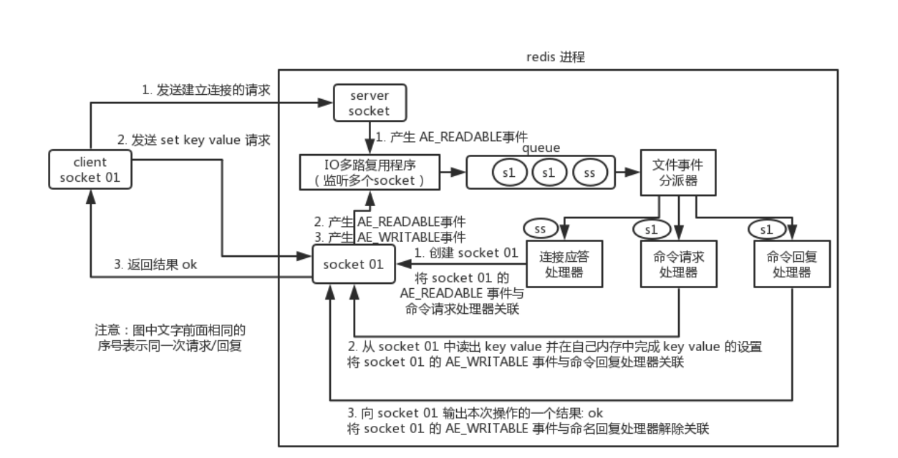

# Redis线程模型

是单线程的 指的是整个文件事件处理器是单线程的

## 文件事件处理器 

redis 内部使用文件事件处理器 `file event handler`，这个文件事件处理器是单线程的，所以 redis 才叫做单线程的模型。它采用 IO 多路复用机制同时监听多个 socket，将产生事件的 socket 压入内存队列中，事件分派器根据 socket 上的事件类型来选择对应的事件处理器进行处理。

文件事件处理器的结构包含 4 个部分：

- 多个 socket
- IO 多路复用程序及其队列
- 文件事件分派器
- 事件处理器（连接应答处理器、命令请求处理器、命令回复处理器）

多个 socket 可能会并发产生不同的操作，每个操作对应不同的文件事件，但是 IO 多路复用程序会监听多个 socket，会将产生事件的 socket 放入队列中排队，事件分派器每次从队列中取出一个 socket，根据 socket 的事件类型交给对应的事件处理器进行处理。

客户端发送set请求后，会尝试读取命令回复，所以会有readable和writable两个事件入队

当一个socket同时可读写的时候，服务器会先处理读后处理写

## IO多路复用简单描述

IO复用模型的思路是使用一个单独的线程去处理多个socket fd，这个线程对fd进行管理，由它来对它所管理的fd进行监控，当有数据准备好时，再分配对应的线程去读取数据。

此时socket应该采用非阻塞模式

这样在整个过程中只有socket调用select/poll/epoll这些函数的时候会阻塞，收发消息是不会阻塞的

这个所谓的监控线程有多种实现：

select是最常见的也是性能最低的 只能监听1024个描述符 采用轮询的方式对每一个描述符询问是否可用

poll和select区别不大 没有最大连接数的限制 原因是它基于链表

epoll采用了事件通知机制的思想，当描述符就绪，内核会callback来激活这个fd（但是其实内部是有一个等待队列和一个就绪队列的，激活是将fd放入就绪队列，对就绪队列中的处理仍然需要轮询，这样避免了对所有fd的轮询）

## IO多路复用实现

通过包装常见的select/epoll(linux)/kqueue(freeBSD/macOS)这些IO多路复用的函数库来实现

Redis为这些库实现了相同的API，所以IO多路复用的底层是可以互换的

程序会在编译时根据系统环境选择性能最高的IO多路复用函数库作为底层实现

evport->epoll->kqueue->select

 evport不常见 在Solaris 10系统上

